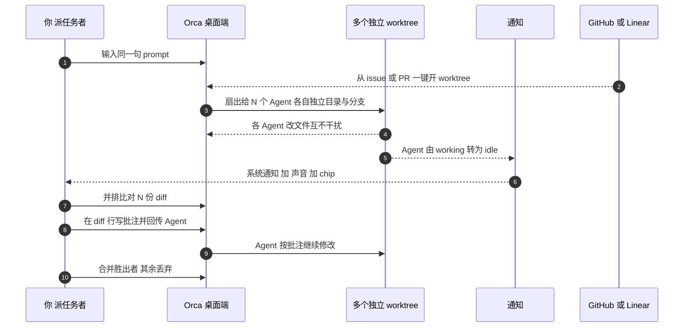

# 实操 2：并行 worktree 扇出、Orca CLI 与远程移动端

> **实操来源说明（必读）**：本篇命令与参数来自**官方文档与官方仓库的逐字核验**（核验日 2026-09-20，对应最新正式版 **v1.4.205**，F-067）；**本知识包制作过程中未在任何平台真机执行**。博文作者只声明 macOS 侧跑过一行安装命令（F-043），**未展示任何命令输出**，本节涉及的并行 worktree、CLI、SSH、移动端均为官方文档口径，而非博文作者的实测记录。文中凡引号内文字均为官方文档原文措辞（标注 F 编号），**属"官方文档描述，非实测输出"**；执行前请以官方最新文档为准。

## 1. 并行 worktree 的完整链路

官方 worktrees 文档原文（F-082，官方文档描述，非实测输出）：

> "Fan one prompt across five agents, each in its own isolated git worktree — compare the results and merge the winner."

据此，官方支持的链路为（F-014~F-018、F-047、F-048、F-083）：

| 步骤 | 动作 | 出处 |
|---|---|---|
| 1 | 同一个需求、同一句 prompt | F-015、F-083 |
| 2 | 同时派给好几个 Agent，一个 worktree 派一个 Agent | F-015、F-048 |
| 3 | 每个 Agent 分到独立 git worktree（独立目录 + 独立分支） | F-016 |
| 4 | 各 Agent 改文件互不干扰（"isolated git worktree"） | F-017 |
| 5 | 跑完在一个界面并排看 diff | F-018 |
| 6 | 挑一份最满意的合并，其余直接丢弃 | F-018 |

官方 first-session 文档对同一动作的概括原文（F-083，官方文档描述，非实测输出）："**Three branches. Three diffs. Same prompt.**"

博文补充的动机描述——"以前做同样的事需手动开多个终端、自建 worktree、人工记窗口与任务对应关系"——属**博文作者观点（F-019，P2 单源）**，不作为事实引用。

机制层原理（隔离 → 对比 → 择一合并）见 [概念 01](/concepts/01-fleet-worktree-mechanism.md)；适用人群与成本判断见 [概念 02](/concepts/02-ecosystem-and-fit.md)。

## 2. 配套交互（同一条链路用到的能力）

| 能力 | 官方口径 | 出处 |
|---|---|---|
| 终端 | "Ghostty-class terminals with **WebGL rendering**, **infinite splits**, and **scrollback that survives restarts**"——无限分屏、回滚记录重启后仍在 | F-084；同一文档另称其为 "the same **xterm.js-based** terminal VS Code uses"，两口径并存（F-085） |
| 多 Agent 输出 | 所有输出平铺在同一个窗口里 | F-023 |
| 完成通知 | Agent 从 working 转为 idle 时触发**系统通知 + 声音 + chip**，不必一直盯屏 | F-086 |
| Design Mode | "Click any UI element in a real **Chromium** window to send its **HTML, CSS, and a cropped screenshot** straight into your agent's prompt."（官方文档描述） | F-087；博文口径为 HTML/CSS/截图（F-026），官方文档另列 computed styles 与 source map |
| Diff 行级批注 | "**Drop comments on any diff line and ship them back to the agent**"——写完一起发回让 Agent 继续改 | F-088 |
| GitHub / Linear 集成 | "**GitHub & Linear, Native** — Browse PRs, issues, and project boards in-app — **open a worktree from any task**"，即从任意任务一键开 worktree | F-089；博文口径同（F-029、F-030） |

以上均为**官方文档原文描述，非实测输出**。

## 3. Orca CLI（随桌面端附带）

命令名为 `orca`，随桌面端附带（F-097）；CLI 可脚本化建 worktree、打快照、点界面等操作（F-041），且 **Agent 反过来也能驱动 Orca**（F-042，"Agents drive Orca too"，可把整个流程接进自动化）。

命令族：**worktree / terminal / file / browser**（F-097）。本包已核验的具体命令如下：

| 命令 | 用途 | 出处 |
|---|---|---|
| `orca worktree create` | 脚本化创建 worktree | F-097、F-041 |
| `orca snapshot` | 打快照 | F-097、F-041 |
| `orca click` | 点击界面元素 | F-097、F-041 |
| `orca fill` | 填写界面输入 | F-097 |
| `orca serve` | 无头 Linux 运行 | F-097 |

```bash
# 脚本化建 worktree（命令族：worktree）
orca worktree create

# 打快照 / 点击 / 填写（命令族：browser）
orca snapshot
orca click
orca fill

# 无头 Linux 运行
orca serve
```

> **完整参数以官方 CLI 文档为准**（`onorca.dev/docs/cli/overview`，F-097）。本包只登记上述经核验的命令面；**其余子命令与旗标未在本包核验范围内，故不列出，也不做推测**。

## 4. SSH 远程 worktree

- 可把 Agent 放到远程服务器上跑（F-031）；远程场景下文件编辑、git、终端能力都是完整的（F-032）。
- 官方原文："**auto-reconnect and port forwarding included**"、"Orca reconnects and re-attaches"——断线自动重连（F-033、F-090）。
- 端口转发：侧栏 **Ports** tab 一键转发（F-034、F-090）。
- 官方明确 Orca **不卖托管 VPS**："Orca does **not** sell managed VPS hosting"、"your provider account, images, and billing stay yours"——服务器与账单仍归你（F-081）。

远程执行的具体主机配置命令，官方文档在本包核验范围内未登记，故不列出。

## 5. 移动端（远程指挥）

| 平台 | 获取方式 | 注意 | 出处 |
|---|---|---|---|
| iOS | App Store，条目名 **"Orca IDE"**（副题 "Manage Coding Agents Remotely"，免费，iPhone/iPad；开发者栏显示 **Lovecast LLC**）；亦可走 TestFlight | 官网 `/download` 同时提供 App Store 与 Android APK；README 另给 TestFlight 链接 | F-094、F-093、F-052 |
| Android | 官网 `/download` 或 GitHub Releases 下载 APK | **无 Google Play 官方条目**（Play 上的 "Orca: Boat GPS…" 为航海 App，无关） | F-095、F-053 |

> ⚠️ **Android 版本号口径不一致（E-6）**：官网 `/download` 写 "APK 0.0.48"，README 链接指向 `mobile-android-v0.0.50`（F-096）。下载时请以你实际拿到的文件名与官方 Releases 页面为准。

配对与使用（官方原文，F-091，官方文档描述，非实测输出）：

- "**Pairing is one-time**"——配对为一次性（F-091、F-054）；
- "get notified when an agent finishes and **send follow-ups from anywhere**"——Agent 跑完手机收到通知，人不在电脑前也能发后续指令（F-091、F-036、F-037）。

> ⚠️ **账号口径矛盾（E-2，双口径呈现，本包不替官方调和）**
> - 官方 telemetry 文档称："**Orca has no account system**"（F-078）——桌面端可免账号使用；
> - 官方 mobile 文档则要求 "signed into the same Orca account"，并限定 "sign-in is required for **Relay only**"（F-079）——**移动端 Relay 必须登录同一 Orca 账号**。
>
> 即"免账号"是桌面端口径，不等于全功能免账号。读者以官方 mobile 页现值为准。

## 6. 用量与多账号

官方 usage-tracking 文档原文（F-092，官方文档描述，非实测输出）：

> "See **Claude and Codex usage and rate-limit resets**, and **hot-swap accounts without re-logging in**."

- 状态栏直接显示 Claude / Codex 用量与限流重置时间，覆盖 **5 小时 / 日 / 周**三个重置窗口（F-038、F-092）；
- 触及 **80%** 时给出警告 chip（F-092）；
- 多个账号之间**一键热切换，不用重新登录**（F-039、F-092）。

## 7. 成本提示（并行 = 成倍 token）

- 官方口径：用的是**你自己已有的 Agent 订阅**，各 Agent 额度该怎么算还怎么算（F-050）；Orca 自己不卖模型、也不收费（F-049）。
- 博文作者的推断：同时派五个 Agent 出去，token 消耗也是五份（**F-051，作者观点，P2 单源，非官方口径**）——该推断与官方"自带订阅"口径自洽，但请按自己的订阅套餐与上文用量面板核算。
- 实务含义：并行扇出的收益是"方案对比与择优"，代价是**N 份 token 且按各 Agent 供应商分别计费**；额度耗尽是并行链路的首要失败模式。

## 8. 链路时序图



## 9. 已知限制（引用前请读）

- **未真机执行**：本篇全部命令经官方文档逐字核验，但本包制作中未在任何平台运行；无终端输出可引用（见顶部"实操来源说明"）。
- **命令面不完整**：`orca` CLI 的完整子命令与旗标以官方 `/docs/cli/overview` 为准（F-097）；本包仅登记 5 条已核验命令。
- **Agent 数量口径不稳**：官方三处不一致——README 29 个、官网首页 27 个、`docs/agents/supported` 表 35 行（F-065、F-066）；引用"支持多少个 Agent"请以官方现值页面为准。
- **双账号口径未获官方澄清**：F-078 与 F-079 的矛盾未获官方说明，本篇按双口径并列呈现（E-2）。
- **成本数字为作者推断**：F-051 为 P2 单源观点，不构成官方计费承诺。

相邻对照：[LoopX 束](../../loopx/index.md)（长程控制面，解决"跨天跑、不空烧"，与 Orca 的"并行扇出择一"是不同层面的治理）；[ToDesk AI 束](../../todesk-ai/index.md)（跨设备远程指挥，可对照移动端远程操控的生态位）。

上一篇：[三平台安装 Orca 与首个会话](00-install-and-first-session.md)。