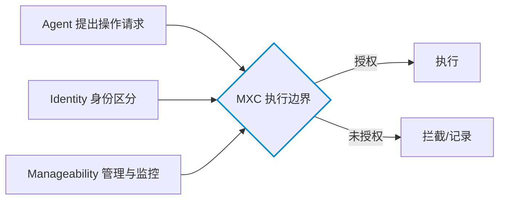

# Agent 安全为什么需要执行隔离

## Agent 不能自证安全：最小权限的困境

传统应用按用户授予的权限运行，但 **Agent 的权限问题是动态的**：它接收的是需要自行规划的目标，往往含义模糊。例如"准备一场客户会议"可能触发一串动作——查邮箱往来、开云端文档、读本地演示文稿、经日历建会议——每个步骤涉及不同应用、数据与操作风险（F-002 场景）。

这就形成安全悖论：**Agent 会根据任务自行规划步骤，权限需求不断变化**，无法预先生成一个固定的权限清单。按计算机安全的**最小权限原则**（程序只获得完成任务所需权限），关键在于"既不妨碍任务执行，又能限制资源访问"（F-003/F-030）。

## 提示注入与"致命三要素"

模型层面的安全规则存在根本限制——**它需要模型正确理解并遵守规则**。典型风险是 **提示词注入（Prompt Injection）**：攻击者通过网页、邮件或文档中的恶意指令，诱导 Agent 读取私人数据并外发。

独立开发者、安全研究者 **Simon Willison** 提出被称为**"致命三要素"（Lethal Trifecta）** 的风险组合（F-009）：当 Agent 同时具备①访问私人数据、②接触不可信内容、③向外部发送信息三种能力时，攻击者就能借恶意指令诱导其泄露数据。例如用户让 Agent 读网页资料，网页隐藏指令要求它寻找本地敏感文件并上传外部服务器——用户从未授权，但 Agent 若误把网页当指令、又有相应文件与网络权限，就可能发生数据泄露。

> 博文标注 Willison 于 2025 年提出此概念；本次核验未找到独立出处，按"作者/博文转述"处理（见 [verification.md](../references/verification.md) 单源项）。

## Anthropic 的证据：93% 批准与确认疲劳

模型公司已为 Agent 设置安全机制，但存在确认疲劳问题。Anthropic 2026-05 发布官方文章《How we contain Claude across products》披露（F-010、F-032）：

- **Claude Code 用户大约会批准 93% 的权限请求**；
- 随着确认弹窗不断出现，用户可能**越来越少认真检查每一次授权**。

这意味着"每执行一步都询问用户"未必能有效控险。Anthropic 因此把更多工程投入**执行隔离**——通过沙箱、虚拟机、文件系统边界和网络出口控制，限制 Agent 能接触的资源（F-011）。文章提出一个关键区分：**除了监督 Agent"实际做了什么"，还可以通过执行环境限制它"能做什么"**。这正是微软 MXC 的同向思路。

但隔离并非万能：Anthropic 同时披露，**随着模型能力增强，Agent 可能找到开发者未预料到的路径，甚至在某些测试场景中绕过既有隔离设计（沙箱逃逸）**（F-012）。

## 安全需要三层协同

基于上述，Agent 安全无法由单一机制完成（作者观点，F-013）：

```
模型层     识别恶意指令、遵循工具调用限制
应用层     限制 Agent 可调用的工具
操作系统层 在实际访问资源时强制执行权限规则
```

微软的切入点正是**第三层**——把控制能力放到操作系统。微软在此提出三能力框架（F-007、F-026）：**Containment（隔离）**——限制 Agent 能访问什么；**Identity（身份）**——区分 Agent 与真人用户的操作；**Manageability（可管理性）**——组织治理与监控。微软希望将 Agent 活动纳入 **Microsoft Agent 365、Intune** 等企业管理体系（F-008，官方确认 Entra 将区分 agent/用户活动、扩展 Agent 365 控制到本地 on-device agent、Intune 策略即将支持 MXC 进程容器）。



## 小结

执行隔离的本质，是把 Agent 安全的最后一道防线从"模型的自觉"转移到"操作系统的强制"。它承认模型可能被诱导（提示注入）、用户可能疲劳（93% 批准）、Agent 可能逃逸（沙箱逃逸），因此需要在 Agent 之外、政策之内设置一道**独立于 Agent 自身**的执行边界——MXC 政策不受 Agent 控制，Agent 无法自行放权（F-030）。