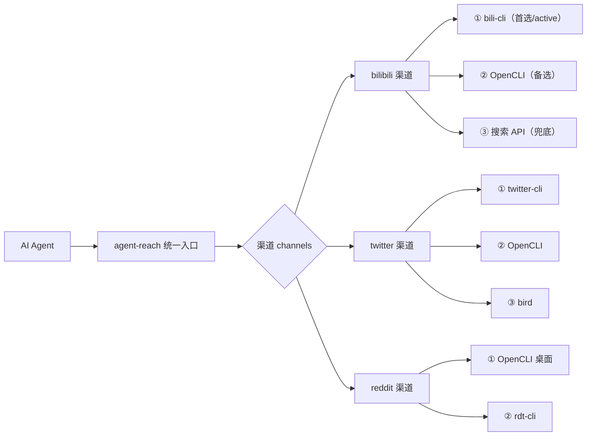

# 能力层架构：有序后端列表与 16 渠道全景

> 机制层（How）。本文解释"能力层"与单平台抓取工具的结构差异、有序后端列表的工作方式，以及 16 个渠道的三档分布。事实均经 README 与 git tree 核验。

## 1. 能力层，不是"第 17 个工具"

博文把同类项目分成两种做法（F-010）：

- **工具层做法**：写一个工具帮你抓某个平台。项目寿命 = 它依赖的那条接入路径能活多久，平台一改反爬项目就坏，用户等作者修。
- **能力层做法（Agent Reach）**：自己不做抓取，只负责**选型、安装、体检、路由**；抓取动作由 Agent 直接调用上游工具完成，中间没有包装层。

项目作者在 README 中对这件事的表述是（F-012，属项目方自述 S）：

> "当下最稳的接入方式，我们替你选好、装好、体检好。接入方式会换代，你不用操心。"

推介作者把它翻译成架构语言（F-013，V 观点层）："把'易变的接入方式'封装在一层稳定接口后面——变的永远是实现，不变的是 agent-reach 这个入口和那 16 个渠道名。"

需要注意的边界："当下最稳"是项目方的自我定位而非第三方评测结论；README 含赞助商区块（BrowserAct、腾讯云 OpenClaw 等，F-071），读者评估其中立性时应知悉这一背景。

## 2. 核心结构：每渠道一个有序候选后端列表

实现非常朴素：`channels/` 目录下每个平台一个 Python 文件，每个渠道维护**一个有序的候选后端列表**——第一个是首选，后面依次是备选；渠道通过 `active_backend` 字段上报"现在实际在用哪个后端"（F-016，经 README 与第三方文档核验 F-065/F-067）。

这一结构带来两个直接性质：

1. **换接入方式 = 调整列表顺序，不是重写代码**（F-016）。某个上游失效，把备选提前即可，渠道名和入口不变。
2. **可单独覆盖、互不影响**：可以用环境变量（渠道名 + `_backend` 形式）单独指定某渠道后端；不信任某条路就改对应的 channel 文件，其他渠道完全不受影响（F-017/F-038）。

推介作者由此给出一条可迁移的工程建议（F-018，V）：面对"上游随时会变"的依赖，不要写 `if upstream_a ... else ...` 分支（分支数量随上游爆炸），而应写"有序候选列表 + 探测选主"。

> 📁 **目录规模勘误**：博文画的 channels/ 树是 9 个文件的**示意**（F-015）；README 自带树图也只画了 13 个渠道。git tree 地面真值为 **20 个文件、17 个渠道实现**（`__init__.py`、`_opencli_site.py`、`base.py` 加 bilibili/boss/exa_search/facebook/github/instagram/linkedin/mcporter/reddit/rss/twitter/v2ex/web/xiaohongshu/xiaoyuzhou/xueqiu/youtube 共 17 个渠道 py）（F-063）。17 个实现 vs 对外宣称的 16 个渠道，存在 mcporter 作为 Exa 承载实现等内部映射差异。

## 3. 真实故障案例：yt-dlp 被 B站 412，用户零感知

博文用一个有官方记载的案例说明结构差异（F-023~F-026）：

- **2026 年 6 月**，B站风控升级，yt-dlp 拉取 B站内容全面返回 HTTP 412，直接废掉。
- Agent Reach 的 bilibili 渠道后端列表本就是 **bili-cli ▸ OpenCLI ▸ 搜索 API**：yt-dlp 退役，bili-cli 顶上，**用户什么都不用做**。
- README"当前选型"表把退役原因写得很硬："yt-dlp 被 B站风控 412 封死（2026-06 实测）"——该注记经核验确实存在于官方 README（F-064）。

README 设计理念段还记载：**2026 年 3 月**有一批单平台 CLI 集体停更，项目整体换了一轮路由（F-026/F-064）。

| 渠道 | 首选 | 备选（有序） | 备注 |
|------|------|-------------|------|
| B站 | bili-cli | OpenCLI ▸ 搜索 API | yt-dlp 因 412 于 2026-06 退役 |
| Twitter/X | twitter-cli | OpenCLI ▸ bird | OpenCLI 走登录态兜底 |
| Reddit | OpenCLI（桌面） | rdt-cli | 匿名接口被封、官方 API 审批制 |
| 小红书 | OpenCLI | xiaohongshu-mcp ▸ xhs-cli | 只用用户已有浏览器会话 |
| 全网搜索 | Exa via mcporter | — | MCP 接入，免 Key |
| LinkedIn | mcp-server-linkedin | Jina Reader | README 当前选型 |

> 推介作者据此给出的判断标准（F-027，V）："判断一个 Agent 基建项目值不值得用，别看它现在支持多少平台，去看它的 CHANGELOG 里有没有'后端换了一轮但用户无感'这类记录。"Agent Reach 的 v1.5.0 版本标题即为「能力层:多后端路由 + 真体检 + OpenCLI」（F-058），与这一叙事方向一致。

## 4. 16 渠道三档全景

README 平台表确为 **16 个渠道**（F-060），博文按配置成本分三档（F-028~F-031）：

### 第一档：开箱即用（官方默认激活 6 个）

| 渠道 | 能力 | 上游 |
|------|------|------|
| 任意网页 | 读网页正文 | Jina Reader（`r.jina.ai`） |
| YouTube | 字幕 + 搜索 | yt-dlp |
| GitHub | 读公开仓库 + 搜索 | gh CLI |
| RSS/Atom | 订阅源解析 | feedparser |
| 全网语义搜索 | Exa 搜索 | mcporter（MCP，免 Key） |
| V2EX | 社区内容 | 直连 |

> ⚠️ **6 vs 7 口径差异（必读）**：博文头部信息卡写"6 个开箱即用"，但正文零配置名单列了 **7 个**，多出 B站（F-029）。官方 README 的**激活口径**是"默认只激活 6 个零配置渠道"（即上表 6 个）；同时平台表 B站行另注"装好即用：搜索+详情 bili-cli 无需登录"（F-061）。也就是说：**B站不需要登录，但不在默认激活的 6 个之内**（装好 bili-cli 后即可用）。博文的 7 个名单扣除 B站恰为官方 6 个。本知识包以官方"默认激活 6 个"为准，同时保留"B站免登录、装好即用"这一事实。

### 第二档：一句话解锁（5 个）

直接对 Agent 说"帮我配 XXX"，由它引导完成配置（F-030）：

- **Twitter/X**：搜索、时间线（需 `TWITTER_AUTH_TOKEN`/`TWITTER_CT0`，见 [examples/02](../examples/02-login-channels-and-cookie-safety.md)）
- **雪球**：行情、热门
- **小宇宙播客**：音频转文字
- **LinkedIn**：mcp-server-linkedin ▸ Jina Reader
- **Boss直聘**：招聘信息

### 第三档：需要登录态（4 个）

涉及浏览器会话或 Cookie（F-031）：**小红书、Reddit、Facebook、Instagram**。

这一档有一条明确的克制设计：小红书链路**不替用户登录、不读浏览器 Cookie**——OpenCLI 只使用用户已有且明确控制的浏览器会话（F-032，README 一致）。项目方与博文都建议：凡需要 Cookie 的平台一律使用**专用小号**，因为脚本调用有被平台检测限制的风险，而 Cookie 等同于完整登录权限（F-033，配置细节见 [examples/02](../examples/02-login-channels-and-cookie-safety.md)）。

> 📺 **旧版口径漂移登记**：第三方技能市场 lobehub 的镜像快照曾显示"13+ platforms"且含抖音/微博/微信文章渠道（F-070），那是旧版快照，与官方现行 16 渠道名单不一致，本知识包不采信。以官方 README 为准。

## 5. 边界与小结

- Agent Reach 统一的是**入口、渠道名、体检与路由**；真正干活的仍是 yt-dlp、gh、bili-cli、OpenCLI 等上游工具，所以上游工具自身的封号、失效风险并不因此消失，只是被隔离在可替换的后端层。
- "16 渠道""选型最稳"是 README 口径（S）；本知识包核验了渠道与文件的**存在性**和故障史的**文字记载**，但未逐一实测 17 个渠道实现的当前可用性。
- 下一篇看这套结构如何被"体检"：[02 · doctor 真体检与安全模型](02-doctor-health-and-security-model.md)。
