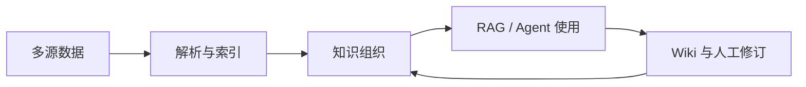

# 从数据汇聚到可演进知识资产

作者的核心观察是：数据负责进入系统，知识管理负责组织和维护，AI 负责理解与使用（F-008、F-012）。这是一个分析模型，不应当当作 WeKnora 官方宣称的唯一架构。

## 三段式闭环

这张图表达的是文章的概念关系：接入不是终点，知识会回到组织和维护环节。官方 README 对 Wiki 的描述包含自动生成互链 Markdown 知识库、交互式知识图谱、人工编辑、修订历史和回滚（F-016）。

## 为什么知识管理改变 RAG 体验

普通 RAG Demo 往往把文档导入和问答作为一次性流程。文章强调 Chunk 的查看、编辑、版本变化和再索引（F-010），其可迁移的工程启示是：

1. 把检索单元当作可观察、可修订的知识对象。
2. 为自动生成内容保留版本和回滚路径。
3. 让 Wiki 层承担跨文档组织，而不是只展示单次回答。

官方 API 文档还显示，WeKnora 将知识库、知识内容、分块、Agent 和聊天暴露为 RESTful API（F-018），因此该闭环既有 UI 形态，也有程序化入口。

