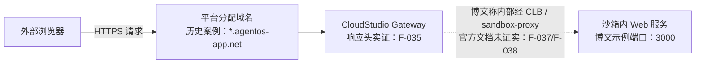

# 公网端点机制：从沙箱端口到 HTTPS 域名

## 1. 先区分三层结论

这篇博文讨论的不是“免费领取一台长期云服务器”，而是**平台环境把用户运行的临时服务暴露成公网 HTTPS 页面**。阅读时应区分三层事实：

| 层次    | 可确认程度   | 内容                                                                                                    |
| ----- | ------- | ----------------------------------------------------------------------------------------------------- |
| 能力层   | ✅ 可确认   | WorkBuddy Enterprise / WMA 官方资料确认 Runtime 具备端口转发能力（F-031）；公开 `*.agentos-app.net` 页面可经 HTTPS 访问（F-034） |
| 观测层   | ✅ 可确认   | 2026-09-16 实测响应头显示 `Server: CloudStudio Gateway`（F-035）                                               |
| 内部实现层 | ⚠️ 博文单源 | 博文称链路为“腾讯云 CLB TLS 终止 + 沙箱内 sandbox-proxy 反代”（F-008、F-009），未找到公开官方文档证实（F-037、F-038）                   |

因此，最稳妥的表述是：**平台能为环境中的 Web 服务分配公网 HTTPS 入口；当前可观测边缘网关为 CloudStudio Gateway；更内层的 CLB 与 sandbox-proxy 细节暂按博文口径处理。**

## 2. 可验证链路



### 2.1 沙箱内服务

博文以在沙箱中监听 `:3000` 的服务为例，Node、Python、Java 或静态文件服务器都可以作为服务进程（F-006、F-011）。这一步只要求沙箱内存在一个能响应 HTTP 的进程；博文没有给出具体语言的启动命令、绑定地址和健康检查输出（F-011）。

### 2.2 平台分配域名

博文写出的域名格式是 `<沙箱ID>.sh1.agentos-app.net`（F-007）。但公开案例显示同一域名族下还存在 `bj10`、`sh7`、`bj3` 等不同前缀（部分疑似地域标识）；2026-09-15 的网易号转载稿又写成 `<沙箱ID>.app.workbuddy.host`（F-034、F-036）。这说明读者不应手写固定后缀，而应从当前沙箱信息、任务面板或部署记录中读取实际域名。

### 2.3 HTTPS 与网关

三个历史 `*.agentos-app.net` 页面在 2026-09-16 均通过 HTTPS 返回 HTTP 200，响应头包含（CLB 即云负载均衡 Cloud Load Balancer）：

```text
Server: CloudStudio Gateway
X-Trace-Id: ...
```

这证明公网入口和平台网关真实存在（F-034、F-035）。博文关于“腾讯云 CLB 做 TLS 终止”的说法可能描述更底层基础设施，但响应头本身没有暴露 CLB 字段，公开官方资料也未直接证实该链路（F-008、F-038）。

## 3. 与相邻产品能力的区别

WorkBuddy Enterprise 不是单一产品，官方将其拆成三类（F-028）：

| 产品/能力                    | 主要用途                 | 与本文关系                                                             |
| ------------------------ | -------------------- | ----------------------------------------------------------------- |
| WorkBuddy                | AI 办公协同桌面工作台         | 博文使用的用户侧名称                                                        |
| CodeBuddy                | 智能编码工具，含 IDE/CLI 等形态 | CloudStudio 部署环境出现在 CodeBuddy IDE 更新记录中（F-033）                    |
| WorkBuddy Managed Agents | 企业智能体云端托管 Runtime    | 官方确认云端沙箱、端口转发、7×24、自动休眠/恢复等能力（F-029\~F-031）                       |
| CodeBuddy Remote Control | 远程访问本机 CodeBuddy 会话  | 公网模式走 Cloudflare Tunnel，域名是 `*.trycloudflare.com`，与本文域名族不同（F-032） |

这条边界很重要：**临时页面预览、CloudStudio 部署环境、Remote Control 远程窗口、WMA 企业托管 Runtime 不能混为一个功能。** 它们共享腾讯产品生态，但生命周期、运行位置和 SLA 并不相同（F-039）。

## 4. 使用时应向平台确认的信息

在把博文提示词交给 Agent 前，应先确认：

1. 当前环境实际分配的域名是什么，不要自行拼接 `sh1.agentos-app.net`（F-007、F-036）。
2. 平台允许转发哪些端口，是否只识别特定端口或需要显式发布（F-021）。
3. 域名的保留时间、休眠规则、回收规则和限流策略（F-014、F-021）。
4. 入站 Webhook 是否允许外部平台调用，是否有鉴权、重试、IP 范围或请求体大小限制（F-012、F-021）。
5. 是否支持自定义域名；博文仅称不支持，且该说法没有官方文档复核（F-022）。

## 5. 本篇结论

公网 HTTPS 入口不是博文虚构：实时页面、官方 Runtime 能力和 CloudStudio Gateway 响应头形成了相互支撑的证据链（F-031、F-034、F-035）。但博文给出的固定后缀和内部组件名称具有明显的时效性与单源性，实际使用应以平台面板和官方文档为准。

下一篇进入场景选择：[临时服务的适用场景与边界](01-temporary-service-use-cases.md)。
