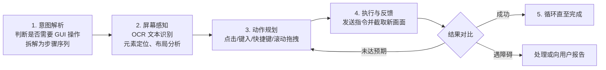

# Computer Use 运行机制与能力边界

## 运行流程：五阶段循环

原文将 Computer Use 的工作过程拆为五个阶段（F-037），构成一个"感知—规划—执行—反馈"的闭环：

### 各阶段要点

1. **意图解析**：解析用户指令，判断任务是否需要 GUI 操作，并拆解为可执行的步骤序列（F-037）。
2. **屏幕感知**：通过远程连接获取实时屏幕画面，做三类视觉理解（F-038）——文本识别（OCR：文字标签、按钮名称、输入框提示）、界面元素定位（窗口/菜单/按钮/输入框的位置与状态）、布局分析（层级关系与操作流程）。
3. **动作规划**：生成具体操作指令——鼠标移动点击、键盘输入、组合快捷键（如 Ctrl+C、Alt+Tab）、滚轮滚动与拖拽（F-039）。
4. **执行与反馈**：将动作发送至目标电脑执行，随即截取新画面与预期对比——成功则继续；未达预期则调整策略重试；遇障碍（弹窗、网络异常）则尝试处理或向用户报告（F-040）。
5. **循环直至完成**：阶段 2-4 反复执行，直到全部步骤完成或遇到无法自动处理的异常。

## 适用与不适用场景

### 适用五类（F-041）

| 类别 | 典型示例 |
|------|---------|
| 即时通讯工具 | 操作微信、企业微信、飞书桌面客户端：发消息、转发文件 |
| 企业内部系统 | OA、ERP、CRM 网页端：提交审批、填写日报 |
| 电商及运营后台 | 商家后台、广告管理后台：查看订单、导出数据 |
| 桌面应用程序 | 无命令行入口的软件：修改系统设置 |
| 网页端交互 | 需登录认证、表单填写、多步骤流程的网页 |

### 不适用六类（F-042）

| 类别 | 替代方式 |
|------|---------|
| 文件格式转换（PDF→Word、图片压缩等） | 内置工具或命令行 |
| 数据检索与计算 | 文件读写与代码执行 |
| 本地文件整理（归类/重命名/搜索） | 命令行或文件系统 API |
| 代码编译与运行 | 终端环境直接执行 |
| 安全敏感界面（Windows UAC、macOS 权限授权） | 不越权操作（见下） |
| 全屏游戏、加密保护的应用 | 不支持屏幕捕获或输入模拟 |

判断逻辑可以归纳为：**有 API/命令行通路的事不走 GUI，GUI 只兜"只能靠界面操作"的底**。

## 安全约束：不越过操作系统

Computer Use 不会越过操作系统的安全弹窗（F-043）：Windows 的 UAC（用户账户控制）与 macOS 的辅助功能/屏幕录制权限必须由用户手动确认，AI 无法代操作。官方建议首次使用前在目标电脑上提前授予必要权限。

## 运行前提与操作纪律

| 前提 | 说明 | F |
|------|------|---|
| 窗口可见 | 目标窗口被完全遮挡或最小化时，AI 需先将其恢复至前台 | — |
| 分辨率与缩放 | 建议 1920×1080 或以上、100% 缩放；4K/非标准缩放仍可操作但定位精度下降 | F-045 |
| 多显示器 | 可识别多屏，但目标窗口所在显示器需处于活跃状态；建议置于主显示器 | F-046 |
| 解锁与唤醒 | 锁屏无法操作（需先解锁）；睡眠状态无响应（需保持唤醒） | F-047 |
| 非标准 UI | 老旧软件或自绘控件可能影响元素识别准确率 | — |
| 中断与回滚 | 执行中可暂停/取消，立即停止；已完成步骤不回滚 | F-044 |
| 超时 | 网络延迟、软件响应慢、不确定等待状态会触发超时终止并说明 | F-045 |
| 人机冲突 | 不建议用户同时手动动鼠标键盘，需干预先暂停任务 | — |

## 与审计的闭环

所有操作完整记录（含截图、操作步骤、执行结果）沉淀在「审计日志」（F-047），对应能力图的"操作记录存档/历史记录查看"（F-013）。这使 GUI 操控类任务具备可回溯、可审计的合规路径——与官网"ToDesk AI 审计"能力互证（F-004）。