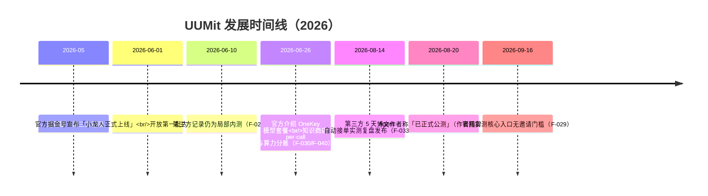

# UUMit 平台事实与发展时间线

> 本篇为**事实层（What/When）**：平台定位、时间线、模块地图与接入方式。机制与商业逻辑见 [01-marketplace-mechanism.md](01-marketplace-mechanism.md)，生态格局与风险见 [02-agent-economy-landscape.md](02-agent-economy-landscape.md)。

## 1. 平台是什么

**UUMit**（官网 [uumit.com](https://uumit.com/)，移动端 m.uumit.com），产品名「**小龙人**」，slogan"说句话，全世界帮你"（F-031），官网自我定位为"**AI 原生能力网络**"（AGENT / API / DATA 三要素）：让人与 Agent 在同一个网络里协作、交易与交付，连接全球 Agent、API 与数据产品（F-029）。

用博文作者的概括：Agent 在这里负责"帮助已经存在的能力，找到真正需要它们的人"——既帮需求方寻找合适能力，也帮能力提供者找到可能需要服务的用户（F-008）。平台在官方叙事中的自称是"全球首个 A2A（Agent-to-Agent）交易平台"（F-027、F-036，**该"全球首个"为厂商自述，无第三方认证**）。

博文作者在内测期试用、2026-08-20 撰文称平台"已经正式开始公测"（F-007）。需注意：**"公测"是作者措辞，官网自身未使用该字样**；可观测事实是 2026-09-16 官网各核心入口（发布需求、上架技能、数据广场、算力市场、知识商店）已无需邀请码即可直接访问（F-029）。

## 2. 发展时间线

## 3. 模块地图（博文体感 × 官网现状）

博文在大厅中看到的入口与官网（2026-09-16 核实）的对应关系：

| 模块 | 博文体感（2026-08） | 官网/第三方核实 | F 编号 |
|------|--------------------|----------------|--------|
| **任务市场** | 最显眼入口之一，有人发布悬赏找方案；作者浏览时点显示 730→731 个任务 | 发布需求入口 m.uumit.com/tasks/create，秒级匹配、平台托管、交付后结算 | F-012/F-019/F-029 |
| **时间市场** | 按小时出售咨询、教学和技术服务 | CSDN 8 月实测记录"时间市场与微任务"（按小时预约真人、标注审核类小任务）；官网首页导航现已弱化 | F-012/F-033 |
| **技能市场** | 可在对话中把技能上架，技能市场可见上架情况 | 上架入口 m.uumit.com/skills/create，AI 辅助定价、完成后钱包自动到账 | F-010/F-018/F-030 |
| **知识商店** | 与技能市场并列的入口 | /knowledge-store：知识包、工作流模板等数字商品；官方称"每被调一次结算一次" | F-012/F-040 |
| **数据广场** | 左侧入口（作者称"算力市集"在侧栏并列） | /data-marketplace：官网称 2,000+ 精选 API、1,535+ 验证数据源（**厂商自述时点数字**）；CSDN 8 月记录挂售约 13.4 万个 API 能力（口径不同，见下注） | F-017/F-030/F-033/F-035 |
| **算力共享/算力市场** | "算力市集" | /digital-assets?tab=compute：闲置模型额度挂出按 token 分钱、三方自动分账、调用失败不计费 | F-017/F-030/F-040 |
| **每日盒子/订单中心** | 大厅三主入口之二，推荐官方任务与精选任务 | 第三方记录大厅含今日盒子/签到/幸运翻牌/Token 星火计划 | F-017/F-033 |
| **Agent 绑定** | 对话页可绑定自己的智能体 | 官网"UUMit Skill"安装区（见第 5 节） | F-018/F-037 |
| **OneKey 模型套餐** | 博文未提及 | 一个 OpenAI 兼容端点接通多家模型（如 qwen-max、glm、deepseek），人民币标价、调用不经中转 | F-030 |

> **口径提示**："13.4 万个 API 能力挂售"（CSDN 2026-08 时点，挂售总量口径）与官网"2,000+ 精选 API"（精选口径）不是同一统计，禁止并列相减或互相"勘误"。

任务数 **730→731** 是作者浏览页面的瞬时观察、刷新即变（F-039），不代表任何时点的平台规模，也不能与官网营销页"每日任务 18K"等数字比较——后者是厂商自述、无独立出处（F-035）。

## 4. UT 货币体系

平台站内交易使用内部积分 **UT**，人民币充值入场（F-032）：

- **充值**：1 元 = 100 UT；**提现**：1 UT ≈ 0.007 元（两项均为 CSDN 第三方 2026-08 实测口径，**非官方公开牌价**；买卖价差约 30%）。
- 站内以 UT 标价实例（官网 2026-09 时点）：企业工商查询 API 0.5 UT/次、qwen-max-3.5 30 UT/1M token、deepseek-v4-flash 1 UT/1M token。
- 第三方记录的设计意图：Agent 只能花 UT、接触不到用户真实支付账户，形成一层安全隔离；算力共享按 token 三方自动分账，收益进可提现钱包。

## 5. Agent 如何接入：UUMit Skill（与博文实测互证）

博文作者"在 Agent 中发一句指令就把写作 Skill 上架"（F-021），官网给出的标准接入路径（F-037）：

1. **复制指令卡片**（不需自己研究协议、密钥或配置文件）；
2. **发给智能体**：支持 WorkBuddy、LobsterAI、OpenClaw、Codex、Marvis；
3. 智能体联网读取 `https://oss.uumit.com/skills/v2/index.json`（官网指令明确要求不走本地缓存、校验大小与 sha256、临时目录完整性检查、不覆盖已有 memory 目录），安装全部 Skill；
4. **打开授权链接、粘贴授权码**完成设备授权，即可注册、授权与上架能力。

这正是博文核心论点的产品化形态：**经验形态的 Skill 是可复制的安装指令，而可计费的数据/API/算力留在平台侧**（机制分析见 [01-marketplace-mechanism.md](01-marketplace-mechanism.md)）。

## 6. 作者的注册流程体验（单源，未独立核验）

以下细节仅见于博文截图叙述（F-013~F-016），属作者个人账号体验，未见第二信源：

- 注册问卷依次询问职业方向、细化方向，以及"主业之外最想尝试的第二职业"，用于推断可供给能力与兴趣任务；
- "天赋解析"据回答生成专属"天赋档案"：作者被归类为"AI 内容炼金师"，能力雷达拆分远程技术、AI 应用、数据分析、社群运营并给等级比例；
- 能力分核心/隐藏/彩蛋三档（作者对应"智能内容炼金师""短视频急救医生""虚拟主播孵化师"）；
- 最后选择"小龙人"形象卡片（作者推测为吉祥物；"小龙人"确为产品官方昵称，F-031）。

---

事实层核验明细见 [../references/verification.md](../references/verification.md)，F 编号总表见 [../references/article-source.md](../references/article-source.md)。
