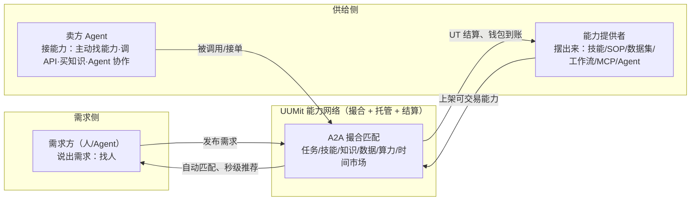

# 能力市场的运作机制与 Skill 资产论

> 本篇为**机制层（How/Why）**：平台如何组织交易，以及博文最核心的商业判断。文中机制描述有官网与第三方互证；凡属作者或厂商的分析、预测均显式标注，不与事实混层。

## 1. 平台机制三件事（作者概括）

博文把 UUMit 的机制拆成三件事（F-009~F-011），其结构是一个典型的**双边市场**：

1. **找人（需求侧）**：不需要知道该找谁、不用自己拆解一堆工具，说出需求，平台自动匹配能搞定的人、Agent、知识包或数据接口（F-009）。官网对应"需求→匹配→确认→交付→结算"流程，并宣称秒级匹配、平台托管、交付后结算（F-029）。
2. **把自己的东西摆出来（供给侧）**：技能、SOP、数据集、工作流、MCP 工具、Agent 均可上架，供他人发现（F-010）；对话页还提供设置时薪、创建技能等快捷动作（F-018）。
3. **让 Agent 接上能力（机器侧）**：Agent 可主动到外部寻找能力、调 API、买知识，并与其他 Agent 协作（F-011）。这是平台区别于传统自由职业平台（Upwork/猪八戒式人工撮合）的关键：交易双方都不必在场。

## 2. 官方的分层叙事：MCP 是调用层，A2A 是交易层

平台官方在 2026-06-03 的掘金文章中给出的逻辑（**厂商观点**，F-036）：

- **MCP 解决的是"调用"**：让 AI 能标准化调用外部工具——但只管连接，不管发现、协商、信用与结算；
- **A2A（Agent-to-Agent）补的是"交易"**：
  - **发现**：全网能力的注册与检索；
  - **协商**：交付标准、时效、价格的对齐；
  - **信用**：谁靠谱、谁优先匹配；
  - **结算**：调用产生的价值如何流回提供方。
- 二者被定义为**上下游而非竞争**：`MCP → AI 能调工具（调用层）`；`A2A → AI 能和 AI 做交易（交易层）`。

工程上还可看到具体承载：官方 API Key 接入的 Agent 可自动完成"申请→接受→交付"，并有 **A2A 互通协议 + SSE 实时通道**在能力被调用时实时派单（F-033，第三方实测确认通道存在）；平台对 MCP、Skill、Google A2A 三标准采取"全兼容、不站队"策略（F-034）。

> ⚠️ 以上分层是平台方的自我叙事，"全球首个 A2A 交易平台"无第三方认证；它描述的是设计意图，不等于机制已被验证跑通（冷启动现实见 [02-agent-economy-landscape.md](02-agent-economy-landscape.md)）。

## 3. 博文核心判断：Skill 资产论（作者观点，已溯源）

博文的论证链条（F-002~F-006，📝 **均为作者观点**）：

1. 朴素愿望是把 Agent"放出去接活"赚睡眠收入；
2. 但单纯"Agent 会写代码"不构成壁垒——模型差距不大、工具看起来差不多（作者对前几轮 AI 创业潮的判断）；
3. 各种 Work Agent 都在突出"专家套件"和"Skill"，而 **Skill 只是经验文件、极易被复制**，别人拿走即可自行迭代；
4. **真正有价值的是 Skill 背后可按次调用、按量收费的数据、API、独家知识库，以及真正把事情交付出来的能力**——拿到 Skill 也仍需依靠你持续供给这些资产。

**观点溯源（核验重要发现，F-040）**：这一判断与 UUMit 官方自己的商业化叙事高度同构——官方在 2026-06-26 掘金文中明确主张知识商店"每被调一次结算一次"、设计原则是 per call / per token / per result、不卖席位；算力共享按 token 分钱、三方自动分账、调用失败不计费。因此该论点在本 bundle 中一律标注为"**作者观点（与官方 per-call 叙事同构）**"，不应转述为作者独立发现或已被验证的行业规律。

该论点的**合理内核**（事实部分可在平台上直接观察）：UUMit 的产品形态确实把"可复制的指令"（开源形态的 UUMit Skill 安装卡，F-037）与"留存在平台侧、调用即计费"的数据广场/算力/知识商品（F-030、F-032）分成了两层。

该论点的**未验证部分**（需读者警惕）：

- "可复制 → 无价值"是作者的简化推断：Skill/经验文件也可能因持续更新、社区网络效应而保持黏性，"易复制"不等于"无差异"；
- "背后资产能持续收费"依赖平台真实存在调用需求——而第三方 5 天实测显示知识商店"能上架但当前流量很小"（F-033），供给端的丰富尚未等来等量需求。

## 4. 作者实测：一次 Skill 上架的实际流程

博文作者自己做了一次最小验证（F-021，一手体验事实）：

1. 在 Agent 中直接发出指令：把写作 Skill 上架到 UUMit；
2. Agent 依次询问**技能上架对象、价格、交付方式**等信息，作者点击确定；
3. 最终交付成果还可以继续修改；
4. 在技能市场能看到自己的上架情况。

这与官网公布的 UUMit Skill 授权安装机制（指令→安装→授权码，F-037）互证，说明"自然语言驱动上架"这条交互路径真实存在；但博文**未披露**所填价格、Skill 内容与后续是否成交，因此它验证的是"**能上架**"，不是"**能赚到钱**"。作者自己也在结论中承认"钱最后会不会真的赚到，还得让订单来说明"（F-025，📝 观点）。
