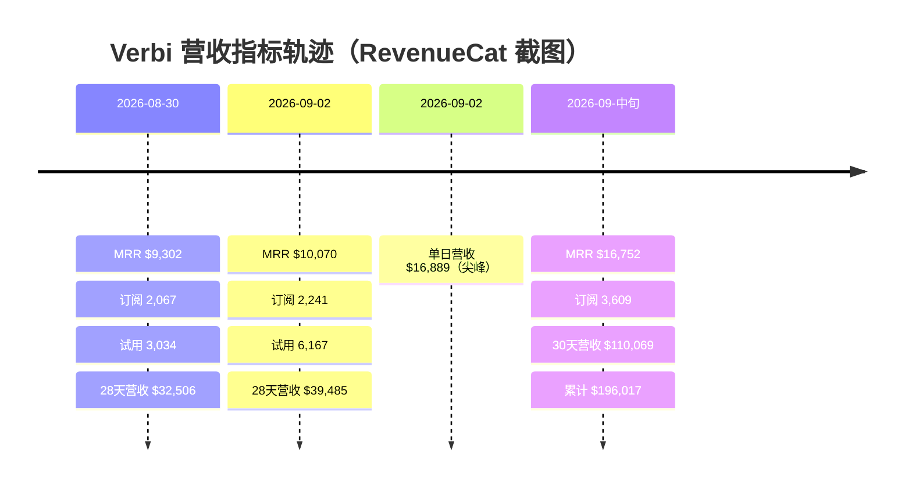

# RevenueCat 账本核验与营收轨迹

## 博文账本六项数字（截图时点约 2026-09 中旬）

| 指标 | 博文口径（F-010–F-016） | 口径说明 | 核验 |
|------|------------------------|---------|:----:|
| 近 30 天营收 | **$110,069** | 滚动 30 天 trailing revenue，非自然月；博文称全部来自 App 订阅 | ✅ |
| MRR | **$16,752** | 月度经常性收入（订阅口径） | ✅ |
| MRR 环比 | **+230.8%** | 相对上一统计期的 MRR 增幅 | ⚠️ 单源 |
| 活跃订阅 | **3,609** | 截图时点的付费订阅存量 | ⚠️ 单源时点 |
| 净利率 | **55%** | 创始人自述 | ⚠️ 单源，非 RevenueCat 指标 |
| 累计营收 | **$196,017** | 自上线以来 | ✅（取整差） |

另有 App Store 评分 **4.62**（F-016）与「上线 5 个半月 · 单人团队」标注（F-017）。

## 一手 RevenueCat 截图时间线

创始人 @pedrotech_ 在 X 公开的仪表盘截图构成可交叉核验的时间序列（时点均为 2026 年，UTC）：

数据来源：F-021/F-022/F-024/F-010–F-015。

- **8/30**「There is always a bigger spike」：MRR $9,302、订阅 2,067、试用 3,034、28 天营收 $32,506、新客 37,328，Best Day = Aug 30（F-021）；
- **9/2**「Finally hit 10k MRR」：MRR $10,070、订阅 2,241、试用 6,167、28 天营收 $39,485、新客 56,323（F-022）；
- **9/2 当日**：单日营收 $16,889（F-024），并伴随密集的美国区试用→年度订阅转化通知，年订阅价格点 $47.99/$59.99/$69.99（F-023）；
- **9 月中旬**（博文截图）：MRR 升至 $16,752、活跃订阅 3,609、30 天滚动营收 $110,069、累计 $196,017。

## 第三方独立锚点

TrustMRR 通过 RevenueCat 数据接入独立核验（F-026/F-027）：

- 9/1 快照：30d $32,819、MRR $9,202、2,025 订阅——与创始人 8/30 截图吻合（$32,506/$9,302/2,067）；
- 较新的加拿大列表取整值：30d ≈$107k、MRR ≈$16k、Total ≈$191k——与博文 $110,069/$16,752/$196,017 方向一致，差异来自取整与截图时点。

## 数字勾稽与可信度判断

1. **量级勾稽成立**：订阅数从 9/2 的 2,241 增至中旬 3,609，配合年订阅 ~$48–70 与周订阅 $7.99 的混合档位，MRR $16,752（ARPU ≈ $4.6/月，年付折算口径下合理）与 30 天 $110,069（含尖峰日 $16,889）相容；
2. **增长方向被双源印证**：MRR $9.30k → $10.07k → $16.75k 三个台阶，TrustMRR 取整值同步；
3. **保留单源标注**：环比 +230.8%、净利率 55% 无第二信源；尤其「净利率」不是 RevenueCat 可计算指标（无成本数据），应理解为创始人扣除应用商店抽成与 API/运营成本后的自述口径；
4. **渠道相关数字的勘误**：「全部来自 App 订阅」与 Google Play 已上架矛盾，详见 [02 定位与渠道增长](02-positioning-growth.md) 与核验报告 E-1。
