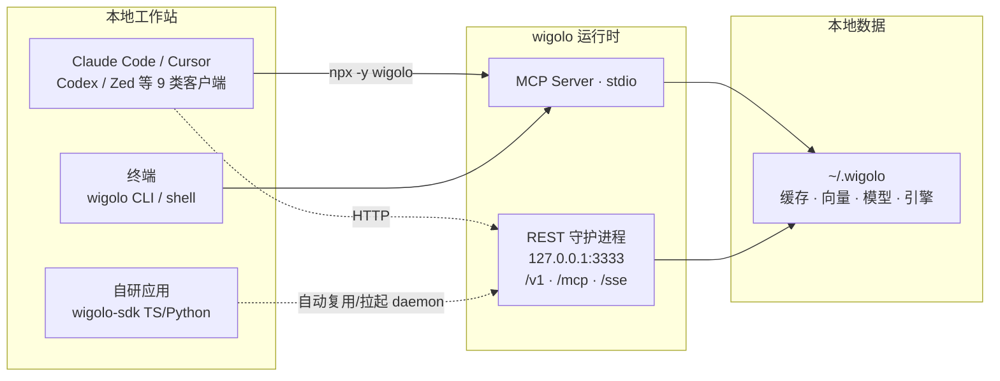
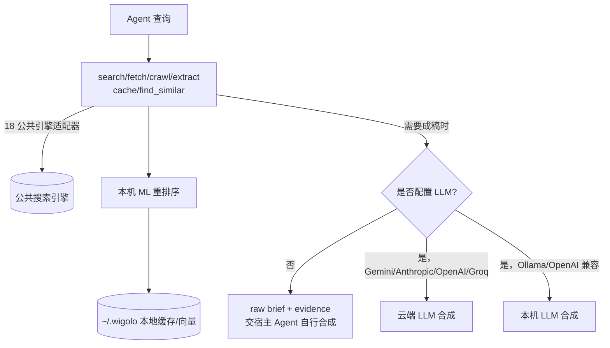

# 本地优先架构与四种部署形态

> 架构模式层：数据边界、隐私模型、部署形态与安全机制。条目溯源 F-010、F-020~F-025、F-046~F-052、F-054。

## 1. 本地优先（Local-First）的数据边界

wigolo 的"本地优先"不是营销词，它对应三条具体边界：

1. **数据落点单一**：配置、缓存网页、嵌入向量、本地模型、浏览器引擎全部位于 `~/.wigolo/`（Docker 部署时落在 `/data` 命名卷）（F-010/F-046）；
2. **默认零外传**：搜索走公共引擎适配器、抓取/提取/重排序/嵌入全部在本机完成；除非用户显式配置 LLM，没有数据被发送到第三方服务器（F-010/F-040）；
3. **缓存即私有知识库**：每个响应都被缓存，重复查询即时返回、离线可查；`cache` 工具支持关键词与混合语义检索（F-030/F-043）。

这一架构带来两个直接收益：重复查询边际成本为零（对比云端 API 的按次计费，F-045）；敏感代码/内网文档经 Agent 搜索时不必先经过一家 SaaS。

卸载语义也与此一致：`wigolo uninstall`（或 `npx wigolo config --uninstall --yes`）只移除 Agent 集成，**刻意保留 `~/.wigolo`**；要彻底删除数据需手动 `rm -rf ~/.wigolo`（F-054）。

## 2. 四种部署/接入形态

### 形态一：MCP Server（stdio，默认）

不带参数运行 `wigolo`（或经 `npx wigolo init --agents=<id>` 自动接线）即是 stdio MCP Server，与编码 Agent 同机运行（F-038/F-039）。这是博文的主推路径，也是最常见形态。

### 形态二：REST 守护进程（`wigolo serve`）

不绑定编辑器时，一条命令把同样的 10 个工具暴露为纯 JSON HTTP 服务（F-049）：

| 端点 | 用途 |
|------|------|
| `POST /v1/{tool}` | 覆盖全部 10 个工具（博文示例为 `/v1/search`，F-021） |
| `GET /openapi.json` | OpenAPI 3.1 契约 |
| `/mcp`、`/sse` | 同一端口承载远程 MCP 客户端 |
| `/health` | 健康检查（Docker 文档提及） |

默认仅监听回环 `127.0.0.1:3333`；`serve` 参数为 `[--port N] [--host H] [--allow-unauthenticated]`（F-049）。

### 形态三：Docker 自托管

镜像 `ghcr.io/knockoutez/wigolo`（F-046）：

- **发布镜像即 slim 变体**：浏览器引擎二进制与本地模型在首次使用时下载进 `/data` 卷，镜像小、下载物可持久复用；
- stdio 模式 `docker run -i --rm -v wigolo-data:/data ghcr.io/knockoutez/wigolo` 与博文逐字一致（F-022）；
- HTTP 模式官方推荐用仓库内 `packaging/compose.serve.yml`；博文给出的 `docker run -p 3333:3333 ... -e WIGOLO_API_TOKEN=... serve --host 0.0.0.0` 与该机制兼容（F-022/F-048）；
- 关于 `full`：官方文档确认它是仓库 Dockerfile 的**构建目标**（`docker build --target full -t wigolo:full .`，构建期预装浏览器引擎，适合 `--rm` 无卷场景）；**官方文档未确认 ghcr 已发布 `:full` 预构建标签**（F-047，⚠️ 博文":full 标签"措辞不严谨，需要时以本地 build 为准）。

**fail-closed 安全机制**：一旦绑定非回环地址（如 `0.0.0.0`），守护进程在未设置 `WIGOLO_API_TOKEN`、也未显式传 `--allow-unauthenticated` 时直接拒绝启动（F-048）。这就是博文"配个 token 就能安全访问"背后的强制逻辑——默认失败关闭，而非默认开放。

### 形态四：嵌入式 SDK

| SDK | 安装 | 特点 |
|-----|------|------|
| TypeScript | `npm install wigolo-sdk` | 零依赖，Node/Bun/Deno/edge；`createLocalClient()` 自动复用健康 daemon，没有则拉起，`close()` 仅在由自己拉起时停止进程（F-052） |
| Python | `pip install wigolo` | 仅标准库，同步 + 异步；`local_client()` 上下文管理器（F-052） |

另有交互形态 `wigolo shell`：常驻进程的 REPL，支持 Tab 补全、NDJSON 管道输出（`--json`），适合脚本化串联多个工具（F-054）。

## 3. LLM 在架构中的位置（可选的合成层）

配置方式（F-050，与博文 F-024/F-025 逐字一致）：`WIGOLO_LLM_PROVIDER=gemini` + `GEMINI_API_KEY`（[aistudio.google.com/apikey](https://aistudio.google.com/apikey) 免费层）；也支持 `anthropic`、`openai`、`groq`，或 `ollama` / 任意 OpenAI 兼容端点保持全本地。另有统一密钥变量 `WIGOLO_LLM_API_KEY`，密钥只从环境变量读取、不从命令行 flag 读取（F-050）。

## 4. 选型小结

| 场景 | 推荐形态 | 理由 |
|------|---------|------|
| 个人用 Claude Code/Cursor 写代码 | MCP stdio + `init --agents` | 一条命令接线，数据不出本机（F-038） |
| 团队内网给多个 Agent 共享搜索 | Docker + serve + token | 一处部署，缓存共享，fail-closed 保安全（F-048） |
| n8n / 自研服务编排 | REST `/v1/{tool}` | 纯 JSON + OpenAPI 3.1，无 MCP 客户端依赖（F-049） |
| 在自己的产品内内嵌 | TS/Python SDK local 模式 | daemon 生命周期自管理（F-052） |

## 5. 许可证提示：AGPL-3.0 的采用边界

wigolo 采用 **AGPL-3.0**（F-037）。个人本地使用、经 MCP/stdio 与自己的 Agent 配合均无负担；但企业采用前需注意 AGPL 的 copyleft 约束：**修改 wigolo 源码后通过网络对外提供服务**（SaaS 形态）触发 AGPL 的开源义务，修改部分需以同等许可证向使用者提供源码。仅把它作为内部工具调用（不分发、不对外提供修改版服务）风险较低；商业产品内嵌或二次开发分发前建议法务确认。博文"零费用"指调用费用为零，不等同于许可证零义务（F-006/F-031）。

## 延伸阅读

- 安装接线实操：[examples/00 · 安装与 Agent 接入](../examples/00-install-and-agent-wiring.md)
- REST/Docker/LLM 配置演练：[examples/02 · REST/Docker/LLM](../examples/02-rest-docker-and-llm.md)
