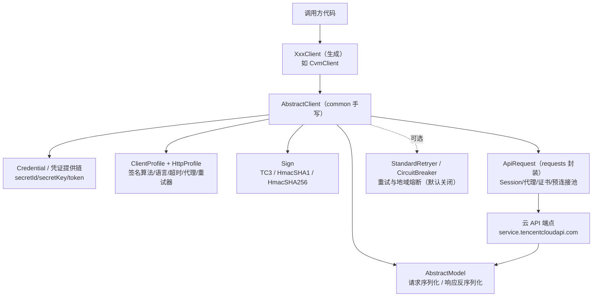

# 架构与一次同步调用链

## 组件全景

同步栈以 `AbstractClient` 为中心，五个协作者各司其职：



- **生成客户端 `XxxClient`**：只负责覆盖服务身份（`_service`/`_apiVersion`/`_endpoint`）与提供动作方法，本身无机制代码（见 [02 生成代码模式](02-generated-code-pattern.md)）。
- **AbstractClient**：基类，承担请求构建、签名分流、端点解析、发送、错误检查、SSE 解析、日志、重试/熔断挂载（F-022 ~ F-041）。
- **Credential**：提供 secretId/secretKey/token；角色类凭证还负责到期前自动刷新（见 [05 凭证链](05-credential-chain.md)）。
- **Profile 两层**：ClientProfile 管协议选项（签名算法、语言、重试器、熔断），HttpProfile 管传输选项（方法、超时、代理、根域名），见 [03 Profile 与 HTTP 配置](03-profile-http.md)。
- **ApiRequest**：对 requests.Session 的薄封装，处理代理发现、certifi 证书、keep-alive、预连接池与网络异常包装。

## 构造一个客户端时发生了什么（F-022 ~ F-024、F-076）

```python
client = cvm_client.CvmClient(cred, "ap-shanghai", client_profile)
```

1. 生成类的类属性已固定服务身份：`_apiVersion='2017-03-12'`、`_service='cvm'`、`_endpoint='cvm.tencentcloudapi.com'`，以及全局 `_sdkVersion='SDK_PYTHON_3.1.185'`（F-022、F-046）。
2. `AbstractClient.__init__` 保存 credential 与 region；profile 为 None 时新建默认 ClientProfile（TC3 签名、zh-CN、熔断关闭）。
3. 依据 HttpProfile 创建 `ApiRequest`（超时、代理、scheme、证书、预连接池大小）；keepAlive=True 时启用 Session 连接复用。
4. 仅当 `profile.disable_region_breaker` 为 False 时才创建 CircuitBreaker——**默认配置下熔断器不存在**（F-076）。
5. logger 名为 `tencentcloud_sdk_common`，默认挂一个空 handler，不输出任何日志。

## 一次调用的完整时序（F-025 ~ F-039、F-047）

以 CVM 标准调用为例：

```python
req = models.DescribeInstancesRequest()
req.Filters = [models.Filter(Name="zone", Values=["ap-shanghai-1"])]
resp = client.DescribeInstances(req)
```

生成的动作方法体是固定五步模板（F-047）：

```python
def DescribeInstances(self, request, headers=None, options=None):
    try:
        params = request._serialize()                 # ① 模型序列化为 dict
        body = self.call("DescribeInstances", params,
                         headers=request.headers, options=options)  # ②~⑥
        response = json.loads(body)
        model = models.DescribeInstancesResponse()
        model._deserialize(response["Response"])     # ⑦ 响应反序列化
        return model
    except TencentCloudSDKException:
        raise                                       # SDK 异常原样抛
    except Exception as ex:
        raise TencentCloudSDKException(type(ex).__name__, str(ex))  # 其余包装
```

`self.call` 内部（F-036、F-037）：

1. **headers 校验与 TraceId 注入**：headers 必须是 dict；若无 `X-TC-TraceId`（大小写不敏感）则自动生成一个 uuid4 填入，便于全链路追踪（F-096）。
2. **熔断分流**：启用了地域熔断时走 `_call_with_region_breaker`（可能改写端点为备份域名），否则走普通路径（F-075）。
3. **请求构建 `_build_req_inter`**——按条件三选一（F-025）：
   - `options['SkipSign']` → 免签路径，Authorization 置为 `SKIP`（仅凭证刷新等内部场景，F-098）；
   - signMethod 为 TC3-HMAC-SHA256（默认）或 multipart 上传 → TC3 签名路径；
   - HmacSHA1/HmacSHA256 → 旧签名路径；
   - 其他签名算法直接抛 ClientError。
4. **端点确定**：httpProfile.endpoint > options Endpoint > `service + "." + rootDomain`（默认 `cvm.tencentcloudapi.com`）；若配置了 apigw_endpoint，实际连接目标与 Host 头被改写为网关地址（F-033、F-097）。
5. **发送**：ApiRequest 调 requests.Session.request，stream=True；GET 拼 query、POST 发 body；任何网络层异常被包装为 `ClientNetworkError`（F-054）。
6. **重试包裹**：②~⑤整体被 `profile.retryer` 包裹，None 时为 NoopRetryer（只执行一次）（F-037、F-067）。
7. **响应检查**：HTTP 非 200 → `ServerNetworkError`；JSON 中含 `Response.Error` → 抛 `TencentCloudSDKException(code, message, requestId)`；含 `Response.DeprecatedWarning` → 发 DeprecationWarning（F-034、F-035）。
8. **反序列化**：按 Content-Type 分流——`text/event-stream` 走 SSE 帧解析，否则取 JSON 的 `Response` 键构造强类型模型（F-039、F-040）。

## 调用入口不止 call 一个（F-038）

AbstractClient 对生成层暴露四个入口，重试包裹方式完全相同：

| 入口 | 返回 | 用途 |
|------|------|------|
| `call(action, params)` | bytes（响应正文） | 标准 JSON 接口，生成方法默认使用 |
| `call_json(...)` | dict/list | CommonClient 等不需要模型类的场景 |
| `call_sse(...)` | 生成器（dict 帧） | AI 流式接口（text/event-stream） |
| `call_octet_stream(...)` | bytes | 二进制请求体上传；强制 TC3 + POST |
| `call_with_region_breaker(...)` | bytes | 显式走熔断/备份端点路径 |

## 横切机制的挂载点

架构上所有"非业务"能力都通过构造期或调用期注入，而非硬编码：

- **重试**：`client_profile.retryer` 注入任何带 `send_request(fn)` 的对象（F-058）。
- **熔断**：`client_profile.disable_region_breaker=False` + `region_breaker_profile` 启用（F-074）。
- **自定义请求客户端标识**：`client_profile.request_client`（正则白名单、截断 128 字符），拼入 `X-TC-RequestClient` 头。
- **每请求选项**：动作方法第三个参数 `options` 支持 SkipSign、IsMultipart、BinaryParams、Endpoint、IsOctetStream、apigw 等运行时开关。
- **每请求自定义头**：`request.headers = {"X-TC-TraceId": ..., "X-TC-Canary": ...}`（F-093）。

## 与异步架构的对照

异步栈（3.1.0 引入）实现的是同一条协议链路，但把重试/熔断/构建/发送/反序列化组织为 RequestChain 拦截器链，传输换成 httpx.AsyncClient——对照阅读见 [07 异步栈](07-async-stack.md)。

## 相关概念

- [02 生成代码模式](02-generated-code-pattern.md)——动作方法模板与模型序列化细节
- [03 Profile 与 HTTP 配置](03-profile-http.md)——ClientProfile/HttpProfile 全参数
- [04 签名与传输](04-signature-and-http.md)——三条签名路径与 TC3 计算过程
- [06 重试与熔断](06-retry-and-breaker.md)——重试器与地域熔断器
