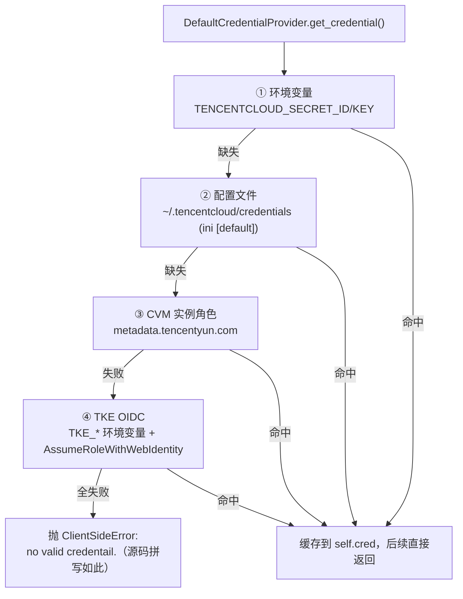

# 凭证体系

`tencentcloud/common/credential.py` 在一个文件内定义 6 类凭证加 1 个提供链。理解凭证体系的关键是区分**长期密钥**（SecretId/SecretKey）与**临时密钥**（多一个 Token、有过期时间、SDK 自动刷新）。

## 基类 Credential：长期密钥（F-059）

```python
cred = credential.Credential("AKID...", "xxxx")
cred = credential.Credential("AKID...", "xxxx", token="...")  # 也可承载临时密钥
```

- 构造即校验：secret_id/secret_key 为 None、空串、或首尾含空格都抛 InvalidCredential。
- 对外只有只读 property（secretId/secretKey）与 `get_credential_info() -> (id, key, token)`，token 存在时请求自动带 X-TC-Token 头。
- 它本身**不感知过期**——把临时三元组塞给 Credential 时，刷新责任在调用方。

## 默认提供链 DefaultCredentialProvider（F-064、F-066）

`get_credential()` 按固定顺序尝试，返回第一个成功者：



结果缓存于 provider 实例（只解析一次）；README 记载的官方顺序为「环境变量 -> 配置文件 -> 实例角色 -> TKE OIDC 凭证」（F-066）。

## 五类来源逐一拆解

### ① 环境变量 EnvironmentVariableCredential（F-062）

读 `TENCENTCLOUD_SECRET_ID` / `TENCENTCLOUD_SECRET_KEY`；任一缺失或为空串返回 None（继续回退下一级）。tox.ini 的 passenv 也正是这两个变量加 TENCENTCLOUD_ROLE_ARN（F-010）。

### ② 配置文件 ProfileCredential（F-063）

按顺序查找：

- `~/.tencentcloud/credentials`（Windows 即 `C:\Users\<NAME>\.tencentcloud\credentials`）
- `/etc/tencentcloud/credentials`

ini 格式，读 `[default]` 段：

```ini
[default]
secret_id = AKID...
secret_key = xxxx
role_arn = qcs::cam::...      # 可选，值统一 strip
```

文件不存在或字段缺失返回 None，不报错。

### ③ CVM 实例角色 CVMRoleCredential（F-060）

在已绑定 CAM 角色的 CVM 内，访问元数据服务：

```
http://metadata.tencentyun.com/latest/meta-data/cam/security-credentials/<role_name>
```

- role_name 为 None 时先请求该路径列出角色名，再取临时凭证 JSON（TmpSecretId/TmpSecretKey/Token、ExpiredTime）。
- 元数据返回 Code != "Success" 时视为失败；刷新异常在 update_credential 内被捕获（静默），下次调用重试。
- 提前 **300 秒**判定过期并刷新；threading.Lock 保证多线程并发首次获取时只拉一次。

### ④ STS 角色扮演 STSAssumeRoleCredential（F-061）

用长期密钥扮演 CAM 角色换取临时密钥：

```python
cred = credential.STSAssumeRoleCredential(
    "SecretId", "SecretKey",
    "qcs::cam::uin/...:roleName/...",   # RoleArn
    "my-session")                        # RoleSessionName
```

- 内部硬编码 STS 服务坐标：region `ap-guangzhou`、service `sts`、version `2018-08-13`、端点 `sts.tencentcloudapi.com`，用 CommonClient 调 AssumeRole。
- 取响应 Response.Credentials 的 Token/TmpSecretId/TmpSecretKey。
- duration_seconds 默认 **7200**，docstring 载最大值 43200；刷新时刻 = `ExpiredTime - duration_seconds × 0.9`（默认提前 720 秒）。

### ⑤ TKE OIDC OIDCRoleArnCredential（F-065、F-098）

在 TKE 集群中通过服务账户 OIDC 联合身份换临时密钥，`_init_from_tke` 读四个环境变量装配：

| 环境变量 | 用途 |
|----------|------|
| `TKE_REGION` | 调用 STS 的地域 |
| `TKE_PROVIDER_ID` | OIDC 提供商 ID |
| `TKE_WEB_IDENTITY_TOKEN_FILE` | Pod 中挂载的 WebIdentity token 文件路径 |
| `TKE_ROLE_ARN` | 要扮演的角色 ARN |

特殊之处：调 STS 的 AssumeRoleWithWebIdentity 时 credential 传 None 且 options 置 `SkipSign=True`——即对 STS 发 **Authorization: SKIP 的免签请求**（F-098），因为此刻还没有任何密钥可用于签名。刷新时刻 = `ExpiredTime - duration × 0.1`（提前 10%，比 STS 类更激进）。

## 选型决策

| 运行环境 | 推荐方式 |
|----------|----------|
| 本机开发/CI | 环境变量（配合密钥管理）或 ini 文件 |
| CVM 内部署 | DefaultCredentialProvider（自动落到实例角色） |
| TKE Pod 内部署 | DefaultCredentialProvider（自动落到 OIDC） |
| 跨账号/临时授权 | STSAssumeRoleCredential |
| 单元测试/一次性脚本 | Credential 直接传入 mock 或短期密钥 |

排障顺序即提供链顺序：命中环境变量后不会再读文件——"改了 credentials 不生效"先看环境变量；CVM 角色卡住注意元数据服务可达性与静默刷新重试；四级全失败的终态异常文案是源码原文 `no valid credentail.`（拼写如此，F-064）。

## 相关概念

- [00 总览](00-overview.md)——凭证在四种调用形态中的位置
- [04 签名与传输](04-signature-and-http.md)——Token 如何进入 X-TC-Token、免签请求长什么样
- [08 分包与遗留层](08-packaging-and-legacy.md)——凭证刷新为何依赖 CommonClient
