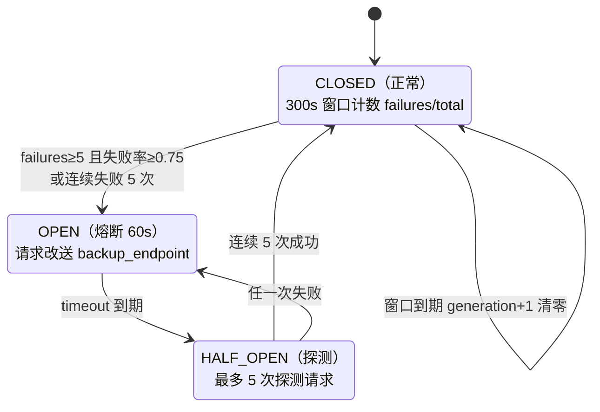

# 重试与地域熔断

SDK 有两层相互独立的弹性机制，且**默认全部关闭**：重试器默认是 NoopRetryer，地域熔断器默认不创建（F-067、F-076）。重试能力本身到 3.0.1317（2025-02-12）才进入 CHANGELOG（F-070）。

## 重试器 NoopRetryer / StandardRetryer（F-067 ~ F-069）

### NoopRetryer（默认）

`send_request(fn)` 直接 `return fn()`——一次调用失败即抛出。

### StandardRetryer

```python
from tencentcloud.common import retry
client_profile.retryer = retry.StandardRetryer(max_attempts=3, backoff_fn=None, logger=None)
```

- **max_attempts=3**：最多尝试 3 次。注意单元测试锁定的语义是——首次 + 3 次重试，**实际请求次数为 max_attempts + 1 = 4**（F-090）。
- **退避**：默认 `backoff(n) = 2 ** n` 秒（第 n 次重试前 sleep），可传自定义函数；README 示例用 `lambda n: 0` 关闭等待（F-093）。
- **可重试错误码白名单**（只认 TencentCloudSDKException，白名单外立即抛出）：

| 错误码 | 来源 |
|--------|------|
| `ClientNetworkError` | 本机网络异常（requests 层包装，F-054） |
| `ServerNetworkError` | HTTP 非 200 |
| `RequestLimitExceeded` | 云 API 限频 |
| `RequestLimitExceeded.UinLimitExceeded` | 账号级限频子码 |
| `RequestLimitExceeded.GlobalRegionUinLimitExceeded` | 全球地域账号级限频子码 |

业务错误码（参数错误、资源不存在、鉴权失败等）**不在白名单内，绝不重试**。重试包裹的是完整的 `_call → 状态检查 → 错误检查` 流程，因此重试会重新签名、重新注入 TraceId 之后的完整请求。

### 默认关闭的工程理由

云 API 写接口不天然幂等：对 RunInstances 自动重试可能创建两批机器。因此 SDK 把策略选择留给调用方——查询接口可以放心开重试，写接口需要先确认业务幂等性（或幂等 Token）后再开。

## 地域熔断器 CircuitBreaker（F-071 ~ F-076）

地域熔断解决的是另一类问题：**某地域接入点大面积故障时，把流量改送到备份地域端点**（默认备份 ap-guangzhou），而不是反复重试坏端点。

### 三态状态机



实现要点（F-071 ~ F-073）：

- Counter 四计数：failures、total、consecutive_successes、consecutive_failures。
- 触发条件 `ready_to_open`：（failures ≥ max_fail_num **且** 失败率 ≥ max_fail_percent）**或** 连续失败 ≥ 5（两道条件取或）。
- threading.Lock 保护状态迁移；generation 号 0-9 循环，窗口换代时清零计数，期间在途请求回来发现 generation 已变则结果丢弃，避免旧窗口数据污染新窗口。
- OPEN 持续 60 秒；HALF_OPEN 需 max_requests=5 次连续成功才恢复 CLOSED，任何一次失败立即回到 OPEN。

### 备份端点改写与成功判定（F-074、F-075）

- 启用方式：`client_profile.disable_region_breaker = False`。
- RegionBreakerProfile 默认 `backup_endpoint="ap-guangzhou.tencentcloudapi.com"`，改写时拼成 `<service>.ap-guangzhou.tencentcloudapi.com`；check_endpoint 校验备份域名必须是 tencentcloudapi.com 或 `<region>.tencentcloudapi.com` 形态。
- 每次请求后按「响应含 RequestId **且** 错误码 != InternalError」判成功，其余（网络错误、InternalError 等）记一次失败。
- 熔断期间签名仍按原 service 计算，仅网络目标改变（与 apigw_endpoint 同一解耦模式）。

### 默认关闭的工程理由

熔断会把请求**静默改送到另一个地域**，对数据驻留、合规、就近延迟敏感的业务可能不可接受；75% 失败率阈值也未必适合所有流量规模。因此 ClientProfile 的 disable_region_breaker 默认 True，必须显式开启（F-076）。

## 配置示例

```python
from tencentcloud.common import retry
from tencentcloud.profile.client_profile import ClientProfile, RegionBreakerProfile

cp = ClientProfile()
cp.retryer = retry.StandardRetryer(max_attempts=3)        # 开启重试

cp.disable_region_breaker = False                          # 开启地域熔断
cp.region_breaker_profile = RegionBreakerProfile(
    backup_endpoint="ap-shanghai.tencentcloudapi.com",    # 备份域名需合规校验
    max_fail_num=5, max_fail_percent=0.75,
    window_interval=300, timeout=60, max_requests=5)
```

## 两层机制的协作边界

- 重试器处理"偶发、可重试、端点不变"的失败；熔断器处理"持续性、地域性、需要换端点"的故障。
- 调用链上重试在熔断外层：开启熔断时，单次尝试进入 `_call_with_region_breaker`（可能改端点），其结果既决定重试是否继续，也向熔断器上报成败。
- 异步栈中重试与熔断是 RequestChain 的两个独立拦截器，顺序与协作见 [07 异步栈](07-async-stack.md)。

## 相关概念

- [03 Profile 与 HTTP 配置](03-profile-http.md)——retryer 字段与 RegionBreakerProfile 参数表
- [04 签名与传输](04-signature-and-http.md)——错误码如何从响应映射为异常
- [01 架构与一次同步调用链](01-architecture.md)——重试包裹的完整调用边界
