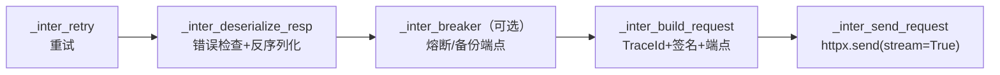

# 异步栈：httpx 与 RequestChain

异步能力从 3.1.0 引入，需安装 `tencentcloud-sdk-python-common[async]`（httpx>=0.22.0），产品方法使用 `*_client_async` 模块（F-082）。它与同步栈实现**同一份云 API 协议**（同样的 TC3 签名、X-TC 头、错误码、模型类），但 IO 与横切组织方式完全不同。

## 客户端生命周期（F-079）

异步 AbstractClient 在构造时就创建**一个** `httpx.AsyncClient` 并在整个客户端生命周期复用：

```python
async with cvm_client_async.CvmClient(cred, "ap-shanghai") as client:
    resp = await client.DescribeInstances(req)
```

HttpProfile 到 httpx 参数的映射：

| HttpProfile | httpx.AsyncClient 参数 |
|-------------|------------------------|
| reqTimeout | `timeout` |
| keepAlive=False（默认） | `limits=httpx.Limits(max_keepalive_connections=0)`（不复用空闲连接） |
| proxy | `proxies` |
| certification=False | `verify=False` |
| certification 为非空字符串 | `cert=<路径>` |

客户端实现 `__aenter__`/`__aexit__`，退出时 `await http_client.aclose()`；不使用 async with 时必须自行 await close()，否则事件循环关闭后会有资源告警。另外每个请求都会把客户端 timeout 复制进 `req.extensions["timeout"]`，以兼容"低版本 httpx 不读 Client.timeout"的行为。

## RequestChain：拦截器链架构（F-080）

异步栈最核心的设计差异：重试、熔断、构建、发送、反序列化不是嵌套方法调用，而是五个**拦截器（interceptor）**挂在一条 RequestChain 上：



注册顺序即嵌套顺序（F-080）：最外层 retry，然后 deserialize，启用熔断时插入 breaker，再 build，最内 send。

推进机制是"快照链"：`chain.proceed()` 不推进自身，而是复制一个 `_idx + 1` 的新快照传给当前拦截器，拦截器在准备工作完成后 `await snapshot.proceed()` 调下一环。这样每个拦截器既能在**下游调用前**做事（build 构造请求、breaker 改 URL），也能在**下游返回后**做事（deserialize 解析响应、breaker 上报成败、retry 决定是否再来一轮）。

### 五个拦截器职责

| 拦截器 | 下游前 | 下游后 |
|--------|--------|--------|
| retry | 调 `retryer.send_request(chain.proceed)`，由重试器决定整个下游链执行几次 | — |
| deserialize | — | check_err（非 200/Error/DeprecatedWarning），再按 Content-Type 反序列化为模型/dict/SSE 生成器，finally 中关闭响应 |
| breaker | before_requests 取 generation/need_break，熔断打开时把 url 改写为备份端点 | TransportError 记失败；SDK 异常按"响应含 RequestId 且 code≠InternalError"判成败上报 |
| build | headers dict 校验、自动注入 X-TC-TraceId(uuid4)、`_build_req` 签名分流、apigw_endpoint 改写、per-request timeout | debug 日志 |
| send | — | `http_client.send(req, stream=True)`，返回 httpx.Response |

## 异步重试器（retry_async.py）

接口与同步 StandardRetryer 同名同参数（max_attempts=3、默认退避 2^n），但全部 async 化，且有一处实质差异：

- 退避函数可以是协程：`sleep = await self._backoff_fn(n)`；等待用 `await asyncio.sleep(sleep)`。
- **可重试集合多一条原生路径**：除了同样的 5 个 TencentCloudSDKException 错误码外，`httpx.TransportError` 直接判定可重试（异步链上传输异常可能不被包装成 ClientNetworkError）。
- 重试日志格式：`retry: n=%d sleep=%ss err=%s`，需显式传入 logger 才输出。

## 生成的异步动作方法（F-081）

```python
async def DescribeInstances(
    self, request: models.DescribeInstancesRequest,
    opts: Dict = None
) -> models.DescribeInstancesResponse:
    try:
        return await self.call_and_deserialize(
            action="DescribeInstances",
            params=request._serialize(),
            resp_cls=models.DescribeInstancesResponse,
            headers=request.headers,
            opts=opts or {})
    except TencentCloudSDKException:
        raise
    except Exception as ex:
        raise TencentCloudSDKException(type(ex).__name__, str(ex))
```

与同步版对照：多了完整类型标注、options 参数名缩写为 opts，反序列化由链上的拦截器统一完成（同步版写在每个生成方法里）。CommonClient 的异步版本同理由 call_and_deserialize 驱动。

## 响应反序列化与 SSE（F-083）

deserialize 拦截器按 resp_cls 与 Content-Type 分三路：

1. `resp_cls == dict` → `json.loads(content)`（CommonClient 默认）；
2. resp_cls 是 AbstractModel 子类 → 无参构造后 `_deserialize(json.loads(content)["Response"])`；
3. 其他类型 → 抛 ClientParamsError；
4. Content-Type 为 `text/event-stream` 时不返回对象，而返回一个**异步生成器**：`async for line in resp.aiter_lines()`，SSE 帧规则与同步一致（空行出帧、冒号注释、多 data 行以 `\n` 连接、retry 转 int），finally 中关闭响应。

消费 AI 流式接口：

```python
async for event in client.ChatCompletions(req, opts={}):
    if "data" in event:
        chunk = json.loads(event["data"])   # 业务负载仍需自行解析
```

## 版本兼容注记（F-084）

- Python 3.6 环境可安装的 httpx 上限是 0.22.0，源码中保留针对该版本的兼容处理：0.22.0 会过滤空 value 的 query 参数，因此 GET 请求不使用 httpx 的 params=，而是手工把 query 拼到 URL。
- tox 在 py27 环境以 `--ignore-glob='*_async.py'` 完全跳过异步文件——异步栈不支持 Python 2.7（F-010）。

## 同步还是异步

- 选异步：高并发扇出（批量调多产品/多地域）、SSE 流式（AI 对话、日志订阅）、已有 asyncio 服务。
- 保持同步：脚本、Lambda 简单任务、需要自定义 requests 中间件（预连接池等同步独有能力，见 [03 Profile 与 HTTP 配置](03-profile-http.md)）。
- 两套栈共享 models 与 errorcodes，业务参数构造代码可以完全复用。

## 相关概念

- [01 架构与一次同步调用链](01-architecture.md)——同一协议的同步实现对照
- [06 重试与熔断](06-retry-and-breaker.md)——重试白名单与熔断状态机的同步版本
- [03 异步示例](../examples/03-async-retry-sse.md)——并发调用与 SSE 完整代码
