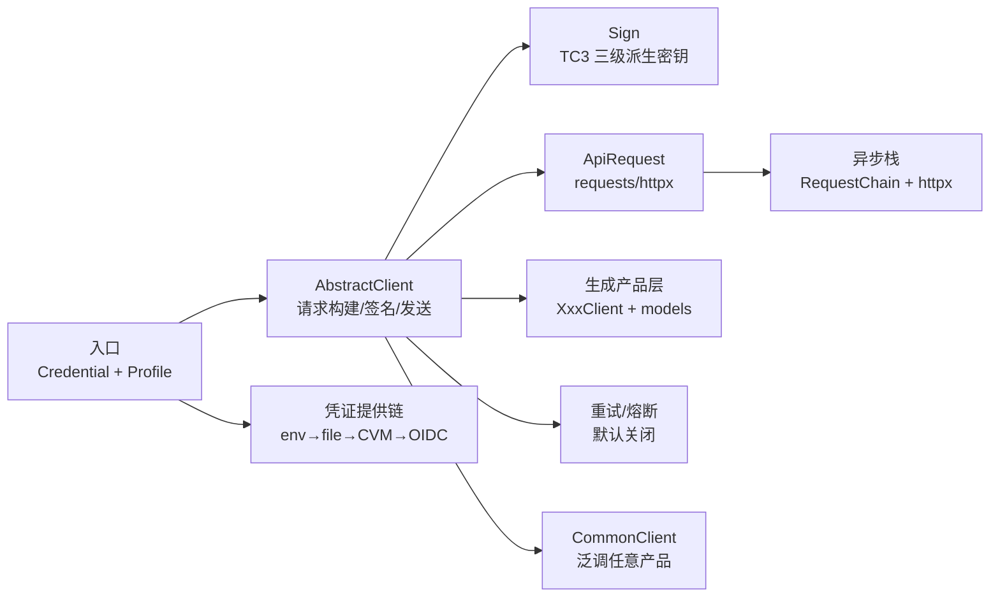

# 架构洞察（Insights）

> 基于 [facts.md](facts.md) 的 100 条源码事实提炼（G2 门：每条含现象+根因+影响+建议四元组，证据回指 F 编号）。

## 洞察一：极小手写内核 + 海量生成产品层，读懂 SDK 只需读「一个内核 + 一个模板」

- **现象**：全部运行机制集中在 `tencentcloud/common/` 的 20 个手写文件中（签名、HTTP、凭证、重试、熔断、模型基类、异步栈）；而 `tencentcloud/` 下 1783 个 Python 文件中绝大多数是产品代码——300 个版本包、261 个产品目录，单个 CVM v20170312 版本包的 models.py 就有 23652 行/286 个 class、客户端 2713 行/106 个动作方法。〔F-012、F-014、F-016、F-019、F-020〕
- **根因**：SDK 是云 API 3.0 的代码生成产物——产品版本目录（`<product>/v<YYYYMMDD>/`）四件套（models.py / errorcodes.py / 同步 client / 异步 client）由同一份 API 描述按固定模板产出，动作方法体高度同构（serialize → call → json.loads → Response._deserialize），手写逻辑只留在公共基类。〔F-044~F-048〕
- **影响**：逐产品目录学习的投入产出比极低（261 个产品、34 个产品有多版本），但只看一两个产品又容易误把生成代码当手写代码；同理，产品层的"千变万化"不会带来架构理解上的增量。
- **建议**：学习路径严格分两层——先读 `common/` 掌握机制（见 [concepts/00-overview.md](concepts/00-overview.md) 知识地图），再以 CVM v20170312 为唯一样本读懂生成模板（见 [concepts/02-generated-code-pattern.md](concepts/02-generated-code-pattern.md)）；排查产品问题时优先查官网 API 文档与 errorcodes.py，而非通读 models.py。

## 洞察二：凭证体系按「零配置优先 + 运行时自动刷新」设计，生产环境不应硬编码长期密钥

- **现象**：`DefaultCredentialProvider` 按 环境变量 → 配置文件（~/.tencentcloud/credentials ini）→ CVM 实例角色 → TKE OIDC 四级链返回首个可得凭证，全失败才报错；角色类凭证（CVM 元数据、STS AssumeRole、OIDC AssumeRoleWithWebIdentity）内嵌过期刷新（CVM 提前 300 秒、STS 按 0.9 时长、OIDC 按 0.1 时长），且 OIDC 刷新自身临时凭证时走 SkipSign（Authorization: SKIP）免签调用 STS。〔F-060~F-066、F-098〕
- **根因**：云环境中凭证来源随运行位置变化（本机开发、CVM 实例、TKE Pod、跨账号角色扮演），凭证提供链把"在哪运行就用哪种凭证"的判断下沉到 SDK；临时密钥有效期短（STS 默认 7200 秒），必须由 SDK 自动刷新才能保证长进程不中断。〔F-061、F-065〕
- **影响**：直接 `Credential(secret_id, secret_key)` 硬编码长期密钥在本地脚本之外是反模式（泄露面、轮转成本）；反过来，不了解提供链顺序时可能出现"配置了文件却读到了环境变量"的困惑，以及元数据服务不可达时静默重试带来的启动延迟（CVMRoleCredential 刷新异常被捕获后静默处理）。〔F-059、F-060、F-064〕
- **建议**：生产部署优先 `DefaultCredentialProvider().get_credential()`，本地开发用环境变量或 ini 文件，跨账号用 STSAssumeRoleCredential；排查凭证问题时按四级链顺序逐项排除（见 [concepts/05-credential-chain.md](concepts/05-credential-chain.md)、[examples/02-credential-and-common-client.md](examples/02-credential-and-common-client.md)）。

## 洞察三：重试与熔断全部「默认关闭、显式开启」，限频错误不会自动恢复

- **现象**：ClientProfile 的重试器字段缺省为 None，运行时回落到 `NoopRetryer`（只调一次）；地域熔断器开关 `disable_region_breaker` 默认为 True；重试功能本身在 CHANGELOG 中到 3.0.1317（2025-02-12）才加入。即使配置了 StandardRetryer，可重试集合也只有 5 个错误码（ClientNetworkError、ServerNetworkError、RequestLimitExceeded 及其两个子码），默认退避 2^n 秒、最多 3 次。〔F-067~F-070、F-076、F-058〕
- **根因**：云 API 调用不天然幂等，自动重试 POST 请求可能造成重复下单/重复创建，因此默认值选择"只调一次、把判断权留给调用方"；熔断同样会静默切换到备用端点（ap-guangzhou），对数据驻留敏感的业务不应被默认改写请求目标。〔F-074、F-075〕
- **影响**：误以为"SDK 会自动扛住限频"的新用户会在 RequestLimitExceeded 上直接失败；反过来，对非幂等写接口盲目配置重试也可能制造重复副作用。熔断打开后请求被改写到广州备用端点这一行为，不读源码很难从现象反推。
- **建议**：查询类/幂等接口显式注入 `StandardRetryer(max_attempts=...)`（见 [examples/03-async-retry-sse.md](examples/03-async-retry-sse.md)）；写接口重试前先确认幂等性（请求幂等 Token 等）；开启地域熔断前确认业务可接受跨地域端点，并核对 RegionBreakerProfile 的 5 次/75% 阈值与 60 秒 OPEN 窗口是否符合自身流量（见 [concepts/06-retry-and-breaker.md](concepts/06-retry-and-breaker.md)）。

## 洞察四：签名、端点、传输三层解耦，网关改写与备份域名不影响签名计算

- **现象**：TC3-HMAC-SHA256 对规范请求做二次 SHA-256，签名密钥经 "TC3"+secretKey → date → service → "tc3_request" 三级 HMAC 派生；端点解析有独立优先级链（httpProfile.endpoint > options Endpoint > service.rootDomain）；而 `apigw_endpoint` 与熔断器备份端点只改写实际请求的 host/Host 头，签名仍按原 endpoint 与 service 计算。参数在进入签名/传输前先经 `_format_params` 把嵌套 dict/list 扁平化为点号+数字下标键。〔F-026、F-030、F-031、F-033、F-049~F-051、F-075、F-097〕
- **根因**：签名要绑定的是"云侧服务身份（service）+ 日期 + 请求内容"，而实际网络目标可能经过 API 网关或跨地域备份，二者分离才能让流量调度不改签名；扁平化则是为了把开放 API 传统的点号参数名（如 `Placement.Zone.0`）与 Python 的嵌套对象互转。〔F-028、F-029〕
- **影响**：签名失败排查时，改 host/走网关并不会让签名失效，真正敏感的是系统时间（X-TC-Timestamp 参与摘要）、service 名、payload 哈希（multipart/UNSIGNED-PAYLOAD 场景例外）；嵌套对象序列化字段名由 `_FieldName` → `FieldName` 的属性变换决定，字段名不匹配问题往往出在这一层而非 HTTP 层。〔F-042、F-050〕
- **建议**：把"签名三要素（date/service/payload）"与"网络目标（endpoint/网关/备份域名）"分开排查（见 [concepts/04-signature-and-http.md](concepts/04-signature-and-http.md)）；构造复杂参数时优先用生成的 model 类而不是手写 dict，以获得 IDE 校验与键名变换保证。

## 洞察五：同步与异步是「同一 API 协议、两套 IO 架构」，异步侧独有拦截器链

- **现象**：同步栈基于 requests（Session + 可选预连接池），调用就是基类方法直调；异步栈基于 httpx.AsyncClient，并引入 `RequestChain` 拦截器链（retry → deserialize → breaker → build → send 五个拦截器），生成的动作方法仅比同步版多 `async/await` 与类型标注。异步栈还包含针对 httpx 0.22.0（Python 3.6 可装最高版本）过滤空 query 参数的兼容代码。〔F-052~F-056、F-079~F-084〕
- **根因**：3.1.0 才引入异步（晚于同步 API 多年），设计时吸取同步栈的横切逻辑分散问题，把重试/熔断/反序列化组织成可组合的中间件链；SSE 流式响应在同步侧是行迭代生成器、异步侧是 aiter_lines 异步生成器，协议解析逻辑各自实现但 SSE 帧格式（data/event/id/retry）一致。〔F-040、F-082、F-083〕
- **影响**：同步侧要扩展横切行为只能靠 profile 注入（retryer 字段）或子类化，异步侧的拦截器链提供了更清晰的扩展点；两套栈的细节漂移（如 query 兼容、连接池参数）意味着"行为完全一致"只在 API 形态层面成立，边界行为需分别验证。
- **建议**：高并发/流式（AI 对话、日志上传）选异步栈并坚持 `async with` 生命周期管理；学习时以同步栈理解协议、再看异步栈的 RequestChain 如何重组同一批步骤（见 [concepts/07-async-stack.md](concepts/07-async-stack.md)、[examples/03-async-retry-sse.md](examples/03-async-retry-sse.md)）。

## 洞察六：CommonClient、产品分包、全产品包、QcloudApi 四条调用路径并存，选型决定依赖体积与类型体验

- **现象**：仓库提供四种调用形态——①全产品包 `tencentcloud-sdk-python`（含全部 300 个版本包且仍打包 QcloudApi 遗留层）；②按产品分包 `tencentcloud-sdk-python-<product>` + common 包（common 版本约束 `>=当前,<下一大版本`，与全产品包互斥安装）；③只装 common 包用 `CommonClient(service, version, ...)` 泛调任意产品 API（3.0.396 起）；④QcloudApi 遗留 SDK（/v2/index.php、HmacSHA1、约 44 个模块的硬编码 elif 工厂）。〔F-005~F-008、F-077、F-078、F-085~F-088〕
- **根因**：云 API 从 v2（HmacSHA1、单入口 /v2/index.php）演进到 v3（TC3 签名、产品独立端点与版本化），旧 QcloudApi 为兼容性保留；分包策略则是为控制 Lambda 等受限环境的部署体积；CommonClient 用动态化换取"零产品依赖"。〔F-087、F-011〕
- **影响**：选型冲突真实存在——全产品包与分包互斥、common 包版本不匹配会触发 pip 冲突；CommonClient 没有类型提示与请求模型，参数错误只能在服务端暴露；新代码误用 QcloudApi 等于停留在 v2 协议。
- **建议**：常规服务端开发用"common + 所需产品包"并锁版本；体积敏感/动态代理场景用 CommonClient（见 [examples/02-credential-and-common-client.md](examples/02-credential-and-common-client.md)）；QcloudApi 仅用于维护存量 v2 脚本（见 [concepts/08-packaging-and-legacy.md](concepts/08-packaging-and-legacy.md)）。

## 知识地图与推荐学习路径

推荐顺序（对应 concepts 编号）：

1. [00 总览与安装](concepts/00-overview.md)——四种包形态、版本与目录全景
2. [01 架构与调用链](concepts/01-architecture.md)——一次同步调用经过的全部组件
3. [02 生成代码模式](concepts/02-generated-code-pattern.md)——产品四件套与模型序列化
4. [03 Profile 与 HTTP 配置](concepts/03-profile-http.md)——HttpProfile/ClientProfile 全参数
5. [04 签名与传输](concepts/04-signature-and-http.md)——TC3/旧签名、端点、multipart/SSE
6. [05 凭证链](concepts/05-credential-chain.md)——五类凭证与自动刷新
7. [06 重试与熔断](concepts/06-retry-and-breaker.md)——弹性机制与默认值
8. [07 异步栈](concepts/07-async-stack.md)——httpx 与 RequestChain
9. [08 分包与遗留层](concepts/08-packaging-and-legacy.md)——package.py 与 QcloudApi
