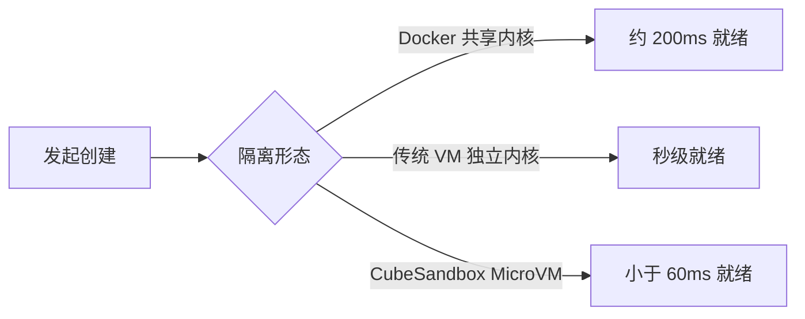

# CubeSandbox 概述与核心指标

> **一句话定位**：CubeSandbox（Cube Sandbox）是腾讯开源的 AI Agent 安全沙箱——基于 RustVMM 与 KVM 的硬件隔离 MicroVM，以毫秒级冷启动、不足 5MB 的额外内存开销提供接近容器的部署密度，同时对外兼容 E2B SDK。（F-001）

本篇是知识包第 1 篇（入门定位），覆盖事实 **F-001 ~ F-009**。全部事实的信源距离为 **① 级**：直接取自官方源码仓库 TencentCloud/CubeSandbox 的 release tag **v0.7.2**（含 README 与 `docs/zh/` 官方中文文档）；版本 pin 与读取规则见 [信源地图](../references/01-source-map.md)。

**本篇读法**：第二节的指标数字与第三节的三方对比是全篇重点，但所有性能数字都受“测试前提”约束。建议先读第一节建立身份认知，再带着“这些数字在我的环境是否成立”的问题阅读第二、三节，最后通过第四、五节校准预期。

## 一、它是什么

Cube Sandbox 是一款“基于 RustVMM 与 KVM 构建的高性能、开箱即用的安全沙箱服务”（F-001，README_zh.md:45）。四个关键词构成它的基本身份：

| 关键词 | 含义 | 依据 |
|---|---|---|
| **RustVMM + KVM** | 每个沙箱是一台由 KVM 驱动、RustVMM 承载的轻量虚拟机（MicroVM），拥有**独立内核**，在硬件虚拟化层与宿主隔离 | F-001 |
| **硬件隔离** | 区别于共享宿主内核的容器，沙箱之间不共享内核，隔离边界由 CPU 硬件虚拟化扩展（VMX）保证 | F-001、F-008 |
| **兼容 E2B SDK** | 对外兼容 E2B SDK，官方对比表标注为“完全兼容 (Drop-in)”——既有的 E2B 代码执行集成可近乎零改动迁移 | F-001、F-008 |
| **单机 / 集群** | “既支持单机部署，也能方便地扩展到多机集群”：入门可单机起步，规模化时以多机集群承载 | F-001 |

运行环境有明确的硬性前提：**支持 KVM 的 x86_64 Linux**（F-003，README_zh.md:280）。换言之，CubeSandbox 不是跨平台的纯软件方案——没有 KVM 的主机（如多数通用容器实例、非 x86_64 环境）无法运行，这是选型时首先要确认的条件。

## 二、核心指标

CubeSandbox 的核心卖点，是“在硬件隔离的前提下逼近容器级敏捷”。官方数据汇总如下：

| 指标 | 数值 | 场景与口径 | 依据 |
|---|---|---|---|
| **冷启动（单并发）** | **60ms** | 创建“具备完整服务能力的硬件隔离沙箱”；简介页表述为“冷启动不到 60ms” | F-001、F-002、F-004 |
| **冷启动（50 并发）** | 平均 **67ms** / P95 **90ms** / P99 **137ms** | 50 并发创建场景，整体保持在百毫秒级 | F-002 |
| **额外内存开销** | **小于 5MB（< 5MB）** | CubeSandbox 自身在沙箱规格之外的内存消耗；简介页表述为“额外内存不足 5MB” | F-001、F-004 |
| **部署密度** | **单机数千实例** | 官方定性为“极高”密度 | F-008 |

作为参照，同一份官方资料将 Docker 容器的完整 OS 启动时间记为 **200ms**，而 CubeSandbox 为亚 60ms（F-005）。

### 测试前提（引用数字时必须附带）

上述数字不是任意环境下的普遍承诺。README 的性能注释明确限定了测量条件（F-009，README_zh.md:241）：

- **启动速度项**：基于**裸金属环境**测试——单并发 60ms；50 并发场景下平均 67ms（P95 90ms，P99 137ms）。
- **内存开销项**：基于 **≤32GB 规格**沙箱实测；官方同时说明，更大规格下开销会略有上升，但幅度极小。

因此在虚拟机（尤其是嵌套虚拟化）或更大规格沙箱中复测，结果可能偏离。引用这些数字时应始终附带“裸金属 / ≤32GB 规格”前提，不外推到任意环境。（F-009）

## 三、三种隔离方式对比

理解 CubeSandbox 的坐标，最好的方式是把它与 Docker 容器、传统虚拟机并列：

| 维度 | Docker 容器 | 传统虚拟机（VM） | CubeSandbox |
|---|---|---|---|
| **内核形态** | 共享宿主内核（Namespaces） | 独立内核 | **独立内核（MicroVM）** |
| **网络隔离** | 随容器网络栈 | 虚拟网络设备 | **eBPF 网络隔离** |
| **启动速度**（完整启动 OS） | 200ms | 秒级 | **毫秒级（< 60ms）** |
| **部署密度** | 高 | 低 | **极高（单机数千实例）** |

（依据 F-008，README_zh.md:233-240；启动对比另见 F-005。）

可以看到 CubeSandbox 的设计意图：取传统 VM 的**独立内核**强隔离，再借极限裁剪与 RustVMM 把启动时延和内存开销压到容器一侧。下图以量级方式直观呈现三者的启动速度差异：

图中数值均为官方文档口径（F-005、F-008），仅示意量级，不代表严格基准测试结果。

## 四、能力边界提示

入门阶段需要如实记住两条边界，避免过度预期：

1. **跨机暂停与恢复尚为 Preview**。官方简介页列出“跨机暂停与恢复（Preview）”，该能力配合 **S3 快照后端**工作；在生产中依赖前，应先验证其成熟度与 S3 后端的配置要求。（F-006）
2. **强依赖 KVM 与 x86_64 Linux**。运行环境必须是支持 KVM 的 x86_64 Linux（F-003），无 KVM 环境不在支持之列。

此外，本篇引用的全部性能数字均附带“裸金属 / ≤32GB 规格”前提（F-009），不应脱离前提进行横向比较。

## 五、社区背景

CubeSandbox 的关注度在开源后快速攀升。据官方 Cube100 页面：项目开源 **80 天内突破 10,000 GitHub Star**，期间**发布 11 个版本**，有**近 70 位贡献者**参与、累计**超过 560 个 commits**。（F-007）

官方简介页同时说明，核心系统在开源前已在**腾讯云生产环境规模化验证**（F-004）。这一背景也解释了它的设计为何偏向高密度、可编排的生产场景。

## 六、本篇不覆盖

作为入门篇，以下内容只给出指针、不展开，以免在缺少架构上下文时引入误解：

- **内部组件与调用链**（CubeAPI / CubeMaster / Cubelet / hypervisor 等如何协同）：见 [02-architecture.md](02-architecture.md)。
- **安装命令、模板制作与集群配置**：见 [03-deployment.md](03-deployment.md)。
- **术语精确释义**（RustVMM、KVM、MicroVM、eBPF、Snapshot 等）：见 [术语表](../references/03-glossary.md)。

## 七、下一步

- [总体架构 02-architecture.md](02-architecture.md)：MicroVM、shim 与控制面如何协同工作
- [部署指南 03-deployment.md](03-deployment.md)：单机部署与多机集群的具体路径
- [术语表 03-glossary.md](../references/03-glossary.md)：RustVMM、KVM、MicroVM、eBPF 等术语释义

## 八、附：事实索引（F-001 ~ F-009）

| 编号 | 事实摘要 | 信源位置 |
|---|---|---|
| F-001 | 基于 RustVMM 与 KVM、兼容 E2B SDK、60ms 创建、内存开销 <5MB、支持单机与集群 | README_zh.md:45 |
| F-002 | 单并发冷启动 60ms；50 并发平均 67ms、P95 90ms、P99 137ms | README_zh.md:241 |
| F-003 | 运行环境为支持 KVM 的 x86_64 Linux | README_zh.md:280 |
| F-004 | 冷启动不到 60ms、额外内存不足 5MB；开源前在腾讯云生产环境规模化验证 | docs/zh/guide/introduction.md:3 |
| F-005 | Docker 容器启动 200ms，CubeSandbox 亚 60ms | docs/zh/guide/introduction.md:38 |
| F-006 | 跨机暂停与恢复（Preview），配合 S3 快照后端 | docs/zh/guide/introduction.md:19 |
| F-007 | 开源 80 天破万 Star、11 个版本、近 70 位贡献者、超 560 个 commits | docs/zh/guide/cube100.md:9 |
| F-008 | Docker / 传统 VM / CubeSandbox 在隔离、启动、密度上的对比 | README_zh.md:233-240 |
| F-009 | 启动速度基于裸金属测试；内存开销基于 ≤32GB 规格沙箱实测 | README_zh.md:241 |
