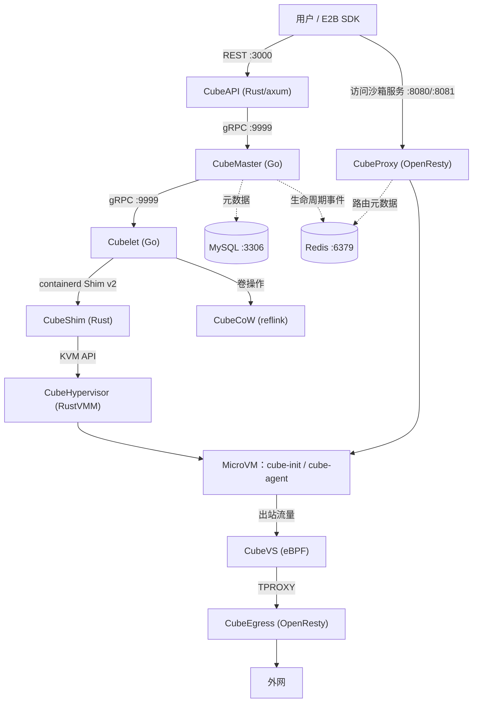
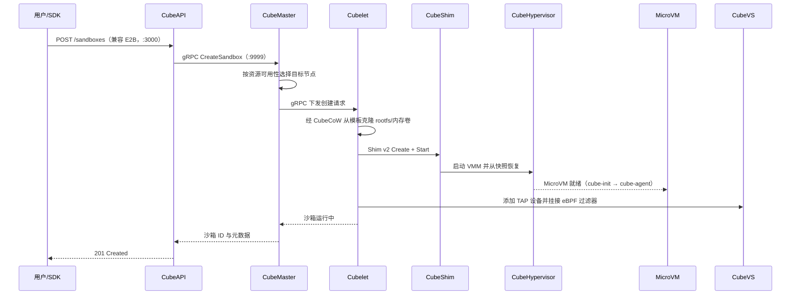

# 总体架构与组件全景

> 本篇是知识包第 2 篇，给出 CubeSandbox 的**组件地图**：控制面与数据面如何分层、每个组件用什么语言写、监听哪些端口、彼此如何调用。具体实现细节留给后续各篇。
>
> **信源距离：①（一手信源）**——事实全部来自官方仓库 v0.7.2 的架构概览页与 `README_zh.md`，信源登记见 [01-source-map.md](../references/01-source-map.md)。

## 1. 导语：一套双层的 MicroVM 沙箱系统

CubeSandbox 是面向 AI Agent 场景构建的基础设施，借助预快照模板与 RustVMM 恢复路径，把具备硬件 KVM 隔离的 MicroVM **冷启动压到 100ms 以内**（F-010）。整套系统沿「控制面 / 数据面」切分：

- **控制面**只做 API 网关、调度、状态协调与运维控制台，由 CubeAPI、CubeMaster、WebUI、Redis 四个组件构成（F-010）；
- **数据面**负责 VM 生命周期、存储、网络、安全策略执行与请求路由，由 Cubelet、CubeShim、CubeHypervisor、CubeCoW、CubeVS、CubeEgress、CubeProxy 七个组件构成（F-010）；
- 官方 README 的架构表用七个条目概括了同一组核心组件：CubeAPI、CubeMaster、CubeProxy、Cubelet、CubeVS、CubeEgress、CubeHypervisor & CubeShim（F-011）；
- 网络数据面由三个挂载在关键位置的 eBPF 程序承担（F-012）；
- 技术栈并非从零造起：Cloud Hypervisor、Kata Containers、virtiofsd、containerd-shim-rs、ttrpc-rust 是官方鸣谢的上游基石（F-013）。

各组件的默认监听端口（均来自源码/官方文档事实）：CubeAPI `:3000`（F-039）、CubeMaster HTTP `:8089`/gRPC `:9999`（F-060）、Cubelet HTTP `:9998`/gRPC `:9999`/debug `:9966`（F-071）、CubeEgress `:8080`/`:8443`/`:9091`（F-185、F-190）、CubeProxy `:8080`/`:8081`/`:9090`（F-193）、CubeOps `:3010`（F-216）、WebUI `:12088`（F-035）、MySQL `:3306`（F-064）、Redis `:6379`（F-065）。

## 2. 分层总览

| 层 | 组件 | 一句话职责 |
|---|---|---|
| **控制面** | CubeAPI、CubeMaster、WebUI、Redis | API 网关、集群调度、状态协调、运维控制台（F-010） |
| **数据面** | Cubelet、CubeShim、CubeHypervisor、CubeCoW、CubeVS、CubeEgress、CubeProxy | VM 生命周期、存储、网络、安全策略执行、请求路由（F-010） |

控制面的 MySQL 提供持久化元数据（F-064），Redis 承载沙箱元数据、生命周期事件流与分布式协调（F-010、F-065）；数据面组件是**节点本地**的——每个计算节点各自运行 Cubelet/CubeShim/CubeHypervisor/CubeVS/CubeEgress，管理驻留在该主机上的沙箱。

## 3. 架构图

实线是请求/控制链路，虚线是元数据与事件链路。沙箱的**入站**访问统一经过 CubeProxy，**出站**流量统一经过 CubeVS → CubeEgress。

## 4. 组件清单表

| 组件 | 语言 | 端口 | 职责 | F 编号 |
|---|---|---|---|---|
| CubeAPI | Rust（axum） | `:3000` | 兼容 E2B 的 REST API 网关，鉴权并转发内部 gRPC | F-011、F-039 |
| CubeMaster | Go（gin） | HTTP `:8089`、gRPC `:9999` | 集群级编排调度，选节点并分发请求 | F-060 |
| WebUI | Vue | `:12088` | 浏览器管理控制台（沙箱/模板/节点管理） | F-035 |
| CubeOps | Go（gin） | `:3010` | 运维面（认证/集群/节点/仓库），独立于 F-010 最小控制面清单 | F-216 |
| MySQL | — | `:3306` | 持久化元数据存储 | F-064 |
| Redis | — | `:6379` | 沙箱元数据、生命周期事件、分布式锁 | F-010、F-065 |
| Cubelet | Go | HTTP `:9998`、gRPC `:9999`、debug `:9966` | 节点本地沙箱全生命周期与镜像/卷集成 | F-071 |
| CubeShim | Rust | — | containerd Shim v2 桥接，准备 rootfs/内核并启动 VM | F-011 |
| CubeHypervisor | Rust（RustVMM + KVM） | — | 轻量级 VMM，管理 vCPU/内存/virtio 设备与快照恢复 | F-011 |
| CubeCoW | Rust | — | 精简配置卷库，FICLONE 实现 O(1) 快照克隆 | F-010 |
| CubeVS | Go + eBPF C | — | 内核态网络数据面（NAT、连接追踪、策略） | F-011、F-012 |
| CubeEgress | OpenResty + Lua | `:8080`、`:8443`、`:9091` | L7 透明出网网关：域名过滤、凭据注入、审计 | F-185、F-190 |
| CubeProxy | OpenResty + Lua | `:8080`、`:8081`、`:9090` | 反向代理与沙箱请求路由 | F-193 |

「—」表示该组件不以独立 TCP 端口提供服务（库函数、Unix/vsock 通信或经 KVM 接口工作）。

## 5. 网络数据面：三个 eBPF 程序

CubeVS 的三个 eBPF 程序在内核态处理沙箱全部流量的转发（F-012）：

| 程序 | 挂载点 | 方向 | 职责 |
|---|---|---|---|
| `from_cube` | TAP 的 TC ingress | 沙箱 → 主机 | SNAT、策略检查、ARP 代理 |
| `from_world` | 主机网卡的 TC ingress | 外部 → 主机 | 反向 NAT、端口映射 |
| `from_envoy` | cube-dev 的 TC egress | 代理 → 沙箱 | DNAT、透明代理支持 |

出站流量在 `from_cube` 处经 SNAT 后被导向 CubeEgress（TPROXY），因此**沙箱不经过网关就无法出网**——域名白名单、凭据注入与审计在网关处统一生效。深入机制见第 9 篇 [CubeNet 网络数据面](09-network.md) 与第 10 篇 [CubeEgress 与 CubeProxy](10-gateways.md)。

## 6. 上游渊源

官方鸣谢五个上游项目（F-013），CubeSandbox 分别借鉴了它们最成熟的能力：

| 上游项目 | 被借鉴的能力 |
|---|---|
| **Cloud Hypervisor** | VMM 基座——CubeHypervisor 是基于 RustVMM 的 cloud-hypervisor fork，承担 MicroVM 的设备模型与生命周期 |
| **Kata Containers** | 安全容器运行模型——shim/hypervisor/guest agent 分层组织 MicroVM 沙箱的整体范式 |
| **virtiofsd** | host ↔ VM 之间基于 virtio-fs 的文件共享 |
| **containerd-shim-rs** | Rust 语言的 containerd Shim v2 框架，CubeShim 据此实现运行时接入 |
| **ttrpc-rust** | vsock 之上的轻量 RPC 框架，承载 host 与 guest 内 agent 的通信 |

官方 README 同时声明：部分组件为适配 CubeSandbox 运行模型进行了定制修改，原始上游归属声明均已保留（F-013）。

## 7. 端到端请求旅程

一次创建沙箱的请求在组件间的流转（组件级，不展开实现）：

各站的深入阅读：API 兼容与鉴权见第 4 篇 [CubeAPI](04-cubeapi.md)；调度见第 5 篇 [CubeMaster](05-cubemaster.md)；节点生命周期见第 6 篇 [Cubelet](06-cubelet.md)；VM 设备模型见第 7 篇 [cube-hypervisor](07-hypervisor.md)；shim 与 guest agent 见第 8 篇 [cube-agent 与 CubeShim](08-agent-shim.md)；卷克隆见第 11 篇 [CubeCoW 与 CubeS3lvol 存储体系](11-storage.md)；TAP 与 eBPF 挂接见第 9 篇 [CubeNet](09-network.md)。

## 8. 导航

- 上一篇：[01 总览](01-overview.md)
- 第 3 篇：[部署形态与环境要求](03-deployment.md)
- 第 4 篇：[CubeAPI：E2B 兼容网关](04-cubeapi.md)
- 第 5 篇：[CubeMaster：编排调度](05-cubemaster.md)
- 第 6 篇：[Cubelet：节点代理](06-cubelet.md)
- 第 7 篇：[cube-hypervisor](07-hypervisor.md)
- 信源：[CubeSandbox v0.7.2 信源地图](../references/01-source-map.md)
