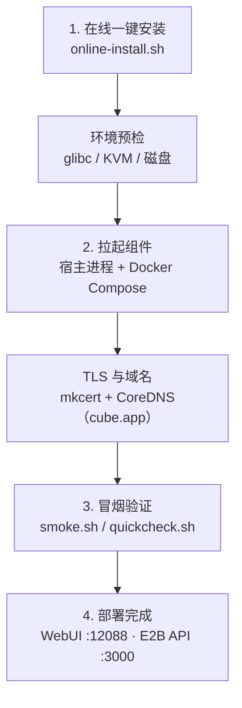

# 部署形态与环境要求

> 本篇覆盖事实 **F-014 ~ F-036**，信源距离①（一手）：全部事实直接取自 release tag v0.7.2 中的官方文档（quickstart、downloads、README）与部署资产文件，锚点逐条登记于[事实锚点索引](../references/02-anchor-index.md)。

## 一、部署总览：四步、免本地构建

CubeSandbox 的部署流程共四步，且**无需本地构建**——发布资产已包含预编译二进制、guest 内核与 guest 镜像（F-014）。整体路径如下：



四步中没有任何源码编译环节；确需源码自建时，参见下文第九节。

## 二、环境要求

### 操作系统与 glibc

| 类别 | 系统 |
|---|---|
| 推荐 | OpenCloudOS 9、TencentOS 4（F-016） |
| 已测试 | Ubuntu 20.04 / 22.04 / 24.04（F-016） |

发布二进制基于 Ubuntu 20.04（glibc 2.31）构建，因此宿主系统的 **glibc 必须 ≥ 2.31**（F-015）。

### 硬件与虚拟化

- 必须运行在支持 **KVM** 的 Linux 主机上：官方 README 的表述为"支持 KVM 的 x86_64 Linux"（F-003）；发布资产同时覆盖 amd64 与 arm64 两种架构（F-028、F-032）。
- Cubelet 数据根目录为 `/data/cubelet`：**≥50GB** 起步；需要承载多个模板时建议 **≥200GB**（F-017）。

### 机器规格（两档）

| 档位 | CPU | 内存 | 磁盘 | 出处 |
|---|---|---|---|---|
| 功能体验（最低） | ≥4 核 | ≥8GB | ≥50GB | F-018 |
| 推荐配置 | 32 核 | 64GB | ≥200GB | F-018 |

## 三、在线一键安装

官方 quickstart 给出的在线安装命令如下（F-019；省略号对应官方安装脚本地址，事实原文即如此）：

```bash
curl -fsSL .../deploy/one-click/online-install.sh \
  | CUBE_PVM_ENABLE=1 MIRROR=cn bash
```

两个关键环境变量：

- `MIRROR=cn`：使用国内镜像源拉取安装资产。
- `CUBE_PVM_ENABLE=1`：启用 PVM 定制内核形态（见第八节）；不启用时使用普通裸金属（bare-metal）guest 内核资产。

如需跳过环境预检，可设置 `ONE_CLICK_SKIP_PRECHECK=1`，或向安装脚本传递 `--skip-precheck`（F-020）。跳检前应自行确认 glibc、KVM 与磁盘条件均已满足。

> **信源说明**：`deploy/one-click` 相关文件在工作树存在 post-release 变更（工作树中 online-install.sh 已删除）。本篇命令以 v0.7.2 tag blob 与 quickstart 原文为准（F-019、F-020），读取规则见[信源地图](../references/01-source-map.md)。

## 四、安装了什么

一键安装在单机上拉起的组件（F-021）：

| 类别 | 内容 |
|---|---|
| 对外接口 | E2B 兼容 REST API，监听 **:3000** |
| 宿主进程 | CubeMaster、Cubelet、CubeShim |
| 依赖中间件 | MySQL、Redis，经 **Docker Compose** 拉起 |

入口侧由 CubeProxy 提供 **mkcert 签发的本地 TLS** 证书，并通过 **CoreDNS** 提供沙箱域名解析，根域名为 **cube.app**（F-022）。

客户端连接所需的环境变量（F-024）：

```bash
export E2B_API_URL=http://127.0.0.1:3000
export E2B_API_KEY=e2b_000000
export SSL_CERT_FILE=/root/.local/share/mkcert/rootCA.pem
```

其中 `SSL_CERT_FILE` 指向 mkcert 根证书，使客户端信任 CubeProxy 的本地 TLS（F-022、F-024）。

## 五、安装路径与服务管理

- 安装入口：`install.sh` 是**控制节点**入口，`install-compute.sh` 是**计算节点**入口；统一安装路径为 `/usr/local/services/cubetoolbox`（F-025）。
- 服务管理以 systemd target 为粒度（F-026）：
  - 控制节点：`cube-sandbox-control.target`
  - 计算节点：`cube-sandbox-compute.target`
- 冒烟脚本：`smoke.sh` 共 18 行，加载 `.env` 后执行 `quickcheck.sh`（F-027）。

```bash
# 安装完成后在安装目录下执行冒烟
bash smoke.sh
```

## 六、多节点与 Kubernetes

- **裸机多节点**：先在控制节点执行 `install.sh`，再在各计算节点执行 `install-compute.sh` 加入集群（F-025）。
- **Kubernetes**：仓库提供 Helm chart，chart name 为 **cube**，`version` 与 `appVersion` 均为 **0.7.2**（F-029）。

多节点部署的完整操作示例见 [02-cluster-deploy.md](../examples/02-cluster-deploy.md)。

## 七、离线整包与发布资产

离线整包按架构发布，包名为 `cube-sandbox-one-click-<版本>-<架构>.tar.gz`，支持 **amd64 / arm64**；发布页位于 `cnb.cool/CubeSandbox/CubeSandbox/-/releases`（F-032）。

内核与 guest 镜像资产以 tag 形式发布并 pin：

| 资产 | tag | 出处 |
|---|---|---|
| kernel_bm_amd64 / kernel_bm_arm64 / kernel_pvm | `kernel-release-260921-1` | F-028 |
| guest_image | `guest-image-260820-1` | F-028 |

downloads 文档另给出 guest 内核 tag 示例 `kernel-release-260812-1`（产物含 `vmlinux-amd64`、`vmlinux-pvm-amd64`），guest 镜像同为 `guest-image-260820-1`（F-033）。

## 八、PVM 定制内核

`pvm_setup.sh` 用于将 PVM 形态接入宿主，共三步（F-034）：

1. **并行构建** PVM host 内核包与 guest `vmlinux`；
2. 经人工确认后，**安装 host 内核包并接入 GRUB**；
3. 将 guest `vmlinux` 放入 assets 目录与运行时路径。

PVM 形态需配合在线安装时的 `CUBE_PVM_ENABLE=1` 使用（F-019、F-034）。

## 九、源码构建与样例配置

需要源码自建时：

- 默认构建镜像为 `cube-sandbox-builder:ubuntu2004`，由 `Dockerfile.builder` 定义（F-030）。
- 仓库包含**六个 Rust 工作区**：CubeAPI、CubeShim、agent、guest-init、cubecow、hypervisor；`BINARIES` 清单含 agent、cube-init、cube-volume-s3、cubeapi、cubelet、cubemaster、cubeops、cubevsmapdump、shim（F-031）。
- `configs/` 提供样例配置：`kernel-oc9.x86_64.config`、`kernel-oc9.aarch64.config`，以及 `single-node/` 下的 `cubelet.yaml`、`cubemaster.yaml`、`templatecenter.yaml`（F-036）。

部署完成后制作模板的命令（F-023）：

```bash
cubemastercli tpl create-from-image --image <基础镜像> \
  --writable-layer-size 1G \
  --expose-port 49999 --expose-port 49983 \
  --probe 49999
```

模板制作的完整说明见本知识包第 13 篇（模板主题）。

## 十、部署后

- 打开管理控制台 WebUI：`http://<控制节点 IP>:12088`（F-035）。
- E2B 兼容 API 入口为 `:3000`，客户端环境变量配置见第四节。

延伸阅读：

- [集群部署示例 02-cluster-deploy.md](../examples/02-cluster-deploy.md)
- [下一篇：CubeAPI 接口与使用](04-cubeapi.md)
- [CubeSandbox 信源地图](../references/01-source-map.md)
- [CubeSandbox 事实锚点索引](../references/02-anchor-index.md)
