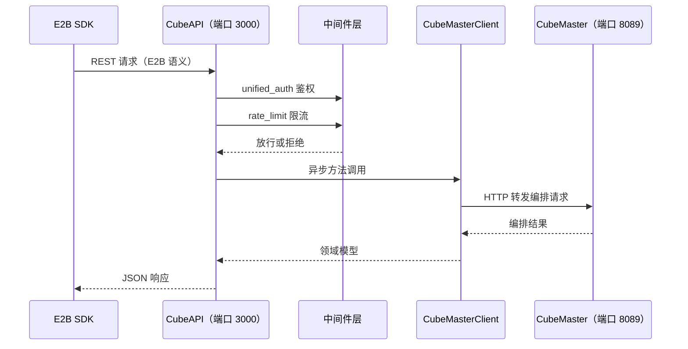

# CubeAPI — E2B 兼容 REST API 网关

> 信源距离①：本文事实直读 CubeAPI crate 源码（bin `cube-api`，`src/main.rs`）与仓库根 `openapi.yml` 的 v0.7.2 tag blob，覆盖事实 F-037 ~ F-059，逐条锚点见 [../references/02-anchor-index.md](../references/02-anchor-index.md)。CubeAPI 是控制面的统一入口：以 E2B 兼容的 REST 语义承接 SDK 请求，经认证与限流后转译并转发给下游 CubeMaster。

## 一、定位与调用链

CubeAPI 的 crate 为 `cube-api` v0.1.0、edition 2021，二进制名 `cube-api`、入口 `src/main.rs`（F-037）；框架为 Rust/axum 0.7（v0.7.2 tag 的 `CubeAPI/Cargo.toml` 直读核实）。crate 内部按职责拆为 config、constants、cubemaster、error、handlers、logging、middleware、models、openapi、routes、services、state 共 12 个模块（`main.rs:5-16`，F-038）。服务默认监听 `0.0.0.0:3000`，下游 CubeMaster 默认指向 `http://127.0.0.1:8089`（F-039），自身不持有沙箱实例，只做协议网关与编排转发。

## 二、CLI 参数与服务配置

CLI 参数定义于 `main.rs:39-120`（F-039）：

| 参数 | 默认值 | 说明 |
|---|---|---|
| `--debug` | — | 开启调试模式 |
| `--bind` | `0.0.0.0:3000` | 监听地址 |
| `--cubemaster-url` | `http://127.0.0.1:8089` | 下游 CubeMaster 地址 |
| `--auth-callback-url` | — | 认证回调地址 |
| `--worker-threads` | — | 工作线程数 |
| `--log-level` | — | 日志级别 |
| `--log-dir` | — | 日志目录 |
| `--log-prefix` | `cube-api` | 日志文件前缀 |
| `--rate-limit-per-sec` | `100` | 每秒限流阈值 |
| `--instance-type` | `cubebox` | 上报的实例类型 |
| `--sandbox-domain` | `cube.app` | 沙箱访问域名 |
| `--export-openapi` | — | 导出 OpenAPI 契约后退出 |

`ServerConfig` 字段包括 bind、log_level、worker_threads、rate_limit_per_sec、cubemaster_url、instance_type、sandbox_domain、log_dir、log_prefix、auth_callback_url、cube_api_key（`config/mod.rs:8-137`，F-048），与 CLI 参数双向映射。同名环境变量：

| 环境变量 | 对应配置 |
|---|---|
| `CUBE_API_BIND` | 监听地址 |
| `CUBE_MASTER_ADDR` | CubeMaster 地址 |
| `CUBE_API_SANDBOX_DOMAIN` | 沙箱域名 |
| `CUBE_API_KEY` | cube_api_key |

## 三、路由全景

路由按资源域分为沙箱、模板、卷、健康四组（F-041 ~ F-046）。

### 3.1 沙箱生命周期

| 方法 | 路径 | 事实 |
|---|---|---|
| GET | `/health` | F-041 |
| GET | `/sandboxes` | F-041 |
| POST | `/sandboxes` | F-041 |
| GET | `/v2/sandboxes` | F-041 |
| GET | `/sandboxes/:sandboxID` | F-042 |
| DELETE | `/sandboxes/:sandboxID` | F-042 |
| GET | `/sandboxes/:id/logs`（含 `/v2`） | F-042 |
| PUT | `/sandboxes/:id/network` | F-043 |
| POST | `/sandboxes/:id/timeout` | F-043 |
| POST | `/refreshes` | F-043 |
| GET | `/snapshots` | F-043 |
| POST | `/sandboxes/:id/pause` | F-044 |
| POST | `/sandboxes/:id/resume` | F-044 |
| POST | `/sandboxes/:id/connect` | F-044 |
| POST | `/sandboxes/:id/snapshots` | F-044 |
| POST | `/sandboxes/:id/rollback` | F-044 |

### 3.2 模板

| 方法 | 路径 | 事实 |
|---|---|---|
| GET | `/templates` | F-045 |
| POST | `/templates` | F-045 |
| GET | `/templates/compat` | F-045 |
| POST | `/templates/compat/:id/adopt-baseline` | F-045 |
| GET | `/templates/aliases/:alias` | F-045 |
| GET | `/templates/:id` | F-045 |
| POST | `/templates/:id` | F-045 |
| PATCH | `/templates/:id` | F-045 |
| PUT | `/templates/:id/alias` | F-045 |
| POST | `/templates/:id/builds/:buildID` | F-045 |
| GET | `/templates/:id/builds/:buildID/status` | F-045 |
| GET | `/templates/:id/builds/:buildID/logs` | F-045 |
| DELETE | `/templates/:id` | F-046 |

### 3.3 卷

| 方法 | 路径 | 事实 |
|---|---|---|
| GET | `/volumes` | F-046 |
| POST | `/volumes` | F-046 |
| GET | `/volumes/:id` | F-046 |
| DELETE | `/volumes/:id` | F-046 |

健康检查仅有 `GET /health` 一条路由（F-041），独立于上述资源路由。

## 四、超时策略

路由级超时常量定义于 `routes.rs:26-36`（F-040），按操作代价分档：

| 常量 | 值 | 适用范围 |
|---|---|---|
| `DEFAULT_ROUTE_TIMEOUT` | 30s | 常规路由默认上限 |
| `PAUSE_RESUME_ROUTE_TIMEOUT` | 120s | pause / resume 路由 |
| `SNAPSHOT_LONG_ROUTE_TIMEOUT` | 240s | 快照等长操作路由 |

## 五、领域模型与 Egress 规则

`enum SandboxState` 含 `Running`、`Paused`、`Pausing` 三个变体；`SandboxNetworkConfig` 描述沙箱级网络策略（`models/mod.rs:36-52`，F-050）：

| 字段 | 含义 |
|---|---|
| `allowPublicTraffic` | 是否允许公网流量 |
| `allowOut` | 允许出向的目标集合 |
| `denyOut` | 拒绝出向的目标集合 |
| `maskRequestHost` | 是否掩码化请求 Host |
| `rules` | L7 Egress 规则列表 |

Egress 规则族定义于 `models/mod.rs:182-238`（F-051）：

| 类型 | 字段/变体 |
|---|---|
| `EgressRuleMatch` | `sni`、`host`、`method`、`path`、`scheme`、`port` |
| `EgressRuleAction` | `allow`、`audit`、`inject` |
| `EgressRuleInject` | `header`、`secret`、`format` |
| `EgressRule` | 匹配条件 + 动作的组合规则 |

同区域还定义了 `NewSandbox`、`Sandbox`、`SandboxDetail` 三个请求/响应模型（F-051）。服务层以 `DENY_ALL_IPV4_CIDR = "0.0.0.0/0"` 为兜底拒绝段，并由 `validate_allow_out_domains_require_deny_all` 校验：配置允许出向域名时必须同时存在全拒绝兜底（`services/mod.rs:16-89`，F-055）。

## 六、应用状态与服务层

`AppState` 为全应用共享状态，含 rate_limiter、http_client、services、logger、config 五个字段（`state.rs:16-31`，F-047）。服务聚合 `AppServices` 下辖 sandboxes、snapshots、templates、volumes 四个服务（F-055）。其中 `SandboxService` 的方法面为：`new`、`list`、`get`、`create`、`kill`、`pause`、`resume`、`connect`、`get_logs`、`get_logs_v2`、`set_timeout`、`update_network`、`refresh`（F-055）。

下游访问由 `CubeMasterClient` 承担，其异步方法包括 `create_sandbox`、`delete_sandbox`、`list_sandboxes`、`get_sandbox`、`set_sandbox_timeout`、`update_sandbox_network`、`create_snapshot`、`rollback_sandbox`、`list_templates` 等（`cubemaster/mod.rs:43-551`，F-054）。

## 七、横切关注点

- **中间件**：`unified_auth` 统一鉴权、`rate_limit` 限流，均在路由外层先行执行（F-054）；默认限流 100 次/秒由 CLI 与配置注入（F-039）。
- **错误模型**：`enum AppError` 含 `NotFound`、`Unauthorized`、`BadRequest`、`Internal`、`Conflict`、`ServiceUnavailable{message, retry_after}`、`TooManyRequests`、`NotImplemented`，配套 `type AppResult<T>`（`error/mod.rs:14-85`，F-052）。其中 `ServiceUnavailable` 携带 `retry_after`，用于向下游传达可重试时机，而非笼统报 500。
- **日志体系**：`LogLevel`、`LogEvent`、`trait Logger` 与 `type ArcLogger` 构成日志抽象，实现包括 `FileLogger`、`MultiLogger`、`FilteredLogger`、`HttpLogger`、`OtlpLogger`、`NoopLogger`（`logging/mod.rs:42-140`，F-053），可按目的地与过滤条件组合。
- **envd 版本**：`ENVD_VERSION_FALLBACK = "0.2.0"`，注解键 `ENVD_VERSION_ANNOTATION = "cube.master.components.envd.version"`（`constants.rs:10-14`，F-049），用于读取或回退沙箱内 envd 组件版本。

## 八、OpenAPI 3.1 契约

仓库根 `openapi.yml` 是 CubeAPI 的接口契约：OpenAPI `3.1.0`、title 为 **CubeAPI**、描述为 "E2B-compatible sandbox API server"，server 前缀 `/cubeapi/v1`（`openapi.yml:5`，F-057）。契约规模为 2458 行、26 个 paths（F-058，含 `/health`）。

> **信源瑕疵（F-059）**：v0.7.2 tag 的 `openapi.yml` 中 `info.version` 仍为 "0.1.0"，与发行版本号不一致。引用口径应为"v0.7.2 tag 中的契约快照"，不得称其为 0.1.0 版接口。

## 九、调用示例与延伸阅读

官方示例直接复用 E2B 客户端形态：Python 示例设置 `os.environ["E2B_API_URL"] = "http://localhost:3000"`（`examples/create.py:8`）；Go client 以 `c.baseURL + "/sandboxes"` 发起 POST（`examples/go/client.go:91`）（F-056）。可见 CubeAPI 的兼容目标是让 E2B SDK 仅改 endpoint 即可接入。

- 下游编排面：[05-cubemaster.md](05-cubemaster.md)
- SDK 三端生态：[13-sdk-ecosystem.md](13-sdk-ecosystem.md)
- SDK 端到端调用流程：[../examples/01-sdk-workflow.md](../examples/01-sdk-workflow.md)
- 全量事实锚点：[../references/02-anchor-index.md](../references/02-anchor-index.md)
