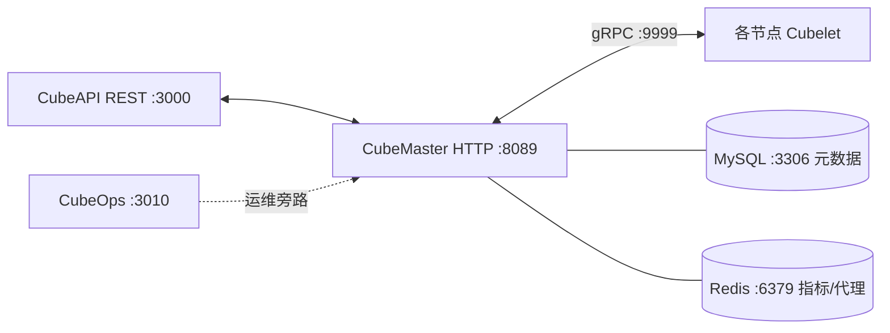
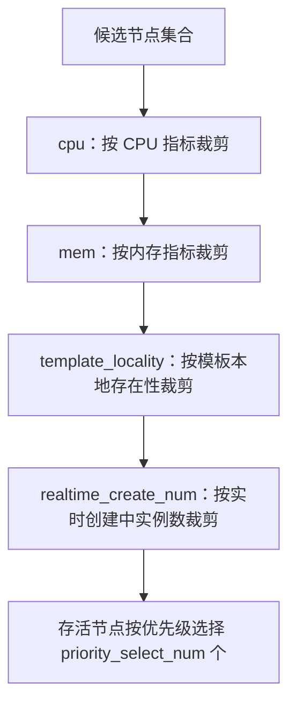

# CubeMaster — 编排调度与全局配置

CubeMaster 是 CubeSandbox 的编排调度中枢：向上承接 CubeAPI 转发的沙箱请求，向下通过 gRPC 指挥各节点上的 Cubelet，并统一管理模板/卷等元数据。本文逐组解读其 `conf.yaml` 全部配置（F-060 ~ F-066）、四过滤器调度器（F-066）、构建产物与 CLI（F-067），以及 single-node 部署样例（F-068）。全部事实直接取自 v0.7.2 tag 中的源码与配置文件，**信源距离①**——无二手转述；配置锚点均为 `CubeMaster/conf.yaml`，版本 pin 见 [信源地图](../references/01-source-map.md)。

## 一、组件定位

CubeMaster 用 Go 编写、HTTP 框架为 gin（F-067），自身 HTTP 监听 **8089** 端口；对下与 Cubelet 通信的 gRPC 端口为 **9999**（F-060、F-062）。它在集群中的位置如下：

- **北向**：对接 CubeAPI——E2B 兼容网关把沙箱创建、模板等请求落到 CubeMaster。
- **南向**：通过 gRPC :9999 调用各节点 Cubelet，完成镜像准备、实例创建/销毁、快照等动作。
- **旁路存储**：MySQL 存元数据，Redis 存节点指标与代理信息（F-064、F-065）。
- **运维旁路**：`cube_ops_addr` 默认指向 `http://127.0.0.1:3010`，即本机 CubeOps（F-060）。

## 二、conf.yaml：common 与 log

### common（conf.yaml:1-18）（F-060）

| 键 | 默认值 | 含义 |
|---|---|---|
| `http_port` | `8089` | CubeMaster HTTP 监听端口 |
| `http_readtimeout` | `120` | HTTP 读超时 |
| `writetimeout` | `360` | HTTP 写超时 |
| `idletimeout` | `360` | HTTP 空闲连接超时 |
| `cube_ops_addr` | `http://127.0.0.1:3010` | CubeOps 运维面地址 |
| `sync_meta_data_interval` | `1s` | 元数据同步间隔 |
| `sync_metric_data_interval` | `1s` | 指标数据同步间隔 |
| `collect_metric_interval` | `1s` | 指标采集间隔 |
| `default_headless_service_nodes_num` | `1` | headless service 默认节点数 |
| `enable_check_com_net_id_param` | `false` | 是否校验通信网络 ID 参数（默认关） |

三个 1s 间隔说明 CubeMaster 以秒级节奏采集节点指标并同步元数据/指标数据。

### log（conf.yaml:20-25）（F-061）

| 键 | 默认值 | 含义 |
|---|---|---|
| `module` | `cubemaster` | 日志模块名 |
| `path` | `/data/log/CubeMaster-dev` | 日志目录 |
| `file_size` | `100` | 单文件大小上限（滚动单位） |
| `file_num` | `10` | 保留文件数 |
| `level` | `info` | 日志级别 |

## 三、cubelet_conf：下游调用超时与并发

`cubelet_conf` 是 CubeMaster 调用 Cubelet 时的客户端参数（conf.yaml:27-42）（F-062）：

| 键 | 默认值 | 含义 |
|---|---|---|
| `grpc_port` | `9999` | Cubelet gRPC 端口 |
| `common_timeout_insec` | `30` | 通用调用超时（秒） |
| `create_image_timeout_insec` | `300` | 镜像准备超时（秒） |
| `app_snapshot_timeout_insec` | `300` | 应用快照超时（秒） |
| `default_timeout_insec` | `-1` | 默认超时（秒），-1 表示永不超时 |
| `create_timeout_insec` | `600` | 创建实例超时（秒） |
| `create_concurrent_limit` | `100` | 创建并发上限 |
| `destroy_concurent_limit` | `100` | 销毁并发上限（键名沿用源码拼写） |
| `enable_exposed_port` | `true` | 是否允许暴露端口 |
| `exposed_port_list` | `["80"]` | 允许暴露的端口白名单 |
| `disable_redis_proxy_port` | `true` | 禁用 Redis 代理端口 |

**关于 `default_timeout_insec: -1`**：该值是"永不超时"（NEVER_TIMEOUT）语义，而非报错值；官方生命周期文档另说明 `0` 表示立即超时，超时单位为秒（E2B 接口侧为毫秒），超时动作为 kill（默认）/pause（F-235、F-237）。超时语义的完整讨论见 [12-ops-lifecycle.md](12-ops-lifecycle.md)。

## 四、认证与请求模板（conf.yaml:44-56）（F-063）

- **认证开关**：`auth.enable: false`——默认配置下不启用鉴权，生产部署须自行评估并打开。
- **请求标签白名单 `whitelist_req_tag`**：仅放行以下请求标签键——`WorkingDir`、`RLimit`、`DnsConfig`、`HostAliases`、`Poststop`、`Prestop`。白名单之外的标签不进入下游请求。
- **沙箱请求模板 `cube_box_req_template`**：对所有沙箱请求注入默认字段：
  - `network_type: "tap"`——默认网络形态为 tap；
  - `TZ: "Asia/Shanghai"`——默认时区；
  - `denyOut`：四条 CIDR 出向拒绝规则（配置中登记为四条，具体 CIDR 值以 `conf.yaml:44-56` 原文为准，本文不转述数值）。

## 五、元数据存储：MySQL 与 Redis

### MySQL：instance_db_config（conf.yaml:58-68）（F-064）

| 键 | 默认值 | 含义 |
|---|---|---|
| `addr` | `127.0.0.1:3306` | 数据库地址 |
| `user` | `cube` | 用户名 |
| `pwd` | `cube_pass` | 密码 |
| `db_name` | `cube_mvp` | 库名 |
| `conn_timeout` | `5` | 连接超时 |
| `max_idle_conns` | `5` | 最大空闲连接 |
| `max_open_conns` | `20` | 最大打开连接 |
| `max_conn_life_time_seconds` | `300` | 连接最大存活时间（秒） |

### Redis（conf.yaml:70-80）（F-065）

| 键 | 默认值 | 含义 |
|---|---|---|
| `nodes` | `127.0.0.1:6379` | Redis 节点 |
| `password` | `ceuhvu123` | 密码 |
| `db_no` | `0` | 逻辑库编号 |
| `max_idle` | `8` | 最大空闲连接 |
| `max_active` | `32` | 最大活跃连接 |
| `idle_timeout` | `30` | 空闲超时 |
| `max_retry` | `2` | 最大重试次数 |
| `node_metric_ttl_sec` | `600` | 节点指标键 TTL（秒） |
| `sandbox_proxy_ttl_sec` | `0` | 沙箱代理键 TTL，0 为不失效 |

> 上述账号 `cube`/`cube_pass` 与 Redis 密码 `ceuhvu123` 均为**仓库自带的默认样例值**，仅作开发/单机示例；任何真实部署都必须替换，并避免把生产密码提交回仓库。

## 六、调度器：四过滤器链（conf.yaml:82-98）（F-066）

调度器参数与过滤器：

| 键 | 默认值 | 含义 |
|---|---|---|
| `priority_select_num` | `1` | 每次按优先级选中的节点数 |
| `metric_update_timeout` | `300s` | 指标更新超时 |
| `local_metric_update_timeout` | `300s` | 本地指标更新超时 |
| `ignore_redis_allocation` | `false` | 是否忽略 Redis 中的分配信息（默认不忽略） |
| `filter.enable_filters` | `cpu, mem, template_locality, realtime_create_num` | 启用的过滤器清单 |

四个过滤器按配置登记的顺序串联，对候选节点逐级裁剪（以下为按过滤器名称与配置语义的客观说明）：

- **cpu**：依据节点 CPU 资源指标排除 CPU 不足的节点。
- **mem**：依据节点内存指标排除内存不足的节点。
- **template_locality**：模板本地性——优先保留本地已有所需模板的节点，减少跨节点模板分发/拉取成本。
- **realtime_create_num**：依据节点实时创建中的实例数量排除瞬时创建压力过大的节点。

经过滤后，调度器按优先级选出 `priority_select_num`（默认 1）个目标节点。指标刷新受 `metric_update_timeout`/`local_metric_update_timeout`（均 300s）约束；`ignore_redis_allocation: false` 表示分配决策不会忽略 Redis 中已登记的分配信息。

## 七、构建、CLI 与单机配置

**Makefile（Makefile:17-145）（F-067）**：

- `APPS=cubemaster cubemastercli`——同目录构建两个产物：服务端 **cubemaster** 与命令行工具 **cubemastercli**。
- `PKG=.../CubeMaster/pkg/base`——构建打包路径。
- `ENVD_EMBED_ASSET`——支持把 envd 资产以嵌入方式打进产物；嵌入前做 **ELF magic 校验**（魔数 `7f454c46`），且嵌入文件大小上限为 **16777216** 字节（16 MiB）。

**go.mod（go.mod:1-50）（F-067）**：Go 版本为 **1.25.7**，关键依赖包括 `gin`（HTTP）、`gorm`（ORM）、`pgx/v5`（PostgreSQL 驱动）、`goose/v3`（数据库迁移）、`urfave/cli`（CLI 框架，cubemastercli 使用）、`k8s.io/api`（Kubernetes API 类型）以及测试用的 `gomonkey/v2`。

**single-node 配置（configs/single-node/cubemaster.yaml:48）（F-068）**：单机样例与主配置口径一致——`http_port: 8089`、`grpc_port: 9999`、`default_timeout_insec: -1`、`create_timeout_insec: 600`、`create_concurrent_limit: 100`；数据库 `driver` 默认为 **mysql**。这是一键单机部署实际引用的 CubeMaster 配置。

## 八、导航

- 上一跳：[04-cubeapi.md](04-cubeapi.md)——北向 E2B 兼容 API 网关。
- 下一跳：[06-cubelet.md](06-cubelet.md)——节点代理与 gRPC :9999 的服务端。
- 运维视角：[12-ops-lifecycle.md](12-ops-lifecycle.md)——超时、暂停/恢复与生命周期动作。
- SDK 视角：[13-sdk-ecosystem.md](13-sdk-ecosystem.md)——三端 SDK 与 tpl 模板命令。
- 事实锚点：[02-anchor-index.md](../references/02-anchor-index.md)——F-060 ~ F-068 逐条源码位置。
