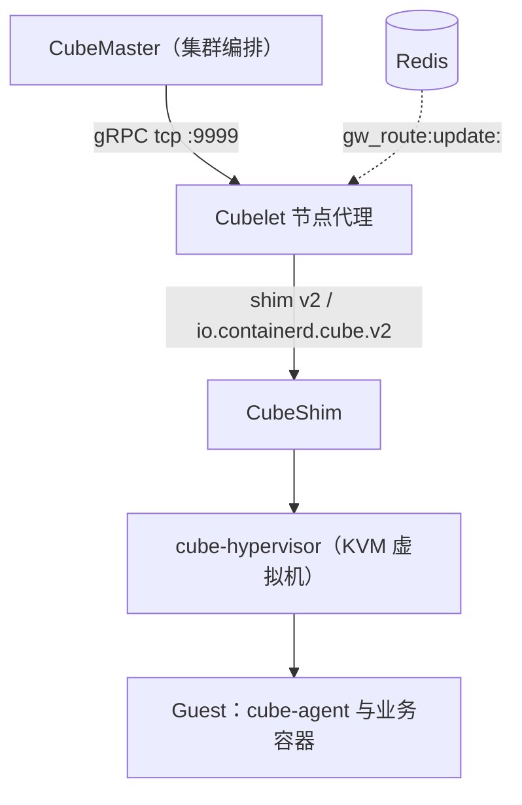
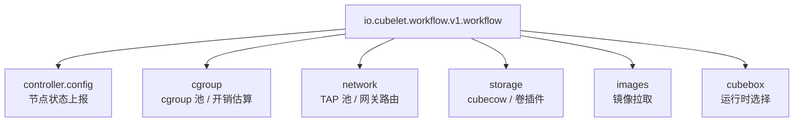

# Cubelet — 节点代理与插件体系

> 本文覆盖 Cubelet 模块事实 F-069 ~ F-093：模块声明、config.toml 全部插件段、进程托管与构建方式、关键 Go 包。信源距离为①级——事实逐字取自 v0.7.2 tag 内的源码与配置原文，锚点逐条见 [02-anchor-index.md](../references/02-anchor-index.md)。

## 一、节点代理定位

Cubelet 的 Go module 声明为 `github.com/tencentcloud/CubeSandbox/Cubelet`，go 版本 1.25.7（F-069）。它是每个计算节点上的节点代理：**对上**以 gRPC 接收 CubeMaster 的创建/销毁/状态指令，**对下**经由 containerd shim v2 任务模型驱动 CubeShim 与 KVM 虚拟机。

全局路径与进程状态在 config.toml 顶层固定（F-070）：

| 字段 | 值 |
|---|---|
| `oom_score` | `0` |
| `root` | `/data/cubelet/root` |
| `state` | `/data/cubelet/state` |
| `version` | `3` |
| `pid_file` | `/run/cube-let.pid` |
| `dynamic_config_path` | `/usr/local/services/cubetoolbox/Cubelet/dynamicconf/conf.yaml` |

`root` 与 `state` 分离：运行时根目录承载运行态数据，state 目录承载可恢复状态；`dynamic_config_path` 指向 cubetoolbox 下的动态配置 YAML，支持不重启更新部分配置（F-070）。

## 二、端口与本地套接字

config.toml 各监听段如下（F-071）：

| 段 | 监听 | 说明 |
|---|---|---|
| `[http]` | `:9998` | HTTP 端口 |
| `[grpc]` | unix `/data/cubelet/cubelet.sock` | 本机 gRPC |
| `[grpc]` | `tcp_address` `:9999` | 对 CubeMaster 的 gRPC |
| `[grpc]` | `max_recv` `16777216` | 单次最大接收字节数（16 MiB） |
| `[cubetap]` | `/data/cubelet/cubetap.sock` | TAP 管理套接字 |
| `[operation_server]` | `disable true` | 运维 HTTP server 默认关闭 |
| `[debug]` | `:9966` | 调试端口 |
| `[cubelog]` | `/data/log/Cubelet`，`file_size 500m` | 日志目录与单文件大小 |

Docker 镜像侧对 `9999 9998 9966` 三个端口做了 EXPOSE 声明（F-081）。

## 三、插件体系总览

Cubelet 以"具名配置插件"组织全部能力，插件名使用反向域名版本化标识，由 workflow 插件编排调用。

控制面插件 `io.cubelet.controller.config.v1.cubelet` 的配置为（F-072）：

| 字段 | 值 |
|---|---|
| `node_status_update_frequency` | `1s` |
| `cubeops_addr` | `""` |
| `cubeops_timeout` | `10m` |

节点状态每秒上报一次；`cubeops_addr` 默认为空字符串，CubeOps 对接超时上限为 10 分钟（F-072）。

## 四、cgroup 插件：资源池与虚拟机内存估算

`io.cubelet.internal.v1.cgroup` 的参数（F-073）：

| 字段 | 值 |
|---|---|
| `pool_size` | `3000` |
| `pool_workers` | `1` |
| `vm_memory_overhead_base` | `42Mi` |
| `vm_memory_overhead_coefficient` | `64` |
| `host_cpu_overhead` | `0.3` |

cgroup 插件把 cgroup 预备成规模 3000 的资源池，由 1 个 worker 维护，创建沙箱时直接取用品化的 cgroup，而非现场创建（F-073）。每个 VM 的宿主侧内存开销按 `42Mi` 基础值加系数 `64` 估算，宿主机 CPU 开销系数取 `0.3`，供节点容量核算与调度上报使用（F-073）。**池化把每实例的一次性构造成本摊到启动之前**，是 CubeSandbox 亚秒级创建路径在节点侧的关键组成。

## 五、network 插件：TAP 池与固定沙箱地址

`io.cubelet.internal.v1.network` 的字段（F-074）：

| 字段 | 值 |
|---|---|
| `eth_name` | `eth0` |
| `tap_init_num` | `500` |
| `cidr` | `192.168.0.0/18` |
| `mvm_inner_ip` | `169.254.68.6` |
| `mvm_mac_addr` | `20:90:6f:fc:fc:fc` |
| `mvm_gw_mac` | `20:90:6f:cf:cf:cf` |
| `mvm_gw_dest_ip` | `169.254.68.5` |
| `mvm_mtu` | `1500` |
| `cube_router_enable` | `false` |
| `stream_name_prefix` | `"gw_route:update:"` |
| `stream_key` | `"gw_key"` |

网络插件启动即预初始化 500 个 TAP 设备（`tap_init_num 500`），节点 Pod 网段 CIDR 为 `192.168.0.0/18`（F-074）。沙箱侧使用**固定**的内层地址模型：沙箱 IP `169.254.68.6`、MAC `20:90:6f:fc:fc:fc`，网关 IP `169.254.68.5`、网关 MAC `20:90:6f:cf:cf:cf`，MTU `1500`——固定编址使 guest 内网络配置无需逐实例协商（F-074）。

网关路由更新经 `stream_name_prefix "gw_route:update:"` 与 `stream_key "gw_key"` 对接 Redis Stream（F-074）。代码侧，`network/plugin.go` 中的 `delegateNetworkManager` 持有 `tapPlugin`、`db`、`allocationStore` 三个成员，网络元数据落入 bucket `network/v1`（`DBBucketNetwork`），并向框架注册 `NetworkID`（F-091）。

## 六、storage 插件：cubecow 后端与卷插件

`io.cubelet.internal.v1.storage` 配置（F-075）：

| 字段 | 值 |
|---|---|
| `storage_backend` | `cubecow` |
| `data_path` | `/data/cubelet/storage` |
| `volume_plugin_base_dir` | `/data/cube-shared/volume` |
| `volume_plugins` | `s3` / `cos`（type `binary`） |
| `[cow.s3] enable` | `false` |
| `[cow.s3] socket_path` | `/var/run/s3lvol.sock` |

存储后端默认是 cubecow；外部卷插件以二进制形式放在 `/data/cube-shared/volume` 下，登记 `s3`、`cos` 两个插件；S3 CoW 子后端默认关闭，通过 unix socket `/var/run/s3lvol.sock` 与 s3lvol 服务通信（F-075）。

`storage/plugin.go` 给出全部后端常量与初始化函数（F-088）：

- 后端常量：`StorageBackendCow` = `cubecow`、`cowBackendReflink` = `reflink`、`cowBackendS3` = `s3`，以及 `defaultVolumePluginBaseDir`、`defaultS3SocketPath`。
- reflink 后端的 ext4 初始化命令序列 `reflinkExt4InitCommands`：`mkfs.ext4` / `mount` / `umount` / `losetup`。
- 配置构造：`BuildCowInitJSON`、`BuildS3CowInitJSON`、`PrepareCowInlineConfig`。
- 引擎初始化：`initCowEngineWithConfig`、`initS3CowEngineWithConfig`、`initVolumePlugins`。

本地存储实现 `storage/local.go` 中，`local` 结构持有 `cowEngine`、`s3CowEngine`、`cowManager`、`rcDB`（bolt）、`rcStore`、`poolFormat` 等字段（F-089）。默认池化参数：

| 常量 | 值 |
|---|---|
| `defaultPoolSize` | `500` |
| `defaultPoolWorkers` | `8` |
| `defaultFormatSize` | `1Gi` |
| `defaultDiskUUID` | `ef5c2893-...` |
| `bucketName` | `emptydir/v1` |
| `nfsBucketName` | `nfs/v1` |
| `baseFileName` | `base.raw` |

与 cgroup/TAP 同理，rootfs 以 500 规模、8 worker 预先格式化入池，单卷格式大小 1Gi，基础镜像文件名固定为 `base.raw`（F-089）。

其余存储接线（F-090）：

- **hostdir**：宿主目录后端基准路径 `/data/cubelet/hostdir`；`HostDirBackendInfo` 含 `volume_name`、`share_dir`、`bind_path`、`read_only` 四字段，描述卷到宿主目录的绑定挂载。
- **s3_init**：S3 初始化重试间隔常量 `s3InitRetryInterval` = `5s`，未就绪时返回 `ErrS3NotReady`。
- **pool**：池内拷贝类型常量 `cp_type` = `copy`、`cp_reflink_type` = `copy_reflink`。

## 七、images、cubebox 运行时与 workflow

镜像插件 `io.cubelet.internal.v1.images` 的 `runtime_type` 为 `io.containerd.cube.v2`（F-076）。cubebox 插件 `io.cubelet.internal.v1.cubebox` 配置：`default_runtime_name` = `cube`，`runtimes.cube` = `io.containerd.cube.rs`，`runtimes.runc` = `io.containerd.runc.v2`（F-076）。即默认走 cube 轻量虚拟机运行时，同时保留标准 runc 运行时。

containerd 任务与镜像段的三项配置（F-078）：

| 插件 | 配置 |
|---|---|
| `io.containerd.runtime.v2.task` | platforms `linux/amd64`、`linux/arm64` |
| `io.cubelet.chi.v1.vsocket-manager` | `proxyPort` `1032` |
| `io.containerd.cri.v1.images` | `docker.io` mirror `https://mirror.ccs.tencentyun.com` |

编排插件 `io.cubelet.workflow.v1.workflow` 注册四个 flow（F-077）：

| flow | 并发度 |
|---|---|
| `init` | —— |
| `create` | `100` |
| `destroy` | `100` |
| `cleanup` | —— |

create 与 destroy 的并发上限均为 100。全插件注册的 action 集合为：`cubebox`、`images`、`storage`、`cgroup`、`network`、`volume`、`netfile`、`cube-sandbox-store`、`cleanup`、`createid`、`appsnapshot`（F-077）。事实原文未给出 action 到具体 flow 的逐项映射，本文不做拆分编排。

## 八、进程托管：plugin.conf

Cubelet 由节点进程托管框架拉起，`plugin.conf` 的 `[meta]` 段字段（F-079）：

| 字段 | 值 |
|---|---|
| `name` | `Cubelet` |
| `type` | `2` |
| `start_cmd` | 含 `-c .../config.toml` 与 `--dynamic-conf-path` |
| `plugin_health_check` | `@cubelet` |
| `is_fork` | `true` |
| `pid_file` | `/run/cube-let.pid` |
| `start_secs` | `180` |
| `run_start` | `yes` |

启动命令显式指定 config.toml 与动态配置路径；托管框架以 fork 方式拉起，健康检查锚点为 `@cubelet`，启动容忍期 180 秒（F-079）。

## 九、构建：Makefile 与 Dockerfile

Makefile 的关键定义（F-080）：

- `APPS`：`cubelet`、`cubecli` 两个应用。
- `PROTO`：`services/cubehost`、`multimetadb`、`nbi`、`version` 四组 proto。
- `CONF_VERSION`：`1.1.7`。
- `PKG`：`.../pkg`；ldflags 经 `-X` 注入 `Version` / `Commit` / `BuildTime`。

Dockerfile 分两阶段（F-081）：

1. builder 阶段执行 `cargo build --release -p cubecow`，产出 `libcubecow.a`，安装到 `third_party/cubecow/lib`——Go 侧通过 CGo 静态链接 Rust 编写的 cubecow 引擎。
2. 运行时阶段基于 `ubuntu:22.04`，`ENV IMAGE_ROOT=/opt/cube-image`、`TOOLBOX_ROOT=/usr/local/services/cubetoolbox`，`EXPOSE 9999 9998 9966`。

## 十、依赖与 replace

go.mod 关键依赖（F-082）：

| 模块 | 版本 |
|---|---|
| `cilium/ebpf` | `v0.17.3` |
| `containerd/v2` | `v2.2.2` |
| `cgroups/v3` | `v3.1.2` |
| `redis/go-redis/v9` | `v9.7.0` |
| `vishvananda/netlink` | `v1.3.1` |
| `k8s.io/kubernetes` | `v1.34.1` |
| `urfave/cli/v2` | `v2.27.7` |

依赖形态对应三条主线：containerd v2 提供 shim/任务模型，cilium/ebpf 与 netlink 支撑网络数据面，kubernetes 复用其节点/状态模型（F-082）。

replace 指令（F-083）：

- `google.golang.org/grpc` => `v1.67.1`。
- `k8s.io/cri-api` => `v0.25.16`。
- `CubeNet/cubevs` => `../CubeNet/cubevs`（同仓库本地路径）。
- 另有指向本地 `pkgs/CubeLog`、`pkgs/proto` 的 replace。

## 十一、关键 Go 包速览

**cdp（删除保护）**：`pkg/cdp` 定义 `DeleteOption`，含 `ID`、`ResourceType`、`ResourceOrigin`、`SkipDeleteFlagCheck` 字段；`DeleteProtectionHook` 接口含 `Name`、`PreDelete`、`PostDelete` 三个方法，使资源删除可挂载前后置保护逻辑（F-084）。

**cubecow（CGo binding）**：`pkg/cubecow/doc.go` 的包注释声明导出符号 `cubecow_last_error()`、`Init`、`InitWithoutLogging`、`InitFromJSON`，以及含 `SemanticCode`、`Action` 字段的 `CowError`（F-085）。rootfs 命名模式为模板卷 `tpl-<snapshotID>-rootfs`、沙箱卷 `sb-<sandboxID>-rootfs-gen<N>`（F-085）。

**numa（拓扑感知）**：`pkg/numa` 定义 `NumaInfo` 与 `NumaNode`（字段 `NodeId`、`Cpulist`、`CpulistOrigin`、`Cores`），提供 `GetNumaInfo`、`GetMaxNumaNodeId`、`GetNumaNodeCount`、`GetAllNumaNodes`，数据来自 `/sys/devices/system/node/` 与 cpulist 解析（F-086）。

**gc（垃圾回收服务）**：`services/gc` 的 `GCConfig` 含 `root_path`，bucket 名 `sandbox/v1`（`bucketName`），数据库名 `gcservice`（`DbName`），注册 `GCID`；运行时挂载 tmpfs（`size=100m`），元数据落 `meta.db`（F-087）。

**cubelet core 与 versioninfo**：`pkg/cubelet/cubelet.go` 中常量 `nodeReadyGracePeriod` = `120s`、`nodeStatusUpdateRetry` = `5`，并定义 `KubeletConfig` 与 `Cubelet` 结构——后者持有 `masterClient`、`SetNodeStatusFuncs`、`controllerMap`、`versionCollector`（F-092）。versioninfo collector 的 `Source` 分 `Manifest` / `Binary` / `File` / `ComponentJSON` 四类；采集组件为 Cubelet、CubeAgent、GuestImage、Kernel、CubeEgress，对应文件名常量 `release-manifest.json`、`version.json`、`cube-image/version`、`cube-agent/version`、`cube-kernel-scf/vmlinux`（F-092）。

**utils（节点身份）**：`pkg/utils/cloud.go` 中 `localInstanceType` = `cubebox`，定义 `HostIdentity`；节点身份从环境变量 `CUBE_SANDBOX_NODE_ID`、`CUBE_SANDBOX_NODE_IP`、`CUBE_SANDBOX_ENDPOINT_IP` 与 `/proc/net/route` 获取（F-093）。另有 `bdf.ValidateBDF` 校验 PCI BDF 地址（F-093）。

## 十二、导航

- 上一篇：[05 CubeMaster — 编排调度中心](05-cubemaster.md)
- 下一篇：[07 CubeHypervisor 与 guest-init](07-hypervisor.md)
- 数据面相关：[08 CubeAgent 与 CubeShim](08-agent-shim.md)、[09 CubeNet 网络数据面](09-network.md)、[11 CubeCoW 与存储](11-storage.md)
- 信源回查：[事实锚点索引 F-001 ~ F-244](../references/02-anchor-index.md)
