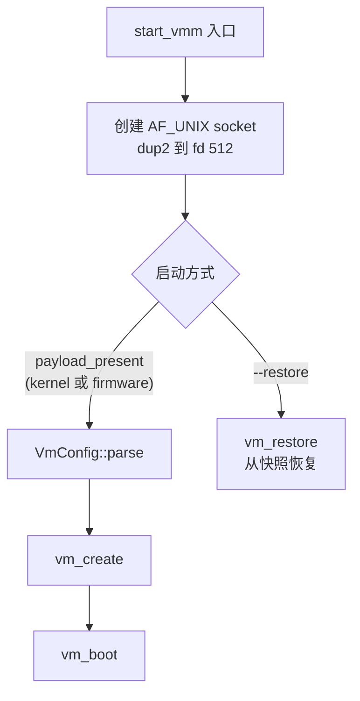
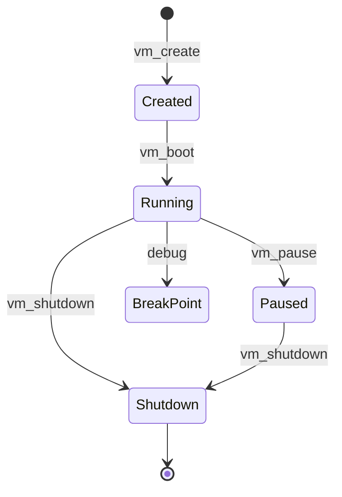
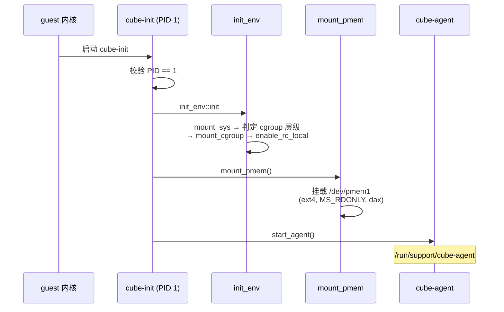

# cube-hypervisor 与 guest-init

> 本文覆盖事实 F-094 ~ F-140，信源距离为 **①**——全部事实直接取自 v0.7.2 源码中的 `hypervisor/` Rust workspace 与 `guest-init/` crate（Cargo.toml、build.rs、Rust 源文件），信源登记见 [01-source-map.md](../references/01-source-map.md)。

CubeSandbox 的虚拟机监控器（VMM）组件 **cube-hypervisor** 是 **cloud-hypervisor 的 fork**：其 crate package name 为 `cube-hypervisor`、version 为 **28.0.0**，对应 cloud-hypervisor 的版本线，包元数据中 authors 仍署 "The Cloud Hypervisor Authors"，homepage 指向 cloud-hypervisor GitHub（F-094、F-095）。它运行在宿主侧、基于 KVM 与 RustVMM 生态创建 MicroVM；与之配对的是 guest 内部的 PID 1 进程 **cube-init**（guest-init crate），负责在 guest 启动早期挂载文件系统/cgroup、以 dax 只读方式挂入 pmem，并拉起 cube-agent（F-137 ~ F-140）。本文只陈述 v0.7.2 源码中可锚定的事实，不替 cloud-hypervisor 上游推断未在本树出现的内部实现。

## 一、crate 概览：元信息、release profile 与 features

hypervisor 顶层包的 Cargo.toml 元信息（F-094、F-095）：

| 项 | 值 |
|---|---|
| package name | `cube-hypervisor` |
| version | **28.0.0** |
| authors | The Cloud Hypervisor Authors |
| edition | 2021 |
| default-run | `cube-hypervisor`（配 `build.rs`） |
| rust-version | 1.77.0 |
| description | KVM VMM |
| homepage | cloud-hypervisor GitHub |

发布构建面向体积优化：`[profile.release]` 设 `codegen-units = 1`、`lto = true`、`opt-level = "s"`（F-095）。

直接依赖按版本 pin 包括：anyhow 1.0.86、clap 4.4.7、epoll 4.3.1、libc 0.2.137、rlimit 0.9.1、seccompiler 0.3.0，以及 slog、thiserror、vmm-sys-util 0.12.1（F-096）。

features 定义（F-097）：

| feature | 启用内容 |
|---|---|
| `default` | `["kvm"]` |
| `guest_debug` | `["vmm/guest_debug"]` |
| `kvm` | `["vmm/kvm"]` |
| `lib_support` | 库支持特性 |
| `mshv` | Microsoft Hypervisor 后端 |
| `tdx` | `["vmm/tdx"]`（Intel TDX） |
| `tracing` | tracing 支持 |

## 二、workspace：29 个成员与共享依赖

`hypervisor/Cargo.toml` 的 `[workspace]` 段 **登记 29 个 workspace 成员**（v0.7.2 tag blob）（F-098）。按信源地图瑕疵条款 3 的口径，成员以 Cargo.toml 登记为准，不等同于"目录中存在 29 个组件目录"。29 个成员为：

api_client、arch、block_util、devices、event_monitor、event_notifier、hypervisor、logging、net_gen、net_util、option_parser、pci、performance-metrics、qcow、serial_buffer、test_infra、tracer、vfio_user、vhdx、vhost_user_block、vhost_user_net、virtio-devices、vm-allocator、vm-device、vm-migration、vm-virtio、vmm、rate_limiter、virtiofsd（F-098）。

`[workspace.dependencies]` 收敛共享版本（F-099）：

- 版本 pin：linux-loader 0.13.0、seccompiler 0.3.0、serde 1.0.208、virtio-bindings 0.1.0、virtio-queue 0.14.0、vm-memory 0.16.1、vmm-sys-util 0.12.1；
- git rev pin：`vfio-ioctls` 指向 rust-vmm/vfio 仓库、rev `64171f3`；`vhost-user-backend` rev `d983ae0`（F-099）。

## 三、库接口：VmmInstance 生命周期

`src/lib.rs` 声明 `mod common`、`pub mod vmm_config`，并 re-export `vmm::api::*`、`vmm::config`、`seccomp_filters::*`、`vmm::vm_config` 以及 `SnapshotConfig`/`SnapshotType`；顶层 `enum Error` 含变体 `ReviverChannel`、`StartVmm`、`CreateHypervisor`、`VmmThread`（F-100）。

对外主控句柄为 `VmmInstance{ vmm_thread }`（F-101）：

- `new(VmmConfig)`：按配置启动 VMM；
- `send_request(ApiRequest)`：向 VMM 线程下发 API 请求；
- `join` / `join_timeout`：等待 VMM 线程结束；
- `Drop`：发送 `VmmShutdown`；若关闭失败，则对线程 `thread.kill(SIGTERM)`（F-101）。

## 四、CLI：参数三组与 seccomp

`main.rs` 的 `create_app` 定义 Command 名 **cube-hypervisor**、about 为 "Launch a cloud-hypervisor VMM"，并设三个 ArgGroup：`vm-config` / `vmm-config` / `logging`（F-102）。

**vm-config 组**（F-103）：`--cpus`、`--platform`、`--memory`、`--memory-zone`、`--firmware`、`--kernel`、`--initramfs`、`--cmdline`、`--disk`、`--net`、`--rng`、`--balloon`、`--fs`、`--pmem`、`--serial`（默认 `null`）、`--console`（默认 `tty`）、`--device`、`--user-device`、`--vdpa`、`--vsock`、`--numa`、`--watchdog`、`--sys-ctrl`。

**logging 组**（F-104）：`-v` 为计数参数，0/1/2/其他分别对应 Warn/Info/Debug/Trace；另有 `--log-file`、`--sandbox-id`、`--log-stderr`。

**vmm-config 组（其余参数）**（F-105）：`--api-socket`、`--event-monitor`、`--restore`、`--tpm`、`--coredump`、`--pvpanic`、`--ivshmem`；x86_64 平台另有 `--sgx-epc`；guest_debug feature 下有 `--gdb`；`-D`/`--snapshot-version` 为 exclusive SetTrue。

**seccomp**：`--seccomp` 取值 `["true","false","log","process"]`，默认 **process**；映射到 `SeccompAction` 四分支 Trap / Allow / Log / KillProcess（F-106）。

## 五、启动路径：fd 512、payload boot 与 --restore

`start_vmm` 首先创建一个 AF_UNIX socket 并 `dup2` 到描述符 **512**，随后按载荷情况分两条路径：当 `payload_present`（存在 kernel 或 firmware）时走 `VmConfig::parse` → `vm_create` → `vm_boot`；指定 `--restore` 时走 `vm_restore`（F-107）。

**日志与 coredump**：`common.rs` 定义 `DEFAULT_LOG_FILE` 为 `/data/log/CubeVmm/vmm.log`、buffer 为 100、`default_coredump_filter` 为 `"0x33"`、coredump_limit 为 `2*1024^3`（F-108）。`Logger{ output/sandbox_id/buffer/vcpu_started }` 的行格式为 `"{} --- {:?} --- {} --- <{}> {}:{} -- {}\n"`（F-109）。

## 六、vmm crate：Vmm / Vm、状态机与快照

`vmm` crate 版本 **v0.1.0**，features 为 guest_debug/kvm/tdx；依赖含 gdbstub 0.6.3、micro_http（firecracker git）、tokio 1.40（full）、virtio-queue 0.11.0、linux-loader（启用 elf/bzimage/pe）、zerocopy 0.6.1（F-110）。

`lib.rs` 模块包括 acpi、api、clone3、config、coredump、cpu、device_manager、device_tree、gdb、interrupt、memory_manager、migration、seccomp_filters、serial_manager、vm、vm_config；`EpollDispatch` 含 Exit/Reset/Api/ActivateVirtioDevices/Debug/LogReopen；`LOG_REOPEN_INTERVAL` 为 60 分钟（F-111）。

### start_vmm_thread 与 seccomp 分层

`start_vmm_thread` 的参数为：vmm_version、http_path、http_fd、api_event、api_receiver、res_sender、seccomp_action、hypervisor（`Arc<dyn Hypervisor>`）、sandbox_id、vcpu_started（F-112）。

seccomp 过滤按线程分层施加（F-113）：

1. 先 `get_seccomp_filter(Thread::All)` 并 apply；
2. 再 spawn 名为 "vmm" 的线程——线程内 apply `Vmm` 过滤器，然后 `Vmm::new`、进入 `control_loop`；
3. HTTP 分支另起 `start_http_path_thread` / `start_http_fd_thread`。

### Vmm 与 VmState

`Vmm` 字段含 epoll、exit_evt、reset_evt、api_evt、version、vm（Option）、vm_config、seccomp_action、hypervisor、signals、threads、sandbox_id、vcpu_started；`HANDLED_SIGNALS` 为 `[SIGTERM, SIGINT]`；方法包括 vm_create、vm_boot、vm_pause、vm_snapshot、vm_restore、vm_shutdown、vm_reboot、vm_info、vm_resize、vm_add_device、vm_add_disk（F-114）。

`VmState` 五状态为 **Created / Running / Shutdown / Paused / BreakPoint**，转移合法性由 `valid_transition` 的五状态分支判定（F-115）。下图按方法语义标出主要转移；完整合法性以 `valid_transition` 为准：

### VmOps、physical_bits 与 Vm

`VmOpsHandler{ memory: GuestMemoryAtomic, io_bus, mmio_bus, pci_config_io }`；`VmOps` 提供 guest_mem_write/read、mmio_read/write、pio_read/write（F-116）。

`physical_bits(max_phys_bits, hypervisor_type)` 对 **KvmPvm** 分支取 `guest_phys_bits = min(max, 43)`，函数末尾再取 `min(host, guest)`（F-117）。

`Vm` 字段含 initramfs（Option File）、threads、device_manager、config（`Arc<Mutex<VmConfig>>`）、state（`RwLock<VmState>`）、cpu_manager、memory_manager、vm（`Arc<dyn hypervisor::Vm>`）、numa_nodes、seccomp_action、exit_evt、hypervisor、load_payload_handle（F-118）。其方法包括 boot、shutdown、resize、resize_zone、add_device、add_user_device、remove_device、add_disk、add_fs、add_pmem、add_net、add_vdpa、add_vsock、counters、balloon_size、power_button、debug_request；`HANDLED_SIGNALS` 为 `[SIGWINCH]`（F-119）。

### 快照：极速启动的恢复落点

`VmSnapshot{ clock: Option<ClockData>, common_cpuid: Vec<CpuIdEntry> }`，常量 `VM_SNAPSHOT_ID` 为 `"vm"`；`Snapshottable` trait 定义 snapshot、restore、start_dirty_log、dirty_log、start_migration、complete_migration（F-120）。第五节的 `--restore` → `vm_restore` 路径与本节快照结构对接：**极速启动所依赖的"从快照恢复"即在此层完成**——不再走完整 payload boot，而是恢复保存的 VM/vCPU/时钟状态。

## 七、CPU 子系统与 gdb 调试

`cpu.rs` 中常量 `CPU_MANAGER_ACPI_SIZE = 0xc`，结构含 LocalApic、Ioapic、GicC、GicD、GicR、ProcessorHierarchyNode、InterruptSourceOverride（F-121）。

`Vcpu{ vcpu: Arc<dyn hypervisor::Vcpu>, id, saved_state, tsc_msrs }`，提供 new、configure，`run` 返回 `Result<VmExit>`，并实现 Snapshottable（F-122）。

aarch64 初始化顺序：依次置 `KVM_ARM_VCPU_PSCI_0_2`；`id > 0` 的 vCPU 置 POWER_OFF；再置 `KVM_ARM_VCPU_PMU_V3`；当 `should_retry_without_pmu` 时去掉 PMU_V3 重试（F-123）。

`CpuManager{ hypervisor_type, config: CpusConfig, interrupt_controller, vm_memory, cpuid, vm, vcpus_kill_signalled, vcpus, seccomp_action, vm_ops }`，内部 flag 取 0/1/2/3；方法含 new、create_boot_vcpus、start_boot_vcpus、resize、shutdown、create_madt、create_pptt（F-124）。

gdb 方面：`DebuggableError`；trait `Debuggable: Pausable` 含 set_guest_debug、debug_pause、read_regs、write_regs、read_mem、write_mem、active_vcpus；另有 GdbRequest/Payload/GdbResponse（F-125）。`GdbStub{ gdb_sender, gdb_event, vm_event, hw_breakpoints, single_step }` 实现 `Target`（Arch=GdbArch）、MultiThreadBase、Breakpoints、HwBreakpoint，并运行 gdb_thread（F-126）。

## 八、平台与设备

### arch crate

arch crate 的 authors 为 Chromium OS Authors；`enum RegionType` 为 Ram/SubRegion/Reserved；导出 arch_memory_regions、configure_system、configure_vcpu、get_host_cpu_phys_bits、initramfs_load_addr、layout、EntryPoint；x86_64 提供 generate_common_cpuid、CpuidFeatureEntry；aarch64 提供 `fdt::DeviceInfoForFdt`（F-127）。

平台数据结构：`NumaNode{ memory_regions, hotplug_regions, cpus, distances, memory_zones, sgx_epc_sections }`，`NumaNodes` 为 BTreeMap；`InitramfsConfig{ address, size }`；`DeviceType` 为 Virtio(u32)/Serial/Rtc/Gpio；`PAGE_SIZE = 4096`（F-128）。

### pci / msi / msix / vfio

pci crate 启用 feature kvm，依赖 vfio-ioctls（rev 64171f3）、vfio-bindings 0.3.1、vm-allocator、vm-migration；模块为 bus、configuration、device、msi、msix、vfio、vfio_user；`PciInterruptPin` 为 IntA~IntD；x86 上 `PCI_CONFIG_IO_PORT = 0xcf8`；另有 `PciBdf(u32)`（F-129）。

`bus.rs` 定义 `VENDOR_ID_INTEL = 0x8086`、`DEVICE_ID_INTEL_VIRT_PCIE_HOST = 0x0d57`、`NUM_DEVICE_IDS = 32`，结构含 PciRoot、`PciBus{ devices, device_ids }`、PciConfigIo、PciConfigMmio（F-130）。

`msi.rs` 定义 `MSI_CTL_ENABLE = 0x1`、`64_BITS = 0x80` 及 MsiCap/MsiConfig；`msix.rs` 定义 `MAX_MSIX_VECTORS_PER_DEVICE = 2048`、每 entry 16、`FUNCTION_MASK_BIT = 14`、`ENABLE_BIT = 15`，及 MsixTableEntry/MsixConfig（F-131）。

`vfio.rs` 定义 `UserMemoryRegion{ slot, start, size, host_addr }`、MmioRegion、VfioError、`trait Vfio`，以及 `VfioPciDevice{ id, vm, device, container, iommu_attached, memory_slot }`（F-132）。

### qcow / vhdx / tpm / docs

qcow crate 为 BSD-3 许可：`QCOW_MAGIC = 0x5146_49fb`、`DEFAULT_CLUSTER_BITS = 16`、`MAX_QCOW_FILE_SIZE = 1<<44`；`QcowHeader` 含 19 个字段；提供 QcowFile、convert、detect_image_type，`ImageType` 为 Raw/Qcow2（F-133）。

vhdx crate 模块为 vhdx_bat、header、io、metadata；`VhdxError` 为 NotVhdx/Parse/Read/Write；`Vhdx` 提供 new、virtual_disk_size 并实现 Read（F-134）。

tpm crate 模块为 emulator、socket；`TPM_CRB_BUFFER_MAX = 3968`；`enum Commands` 有 17 个变体；`trait Ptm`（F-135）。

docs 中：`api.md` 记载默认 socket 为 `/run/user/{uid}/cloud-hypervisor.{pid}`，endpoints 含 `/vmm.ping`、`/vmm.shutdown`；`vsock.md` 说明 virtio-vsock 基于 Firecracker，CID 约定 -1 Random / 0 Hypervisor / 1 Loopback / 2 Host；README 有 "Differences with Firecracker and crosvm"（F-136）。

## 九、guest-init：guest 内 PID 1 cube-init

guest-init crate 名为 **cube-init**，版本 v0.1.0，产出同名 bin `cube-init`；依赖 anyhow、lazy_static 1.4、libc 0.2、nix 0.26（F-137）。

`main.rs` 定义常量 `PMEM_DEV = /dev/pmem1`、`CUBE_AGENT = /run/support/cube-agent`；main 流程为：校验 **PID == 1** → `init_env::init` → `mount_pmem()` → `start_agent()`；pmem 以 ext4、`MS_RDONLY`、`"dax"` 选项挂载（F-138）。

### cgroup 与根文件系统挂载

`init_env.rs` 定义 `InitMount{ fstype, src, dest, flags, options }`；`CGROUPS` 列出 **13 条 cgroup v1** 挂载项：cpu、cpuacct、blkio、cpuset、memory、devices、freezer、net_cls、perf_event、net_prio、hugetlb、pids、rdma（F-139）。`INIT_ROOTFS_MOUNTS` 为 proc、sysfs、tmpfs(dev_shm)、devpts、tmpfs(run)（F-139）。

`pub fn init` 的顺序为：mount_sys → `read_unified_cgroup_hierarchy("/proc/cmdline")` → mount_cgroup → enable_rc_local → init_env；判定为 unified 时走 cgroup2 单条挂载分支；mount_sys 末尾 `set_var` 将 wrapper_mode 置 on（F-140）。

## 十、导航

- 上游宿主侧：[06-cubelet.md](06-cubelet.md)（Cubelet 如何拉起 VMM 与 shim）
- 下游 guest 侧：[08-agent-shim.md](08-agent-shim.md)（cube-agent 与 CubeShim）
- 快照与 pmem 的存储底座：[11-storage.md](11-storage.md)
- 术语背景：[03-glossary.md](../references/03-glossary.md)
