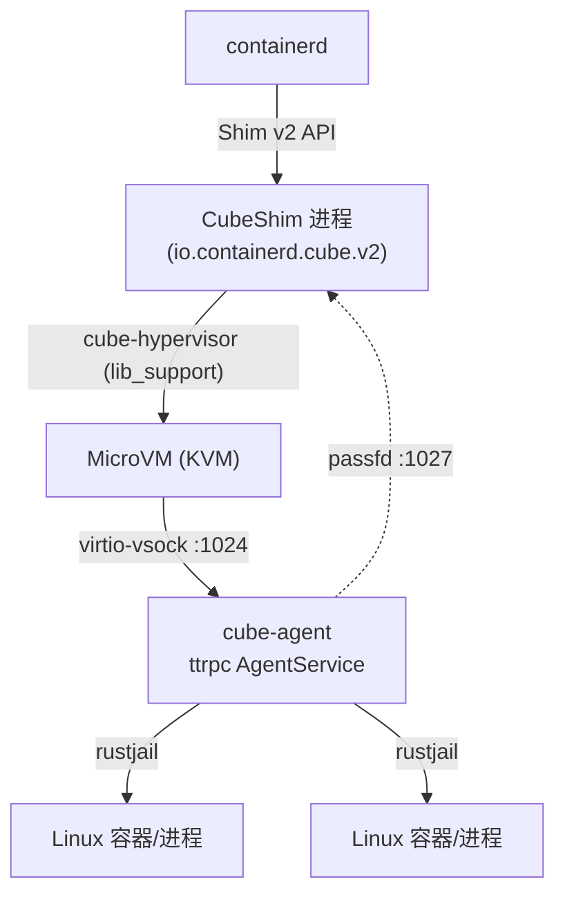
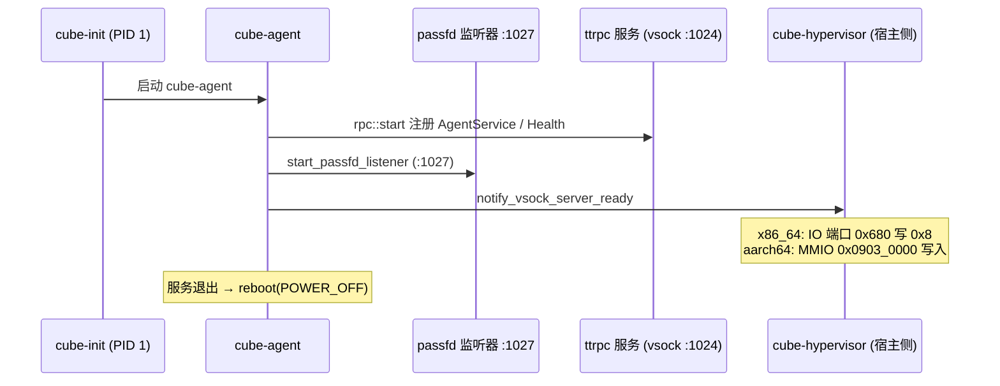

# cube-agent 与 CubeShim

> 本文覆盖事实 F-141 ~ F-165，信源距离为 **①**——全部事实直接取自 v0.7.2 源码中的 `agent/` Rust workspace（cube-agent 二进制及其 rustjail、cube 成员）与宿主侧 CubeShim crate（Cargo.toml、Rust 源文件、proto 生成代码），信源登记见 [01-source-map.md](../references/01-source-map.md)。

CubeSandbox 的容器管理分为**两层**：宿主侧，containerd 通过 **CubeShim**（基于 containerd-shim-rs 的 Shim v2 实现）管控一个 MicroVM 的生命周期；guest 内，**cube-agent** 作为常驻服务监听 vsock 上的 ttrpc 请求，经由 **rustjail** 在 guest 内核中创建真正的 Linux 容器与进程。也就是说——shim 的"任务"是 VM，rustjail 的"容器"是 guest 内的命名空间进程，两者跨 vsock 协同（F-141 ~ F-165）。本文只陈述源码中可锚定的事实，不臆造 rustjail 的内部实现。

## 一、整体拓扑

- 宿主路径：containerd → CubeShim → cube-hypervisor（VM）；
- guest 路径：cube-agent → rustjail 容器；
- 两侧以 virtio-vsock 上的 ttrpc 为主信道，passfd 信道用于描述符传递（详见第四节）。

## 二、cube-agent：crate、构建与子命令

cube-agent 的 Cargo.toml 声明 package 为 **cube-agent v0.1.0**，产出同名 bin `cube-agent`；关键依赖为 **ttrpc 0.8.4**（启用 `async` feature）、**tokio 1.45.1**（`full`）、**tokio-vsock 0.7.2**（F-141）。

workspace 登记的成员包括 **rustjail** 与 **cube**；workspace features 含 **seccomp**、**standard-oci-runtime**（F-142）。

构建参数见 Makefile：`PROJECT_COMPONENT = cube-agent`、`SECCOMP = yes`、`MUSL = yes`——即静态链接 musl、并开启 seccomp 支持（F-143）。

`main.rs` 定义常量 `NAME = "cube-agent"`，读取环境变量 **wrapper_mode**；CLI 含两个 `SubCommand`（F-144）：

| 子命令 | 行为 |
|---|---|
| `Init` | 调用 `rustjail::container::init_child()`（F-145） |
| `Exec` | 调用 `cube::rootfs::do_exec_mount()`（F-145） |

即同一二进制身兼两职：常驻服务形态由 cube-init 拉起（guest PID 1 为 cube-init）；Init 用于容器子进程初始化，Exec 则作为包装器在进入目标 mount namespace 后执行挂载（见第六节）。

## 三、启动链与就绪通知

常驻服务的启动入口为 `start_sandbox`，其调用链为：`rpc::start` → `start_passfd_listener` → `rpc::notify_vsock_server_ready`；服务结束时执行 `libc::reboot(LINUX_REBOOT_CMD_POWER_OFF)` 关闭 guest（F-146）。

**passfd 信道**（`passfd_io`）：监听端口 **1027**，超时 **5s**，`MAX_PENDING_STREAMS = 256`，用于在宿主 shim 与 guest agent 之间传递文件描述符（F-153）。

**ttrpc 注册**：`rpc start` 时注册 `protocols::agent_ttrpc::create_agent_service`（AgentService）与 `health_ttrpc::create_health`（健康检查）两个服务（F-154）。

**就绪通知**（`notify_vsock_server_ready`）：agent 通过平台特定方式告知 VMM"vsock 服务已就绪"——x86_64 向 IO 端口 **0x680** 写入 **0x8**；aarch64 向 MMIO 地址 **0x0903_0000** 写入；事件位定义为 `SYS_VSOCK_SERVER = 1<<3`（F-155）。宿主侧据此判断 guest agent 可以接受 RPC。

## 四、配置与沙箱模型

配置常量：`VSOCK_ADDR = vsock://-1`、`VSOCK_PORT = 1024`（F-147）。`AgentConfig` 字段包括：`debug_console`、`dev_mode`、`log_level`、`server_addr`、`unified_cgroup_hierarchy`、`tracing`、`endpoints`、`supports_seccomp`（F-147）。

其 `Default` 实现中 `server_addr` 为 **vsock://-1:1024**（CID 写作 -1），`supports_seccomp = rpc::have_seccomp()`——即运行时探测 guest 内核是否支持 seccomp（F-148）。

`sandbox.rs` 定义核心结构 `Sandbox`：

| 字段 | 含义 |
|---|---|
| `containers: HashMap<String, LinuxContainer>` | 本沙箱内全部容器（F-149） |
| `network` | 网络状态 |
| `shared_utsns: Namespace` | 共享 UTS namespace |
| `shared_ipcns` | 共享 IPC namespace |
| `pcimap` | PCI 设备映射 |

`Sandbox` 方法包括 `setup_shared_namespaces`、`add_container`、`update_shared_pidns`、`online_cpu_memory`（CPU/内存热插后上线）（F-149）。共享 namespace 落盘于 `PERSISTENT_NS_DIR = /var/run/sandbox-ns`，`NamespaceType` 为 **Ipc / Uts / Pid** 三种（F-150）——同一 VM 内容器可共享 UTS/IPC，并按需要更新共享 PID namespace。

## 五、AgentService：容器/卷管理的 8 个 RPC

`agent.proto` 定义 `service AgentService`（沿用 Kata Agent 的完整接口面，含网络/沙箱/流式 IO 等共 30+ RPC，F-156）。本束聚焦其中容器/进程与卷管理的 8 个：

| RPC 方法 | 语义 |
|---|---|
| `CreateContainer` | 在 guest 内创建 rustjail 容器 |
| `StartContainer` | 启动已创建的容器 |
| `RemoveContainer` | 移除容器 |
| `ExecProcess` | 在容器内 exec 新进程 |
| `SignalProcess` | 向进程发信号 |
| `WaitProcess` | 等待进程退出并返回状态 |
| `GetVolumeStats` | 获取卷容量统计（CSI 口径） |
| `ResizeVolume` | 调整卷大小 |

前 6 个面向容器/进程生命周期，后 2 个面向卷——`GetVolumeStats` 的返回结构与 CSI `VolumeUsage` 同源（见第八节）。

## 六、存储/设备处理与 rootfs 进入

`mount.rs` 中的关键常量（F-151）：

- `TYPE_ROOTFS = rootfs`；`MOUNT_GUEST_TAG = cubeShared`；`CUBE_BIND_SHARE_DIR = /run/cube-bind-share/`；
- guest 侧 cgroup 控制器：`CGROUPS = cpu / cpuacct / memory / pids / rdma`；
- `STORAGE_HANDLER_LIST` 共 **9 个**存储处理器：**blk、virtio-fs、ephemeral、overlayfs、mmioblk、local、scsi、nvdimm、watchable-bind**（F-151）。

`device.rs` 中登记的块设备驱动为：**virtio-fs、blk、blk-cube、mmioblk、scsi、nvdimm、overlayfs**（F-152）。存储处理器与设备驱动共同决定不同后端盘（virtio-fs 共享、虚拟块设备、nvdimm/pmem、临时盘等）如何在 guest 内呈现与挂载，详见 [11-storage.md](11-storage.md)。

**Exec 子命令的 rootfs 进入逻辑**（`cube/rootfs.rs`）：注解键为 `cube.rootfs.info`，环境变量为 `container.pid`；`RootfsInfo` 结构含 `rootfs`、`pmem_file`、`overlay_info`、`mounts`、`ero_image: Option`（F-157）。`do_exec_mount` 对 `/proc/{pid}/ns/mnt` 执行 `setns(CLONE_NEWNS)` 进入目标容器的 mount namespace，以 `MS_BIND | MS_REC` 完成绑定挂载、以 `umount2(MNT_DETACH)` 惰性卸载（F-157）。这保证了被 exec 的进程看到容器视角的根文件系统。

## 七、CubeShim：containerd Shim v2

CubeShim README 明确其**基于 containerd-shim-rs 实现 containerd Shim v2**，注册的 `runtime_type` 为 **io.containerd.cube.v2**（F-158）。containerd 创建该 runtime 的任务时，每个 MicroVM 对应一个 shim 进程。

**main 启动配置**：`Config` 中 `no_reaper`、`no_setup_logger`、`no_sub_reaper` 均设为 `true`，随后调用 `shim_run::<Service>("io.containerd.cube.rs", Some(c))`（F-159）。注意二进制内服务名字符串为 `io.containerd.cube.rs`，而对外 runtime_type 为 `io.containerd.cube.v2`（F-158、F-159）。

**进程预处理 `set_process`**（F-160）：

- 写 `/proc/self/coredump_filter = 0x33`；
- 设置 `RLIMIT_CORE = 2*1024^3`（2 GiB core 上限）；
- 创建一个 dummy AF_UNIX socket 并 `dup2` 到描述符 **512**——与 cube-hypervisor 侧 fd 512 的约定呼应，供两侧握手使用。

**依赖**（shim Cargo.toml）：**containerd-shim 0.9.0**、**containerd-shim-protos 0.9.0**、**ttrpc 0.5.8**；并以 path 依赖 **cube-hypervisor**、启用其 **lib_support** feature——shim 以库方式复用 VMM 能力来创建/管理 VM（F-161；lib_support 特性见 [07-hypervisor.md](07-hypervisor.md)）。

**模块布局**（`lib.rs`）：`common`、`container`、`cube`、`hypervisor`、`log`、`sandbox`、`service`、`snapshot` 共 8 个模块（F-162），分别承载常量与公共逻辑、容器/任务对象、cube 平台适配、VMM 对接、日志、沙箱状态、Shim v2 Service 实现与快照。

**版本与注解常量**（F-163）：`SHIM_VERSION` 取自环境变量 `CUBE_VERSION` 等；识别的 OCI 注解包括：

- `cube.rootfs.wlayer.path`（rootfs 写层路径）；
- `cube.propagation.mounts`（需要传播进 guest 的挂载）；
- `cube.container.log_forwarding`（容器日志转发开关）。

**路径常量**（F-164）：

| 常量 | 值 |
|---|---|
| `PAUSE_VM_SNAPSHOT_BASE` | `/data/cubelet/root/pausevm`（暂停态 VM 快照基座） |
| `GUEST_PROPAGATION_DIR` | `/run/propagation` |
| `GUEST_VIRTIOFS_MNT_PATH` | `/run/virtiofs` |

pausevm 基座路径表明：**极速启动/恢复复用的暂停 VM 快照由 cubelet 根目录统一管理**，shim 据此恢复 VM 而非每次冷启动。

## 八、protoc 生成代码与 CSI 口径

共享的 `protoc` crate 包含模块：`agent`、`agent_ttrpc`、`csi`、`empty`、`health`、`health_ttrpc`、`oci`、`types`（F-165）。这意味着 guest agent 与宿主 shim 共用同一套由 proto 生成的消息与 ttrpc 桩，两侧协议天然一致。

CSI 卷统计方面：`VolumeUsage.Unit` 枚举为 **UNKNOWN=0 / BYTES=1 / INODES=2**；`VolumeUsage` 结构含 `available`、`total`、`used` 三字段（F-165）。AgentService 的 `GetVolumeStats` 即返回该结构。

## 九、两层协作语义与排障提示

1. **任务边界**：containerd 眼中的 task 由 CubeShim 承接，落点是整个 MicroVM；`kubectl exec` 等容器级操作经 shim 转为 vsock ttrpc，由 cube-agent 用 rustjail 在 guest 内执行——排查"进程不存在"类问题时需区分是 VM 层（shim/VMM）还是 guest 容器层（agent/rustjail）。
2. **就绪判定**：guest 侧 agent 只有在 `notify_vsock_server_ready` 发出事件位（`SYS_VSOCK_SERVER = 1<<3`）后才真正可服务；若宿主长时间收不到就绪信号，应查 cube-agent 是否启动、passfd :1027 是否被占用（F-153、F-155）。
3. **日志转发**：容器日志是否回传宿主受注解 `cube.container.log_forwarding` 控制；日志转发能力要求 **CubeShim 版本 ≥ v0.4.0**（F-240），低版本 shim + 新注解组合会出现"注解已配置但宿主无日志"的现象，排障时应先核对 shim 版本（F-163）。
4. **core 与 fd**：shim 已将 coredump_filter 置 `0x33`、core 上限置 2 GiB 并占用 fd 512；抓 shim/VMM core 或排查 fd 泄漏时以此为基线（F-160）。

## 十、导航

- VM 层上游：[07-hypervisor.md](07-hypervisor.md)（cube-hypervisor 与 guest-init）
- 宿主编排：[06-cubelet.md](06-cubelet.md)（Cubelet 如何拉起 VMM 与 shim）
- vsock/网络底座：[09-network.md](09-network.md)
- 存储后端与快照：[11-storage.md](11-storage.md)
- 事实锚点索引：[02-anchor-index.md](../references/02-anchor-index.md)
- 术语表：[03-glossary.md](../references/03-glossary.md)
