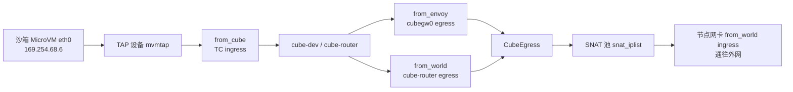
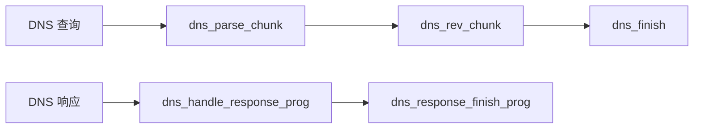

# CubeNet — eBPF 网络数据面

> 本文覆盖事实 F-166 ~ F-184，信源距离为 **①**——全部事实直接取自 v0.7.2 源码中的 `CubeNet/` 目录（cubevs Go 包：cubevs.go、map.go、port.go、snat.go、reaper.go、miscs.go；BPF C 侧：src/map.h、localgw.bpf.c、mvmtap.bpf.c、nodenic.bpf.c）与官方文档 docs/zh/architecture/network.md；信源登记见 [01-source-map.md](../references/01-source-map.md)。

CubeNet 是 CubeSandbox 的网络数据面：沙箱出向流量不经过宿主传统网络命名空间的自由转发，而是在宿主内核的 TC（Traffic Control）钩子上被三组 eBPF 程序强制接管，依次完成策略裁决、会话跟踪、DNAT/SNAT 与重定向（F-179、F-181）。本篇按「拓扑 → 装载 → map → 策略 → DNS → 会话 → SNAT → L7 mark」的顺序展开，只陈述 v0.7.2 源码中可锚定的结构与常量，不替未出现在本树的代码路径推断实现。

## 一、固定拓扑：沙箱没有第二条路

每个沙箱使用固定的内部地址（F-182，network.md:75）：

| 项 | 值 |
|---|---|
| 沙箱内部 IP | **169.254.68.6** |
| 默认网关 | **169.254.68.5** |

沙箱内默认路由唯一指向该网关。地址、网关与上游接口信息由用户态 Params 携带，包括 MVMInnerIP、MVMMacAddr、MVMGatewayIP、Cubegw0Ifindex、Cubegw0IP、EgressSrcMacAddr、EgressDstMacAddr、EgressRedirectFlags、CubeRouterIfindex、NodeIfindex、NodeIPMask、NodeGatewayMacAddr 以及 L7 mark 相关参数（F-167）。

沙箱侧 TAP 设备以 TAPDevice{IP, ID, Ifindex} 描述；每沙箱元数据 mvmMetadata{Version, IP, UUID [64]byte, DNSPolicyFlags, PolicyVersion} 写入 BPF map，供内核程序识别沙箱身份与策略版本（F-168）。

图为拓扑示意，接口与程序名均取自源码（F-167、F-172、F-179）。三个程序名本身标明了流量来源：from_cube 是沙箱发出的流量，from_envoy 是经 L7 envoy 一侧回流的流量，from_world 是外部世界进入的流量。固定地址意味着策略、会话、SNAT 各环节都以「沙箱 IP / ifindex」作为主键，不依赖 DHCP 或可变配置。

## 二、程序装载：bpf2go 三目标与四处 TC 挂载

BPF C 程序通过 bpf2go 生成 Go 绑定：cubevs.go 中有三条 `//go:generate bpf2go` 目标——**localgw、mvmtap、nodenic**，源文件分别为 ../src/localgw.bpf.c、mvmtap.bpf.c、nodenic.bpf.c，头文件搜索路径为 -I../vmlinux/$GOARCH（F-166）。三组程序的 SEC 归属（F-181）：

| bpf2go 目标 | 承载的 TC/DNS 程序 |
|---|---|
| localgw | **from_envoy**（执行 dnat / snat / bpf_redirect） |
| mvmtap | DNS 分片程序 + **from_cube** |
| nodenic | **from_world** + DNS response 程序 |

`Init` 先经 loadLocalgw / loadMvmtap / loadNodenic 完成装载，再依次执行四处 TC 挂接（F-179）：

| 程序 | 挂载点（Params 字段） | 方向 |
|---|---|---|
| from_envoy | cubegw0（Cubegw0Ifindex） | **egress** |
| from_world | cube-router（CubeRouterIfindex） | **egress** |
| from_world | 节点网卡（NodeIfindex） | **ingress** |
| from_cube | 沙箱 TAP 侧（mvmtap，AttachFilter） | **ingress** |

方向用 TCDirection 表示（TCIngress / TCEgress）；BPFRedirectFlagIngress = 1；MVMPort{Ifindex, ListenPort} 描述 TAP 接口与监听端口（F-169）。TC 属性为 clsact qdisc、filter kind `bpf`，并设 tcFlagDirectAction = 1、tcFilterHandle = 1、tcFilterPriority = 1（F-174）。

持久化与复用路径：BPF FS 为 `/sys/fs/bpf`（bpfFSPath），用户态以 pinPath / loadPinnedMap 固定与复用对象（F-175）。由于 localgw、mvmtap、nodenic 是三个独立 ELF 目标，共享状态正是通过「map 以 SEC `.maps` 声明并带 LIBBPF_PIN_BY_NAME、再被各对象 loadPinnedMap 打开」实现的（F-180）。程序侧由 pinProgs 固定、由 rewriteConstants 写入全局变量（F-178）；可改写的全局变量包括 mvm_inner_ip、mvm_macaddr_p1/p2、mvm_gateway_ip、cubegw0_ip、ifindex、egress_smacaddr_p1、nodenic_ip、nodegw_macaddr_p1、cube_l7_mark_http/https/mask（F-174）。

## 三、BPF map 全景

v0.7.2 的 map 名（Go 侧常量，F-173）与内核类型（map.h，F-180）按职责分类如下：

| 分类 | map | 类型 / 说明 |
|---|---|---|
| 沙箱元数据 | mvmip_to_ifindex | HASH：沙箱内网 IP → ifindex |
| 沙箱元数据 | ifindex_to_mvmmeta | ifindex → mvmMetadata（UUID、DNS 策略等，F-168） |
| 端口映射 | remote_port_mapping / local_port_mapping | 远端 / 本地端口映射，支撑入向回连 |
| 出向策略 | allow_out / allow_out_v2 / allow_out_v3 | v3 为 HASH_OF_MAPS，内层为 LPM_TRIE 做前缀匹配 |
| 出向策略 | deny_out | 拒绝策略表 |
| 邻居 | direct_neigh | LRU_HASH：直连邻居 / MAC 缓存 |
| 会话 | egress_sessions / ingress_sessions | 出 / 入向会话表（见第六节） |
| SNAT | snat_iplist | ARRAY：SNAT 地址池（见第七节） |
| DNS | dns_allow / dns_allow_v2 | DNS 放行表（见第五节） |
| DNS | dns_query_track | DNS 查询跟踪表 |
| DNS | dns_tail_calls | PROG_ARRAY，max entries 16 |

端口映射在用户态有完整生命周期接口：AddPortMapping、DelPortMapping、ListPortMapping、GetPortMapping，以及 DeletePortMappingsByIfindex——沙箱删除时按 ifindex 批量清场（F-175）。

## 四、策略模型：V2/V3 与 L3/L7 两级裁决

策略条目结构随版本演进（F-170）：

- **V2**：lpmKey（LPM 前缀键）+ netPolicyValueV2，另以 l7PortEntry 描述 L7 端口条目；
- **V3**：lpmKeyV3{Prefixlen, IP, Port, Pad} + netPolicyValueV3{ExpiresAtNS, Flags, Scheme, KeyPrefixlen}——条目携带过期时间戳、裁决标志与 L7 方案，支持策略热更新与到期自动失效，不必重启数据面。

裁决标志与 L7 方案常量（F-171）：

| 常量 | 值 | 含义 |
|---|---|---|
| netPolicyFlagL7Required | 1 | 必须经 L7（网关侧）放行 |
| netPolicyFlagL3Allowed | 2 | L3 网络层直接放行 |
| L7SchemeNone / HTTP / HTTPS | 0 / 1 / 2 | L7 协议方案 |
| netPolicyValueStatic | 1 | 静态策略值 |
| maxL7PortsPerHost | 8 | 每主机最多 L7 端口条目 |
| maxIDLength | 64 | 标识长度上限 |

即一条出向策略可以是「L3 直接放行」或「要求 L7 检查」；L7 再按 HTTP/HTTPS scheme 与每主机至多 8 个端口条目细化。allow_out_v3 以外层 HASH 定位沙箱 / 主机、内层 LPM_TRIE 做 IP 前缀匹配，使同一主机下可同时挂粗粒度网段与细粒度主机条目（F-180）。

## 五、DNS 策略：学习标志与五段 tail-call

DNS 处理被拆成多段 eBPF 程序、经 tail-call 串联，避免在单个程序中处理超长或跨报文的 DNS 消息（F-172）：

- 查询侧：**dns_parse_chunk、dns_rev_chunk、dns_finish**；
- 响应侧：**dns_handle_response_prog、dns_response_finish_prog**；
- 五个程序占据 dns_tail_calls 的 slot **0~4**（PROG_ARRAY 容量 16），装载时由 populateDNSTailCalls 填充；具体 slot 与程序的对应以该函数实现为准（F-172、F-178、F-180）。

上图为按程序名绘制的串联关系示意；mvmtap 承载查询侧 DNS 程序与 from_cube，nodenic 承载响应侧程序与 from_world（F-181）。策略状态方面：mvmMetadata 携带 DNSPolicyFlags / PolicyVersion（F-168），dnsPolicyFlagLearningEnabled = 1 表示启用 DNS 学习（F-171）；学习结果受容量约束——maxDNSAllowEntries **1024**、maxDNSNameLen **256**，放行项落入 dns_allow / dns_allow_v2，查询过程在 dns_query_track 中登记（F-170、F-171、F-173）。

## 六、会话跟踪：conntrack、超时表与 reaper

CubeNet 自行维护连接跟踪，不依赖宿主 conntrack：会话分 ingress_sessions 与 egress_sessions 两张表（F-177）。TCP 状态枚举 tcpCT 为 SynSent / Established / TimeWait / Invalid；各协议超时（F-177、F-183，network.md:140-144）：

| 协议 / 状态 | 超时 |
|---|---|
| TCP SYN_SENT | 1m |
| TCP ESTABLISHED | **3h** |
| TCP FIN_WAIT | 2m |
| TCP TIME_WAIT | 2m（沙箱主动关闭时 **10s**） |
| UDP（初始 / 已建立） | 30s / 180s |
| ICMP | 30s |

回收由 reaper 负责：扫描间隔 reapSessionsInterval = **5s**；会话容量上限 maxSessions = **1048576**（2^20）；占用率达到 maxSessionPercentage = **0.8** 即告警（F-177、F-183）。新连接异常被拒时，应先确认会话表占用率是否已触及该 80% 阈值。

## 七、SNAT 池与端口分配

出向报文在 from_envoy 等程序中完成 dnat / snat 后 bpf_redirect（F-181）。SNAT 地址池为 ARRAY map **snat_iplist**，条目结构 snatIP{Lock, Ifindex, IP, MaxPort}，由 SetSNATIPs 下发（F-176）。分配规则（F-184，network.md:162-267）：

- 池内最多 **4** 个 SNAT IP（maxSNATIPs = 4）；
- 沙箱到池下标的映射为 **index = jhash(sandbox_ip) % 4**——同一沙箱稳定命中同一出口 IP；
- 传输层源端口从 **30000** 起分配（maxPortStart = 30000）。

节点端口按三段规划：**10000–19999 / 20000–29999 / 30000–65535**；其中 port mapping 仅从 **20000–29999** 段分配，SNAT 源端口占用 30000 起的第三段，两段互不重叠（F-176、F-184）。

以下私网 / 保留网段被**始终拒绝**出向，与具体策略无关（F-184）：

| 网段 | 说明 |
|---|---|
| 10.0.0.0/8 | RFC 1918 私网 |
| 127.0.0.0/8 | 环回地址 |
| 169.254.0.0/16 | 链路本地（含沙箱自身 169.254.68.x） |
| 172.16.0.0/12 | RFC 1918 私网 |
| 192.168.0.0/16 | RFC 1918 私网 |

## 八、L7 mark：HTTP/HTTPS 打标

需要交给 L7 网关处理的报文以 skb mark 标记，默认值（F-178，miscs.go:38-40）：

| 常量 | 值 |
|---|---|
| defaultL7MarkHTTP | **0xCE010000** |
| defaultL7MarkHTTPS | **0xCE020000** |
| L7MarkMask | **0xFFFF0000** |

mark / mask 同时是 Params 入参（L7MarkHTTP / L7MarkHTTPS / L7MarkMask，F-167），并以 cube_l7_mark_http / https / mask 全局变量存在于 BPF 程序中（F-174）。报文被打标之后如何被 L7 网关识别与接管，见 [10-gateways.md](10-gateways.md)。

## 九、排障顺序提示

按数据面链路自内向外逐级排查，可快速定位断点：

1. **查 eBPF map**：mvmip_to_ifindex / ifindex_to_mvmmeta 是否有该沙箱条目；allow_out_v3 / deny_out 是否命中预期策略；会话表占用是否触及 80% 告警；
2. **查 egress 路径**：from_cube → cube-router → from_envoy 各环的重定向标志（EgressRedirectFlags、BPFRedirectFlagIngress）与 pin 程序 / map 是否在位（F-167、F-169、F-175）；
3. **查 SNAT**：snat_iplist 是否经 SetSNATIPs 正确下发、jhash%4 命中的出口 IP 是否可用、30000 起的源端口是否耗尽，以及目标是否落入始终拒绝网段（F-176、F-184）。

## 十、导航

- guest 内代理与宿主 shim：[08-agent-shim.md](08-agent-shim.md)
- L7 网关如何接管被打标流量：[10-gateways.md](10-gateways.md)
- Cubelet 如何配置网络与 TAP：[06-cubelet.md](06-cubelet.md)
- CubeAPI 的策略下发入参（F-050 / F-051）：[04-cubeapi.md](04-cubeapi.md)
- eBPF、TC、conntrack、SNAT 等术语释义：[03-glossary.md](../references/03-glossary.md)
