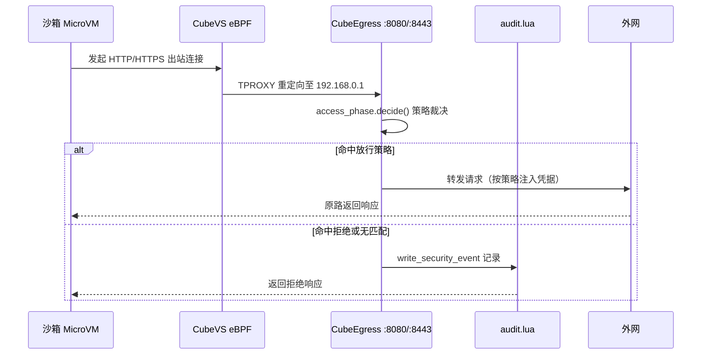
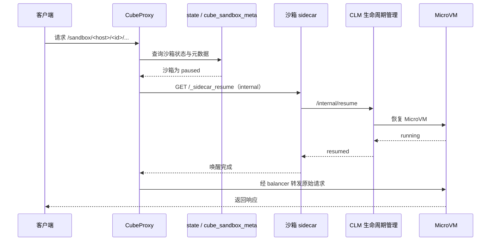

# CubeEgress 与 CubeProxy

> 本篇覆盖事实 **F-185 ~ F-196**，描述 CubeSandbox 的两个 OpenResty 网关：出向的 **CubeEgress** 与入口的 **CubeProxy**。
>
> **信源距离：①（一手信源）**——事实直接取自 v0.7.2 源码中两个网关的 `nginx.conf`、Lua 模块（policy/admin/audit/cert_signer/access_phase、utils/balancer_phase/path_rewrite_phase）、`start.sh`、`gen-ca.sh` 与 Dockerfile，信源登记见 [01-source-map.md](../references/01-source-map.md)。

## 1. 导语：两个 OpenResty 网关，一进一出

CubeSandbox 把 L7 网络能力收敛到两个基于 OpenResty 的网关上：

- **CubeEgress** 负责沙箱**出向**流量的透明策略裁决、动态证书签发、凭据注入与审计，镜像基于带透明代理能力的 `openresty-tproxy:1.29.2.5`，EXPOSE `8080 8443 9091`（F-196）；
- **CubeProxy** 负责**入站**请求的沙箱域名路由、负载均衡、gRPC 桥接与暂停沙箱自动唤醒，镜像为 `openresty:1.21.4.1-6-alpine-fat`，EXPOSE `8080 8081 9090`（F-196）。

本篇按「先出后入」展开：CubeEgress 的透明监听（F-185）、共享内存与策略 CRUD（F-186、F-188、F-189）、证书/审计/管理面（F-187、F-190、F-191），随后是 CubeProxy 的端口拓扑与 gRPC 状态映射（F-192、F-193）、自动唤醒链路（F-194），最后汇总启动脚本与证书脚本默认值（F-195）。

## 2. 双网关定位

| 维度 | CubeEgress | CubeProxy |
|---|---|---|
| 流量方向 | 沙箱 → 外网（出向） | 客户端 → 沙箱（入站） |
| 介入方式 | 透明代理（TPROXY，流量经 eBPF 重定向） | 显式反向代理（客户端直连网关端口） |
| 核心职责 | L7 策略裁决、域名过滤、凭据注入、审计 | 域名路由、负载均衡、gRPC 桥接、暂停唤醒 |
| 监听端口 | `192.168.0.1:8080` / `:8443`、`127.0.0.1:9091`（F-185、F-190） | `:8081` / `:8080`（SSL）/ `:9090`（http2）（F-193） |
| 基础镜像 | `openresty-tproxy:1.29.2.5`（F-196） | `openresty:1.21.4.1-6-alpine-fat`（F-196） |

两个网关都是节点本地数据面组件：每台计算节点各跑一份，分别卡住该节点沙箱流量的「出口」与「入口」。

## 3. CubeEgress 拓扑：透明监听与裁决时序

`nginx.conf` 声明两个透明 server（F-185）：

| 监听地址 | 协议 | 关键参数 |
|---|---|---|
| `192.168.0.1:8080` | HTTP | `transparent`、`reuseport` |
| `192.168.0.1:8443` | HTTPS | `ssl`、`transparent`、`reuseport` |

`192.168.0.1` 是沙箱网段的网关地址；`transparent` 表示按 TPROXY 语义接收目的地址并非本机的连接。沙箱侧连接由 CubeVS 的 eBPF 数据面重定向到这两个端口，因此沙箱**无法绕过网关直接出网**。承载它的镜像 `openresty-tproxy:1.29.2.5` 已具备透明代理所需能力（F-196）。

HTTP 与 HTTPS 两个 location 在访问阶段统一调用 `access_phase.decide()` 完成裁决（F-187）。

## 4. 策略存储：shared_dict 与 policy.lua

`nginx.conf` 通过 `lua_shared_dict` 开辟四块 worker 共享内存（F-186）：

| 共享字典 | 容量 | 用途 |
|---|---|---|
| `cert_cache` | 64m | 动态签发 leaf 证书的缓存 |
| `cert_locks` | 8m | 证书签发串行锁，防重复签发 |
| `policy_store` | 128m | 策略主存储 |
| `meta_store` | 1m | 元数据 |

`policy.lua` 围绕 `policy_store` 实现策略管理：常量 `STORE` 指向 `policy_store`，索引键 `INDEX_KEY` 为 `__index__`，并限定 `MAX_L7_PORTS_PER_HOST = 8`（单主机 L7 端口上限）（F-188）。

写入前的校验函数链（F-188）：

| 函数 | 职责 |
|---|---|
| `is_valid_sandbox_ip` | 校验是否为合法沙箱 IP |
| `parse_ipv4_cidr` | 解析 IPv4 CIDR |
| `normalize_identity` | 归一化身份标识 |
| `validate_match_tuples` | 校验匹配元组 |
| `validate_policy` | 校验整条策略 |

模块导出的操作覆盖全量 CRUD 与运维场景：`list_ips`、`get`、`put`、`delete`、`patch`、`dump_all`、`count`、`bulk_load`（F-189）。其中 `compute_fingerprint` 返回 `fp-` 拼接 sha256 前 8 位 hex 的指纹；`put` 写入时会落 `inj.secret_ref_synthetic`（合成密钥引用，真实 secret 不以明文存储）（F-189）。

## 5. 证书签发与审计

`init_by_lua` 在 worker 启动前执行两个 bootstrap（F-187）：

- **cert_signer.bootstrap**：CA 证书位于 `/etc/cube/ca/cube-root-ca.crt`，`leaf_ttl_sec` 为 **7 天**——网关为命中策略的域名现场签发 7 天有效的 leaf 证书，从而对 HTTPS 做透明 L7 解析；
- **audit.bootstrap**：审计日志落盘 `/data/log/cube-egress/access.jsonl`。

根 CA 由 `gen-ca.sh` 生成：椭圆曲线 `CURVE=prime256v1`、有效期 `DAYS=3650`（约 10 年）（F-195）。

`audit.lua` 提供三个写入口，对应三类事件（F-191）：

| 写入口 | 事件类型 |
|---|---|
| `write_one` | `http_request` |
| `write_security_event` | `security_event` |
| `write_tls_handshake_event` | `tls_handshake` |

## 6. 管理面：127.0.0.1:9091

管理面是独立 server，仅绑定回环 `127.0.0.1:9091`（F-190）。`admin.lua` 路由如下：

| 方法 | 路径 | 用途 |
|---|---|---|
| GET | `/admin/v1/health` | 健康检查 |
| GET | `/admin/v1/dump` | 导出存储 |
| GET | `/admin/v1/policies` | 列出策略 |
| GET/PUT/PATCH/DELETE | `/admin/v1/policies/([%d%.]+)` | 按 IP 单条读改删（捕获数字与点） |

管理面返回策略前先经 `redact_policy` 脱敏（F-191）：

- `inject[].secret` 字段替换为 `***REDACTED***`；
- 删除 `secret_ref_synthetic` 字段。

因此即便管理接口被调用，密钥与合成引用也不会出现在响应中。

## 7. CubeProxy：端口、负载均衡、路径改写与 gRPC 桥接

CubeProxy 的监听端口（F-193、F-196）：

| 端口 | 参数 | 用途 |
|---|---|---|
| `8081` | `reuseport` | 明文 HTTP 主入口 |
| `8080` | `ssl reuseport` | HTTPS 入口 |
| `9090` | `http2 reuseport` | HTTP/2、gRPC 入口 |

upstream `backend` 与 `grpc_backend` 不写死后端节点，统一由 `balancer_by_lua_file lua/balancer_phase.lua` 在均衡阶段动态选路（F-193）。

路径侧有两类 location（F-194）：

- 正则 `^/sandbox/[^/]+/\d+/(?:process\.Process/(?:Start|Connect)|filesystem\.Filesystem/WatchDir)$` 精确匹配 `process.Process/Start`、`process.Process/Connect`、`filesystem.Filesystem/WatchDir` 三类长连接/流式 gRPC 路径；
- 前缀 `/sandbox/` 由 `rewrite_by_lua_file path_rewrite_phase.lua` 改写后转发。

`lua/utils.lua` 承担 gRPC 桥接：`is_grpc_request` 识别 gRPC 请求，`respond_*` 系列方法回造响应；HTTP 状态码到 `GRPC_STATUS` 的映射为（F-192）：

| HTTP | gRPC code |
|---|---|
| 400 | 3 |
| 403 | 7 |
| 404 | 5 |
| 410 | 9 |
| 503 | 14 |

这样 HTTP 侧收到的错误仍能被 gRPC 客户端按正确的状态码语义处理。

## 8. 自动唤醒：暂停沙箱的按需 resume

为支撑沙箱暂停（pause）后仍可被请求触发，CubeProxy 维护三块共享内存（F-194）：`cube_sandbox_meta` 16m、`state` 4m、`last_active` 8m，并声明 internal location：

`/_sidecar_resume` → `proxy_pass http://$cube_sidecar_addr/internal/resume`，其中 `$cube_sidecar_addr` 由 Lua 按目标沙箱动态定位到其 sidecar（F-194）。

暂停/恢复的生命周期语义见 [12-ops-lifecycle.md](12-ops-lifecycle.md)；策略配置示例见 [04-pause-resume-policy.md](../examples/04-pause-resume-policy.md)。

## 9. 配置默认值汇总

CubeEgress `start.sh` 的默认环境变量（F-195）：

| 变量 | 默认值 |
|---|---|
| `CUBE_SANDBOX_NETWORK_CIDR` | `192.168.0.0/18` |
| `CUBE_EGRESS_ADMIN_PORT` | `9091` |

`192.168.0.0/18` 的网关地址 `192.168.0.1` 即 CubeEgress 透明监听地址（F-185）。`gen-ca.sh` 默认 `CURVE=prime256v1`、`DAYS=3650`（F-195）。镜像暴露端口与配置一致：CubeEgress `8080 8443 9091`、CubeProxy `8080 8081 9090`（F-196）。

## 10. 导航

- 网络数据面（eBPF 与 TPROXY 重定向来源）：[09-network.md](09-network.md)
- 沙箱运维生命周期（暂停/恢复）：[12-ops-lifecycle.md](12-ops-lifecycle.md)
- 对外 API 与鉴权：[04-cubeapi.md](04-cubeapi.md)
- 暂停/恢复策略示例：[04-pause-resume-policy.md](../examples/04-pause-resume-policy.md)
- 术语表：[03-glossary.md](../references/03-glossary.md)
- 信源登记：[01-source-map.md](../references/01-source-map.md)
