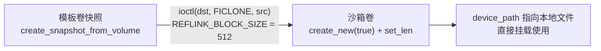

# CubeCoW 与 CubeS3lvol 存储体系

> 信源距离：①（直接阅读 CubeSandbox v0.7.2 源码与随仓 README）。本文事实编号（F-197～F-214）均可回溯至 [CubeSandbox v0.7.2 信源地图](../references/01-source-map.md)（S1）。

## 1. 导语：一套抽象，两种后端

CubeSandbox 的卷（Volume）与快照（Snapshot）由 **cubecow** crate 统一管理：cubecow v0.1.0，crate-type 同时产出 lib / cdylib / staticlib，并附带 `cubecow-cli` 二进制（F-197）。它在同一套 `Engine` 抽象之下提供两个后端：

- **CubeCoW reflink 后端（默认）**：基于 Linux `FICLONE` ioctl 的本地写时复制，免维护账本，内存索引靠目录扫描重建；
- **CubeS3lvol / S3 后端**：经 Unix Domain Socket 调用 SPDK 用户态 target `s3lvol_tgt`（NVMe/TCP），卷页落入对象存储，跨机、跨云可用。

一句话概括：**reflink 管"本机极速克隆"，S3lvol 管"跨机的块设备与对象页"**。快照与克隆语义在两个后端各自成立，但彼此不跨后端。

## 2. 对象模型与 Engine 抽象

### 2.1 Volume 与 Snapshot 字段

| 结构体 | 字段 |
|---|---|
| `Volume`（F-198） | `name`、`size_bytes`、`device_path`、`snapshot_count`（i32）、`created_at`、`export_uuid`、`export_status`、`deletable`（`Option<bool>`） |
| `Snapshot`（F-199） | `name`、`size_bytes`、`device_path`、`origin_volume`、`created_at`、`export_uuid`、`export_status`、`deletable` |

两者共享大部分字段；关键差异是 Volume 持有 `snapshot_count`，而 Snapshot 以 `origin_volume` 指回来源卷。`export_uuid` / `export_status` 服务于卷导出（如 NVMe/TCP 暴露），`deletable` 是三态可选的删除许可标记。

### 2.2 trait Engine：统一操作面

`trait Engine` 要求 `Send + Sync`，可安全地跨线程共享（F-201）。其方法按职责分为三组：

| 分组 | 方法 |
|---|---|
| 卷生命周期 | `create_volume`、`delete_volume`、`resize_volume`、`activate_volume`、`deactivate_volume` |
| 快照与克隆 | `create_snapshot_from_volume`、`create_volume_from_snapshot`、`list_volumes`、`list_snapshots` |
| 节点级操作 | `reset_node_storage`、`metrics` |

两个后端各自实现同一 trait，上层调用方不感知底层是本地文件还是远端 target。

### 2.3 初始化分支与配置

lib.rs 的 `initialize` 按 `BackendKind` 的 **Reflink / S3** 两个取值分支构造对应引擎（F-200）。配置经 serde 反序列化，`rename_all = "lowercase"`，即配置中写作 `reflink`（默认）与 `s3`（F-202）：

| 配置项 | 类型/默认 | 说明 |
|---|---|---|
| `BackendKind` | 枚举，默认 `Reflink` | 取值 `reflink` / `s3`（F-202） |
| `ReflinkConfig.root_dir` | 路径 | reflink 数据根目录（F-202） |
| `S3Config.socket_path` | `/var/run/s3lvol.sock` | 与 target 通信的 UDS 套接字（F-202） |

## 3. reflink 后端：FICLONE 与免账本索引

### 3.1 常量与引擎状态

`reflink.rs` 定义 `REFLINK_BLOCK_SIZE = 512` 与 ioctl 号 `FICLONE = 0x40049409`；引擎结构为 `ReflinkEngine { volumes_dir, name_index: RwLock<HashMap<String, NameKind>>, metrics }`（F-203）。内存索引只记录"名字 → 名称种类（卷或快照）"，不持有任何块分配账本。

### 3.2 初始化：探测 + 扫描重建

`initialize_with_config` 完成三件事（F-204）：

1. 创建 `<root>/volumes` 目录；
2. `probe_reflink_support`：探测当前文件系统是否支持 reflink（FICLONE）；
3. `scan_and_rebuild_index`：扫描卷目录，重建 `name_index`。

这就是"免账本"的含义：**磁盘上不维护独立元数据账本，索引随时可由目录扫描重建**，进程重启后重新 initialize 即恢复全部认知。对照之下，S3 后端需要 index.json 显式落盘（见第 5 节）。

### 3.3 卷、扩容与快照操作

- `create_volume`：以 `create_new(true)` 创建新文件并 `set_len` 到目标大小；同名文件已存在则创建失败（F-205）。
- `resize_volume`：**不允许 new < old**——只扩不缩，缩容请求返回 `InvalidArg`（F-205）。
- `create_snapshot_from_volume`：调用内部 `ficlone`，由内核在两个 inode 之间共享数据块（F-205）。
- `ficlone` 的本质是一次 ioctl：`ioctl(dst, FICLONE, src)`——克隆后源与目标共享物理块，任一方写入时由文件系统执行写时复制（F-206）。

### 3.4 从模板快照到沙箱卷

模板侧产出快照后，每个沙箱卷都是一次 FICLONE 克隆：创建瞬间不复制数据、不占额外物理块，随着沙箱内写入才按文件系统粒度分配新块。

## 4. CGo FFI：三种 crate-type 与错误码

cubecow 的三种 crate-type 是 `lib`、`cdylib`、`staticlib`（F-197）：staticlib 供 C/C++ 侧静态链接，cdylib 供运行时动态加载，lib 供 Rust 内嵌。

`ffi.rs` 定义扁平的 C ABI 错误码（F-207）：

| 错误码 | 值 | 含义 |
|---|---|---|
| `COW_OK` | 0 | 成功 |
| `NOT_FOUND` | -1 | 卷或快照不存在 |
| `ALREADY_EXISTS` | -2 | 同名对象已存在 |
| `PANIC` | -99 | Rust 侧 panic 被捕获后的兜底返回 |

对外以 `extern "C"` 导出 4 个入口：`cubecow_init`、`cubecow_create_volume`、`cubecow_create_snapshot_from_volume`、`cubecow_get_metrics`（F-207）。Cubelet 节点守护进程侧通过静态链接把 cubecow 编入自身，经 C ABI 完成初始化、建卷、建快照与取指标（F-081，见 [06-cubelet.md](06-cubelet.md)）；`cubecow-cli` 则服务于人工排障与运维操作。

Rust 侧的各类错误在跨越 C 边界时统一收敛为上述四个整数码，C 调用方只需按返回码分支处理，无需理解 Rust 错误类型（F-207）。

## 5. S3 后端：UDS JSON-RPC 与 index.json

`engine/s3.rs` 是 S3 后端对 `Engine` 的实现：它本身不处于数据路径上，而是经 UDS（默认 `/var/run/s3lvol.sock`，F-202）以 JSON-RPC 调用 **11 个 `rcow_*`** 方法，并把卷索引以 **index.json 落盘**（F-208）。与 reflink 的"扫描即账本"相反，S3 后端的卷元数据必须显式持久化。

### 5.1 11（Rust 调用面）与 30（C 注册面）

C 侧 SPDK target 在 v0.7.2 tag blob 的 `vbdev_s3lvol_rpc.c` 中经 `SPDK_RPC_REGISTER` 注册 **30 个不同名 `rcow_*` RPC**（F-212）。其中 **9 个核心卷管理 RPC** 为：

| # | RPC | 字面职责 |
|---|---|---|
| 1 | `rcow_create_lvstore` | 创建逻辑卷存储池（lvstore） |
| 2 | `rcow_attach_lvstore` | 附着已有 lvstore |
| 3 | `rcow_create_lvol` | 创建逻辑卷（lvol） |
| 4 | `rcow_create_snapshot` | 创建快照 |
| 5 | `rcow_create_clone` | 基于快照创建克隆卷 |
| 6 | `rcow_resize_lvol` | 逻辑卷扩容 |
| 7 | `rcow_delete_lvol` | 删除逻辑卷 |
| 8 | `rcow_get_lvstores` | 查询 lvstore 列表与信息 |
| 9 | `rcow_active_bdev` | 查询或置活跃块设备（bdev） |

其余 21 个覆盖 lvstore 删除/卸载/flush/checkpoint、卷导入导出（`import_lvol`/`export_snapshot`/`materialise_export`/`release_export`/`get_exports`/`get_imports`）、解耦（`decouple_lvol`/`get_decouple`）、bdev 查询/去激活/批量激活、pending delete 与构建信息等（F-212）。

口径纪律：**11 是 Rust 引擎经 UDS 发起的 `rcow_*` 调用数（F-208，为 C 注册面的子集）；30 是 v0.7.2 tag 中 C 侧注册的不同 RPC 名总数（F-212，V 阶段勘误：R 阶段曾误将核心 9 个当作注册总数）**。两个数字分属不同层面，不可混用。

## 6. CubeS3lvol：SPDK/DPDK 的 NVMe/TCP target

CubeS3lvol 随仓 README 说明，其发布产物为 `bin/s3lvol_tgt`——一个 **NVMe/TCP target**，基于 SPDK（底层为 DPDK）在用户态导出块设备，卷数据页回源对象存储（F-209、F-212）。

构建、发布与 RPC 资产：

- **发布脚本 `make_release.sh`** 参数：`--version`、`--outdir`、`--no-tar`、`--skip-build`、`--skip-smoke`（跳过冒烟验证）（F-209）。
- **`Makefile` 目标**：`all`、`shared`、`static`、`app`、`clean`、`check`、`check-offline`、`check-rules`、`check-env`（F-210）。
- **`scripts/rpc.py`**：包含 `_existing` 与 `find_upstream_rpc_py`（向 SPDK 上游查找并复用 rpc 脚本）；环境变量 `S3LVOL_RPC_DISABLE_FALLBACKS` 用于关闭回退查找逻辑（F-211）。

Rust 侧 `engine/s3.rs` 正是该 target 在 UDS 端点上的 JSON-RPC 客户端：一端在 `s3lvol_tgt` 内由 C 代码注册并处理 `rcow_*`，另一端在 Cubelet 进程内以 Rust 调用发起（F-202、F-208、F-209、F-212）。

## 7. S3 卷的使用：四类对象存储与 s3fs 引用计数

面向 Python 用户的使用方式（F-213）：

- 安装：`pip install cubesandbox>=0.6.0`；
- 建卷：`Volume.create("my-data", driver="s3")`，显式选择 S3 驱动；
- 兼容的对象存储后端共四类：**AWS S3、腾讯云 COS、Cloudflare R2、MinIO**；默认带 MinIO，本地即可起一套 S3 兼容服务。

挂载侧采用引用计数管理生命周期（F-214）：

1. 首次使用时由 **s3fs** 将对象存储桶挂载到宿主机；
2. 多个消费者共享同一挂载点；引用计数归零后执行 `fusermount -u` 卸载；
3. 卸载只断开挂载点，**后端对象数据保留**；
4. `Volume.destroy` 删除 `volumes/<id>/` 前缀——仅清理该卷名下的对象页，不触及其他卷的前缀。

## 8. 后端选择与边界

| 维度 | reflink 后端 | S3 / CubeS3lvol 后端 |
|---|---|---|
| 数据路径 | 本机文件系统 FICLONE | SPDK NVMe/TCP + 对象存储页 |
| 克隆成本 | 建链即完成，本机极速 | 经用户态 target 与对象页，面向跨机 |
| 可移植性 | 不跨机：卷文件与本机 FS 绑定 | 跨机/跨云：对象页在远端，他机可附着 |
| 元数据 | 免账本，目录扫描重建 | index.json 显式落盘 |
| 启用方式 | 默认即此（F-202） | `driver="s3"` 显式指定（F-213） |

边界纪律：

- **快照不跨后端**：reflink 快照与 S3 lvol 快照是两套机制，不能拿一端的快照到另一端建卷；
- reflink 依赖支持 FICLONE 的本机文件系统，探测不通过则该后端不可用（F-204）；
- S3 后端配合跨机暂停恢复 Preview，可让沙箱状态随卷迁移到另一节点（F-006）；跨节点编排见 [07-hypervisor.md](07-hypervisor.md)，运维操作见 [12-ops-lifecycle.md](12-ops-lifecycle.md)。

## 9. 导航

- 虚拟化与设备导出：[07-hypervisor.md](07-hypervisor.md)
- 节点侧存储调用与静态链接：[06-cubelet.md](06-cubelet.md)
- 卷指标上报（GetVolumeStats）：[08-agent-shim.md](08-agent-shim.md)
- 运维生命周期：[12-ops-lifecycle.md](12-ops-lifecycle.md)
- 模板构建实操：[../examples/03-template-build.md](../examples/03-template-build.md)
- 术语对照：[../references/03-glossary.md](../references/03-glossary.md)
