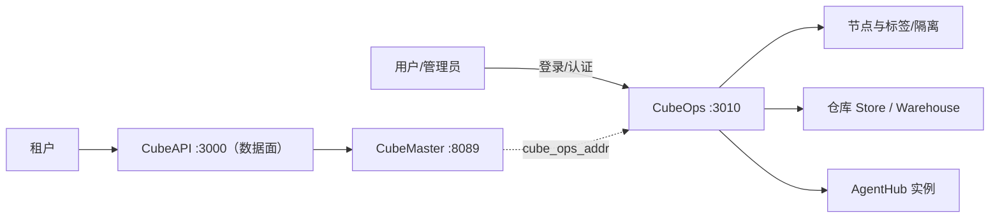
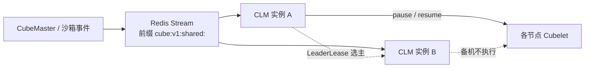
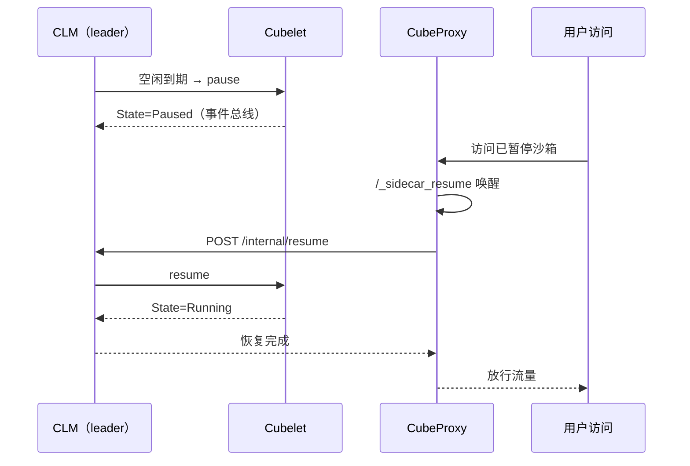
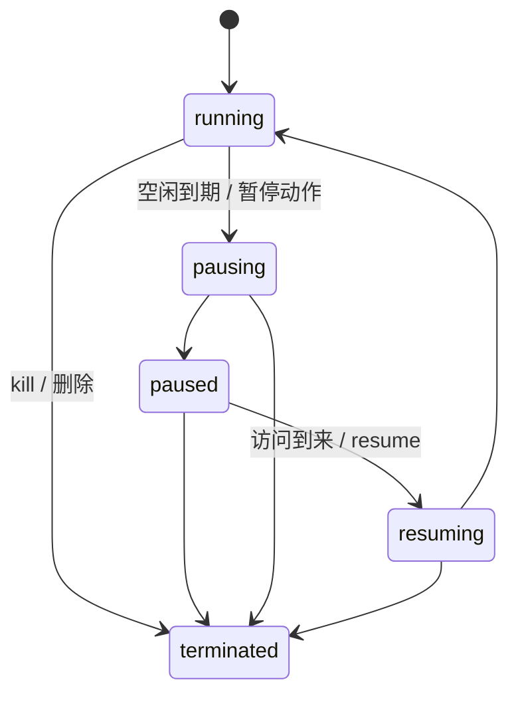
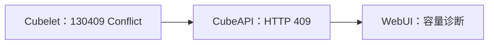

# CubeOps 与生命周期管理

> 本文覆盖运维面三件套 CubeOps / cube-lifecycle-manager（CLM）/ CubeTemplateCenter 的事实 F-215 ~ F-225，沙箱五状态与超时语义 F-234 ~ F-238，以及版本演进线 F-241、F-243、F-244。信源距离为①级——事实逐字取自 v0.7.2 tag 内的源码、README 与配置原文，锚点逐条见 [02-anchor-index.md](../references/02-anchor-index.md)。

## 一、为什么需要独立运维面

CubeSandbox 把**租户数据面**与**集群运维面**拆成两套独立服务：租户请求走 CubeAPI → CubeMaster 的业务链路，而管理员视角的认证、节点、仓库、容量运维走独立的 CubeOps。CubeOps 的 Go module 声明为 `github.com/tencentcloud/CubeSandbox/CubeOps`，go 版本 1.25.7（F-215），README 声明服务监听 **:3010**（F-216）。CubeMaster 侧 `conf.yaml` 的 `cube_ops_addr` 默认指向 `http://127.0.0.1:3010`，即运维旁路的固定入口（F-060）。

分离的收益有三：①运维 API 可单独挂认证与审计，不与无状态业务网关混用身份体系；②节点注册、标签、隔离等集群动作不经过租户链路，故障域隔离；③镜像/制品仓库操作集中在 :3010，权限边界清晰（F-216、F-217）。

## 二、CubeOps API 全景

CubeOps 基于 gin，README 登记的 API 组为 `/api/v1/auth`、`/cluster`、`/agenthub`、`/store`、`/config`、`/warehouse`，以及 `/api/v1/sdk/*` 与 `/internal/warehouse/*`（F-216）。go.mod 关键依赖为 gin、gorm、pgx/v5、redigo、go-containerregistry、urfave/cli，并对本地 `pkgs` 做 replace（F-215）。

| 分组 | 主要路由 | 事实 |
|---|---|---|
| auth | `POST /login`、`POST /refresh`、`GET /session`、`POST /change-password` | F-217 |
| cluster | `GET /overview`、`GET /versions`、`GET /nodes`、`GET /nodes/:id`、`PATCH` labels、`PUT` isolation | F-217 |
| agenthub | `GET/POST/DELETE /agenthub/instances[/:id]`、`POST` restart | F-218 |
| nodemanagement | `GET /readyz`、`POST /nodes/register`、`POST` status | F-218 |
| internal | `GET /nodes`、`DELETE /nodes/:id` | F-218 |
| server | `GET /health` | F-219 |
| sdkV2 | `GET /sandboxes`、`GET /sandboxes/:id/logs` | F-219 |

其中 cluster 组覆盖管理员最关心的集群总览、版本清单、节点列表与单节点查询，并支持对节点打标签（PATCH labels）与设置隔离（PUT isolation）（F-217）；nodemanagement 组的 `/readyz` 与 `/nodes/register` 构成节点侧的注册与就绪探针，节点状态另经 POST status 上报（F-218）。sdkV2 组则面向 SDK 提供沙箱清单与单沙箱日志两类只读接口（F-219）。

部署侧，CubeOps Dockerfile 基于 `alpine:3.20`，`EXPOSE 3010`，入口点为 `cubeops`（F-219）——轻量镜像与固定端口构成运维面的标准交付形态。

## 三、CLM：生命周期管理器的架构

cube-lifecycle-manager（CLM）是与 CubeOps 配套的独立 Go 组件，go 版本同样为 1.25.7；go.mod 关键依赖为 `redis/go-redis/v9 v9.20.0`、zap（日志）、`backoff/v7`（退避重试）与 miniredis（测试用 Redis）（F-220）。

`main` 在启动时构造以下组件：redis client、stream、cubemaster client、registry、leader lease、resumer、sweeper、httpapi（F-221）。随后拉起的 goroutine 构成 CLM 的全部运行面：

| goroutine | 职责 |
|---|---|
| `consumeStream` | 消费 Redis Stream 上的沙箱事件 |
| `pollLastActive` | 轮询沙箱最近活跃时间，判定空闲 |
| `sweep.Run` | 清扫到期/异常沙箱 |
| `apiSrv.Run` | HTTP API（resume 入口与探针） |
| `lease.Run` | 领导租约维持 |
| `reconcileOnLeadership` | 成为 leader 后的协调动作 |
| `discovery` | 服务/节点发现 |

（以上均据 F-221。）

多实例 CLM 通过 Redis 上的领导租约实现**单活选主**：只有持有 lease 的实例执行空闲检测、清扫与恢复协调，其余实例热备（F-221、F-223）。

## 四、选主与事件总线

事件总线 `eventbus` 的 `Bus` 提供两个核心方法：`Publish(sandboxID)` 发布某沙箱的事件，`Wait(sandboxID)` 等待该沙箱的事件（F-223）。schema 层定义四类键：`MetaKey`、`EventStreamKey`、`EventChannel`、`LeaderLeaseKey`，统一使用前缀 **`cube:v1:shared:`**；Stream 容量常量 `EventStreamMaxLen` 为 **100000**（F-223）。

事件的操作类型（Op）与状态枚举（State）如下（F-223）：

| 类别 | 取值 |
|---|---|
| Op | `Create` / `Delete` / `Update` / `State` |
| State | `Paused` / `Running` / `Killed` |

即事件总线上流转四类操作，其中 `State` 操作携带三态之一。注意事件总线的三态是**事件层**的粗粒度状态；面向用户的完整生命周期另有五状态模型（F-234，见第七节），两者分属不同抽象层。

CLM 的 HTTP 面（httpapi）暴露 `POST /internal/resume`、`GET /healthz`、`GET /readyz`；服务端 `WriteTimeout` 为 **35s**，而 `handleResume` 使用 **25s** 的 context 处理单次恢复（F-222）。恢复是整条链路里最重的动作，因此被赋予独立的、短于服务端写超时的上下文预算（F-222）。

## 五、自动暂停与恢复

自动暂停/恢复由 `pollLastActive` 与 `sweeper` 两个 goroutine 驱动：前者轮询沙箱最近活跃时间并对空闲到期货架执行 pause，后者负责到期清扫（F-221）。当外部访问到达一个已暂停沙箱时，请求经 CubeProxy 的 `/_sidecar_resume` 唤醒路径进入恢复链路（F-194），CLM 侧入口为 `POST /internal/resume`（25s context）（F-222），恢复完成前流量在代理侧等待。

暂停态之所以可行，依赖底层状态外置：沙箱存储经 S3 等后端支持跨机访问（F-006），使暂停后的实例不被绑定在单一节点的本地状态上，恢复时具备节点选择余地。

## 六、五状态模型

沙箱对外呈现五个生命周期状态（F-234）：

| 状态 | 含义 |
|---|---|
| `running` | 运行中 |
| `pausing` | 暂停过渡中 |
| `paused` | 已暂停（可恢复） |
| `resuming` | 恢复过渡中 |
| `terminated` | 已终止 |

`pausing` 与 `resuming` 是两个显式过渡态，使暂停/恢复期间的并发请求能区分"稳态可用"与"切换中"（F-234）；终止可从任一状态进入。

### 超时语义（F-235）

| 规则 | 语义 |
|---|---|
| 单位 | 秒（E2B 原生接口 `timeoutMs` 为毫秒） |
| SDK 默认值 | 无默认值（须显式指定） |
| `on_timeout` | `kill`（默认）/ `pause` |
| `-1` | NEVER_TIMEOUT，永不超时 |
| `0` | 立即超时 |
| 正整数 `N` | 空闲 N 秒后超时 |

即超时按"空闲时长"度量：超时动作为 kill 时沙箱进入终止路径，为 pause 时进入暂停/可恢复路径（F-235）。

### 集群默认值与节点释放比例（F-237）

- 集群默认空闲超时取 `cubelet_conf.default_timeout_insec`，仓库默认值为 **-1（永不超时）**；修改该值后须重启 `cube-sandbox-cubemaster.service` 才能生效，不能热更新（F-237）。
- 节点侧 `host.quota.paused_resource_release_ratio` 的值域为 **[0, 1]**，默认 **0**——默认不回收暂停沙箱占用的资源，调大该比例则按比例释放暂停态资源（F-237）。

## 七、异常路径

**删除持锁沙箱**：对正持有锁（如处于切换动作中）的沙箱执行删除时，服务返回 **503**，并携带响应头 **`Retry-After: 2`**，提示客户端 2 秒后重试（F-236）。这是"过渡态保护"在删除路径上的体现——调用方应把该响应当作可重试信号，而非永久失败。

**恢复被拒链**：当节点容量不足、resume 无法落地时，错误沿三层链路传播（F-238）：

Cubelet 先以 `130409 Conflict` 拒绝恢复，CubeAPI 将其转为 HTTP 409 返回，最终在 WebUI 上呈现为容量诊断信息（F-238）。排障时应自顶向下定位到节点容量，而非在网关层重试。

## 八、CubeTemplateCenter：模板构建面

CubeTemplateCenter 是与运维面并列的模板/制品构建组件，go 版本 1.25.7；go.mod 通过 replace 指向同仓库的 CubeMaster、cubedb、Cubelet（F-224）。其路由分两组（F-225）：

| 类别 | 路由 |
|---|---|
| 公开 | `GET /metrics`、`GET /health` |
| internal | `POST /build`、`POST /artifact/delete`、`POST /artifact/upload` |

测试用前缀为 `/tc/api/v1/`（F-225）。TemplateCenter 把模板构建（build）与制品的上传/删除（artifact upload/delete）收敛为内部 API，对外仅暴露指标与健康探针，与 CubeOps 的"内部动作不直接外露"口径一致。

## 九、版本演进线

CubeSandbox 的版本发布时间线（F-241）：

| 版本 | 日期 |
|---|---|
| v0.1.0 | 2026-04-20 |
| v0.2.0 | 2026-05-07 |
| v0.3.0 | 2026-06-02 |
| v0.4.0 | 2026-06-14 |
| v0.5.0 | 2026-07-03 |
| v0.6.0 | 2026-07-24 |
| v0.7.0 | 2026-08-28 |
| v0.7.1 | 2026-09-11 |
| v0.7.2 | 标题日期 09-23（tag 实际日期 09-24） |

其中 **v0.4.0** 把构建基础镜像下调为 `ubuntu:20.04`、glibc 2.31，以兼容更老的宿主环境（F-243）。从 v0.1.0 到 v0.7.2 约五个月、九个版本，节奏在 6-8 月最为密集。

WebUI（React + TSX）侧 `main.tsx` 注册 **18 条路由**、pages/ 含 19 个组件（F-244，其中主导航 15 个页面，另有登录页与 Warehouse 两个子页），覆盖从沙箱管理到第七节所述容量诊断等运维场景。

## 十、导航

- SDK 与模板生态：[13-sdk-ecosystem.md](13-sdk-ecosystem.md)
- 网关与唤醒入口：[10-gateways.md](10-gateways.md)
- 编排与运维旁路配置：[05-cubemaster.md](05-cubemaster.md)
- 节点侧 pause/resume 执行：[06-cubelet.md](06-cubelet.md)
- 策略示例：[04-pause-resume-policy.md](../examples/04-pause-resume-policy.md)
- 信源回查：[02-anchor-index.md](../references/02-anchor-index.md)——F-006、F-060、F-194、F-215 ~ F-225、F-234 ~ F-238、F-241、F-243、F-244 逐条源码位置。
