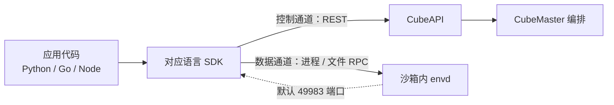
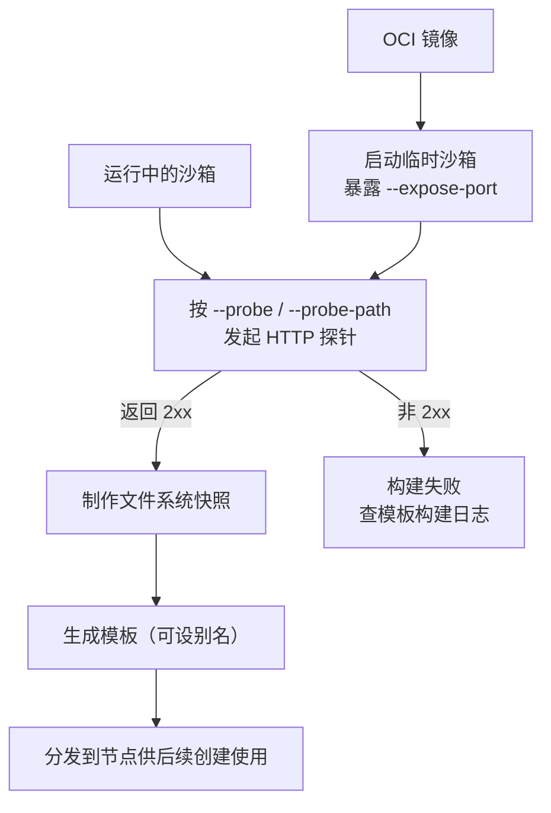

# 三端 SDK 与模板生态

> 信源距离①：本文事实直读 v0.7.2 tag 下 `sdk/go`、`sdk/python`、`sdk/node` 三端源码与 `pkgs/` 共享库，以及中文指南 `docs/zh/guide/templates.md`、`docs/zh/guide/sandbox-logs.md`，覆盖事实 F-226 ~ F-233、F-239 ~ F-240，并引用 CubeAPI 模板路由（F-045）与 envd 版本回退（F-049）。逐条锚点见 [../references/02-anchor-index.md](../references/02-anchor-index.md)。三端 SDK 共享同一套“控制面走 CubeAPI REST、数据面走沙箱内 envd”的双通道模型；模板则以“HTTP 探针通过后制作快照”为统一生产纪律。

## 一、SDK 全景

CubeSandbox 官方维护 Python、Go、Node 三端 SDK，版本节奏与服务端发行版并不同步，接入前应先核对版本兼容口径：

| 端 | 包 / 模块 | 版本 | 关键运行约束 | 事实 |
|---|---|---|---|---|
| Python | `cubesandbox` | 0.7.0 | 以发行包文件清单为准 | F-232 |
| Go | sdk/go module | 随仓库（go 1.22） | Go 1.22 工具链 | F-226 |
| Node | `@cubesandbox/sdk` | 0.3.0 | type module、engines node>=18、undici ^6.19.8 | F-231 |

三端 SDK 在架构上遵循同一组通道划分：

- **控制通道**：沙箱的创建、列举、暂停、恢复、超时、网络、模板与卷管理等生命周期操作，经 CubeAPI 的 REST 路由转发至 CubeMaster 编排（模板路由族见 F-045）。
- **数据通道**：沙箱启动后，进程执行（startProcess）、文件系统 RPC、目录 watch 等高频数据操作直连沙箱内的 envd 组件，不再绕行控制面（F-230）。

envd 的默认版本回退口径为 `ENVD_VERSION_FALLBACK = "0.2.0"`，注解键为 `cube.master.components.envd.version`（F-049）：SDK 连接具体沙箱时按该注解协商 envd 能力，注解缺失时回退到默认版本。

## 二、Go SDK：接口面最完整的参考实现

Go SDK 是三端中能力面最全的一端，其他语言端的概念命名均可与之对照。

### 2.1 Client 与沙箱管理

`sdk/go` 为独立 Go module，go.mod 声明 go 1.22（F-226）。入口类型与选项：

| 符号 | 职责 |
|---|---|
| `Client` / `NewClient` | 客户端类型与构造函数 |
| `ClientOption` / `WithHTTPClient` | 函数式选项，可注入自定义 HTTP 客户端 |

Client 的方法面覆盖沙箱控制通道：`Create`、`Connect`、`List`、`ListV2`、`Health`、`Close`（F-226）。其中 `Connect` 用于接入一个已存在的沙箱，`List` / `ListV2` 对应 CubeAPI 的两代列举路由。

### 2.2 Sandbox 生命周期

`Sandbox` 类型的方法覆盖单个沙箱的全生命周期（F-227）：

| 分组 | 方法 |
|---|---|
| 元信息 | `GetHost`、`GetInfo` |
| 状态控制 | `Pause`、`Resume`、`Kill`、`Close` |
| 配置变更 | `SetTimeout`、`UpdateNetwork` |
| 数据面入口 | `RunCode`、`Commands`、`Files` |

### 2.3 命令与文件

数据面操作经 envd 通道执行（F-228）：

- `Commands.Run`：在沙箱内启动并运行命令。
- `Files`：文件系统句柄，支持 `ForUser`（切换操作用户身份）、`Read`、`Write`、`WriteFiles`、`List`、`Stat`、`Exists`、`Remove`、`Rename`、`MakeDir`、`WatchDir`。

`WatchDir` 与 envd 侧的 `Watcher` 配合，构成目录变更推送能力。

### 2.4 快照、模板与卷

三类可持久化资源各自有独立子接口（F-229）：

| 子接口 | 方法 |
|---|---|
| snapshot | `CreateSnapshot`、`ListSnapshots`、`DeleteSnapshot`、`Rollback`、`Clone` |
| template | `ListTemplates`、`GetTemplate`、`BuildTemplate`、`RebuildTemplate`、`DeleteTemplate`、`SetTemplateAlias`、`GetTemplateBuildStatus` |
| volume | `CreateVolume`、`ListVolumes`、`GetVolume`、`DeleteVolume` |

模板构建为异步操作：`BuildTemplate` / `RebuildTemplate` 触发后，以 `GetTemplateBuildStatus` 轮询构建状态，与 CubeAPI 的 `/templates/:id/builds/:buildID/status` 路由相对应（F-045）。

### 2.5 Policy、Connect、Transport 与 Envd

Go SDK 内部还包含四组支撑模块（F-230）：

| 模块 | 符号 | 作用 |
|---|---|---|
| policy | `Match`、`Inject(Render)`、`Action`、`Rule` | 策略匹配与注入渲染 |
| connect | `encodeConnectEnvelope`、`readConnectEnvelope` | connect 信封编解码 |
| transport | `newControlHTTPClient`、`newDataHTTPClient` | 控制 / 数据两套 HTTP 客户端 |
| envd | `defaultEnvdUser`（root）、`startProcess`、`filesystemRPC`、`watchDir`、`Watcher` | envd 数据通道的客户端实现 |

控制通道与数据通道在 transport 层即拆分为两个 HTTP 客户端，是“双通道模型”在代码中的直接落点。

## 三、Python SDK：以导出符号为准

Python 端发行包名为 `cubesandbox`，版本 0.7.0（F-232）。包的顶层 `__init__` 导出以下符号：

| 导出符号 | 对应概念 | Go 对照 |
|---|---|---|
| `Sandbox` | 沙箱主入口 | `Sandbox`（F-227） |
| `NEVER_TIMEOUT` | 不超时语义 | 同名常量概念 |
| `Config` | 连接 / 客户端配置 | `ClientOption` 体系（F-226） |
| `Execution` | 命令执行 | `Commands.Run`（F-228） |
| `Pty` | 终端交互 | envd 进程通道（F-230） |
| `Template` | 模板资源 | template 子接口（F-229） |
| `Volume` | 卷资源 | volume 子接口（F-229） |

本文只记录导出符号与包文件清单层面的事实（F-232），不推断各符号的方法签名；具体调用形态应以随包发布的源码或 [../examples/01-sdk-workflow.md](../examples/01-sdk-workflow.md) 为准。Python 与 Go 在 `Sandbox`、`NEVER_TIMEOUT`、`Volume` 上保持同名概念，跨端迁移时语义可直接对照。

## 四、Node SDK

Node 端包名为 `@cubesandbox/sdk`，版本 0.3.0（F-231）：

| 包元信息 | 值 |
|---|---|
| 模块类型 | type module（ESM） |
| engines | node >= 18 |
| HTTP 依赖 | undici ^6.19.8 |

包内共 13 个 TypeScript 文件，按职责划分为 `index`、`sandbox`、`commands`、`filesystem`、`pty`、`policy`、`template`、`volume` 等（F-231）。文件切分与 Go SDK 的模块边界基本一一对应：sandbox 对应生命周期，commands/filesystem 对应数据面，policy 对应策略，template/volume 对应持久化资源。

## 五、共享 pkgs

Go SDK 与服务端共用仓库内的 `pkgs` 共享库（F-233）：

| 包 | 职责 | 关键依赖 |
|---|---|---|
| CubeLog | 日志组件 | — |
| blobstore | 对象存储抽象 | minio-go v7.3.0 |
| cubedb | 数据库访问层 | goose 3.27.1、gorm |
| proto | 协议定义 | — |

这些 pkgs 是服务端与 SDK 之间的公共契约层；理解 blobstore 与 proto 有助于理解 SDK 数据通道、卷与模板产物的存储方式（卷的持久化详见 [11-storage.md](11-storage.md)）。

## 六、模板机制：探针通过后快照

模板是沙箱根文件系统的快照产物。v0.7.2 的模板生产遵循统一纪律（F-239）：

- **健康探针前置**：模板快照只在 HTTP 探针返回 2xx 后制作。
- **envd 健康端点**：沙箱内 envd 默认监听 49983 端口，其 `/health` 返回 204。
- **必填参数**：制模板时必须提供 `--expose-port`、`--probe`、`--probe-path`，缺一不可。
- **两种制作方式**：① 从 OCI 镜像启动后制作；② 从一个运行中的沙箱直接制作。

模板路由在 CubeAPI 侧由 `/templates` 路由族承接，含 compat 兼容与 alias 别名管理（F-045）。运维侧另有两个 cubemastercli 子命令（F-239）：

- `tpl merge`：将模板 artifact 存储收敛合并。
- `tpl redo`：在节点上重新分发 / 重建模板。

完整的模板构建步骤见 [../examples/03-template-build.md](../examples/03-template-build.md)。

## 七、日志体系

沙箱运行日志与模板构建日志分别落在两套固定路径上，排障时按对象类型取日志（F-240）：

| 日志类型 | 路径 | 文件 |
|---|---|---|
| 沙箱日志 | `/data/cubelet/state/io.containerd.runtime.v2.task/default/<id>/` | `stdout`、`stderr` |
| 模板构建日志 | `/data/log/template/<templateID>_0/` | `stdout`、`stderr` |

使用上有三条明确约束（F-240）：

1. 日志读取不支持 `--follow`，只能获取当前已落盘内容。
2. 日志转发依赖 CubeShim v0.4.0 及以上版本，低版本环境需先升级再配置转发。
3. 沙箱 ID、模板 ID 必须与路径中的目录名严格对应；路径层级缺失通常意味着任务尚未启动或已被回收。

## 八、选型与版本兼容提示

- **新接入项目**：优先按团队主语言选端；需要最完整能力面（快照克隆、策略注入、目录 watch）时以 Go SDK 为准（F-226 ~ F-230）。
- **版本错配**：Python `cubesandbox` 0.7.0、Node `@cubesandbox/sdk` 0.3.0 的版本号均不等于服务端 v0.7.2；跨版本升级前应核对控制通道路由与 envd 协商版本（F-049）。
- **数据面排障顺序**：先查 envd 49983 端口 `/health` 是否返回 204，再查沙箱 `stdout` / `stderr`；模板类问题改查 `/data/log/template/` 下的构建日志（F-239、F-240）。
- **异步构建**：模板 Build / Rebuild 返回后必须轮询 build status，不能假设调用返回即构建完成（F-229、F-045）。

## 九、导航

- [CubeAPI — E2B 兼容网关](04-cubeapi.md)：控制通道路由与模板路由族
- [运维生命周期](12-ops-lifecycle.md)：沙箱创建、暂停、回收的运维流程
- [存储模型](11-storage.md)：Volume 持久化与 blobstore
- [SDK 端到端调用流程](../examples/01-sdk-workflow.md)
- [模板构建实战](../examples/03-template-build.md)
- [术语表](../references/03-glossary.md)
