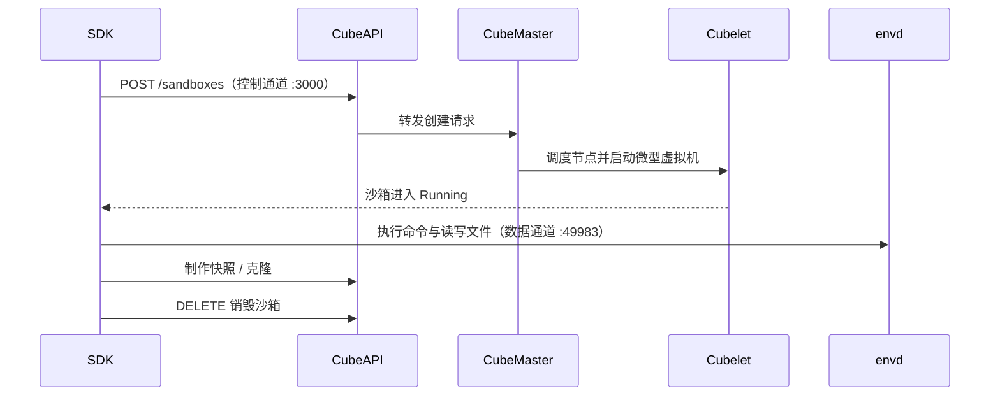

# 三端 SDK 完整工作流

本示例走同一条链路——创建沙箱 → 设超时 → 执行命令 → 读写文件 → 快照/克隆 → 销毁，并给出 Python、Go、Node 三端写法。接口名均来自 v0.7.2 源码事实（F-056、F-226~F-233、F-235~F-239）；未在事实层确认的参数名一律以注释标出，请勿当作精确签名照抄。

## 前置条件

- 已部署 CubeSandbox v0.7.2 系列，CubeAPI 默认监听 3000 端口（F-021、F-039）。
- 准备好 API key，一键部署默认值为 `e2b_000000`（F-024）。
- Python：`pip install -U cubesandbox`；v0.7.2 仓库内 SDK 为 0.7.0（F-232），S3 卷文档给出安装下界 `cubesandbox>=0.6.0`（F-213），客户端与服务端版本宜对齐。
- Go：`go get github.com/tencentcloud/CubeSandbox/sdk/go`，要求 go 1.22+（F-226）。
- Node：`npm i @cubesandbox/sdk@0.3.0`，要求 node >= 18，ESM 包，HTTP 层依赖 undici（F-231）。
- 分清两条通道（Go SDK 有 `newControlHTTPClient` 与 `newDataHTTPClient` 之分，F-230）：
  - **控制通道**：SDK → CubeAPI :3000，负责创建、超时、快照等生命周期操作；
  - **数据通道**：SDK → 沙箱内 envd :49983，负责进程与文件操作；envd 的 `/health` 返回 204（F-239）。

## 时序总览



## Python 示例

事实层确认顶层导出 `Sandbox、NEVER_TIMEOUT、Config、Execution、Pty、Template、Volume`（F-232），`NEVER_TIMEOUT` 值为 -1（F-235）；`Sandbox(...)` 的关键字参数与命令/文件方法的精确签名未在事实中登记，运行前建议内省 0.7.0 的实际签名。

```python
import os
from cubesandbox import Sandbox, NEVER_TIMEOUT, Volume

os.environ["E2B_API_URL"] = "http://localhost:3000"  # F-056
os.environ.setdefault("E2B_API_KEY", "e2b_000000")   # F-024

# timeout 单位为秒，SDK 不带默认值（F-235）；模板参数名以 0.7.0 签名为准
with Sandbox(template="base", timeout=300) as sb:
    r = sb.commands.run("echo hello && uname -a")  # _commands 模块确认(F-232)，调用签名待核实
    print(r.stdout)

    sb.files.write("/tmp/hello.txt", "你好，CubeSandbox\n")  # _filesystem 模块确认(F-232)
    print(sb.files.read("/tmp/hello.txt"))                     # 方法参数名待核实

    sb.set_timeout(NEVER_TIMEOUT)              # NEVER_TIMEOUT=-1 确认(F-235)；方法名待核实
    snap = sb.create_snapshot()                # 快照能力见 F-044/F-229，Python 方法名待核实

# 持久卷（独立于沙箱生命周期），F-213 字面写法，driver 参数为事实确认：
vol = Volume.create("my-data", driver="s3")
```

## Go 示例

事实层确认 `NewClient`、`Create`（F-226）、`SetTimeout`（F-227）、`Commands.Run`（F-228）、`Files.Write/Read`（F-228）、`CreateSnapshot/Clone/Kill`（F-227、F-229）；各方法参数结构体的字段未登记，示例仅保留最少入参并以注释说明。

```go
package main

import (
	"context"
	"fmt"
	"log"

	cubesdk "github.com/tencentcloud/CubeSandbox/sdk/go"
)

func main() {
	ctx := context.Background()

	// NewClient 确认(F-226)；入参形式与 ClientOption 以源码为准，WithHTTPClient 已确认
	cli, err := cubesdk.NewClient("http://localhost:3000", "e2b_000000")
	if err != nil {
		log.Fatal(err)
	}
	defer cli.Close()

	sb, err := cli.Create(ctx, nil /* 创建参数字段：模板ID、timeoutSec 等，以源码为准 */)
	if err != nil {
		log.Fatal(err)
	}

	_ = sb.SetTimeout(ctx, 300) // SetTimeout 确认(F-227)；单位秒(F-235)

	out, err := sb.Commands().Run(ctx, "echo hello && uname -a" /* 执行选项，以源码为准 */)
	if err != nil {
		log.Fatal(err)
	}
	fmt.Println(out) // 返回结构以源码为准

	// Write/Read 确认(F-228)，入参形式以源码为准
	if err := sb.Files().Write(ctx, "/tmp/hello.txt", []byte("你好，CubeSandbox\n")); err != nil {
		log.Fatal(err)
	}
	data, err := sb.Files().Read(ctx, "/tmp/hello.txt")
	if err != nil {
		log.Fatal(err)
	}
	fmt.Println(string(data))

	snap, err := sb.CreateSnapshot(ctx /* 快照选项，以源码为准 */) // CreateSnapshot 确认(F-229)
	if err != nil {
		log.Fatal(err)
	}
	cloned, err := sb.Clone(ctx, snap /* 克隆选项，以源码为准 */) // Clone 确认(F-229)
	if err != nil {
		log.Fatal(err)
	}
	defer cloned.Kill(ctx)

	_ = sb.Kill(ctx)
}
```

## Node 示例

事实层确认包元信息（`@cubesandbox/sdk` 0.3.0、ESM、node>=18、undici）与模块清单（含 `sandbox.ts、commands.ts、filesystem.ts、pty.ts、policy.ts、template.ts、volume.ts` 等 13 个文件，F-231）；导出名与方法签名未在事实层登记，以下按 ESM + E2B 兼容风格示意，一切以包内 `.d.ts` 为准。

```js
import { Sandbox, NEVER_TIMEOUT } from "@cubesandbox/sdk"; // 导出名以 0.3.0 的 d.ts 为准

process.env.E2B_API_URL ??= "http://localhost:3000";
process.env.E2B_API_KEY ??= "e2b_000000"; // F-024

// commands.ts / filesystem.ts 模块存在(F-231)；以下方法签名均以 d.ts 为准
const sb = await Sandbox.create({ template: "base", timeout: 300 });
try {
  const r = await sb.commands.run("echo hello && uname -a");
  console.log(r.stdout);

  await sb.files.write("/tmp/hello.txt", "你好，CubeSandbox\n");
  console.log(await sb.files.read("/tmp/hello.txt"));

  await sb.setTimeout(NEVER_TIMEOUT); // -1 永不超时(F-235)，方法名以 d.ts 为准
  const snap = await sb.createSnapshot(); // 快照路由见 F-044，Node 方法名待核实
  const cloned = await sb.clone(snap);
  await cloned.kill();
} finally {
  await sb.kill();
}
```

## 三端能力差异

| 能力 | Python 0.7.0 | Go（go 1.22+） | Node 0.3.0 |
|---|---|---|---|
| 创建沙箱 | `Sandbox` 导出确认；构造参数未核实 | `NewClient`、`Create` 确认 | 模块确认；导出名未核实 |
| 超时设置 | `NEVER_TIMEOUT=-1` 确认 | `SetTimeout` 确认 | 常量/方法名未核实 |
| 执行命令 | `_commands` 模块、`Execution` 导出确认 | `Commands.Run` 确认 | `commands.ts` 存在 |
| 文件读写 | `_filesystem` 模块确认 | `Files.Read/Write` 确认 | `filesystem.ts` 存在 |
| 快照与克隆 | 方法名未核实 | `CreateSnapshot/Clone` 确认 | 方法名未核实 |
| 卷与模板 | `Volume.create(…, driver="s3")`、`Template` 确认（F-213） | `CreateVolume/BuildTemplate` 确认（F-229） | `volume.ts/template.ts` 存在 |

## 错误处理提示

- **409 Conflict（恢复被拒）**：链路为 Cubelet 内部 130409 → CubeAPI HTTP 409 → WebUI 容量诊断（F-238）；不要盲目重试，先排查目标节点资源与暂停配额。
- **503 Service Unavailable（删除持锁沙箱）**：响应携带 `Retry-After: 2`（F-236），按头部等待 2 秒后再删。
- **timeout 语义**：单位为秒（E2B 的 `timeoutMs` 为毫秒），SDK 不带默认值；`0` 立即超时、正整数 N 为空闲 N 秒、`-1`（`NEVER_TIMEOUT`）永不超时；`on_timeout` 取值 `"kill"`（默认）或 `"pause"`（F-235）。
- **控制面路由超时**：普通路由 30s、暂停/恢复 120s、长快照 240s（F-040），制作大快照时勿在客户端过早放弃。

## 延伸阅读

- [SDK 生态总览](../concepts/13-sdk-ecosystem.md)
- [CubeAPI：E2B 兼容网关](../concepts/04-cubeapi.md)
- [运维与生命周期](../concepts/12-ops-lifecycle.md)
- [模板构建示例](03-template-build.md)
- [事实锚点索引](../references/02-anchor-index.md)
