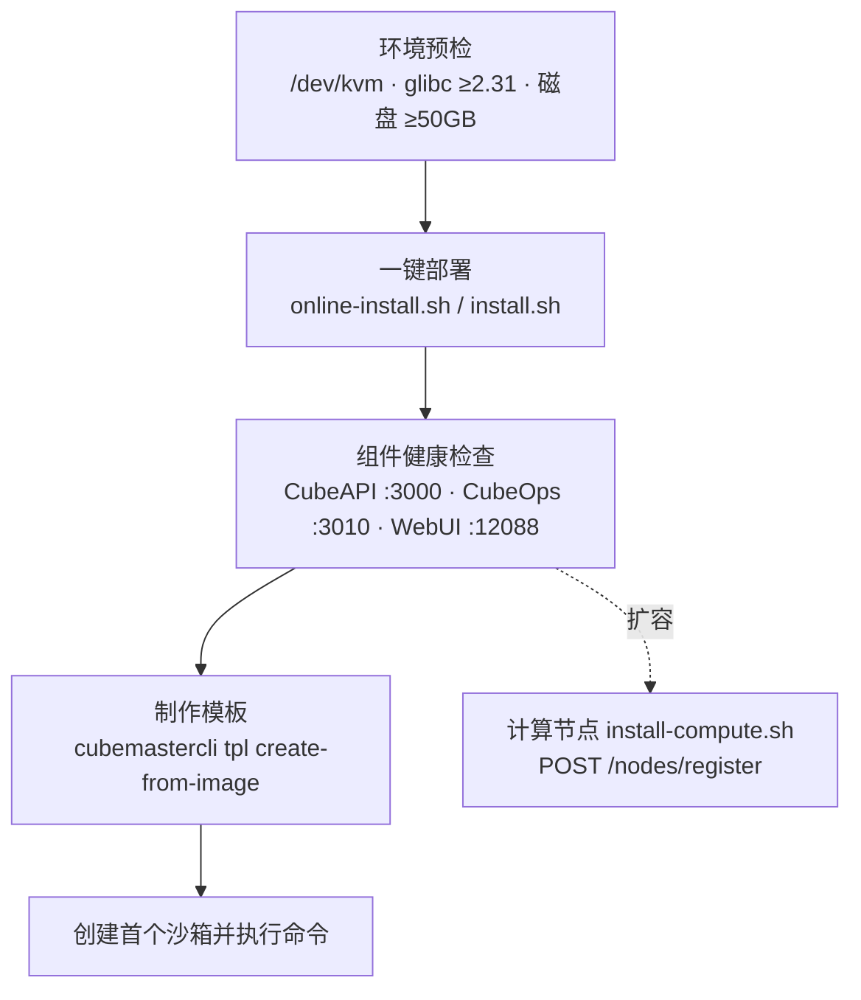

# 单机、多节点与离线部署实战

> 本篇覆盖部署相关事实 **F-014 ~ F-036**，并引用 **F-001 ~ F-013** 的背景事实与 **F-216 ~ F-219** 的节点管理接口。信源距离①（一手）：事实取自 release tag v0.7.2 的官方文档（quickstart、downloads、README_zh）与部署资产；凡事实未覆盖的操作细节，均显式标注"以官方文档为准"。

CubeSandbox 基于 RustVMM 与 KVM 构建，对外兼容 E2B SDK，同时支持单机部署与多机集群（F-001）。本篇按"单机一键 → 多节点扩容 → Kubernetes → 离线环境"的顺序给出可复现的部署与校验路径。

## 一、前置条件

### 1.1 KVM 必需

沙箱为硬件隔离虚拟机，宿主必须提供可用的 KVM。部署前先校验：

```bash
ls -l /dev/kvm
```

- 设备节点存在且当前用户具备读写权限，方可继续。
- 官方 README 对运行环境的表述为"支持 KVM 的 x86_64 Linux"（F-003）。

### 1.2 裸金属优先

官方性能数字（冷启动 <60ms 等）基于**裸金属环境**测试（F-009）。生产建议使用裸金属；嵌套虚拟化的性能不在事实覆盖范围内，需自行实测，不要以官方指标外推。

### 1.3 内核、架构与系统

| 项目 | 要求 | 出处 |
|---|---|---|
| 架构 | x86_64（amd64）、ARM64（arm64），发布资产与 Cubelet 平台清单均覆盖两架构 | F-028、F-032、F-078 |
| glibc | ≥ 2.31（二进制基于 Ubuntu 20.04 / glibc 2.31 构建） | F-015 |
| 推荐系统 | OpenCloudOS 9、TencentOS 4 | F-016 |
| 已测试系统 | Ubuntu 20.04 / 22.04 / 24.04 | F-016 |

### 1.4 资源与磁盘

| 档位 | CPU | 内存 | 磁盘 | 出处 |
|---|---|---|---|---|
| 功能体验 | ≥4 核 | ≥8GB | ≥50GB | F-018 |
| 推荐 | 32 核 | 64GB | ≥200GB | F-018 |

Cubelet 数据根目录 `/data/cubelet` 至少 50GB；承载多个模板时建议 200GB 及以上（F-017）。

## 二、部署流程总览



整体部署共四步且**无需本地构建**（F-014）。

## 三、单机一键部署

### 3.1 在线安装

官方 quickstart 给出的在线安装命令（F-019；省略号对应官方脚本地址，事实原文即如此）：

```bash
curl -fsSL .../deploy/one-click/online-install.sh \
  | CUBE_PVM_ENABLE=1 MIRROR=cn bash
```

- `MIRROR=cn`：使用国内镜像源拉取安装资产。
- `CUBE_PVM_ENABLE=1`：启用 PVM 定制内核形态；不启用则使用普通裸金属 guest 内核资产。PVM host 内核由 `deploy/pvm/pvm_setup.sh` 按三步接入（并行构建 → 确认后安装并接入 GRUB → 放置 guest vmlinux，F-034）。
- 需要跳过下载前检测时，设置 `ONE_CLICK_SKIP_PRECHECK=1` 或传参 `--skip-precheck`（F-020）；跳检前须自行确认 KVM、glibc、磁盘均满足要求。

### 3.2 安装路径与交互配置

控制节点入口为 `install.sh`，安装路径固定 `/usr/local/services/cubetoolbox`（F-025）。事实未登记交互式密码提问；CubeMaster/conf.yaml 中的默认依赖参数可作核对参考（F-064、F-065）：MySQL `127.0.0.1:3306`/库 `cube_mvp`，用户 `cube`、密码 `cube_pass`；Redis `127.0.0.1:6379` db 0，密码 `ceuhvu123`。若安装脚本要求设置密码，以最终生成的配置为准。

### 3.3 部署后验证

| 组件 | 端口 | 验证方式 | 出处 |
|---|---|---|---|
| CubeAPI（E2B 兼容 REST API） | 3000 | `curl -s http://127.0.0.1:3000/health` | F-021、F-039、F-041 |
| WebUI | 12088 | 浏览器访问 `http://<控制节点 IP>:12088` | F-035 |
| CubeOps | 3010 | `curl -s http://127.0.0.1:3010/health` | F-216、F-219 |
| CubeMaster HTTP | 8089 | 控制面内部端口 | F-060 |
| Cubelet gRPC / HTTP | 9999 / 9998 | 节点侧监听 | F-071 |
| MySQL | 3306 | Docker Compose 容器 | F-021、F-064 |
| Redis | 6379 | Docker Compose 容器 | F-021、F-065 |

CubeMaster、Cubelet、CubeShim 以宿主机进程运行，MySQL/Redis 走 Docker Compose（F-021）。入口侧 CubeProxy 提供 mkcert TLS 与 CoreDNS 域名路由，根域名为 `cube.app`（F-022）。

服务以 systemd target 管理：控制节点为 `cube-sandbox-control.target`（F-026）。

## 四、多节点扩容

### 4.1 接入计算节点

新节点先满足第一节前置条件，再执行计算节点入口 `install-compute.sh` 并指向控制节点（F-025）；其服务归入 `cube-sandbox-compute.target`（F-026）。

### 4.2 节点注册与 Cubelet 接入

节点注册由 CubeOps 的 nodemanagement 接口承接（F-218）：`GET /readyz` 为就绪探针，`POST /nodes/register` 用于注册，`POST /nodes/:nodeID/status` 用于注册后周期上报状态。

Cubelet 配置中的 `cubeops_addr`、`cubeops_timeout`（默认 `10m`）字段用于指向 CubeOps（F-072）；节点身份可经环境变量 `CUBE_SANDBOX_NODE_ID`、`CUBE_SANDBOX_NODE_IP`、`CUBE_SANDBOX_ENDPOINT_IP` 标识（F-093）。

### 4.3 隔离与标签

节点接入后，可通过 CubeOps 集群接口维护（F-217）：

- `GET /nodes`：查看节点列表与状态。
- `PATCH /nodes/:nodeID/labels`：维护节点标签，配合调度使用。
- `PUT /nodes/:nodeID/isolation`：设置节点隔离属性。

注册接口的请求体字段未在事实中逐条展开，接入报文细节以官方文档为准。

## 五、Kubernetes 部署

事实确认的内容（F-029）：

- 仓库提供 Helm chart，位于 `deploy/kubernetes/chart`。
- Chart.yaml 中 chart name 为 `cube`，`version` 与 `appVersion` 均为 `0.7.2`。

边界说明：事实未覆盖 `values.yaml` 字段、CRD/operator 形态、工作负载清单与 Pod 内 KVM 暴露方式等细节，本篇不做推断。实际在 Kubernetes 上运行仍需节点提供 `/dev/kvm`；安装命令、参数与前置条件**以官方文档为准**。

## 六、离线环境

### 6.1 离线整包

- 整包命名 `cube-sandbox-one-click-<版本>-<架构>.tar.gz`（架构 `amd64`/`arm64`），发布页 `cnb.cool/CubeSandbox/CubeSandbox/-/releases`（F-032）。
- 内网主机解压后，按控制节点 `install.sh`、计算节点 `install-compute.sh` 的顺序本地安装（F-025），无需公网。

### 6.2 重资产版本核对

离线包配套的内核与 guest 镜像以 tag 发布并 pin（F-028、F-033）：

| 资产 | tag |
|---|---|
| kernel_bm_amd64 / kernel_bm_arm64 / kernel_pvm | `kernel-release-260921-1` |
| guest_image | `guest-image-260820-1` |

downloads 文档另给出内核 tag 示例 `kernel-release-260812-1`（含 `vmlinux-amd64`、`vmlinux-pvm-amd64`）。离线环境应核对包内资产 tag 与 release-assets 清单一致后再部署。

### 6.3 离线校验与组件级打包

- `smoke.sh` 加载 `.env` 后执行 `${INSTALL_PREFIX}/scripts/one-click/quickcheck.sh`（F-027），全程本地执行，可用于离线验收。
- 组件层面，CubeS3lvol 的 `make_release.sh` 支持 `--version`、`--outdir`、`--no-tar`、`--skip-build`、`--skip-smoke`（F-209）；标准离线部署仍以一键整包为准。

## 七、部署后冒烟

### 7.1 制作模板并创建沙箱

沙箱从模板启动。首次部署先制作模板（F-023）：

```bash
cubemastercli tpl create-from-image --image <基础镜像> \
  --writable-layer-size 1G \
  --expose-port 49999 --expose-port 49983 \
  --probe 49999
```

随后配置客户端环境变量（F-024）：

```bash
export E2B_API_URL="http://127.0.0.1:3000"
export E2B_API_KEY="e2b_000000"
export SSL_CERT_FILE="/root/.local/share/mkcert/rootCA.pem"
```

### 7.2 创建沙箱并执行命令

通过 Python SDK（包名 `cubesandbox`，导出 `Sandbox`，F-232；地址用法见 F-056）：

```python
import os
os.environ["E2B_API_URL"] = "http://127.0.0.1:3000"
os.environ["E2B_API_KEY"] = "e2b_000000"

from cubesandbox import Sandbox

sb = Sandbox()                      # 基于默认模板创建沙箱
print(sb.commands.run("hostname"))  # 在沙箱内执行命令
sb.kill()
```

SDK 方法签名细节以官方文档为准；REST 方式可直接向 CubeAPI 的 `POST /sandboxes` 发起请求（F-041、F-058），请求体字段以 openapi.yml 为准。

### 7.3 版本与健康查询

- `GET /health`：CubeAPI、CubeOps 均提供健康检查（F-041、F-219）；CubeOps 另可经 `GET /cluster/overview`、`GET /cluster/versions` 查询集群概览与版本（F-217）。

## 八、常见问题

| 现象 | 排查要点 | 依据 |
|---|---|---|
| `/dev/kvm` 不存在或无权限 | 确认物理机/云实例已开启虚拟化；检查当前用户对 `/dev/kvm` 的读写权限；嵌套虚拟化需自行验证可用性与性能 | F-003、F-009 |
| 端口冲突 | 逐一核对 3000 / 12088 / 3010 / 8089 / 9999 / 9998 / 3306 / 6379 是否被占用，再启动部署 | 见第三节验证表 |
| 服务起不来或反复重启 | 确认 Docker Compose 已拉起 MySQL、Redis；核对 CubeMaster 中数据库/Redis 地址与凭据 | F-021、F-064、F-065 |
| 二进制无法执行 | 核对 glibc ≥ 2.31，且包架构（amd64/arm64）与主机一致 | F-015、F-032 |
| 磁盘写满 | `/data/cubelet` 起步 ≥50GB、多模板建议 ≥200GB | F-017 |
| 计算节点不在线 | 检查 `/readyz`、`/nodes/register` 链路与 Cubelet 的 `cubeops_addr` | F-072、F-218 |

## 九、延伸导航

- [部署形态与环境要求（概念）](../concepts/03-deployment.md)
- [架构总览（概念）](../concepts/02-architecture.md)
- [SDK 工作流示例](01-sdk-workflow.md)
- [CubeSandbox 信源地图](../references/01-source-map.md)
