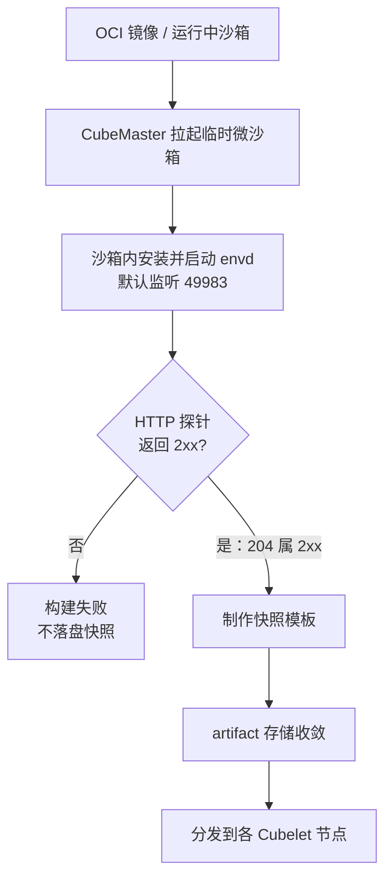

# 快照模板制作实战

> 本示例基于 CubeSandbox v0.7.2 的中文指南与源码常量，覆盖事实 F-023、F-049、F-239、F-240，并引用 CubeMaster/CLI 事实 F-060 ~ F-068 与 Go SDK 模板接口 F-229。逐条锚点见 [../references/02-anchor-index.md](../references/02-anchor-index.md)。文中只列事实中出现过的命令与参数；事实未登记之处一律标注“以 `cubemastercli tpl --help` 为准”。

## 一、模板机制一句话

**模板 = 探针通过后落盘的快照**：构建时 CubeMaster 先拉起一个临时微沙箱并在其中安装 envd，envd 默认监听 **49983** 端口，其 `/health` 接口返回 **204**；只有当配置的 HTTP 探针返回 **2xx** 后，系统才对该微沙箱制作快照，产物随后分发到各节点（F-239）。探针不通过则快照不会产生——这是模板生产的硬纪律。

## 二、制作流程总览



流程要点（F-239、F-240）：

1. 输入只有两类：**OCI 镜像**或**运行中的沙箱**。
2. 快照时机由探针响应决定，不以固定等待时间决定。
3. 产物先入 artifact 存储，再分发到节点；节点侧重做见第五节 `tpl redo`。

## 三、方式一：从 OCI 镜像制作

### 3.1 文档原例（F-023）

快速开始页给出的制作命令为：

```bash
cubemastercli tpl create-from-image \
  --image <OCI 镜像名> \
  --writable-layer-size 1G \
  --expose-port 49999 \
  --expose-port 49983 \
  --probe 49999
```

其中 `cubemastercli` 与 `cubemaster` 同属 CubeMaster 的构建产物（Makefile `APPS=cubemaster cubemastercli`，F-067），模板任务运行时经 CubeMaster 编排：CubeMaster 默认 HTTP 端口 8089（F-060、F-068）。

### 3.2 必填参数纪律（F-239）

模板页明确制作时**必填**三类参数：

| 参数 | 含义 | 事实口径 |
|---|---|---|
| `--expose-port` | 声明需要在微沙箱内放行的端口；可重复传入 | F-239；原例传 49999 与 49983（F-023） |
| `--probe` | 指定探针端口，快照前对其发起 HTTP 探测 | F-239；原例为 `--probe 49999` |
| `--probe-path` | 指定探针请求的 HTTP 路径 | F-239 |

> 注意：F-023 的文档原例只出现了 `--expose-port` 与 `--probe`，但模板页将 `--probe-path` 与前两者并列为必填（F-239）。实际执行时三者都应显式给出；参数的完整拼写与默认值以 `cubemastercli tpl create-from-image --help` 为准。

### 3.3 以 envd 健康口为探针

envd 默认监听 49983，`/health` 返回 204（F-239），而 204 属于 2xx，因此以 envd 健康检查作为快照门禁在事实层面成立：

```bash
cubemastercli tpl create-from-image \
  --image <OCI 镜像名> \
  --writable-layer-size 1G \
  --expose-port 49983 \
  --probe 49983 \
  --probe-path /health
```

需要同时放行业务端口时，按原例追加 `--expose-port`（如 49999）。49999/49983 自 v0.2.2 起成为默认沙箱暴露端口，取代了更早的 8080/32000（F-242）。

### 3.4 envd 版本回退语义（F-049）

CubeAPI 常量规定：

- `ENVD_VERSION_FALLBACK = "0.2.0"`：镜像或模板未声明 envd 版本时，按 0.2.0 协商；
- `ENVD_VERSION_ANNOTATION = "cube.master.components.envd.version"`：envd 版本通过该注解键声明。

制作模板时，若镜像内置 envd 与默认回退版本不一致，应通过该注解显式标注版本，避免 SDK 数据通道按 0.2.0 能力协商而出现接口不匹配（F-049，数据通道背景见 F-230）。

## 四、方式二：从运行中的沙箱制作

模板页登记的第二种制作方式是**从运行中的沙箱**制作快照模板（F-239）。事实层面可确认的前提：

1. 目标沙箱处于运行状态，且所声明的暴露端口上已有可响应的 HTTP 服务；
2. 探针同样必须返回 2xx 后才会制作快照——探针纪律与方式一完全一致；
3. 快照捕获的是制作时刻沙箱内的文件系统与运行环境状态，制作前应把需要固化的依赖与数据全部落盘。

> 事实登记表（F-023、F-239）未记录“从运行中沙箱制作”对应子命令的完整拼写与参数名，本文不做推测。请在部署环境以 `cubemastercli tpl --help` 及对应子命令的 `--help` 输出为准；可以确定的是，其仍遵循 `--expose-port`、`--probe`、`--probe-path` 所属的同一套探针机制（F-239）。

## 五、模板运维：merge、redo 与别名状态

### 5.1 存储收敛：tpl merge

`cubemastercli tpl merge` 用于处理**历史 artifact 的存储收敛**（F-239）：升级或长期运行后，模板产物可能散落在多代存储布局中，merge 将其收敛到统一口径，避免同一模板的 artifact 重复占用。

### 5.2 节点重做：tpl redo

`cubemastercli tpl redo` 用于**节点侧的重新分发/重建**（F-239）：模板内容更新，或某节点上的模板产物缺失、损坏时，redo 触发该模板在节点上的重新分发与重建，无需逐个重建沙箱。

> merge 与 redo 的具体参数（模板 ID、节点范围等）事实表未登记，以 `cubemastercli tpl merge --help`、`cubemastercli tpl redo --help` 为准。

### 5.3 别名与状态查询

REST 侧，CubeAPI 提供模板查询、补丁、别名绑定与构建状态路由，如 `GET /templates/aliases/:alias`、`PUT /templates/:templateID/alias`、`GET /templates/:templateID/builds/:buildID/status` 及其 `logs`（F-045）。

Go SDK 侧，`template.go` 提供成套方法（F-229）：

| Go SDK 方法 | 对应能力 |
|---|---|
| `ListTemplates` / `GetTemplate` | 模板列举与详情 |
| `BuildTemplate` / `RebuildTemplate` | 构建 / 重新构建 |
| `GetTemplateBuildStatus` | 查询构建状态 |
| `SetTemplateAlias` | 设置别名 |
| `DeleteTemplate` | 删除模板 |

在脚本或程序中跟踪模板时，应优先使用上述接口轮询构建状态，而不是靠猜测时间窗判断构建是否完成。

## 六、日志与排障

### 6.1 模板构建日志路径（F-240）

模板构建的标准输出与标准错误落盘在：

```text
/data/log/template/<templateID>_0/stdout
/data/log/template/<templateID>_0/stderr
```

排查时直接读取这两个文件；**日志体系没有 `--follow` 标志**（F-240），需要持续观察时在宿主机侧自行轮询文件，不要给模板命令追加 `--follow`。另需注意，沙箱日志转发要求 CubeShim v0.4.0 及以上（F-240）。

### 6.2 探针失败的常见原因

探针不返回 2xx 时快照不会产生（F-239），排查清单：

1. **端口未暴露或未放行**：服务监听端口与 `--expose-port`、`--probe` 不一致；envd 口应为 49983。
2. **探针路径错误**：`--probe-path` 与服务实际健康路径不符；envd 标准健康路径为 `/health`，返回 204。
3. **服务启动慢于探测**：探针发起时服务尚未就绪——应在镜像内让服务随系统启动，而非靠固定 sleep 碰运气。
4. **服务仅绑定回环地址**：服务需绑定到对外可达地址，仅监听回环口时探针无法到达。
5. **envd 版本不匹配**：镜像内 envd 与注解或回退版本（默认 0.2.0）不一致导致行为差异，用注解键 `cube.master.components.envd.version` 显式声明（F-049）。
6. **可写层容量不足**：安装依赖超出 `--writable-layer-size`（原例为 1G），构建在探针通过前即中断（F-023）。

## 七、导航

- 概念
  - [三端 SDK 与模板生态](../concepts/13-sdk-ecosystem.md)：三端 SDK、envd 数据通道与模板机制的完整概念面
  - [CubeMaster 编排调度](../concepts/05-cubemaster.md)：模板构建背后的编排、端口与超时配置
  - [CubeHypervisor 与 guest-init](../concepts/07-hypervisor.md)：快照所依赖的虚拟化基座
- 示例
  - [SDK 工作流示例](01-sdk-workflow.md)：从 SDK 侧创建沙箱、连接并与模板协作
- 参考
  - [锚点索引](../references/02-anchor-index.md)：全部事实编号到源码锚点的回查入口
