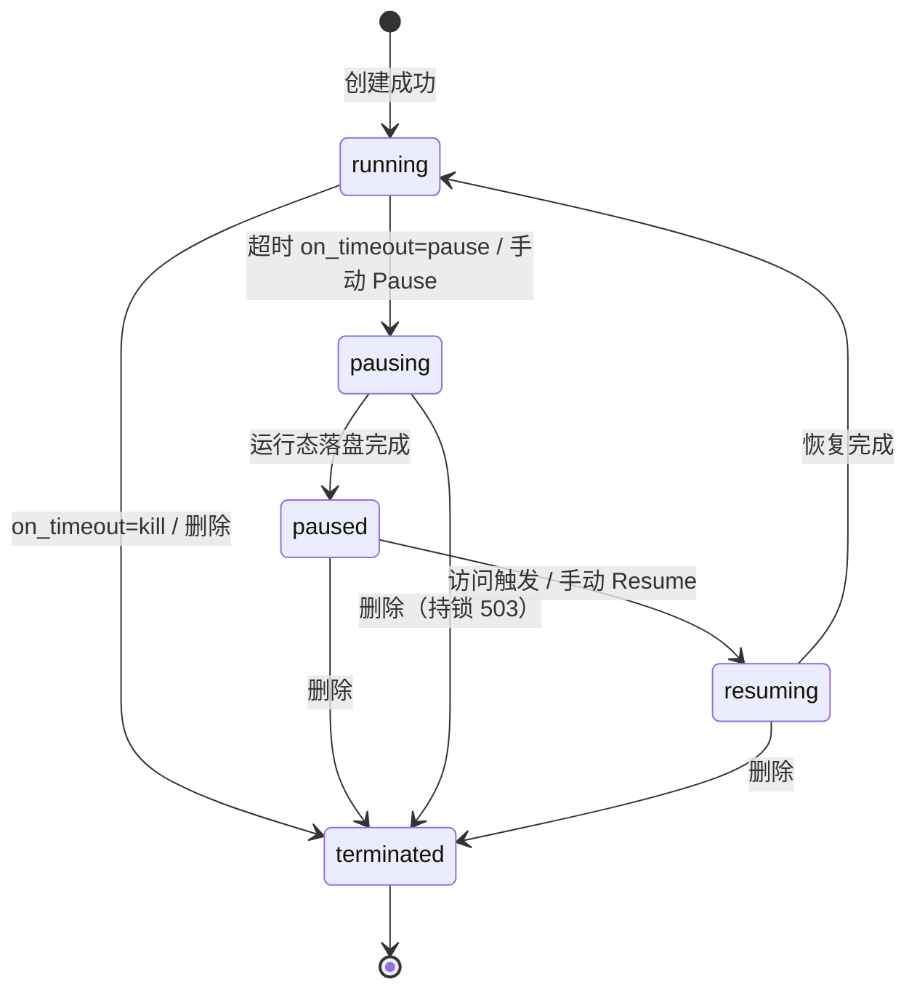
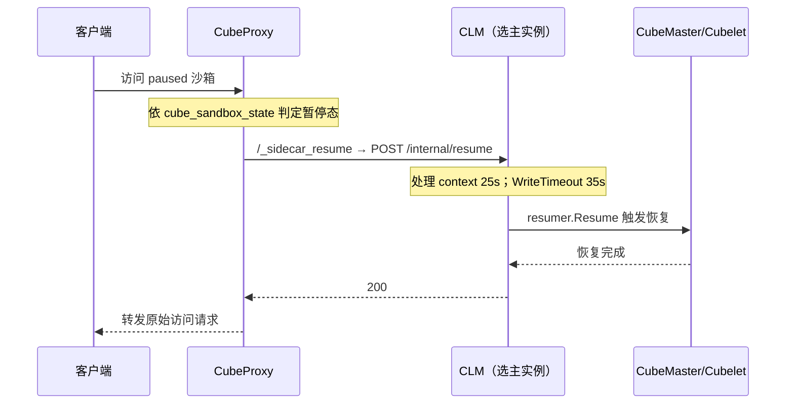

# 超时策略与自动暂停恢复

> 本示例基于 CubeSandbox v0.7.2 的登记事实，覆盖五状态模型（F-234）、超时与 on_timeout 语义（F-235）、集群默认策略（F-237）、CLM 选主与事件总线（F-220 ~ F-223）、CubeProxy 访问触发唤醒（F-194）、异常链路（F-236、F-238）与跨机恢复 Preview 边界（F-006）。所有配置项与语义均可在 [01-source-map.md](../references/01-source-map.md) 指向的源码中回验。

## 一、场景：为什么暂停而非销毁

长空闲、低频访问的沙箱（等待 Webhook 的调试环境、挂起中的交互式会话）如果一直 running，会持续占用 vCPU 核算与内存配额；如果直接 kill，则内存中的进程状态、未保存的上下文全部丢失，再次访问要重新走冷启动与环境初始化。

CubeSandbox 的折中是**暂停（pause）而非销毁（kill）**：把 VM 暂停并将运行态落盘，节点可以回收部分暂停沙箱占用的资源；访问到来时再从落盘状态快速恢复，进程按暂停点继续，业务无感知。超时到期后走哪条路由 `on_timeout` 决定——`kill`（默认）销毁沙箱进入 terminated，`pause` 则进入暂停链路（F-235）。

暂停相对销毁的两个关键收益：

- **资源可回收**：沙箱进入 paused 后，节点可结合暂停资源释放比例回收占用（配置见第四节）；terminated 之后若要再用，则必须重新创建。
- **状态可续跑**：VM 运行态在暂停时落盘，恢复后进程与内存数据按暂停点继续，省去重新初始化；这也是“访问触发自动唤醒”能对用户透明的前提。

## 二、五状态模型

生命周期文档登记的沙箱状态共五种（F-234）：



注意可见性差异：CubeAPI 的 `SandboxState` 枚举仅含 Running/Paused/Pausing 三个变体（F-050），外部 GET 看到的状态收敛在这三态；完整的 running/pausing/paused/resuming/terminated 五态以生命周期文档为准（F-234）。查询返回的 Sandbox/SandboxDetail 等模型结构见 F-051。

## 三、超时语义表

CubeSandbox 的 timeout 单位为**秒**，而 E2B 原生 `timeoutMs` 为**毫秒**，从 E2B 迁移时必须换算（F-235）。

| 取值 / 配置 | 语义 | 事实 |
|---|---|---|
| `-1`（NEVER_TIMEOUT） | 永不超时 | F-235 |
| `0` | 立刻超时 | F-235 |
| 正整数 `N` | 空闲 N 秒后触发 on_timeout | F-235 |
| `on_timeout: "kill"` | 默认动作，销毁沙箱 | F-235 |
| `on_timeout: "pause"` | 转入暂停链路 | F-235 |
| SDK 默认值 | SDK **不携带默认 timeout**，需显式声明 | F-235 |

Python SDK 在包顶层导出了 `NEVER_TIMEOUT` 常量（F-232），可用符号代替裸 `-1`：

```python
from cubesandbox import Sandbox, NEVER_TIMEOUT  # F-232

# SDK 不提供默认 timeout（F-235），数值单位均为秒：
#   NEVER_TIMEOUT  永不超时
#   0              立刻超时
#   300            空闲 300 秒后执行 on_timeout
```

运行中的沙箱可通过 `POST /sandboxes/{sandboxID}/timeout` 修改超时（路由见 F-043）；Go SDK 的 Sandbox 提供 `SetTimeout` 方法（F-227）。

几种常见配置组合（取值均来自 F-235）：

- 临时调试沙箱：`N=300` + `on_timeout=kill`，空闲 5 分钟自动销毁，即默认行为。
- 低频常驻环境：`N=600` + `on_timeout=pause`，空闲 10 分钟暂停，访问时自动唤醒。
- 明确保活：timeout 设为 `NEVER_TIMEOUT`，完全靠手动 Pause/Kill 管理生命周期。
- `0` 会立刻触发超时，仅适合验证超时链路，不要用于正常业务。

## 四、集群默认策略

单个沙箱未显式设置超时时，集群默认值来自 CubeMaster 配置 `cubelet_conf.default_timeout_insec`（F-237）：

- 仓库内该键默认值为 **-1**，即默认永不自动超时；同文件还登记了 `common_timeout_insec: 30`、`create_timeout_insec: 600` 等其它阶段超时，注意不要混淆（F-062）。
- 修改默认值后需要**重启 `cube-sandbox-cubemaster.service`** 才能生效（F-237）。

节点侧另有暂停资源释放比例配置 `host.quota.paused_resource_release_ratio`，位于 Cubelet 的 `config.toml`，值域 `[0,1]`，默认 `0`（F-237）。默认配置下不按比例释放暂停沙箱的资源；需要让 paused 沙箱让出更多资源时再调整该比例。

## 五、CLM 部署与选主

自动暂停/恢复由独立组件 cube-lifecycle-manager（CLM）承担。其 Go module 为 `github.com/tencentcloud/CubeSandbox/cube-lifecycle-manager`，go 1.25.7，关键依赖含 redis/go-redis v9.20.0、zap、backoff/v7 与测试用 miniredis（F-220）。

CLM 启动时装配 redisclient、redisstream、cubemasterclient、registry、leader.Lease、resumer.Resumer、sweeper 与 httpapi.Server，并并发运行 consumeStream、pollLastActive、sweep、lease、resume API、reconcileOnLeadership、discovery 等后台循环（F-221）。

协调信息全部走 Redis 共享键，键前缀统一为 `cube:v1:shared:`，包括 MetaKey、EventStreamKey、EventChannel、LeaderLeaseKey；事件流上限 100000 条，操作码为 OpCreate/OpDelete/OpUpdate/OpState，状态字符串为 StatePaused/StateRunning/StateKilled（F-223）。选主模型为租约（Lease）：只有持有 LeaderLeaseKey 的实例执行 reconcileOnLeadership 与恢复投递，因此同一 paused 沙箱的恢复始终在单实例内执行，避免多副本重复唤醒（F-221、F-223）。事件总线还提供 `Publish(sandboxID)` 与 `Wait(sandboxID)` 方法，恢复发起方可等待指定沙箱的恢复完成事件后再继续转发（F-223）。

## 六、自动唤醒链路

访问一个 paused 沙箱时，CubeProxy 不直接把请求打给停机的 VM，而是先触发恢复（F-194）：



两个实现细节：

- CubeProxy 通过 internal location `/_sidecar_resume` 转发到 `http://$cube_sidecar_addr/internal/resume`，并以 `cube_sandbox_meta`、`cube_sandbox_state`、`cube_sandbox_last_active` 等共享字典缓存元数据、状态与最近活跃时间（F-194）。
- CLM 的 HTTP 服务注册 `POST /internal/resume`、`GET /healthz`、`GET /readyz`，WriteTimeout 35s；处理函数内部用 25s context 调用 resumer.Resume，为恢复留出时间预算（F-222）。

此外，`process.Process/Start|Connect`、`filesystem.Filesystem/WatchDir` 等长连接路径在 CubeProxy 中有专门的 location 正则匹配（F-194）。

经 CubeAPI 发起的 pause/resume 请求另有路由级时间预算：`PAUSE_RESUME_ROUTE_TIMEOUT` 为 120s，长于普通路由 30s 的 `DEFAULT_ROUTE_TIMEOUT`（F-040），与 CLM 侧 25s/35s 的预算配套，避免恢复未完成就被网关提前断开。

## 七、异常处理

**删除持锁沙箱**：暂停/恢复过程中沙箱处于持锁状态，此时删除返回 `503 Service Unavailable` 并携带 `Retry-After: 2`，客户端应等待 2 秒后重试（F-236）。CubeAPI 的错误模型中也专门定义了带 retry_after 字段的 ServiceUnavailable 变体（F-052）。

**恢复被拒链路**：资源容量不足导致恢复被拒时，错误沿链路逐级上抛——Cubelet 返回 `130409 Conflict`，CubeAPI 映射为 HTTP `409`，最终在 WebUI 呈现为容量诊断信息（F-238）。排查顺序为：先看 WebUI 容量诊断，定位是哪类资源（内存/CPU/配额）耗尽，再沿 409 → 130409 对照节点侧日志。

## 八、跨机恢复边界

需要明确：本文验证的暂停/恢复是**同机**链路。官方简介将“跨机暂停与恢复”标注为 **Preview**，且需配合 S3 快照后端（F-006）。Cubelet 默认配置中 `[cow.s3] enable = false`（F-075），因此跨机恢复不是开箱即用能力——需要先启用 S3/CoW 快照后端，并接受 Preview 的功能稳定性预期。

## 九、验证步骤

1. **手动暂停**：对运行中的沙箱调用 `POST /sandboxes/{id}/pause`（F-044），轮询 `GET /sandboxes/{id}`（F-042），观察 running → pausing → paused；Go SDK 直接调 Sandbox 的 `Pause` 方法（F-227）。
2. **手动恢复**：调用 `POST /sandboxes/{id}/resume`（F-044），观察状态回到 Running，再访问沙箱内服务确认进程从暂停点继续；SDK 对应 `Resume` 方法（F-227）。
3. **验证超时策略**：将 timeout 设为短空闲值（如 60 秒）且 `on_timeout=pause`，空闲等待超过 60 秒后确认沙箱自动进入 paused，且未被销毁。
4. **验证自动唤醒**：保持沙箱 paused，经网关域名直接访问，确认 CubeProxy 触发 `/_sidecar_resume`、恢复完成后请求被正常转发（F-194、F-222）。
5. **验证删除重试**：在暂停/恢复进行中删除沙箱，确认得到 503 与 `Retry-After: 2`，按提示重试成功（F-236）。
6. **验证容量拒绝**：在资源紧张的节点上恢复 paused 沙箱，观察 130409 → 409 链路与 WebUI 容量诊断是否符合预期（F-238）。

## 十、导航

- 生命周期与 CLM 全景：[12-ops-lifecycle.md](../concepts/12-ops-lifecycle.md)
- CubeProxy/CubeEgress 网关：[10-gateways.md](../concepts/10-gateways.md)
- 网络模型与端口映射：[09-network.md](../concepts/09-network.md)
- SDK 基础工作流：[01-sdk-workflow.md](01-sdk-workflow.md)
- 术语表：[03-glossary.md](../references/03-glossary.md)
