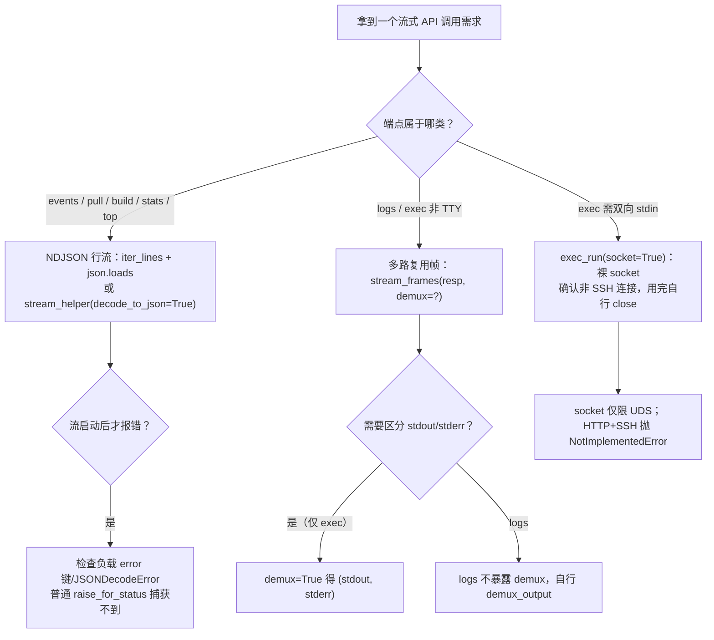

# 08 - 事件系统与三套流协议

Podman REST API 的长响应并不只有一种格式。podman-py 内部并存**三套互不兼容的线协议（wire protocol）**，而各方法上的 `stream=True` 只是同一个多义词——消费响应之前必须先判定自己面对的是哪一套。

## 8.1 三套线协议总览

| 协议 | 负载形态 | SDK 消费器 | 典型端点 |
|------|---------|-----------|---------|
| ① NDJSON 行流 | 每行一个 JSON 对象（`iter_lines`） | `stream_helper(decode_to_json=True)`、`json_stream()`、手工 `json.loads(line)` | `/events`、`/images/pull`、`/build`、stats/top 流式 |
| ② Docker 多路复用帧 | 8 字节帧头：1B 类型 + 3B padding + 4B 大端长度，后接负载 | `frames()`（缓冲）、`stream_frames()`（实时）、`demux_output()`（分 stdout/stderr） | `/containers/{id}/logs`、`/exec/{id}/start`（非 TTY） |
| ③ HTTP Upgrade 裸连接 | `101 Switching Protocols` 后 UDS 变为双向字节通道 | 调用方自管 socket | `exec_run(..., socket=True)` |

## 8.2 协议①：NDJSON 行流与容错分割

### 8.2.1 事件流 EventsManager

[events.py](https://github.com/containers/podman-py/blob/v5.8.0/podman/domain/events.py) 的 `EventsManager` 是唯一"单方法管理器"（47 行，只有 list），且门面对待它也与其他管理器不同：`PodmanClient.events()` **每次调用现场 new 一个 EventsManager**，而不是 cached_property 单例。

```python
for event in client.events(since=datetime(2026, 9, 1), decode=True,
                           filters={"type": "container", "status": "start"}):
    print(event["Action"], event["Actor"]["Attributes"].get("name"))
```

`list(since=None, until=None, filters=None, decode=False)` → `GET /events?stream=true`：时间参数经 `prepare_timestamp`（接受 datetime 或 epoch int，naive datetime 按 UTC 处理），filters 经 `prepare_filters` 序列化；逐行 `response.iter_lines()`，`decode=True` 时每行 `json.loads` 出 dict，否则给出原始字符串行。

### 8.2.2 json_stream：容忍"不一致缓冲"

pull 进度流在不同守护进程版本下，JSON 对象可能换行分隔、也可能粘连。[json_stream.py](https://github.com/containers/podman-py/blob/v5.8.0/podman/domain/json_stream.py) 的解法不是按行切，而是：

1. `stream_as_text` 把 bytes 块以 utf-8（`errors='replace'`）转文本并拼进缓冲；
2. `json_splitter` 用模块级单例 `json.JSONDecoder().raw_decode()` 从缓冲头部解析**一个完整对象**，WHITESPACE 正则跳过对象间空白，返回 `(对象, 剩余串)`；解析不动（ValueError）就返回 None 等更多数据；
3. 流结束后若还有残块，最后一次 decode 失败会被包装为 `StreamParseError`（RuntimeError 子类）。

这正是 `images.pull(stream=True, decode=True)` 在 chunked 传输下的解析路径。

### 8.2.3 chunked 判定与错误内联（pull 流）

`ImagesManager._stream_helper` 先检查 `response.raw._fp.chunked`：

- chunked：循环 `read(1)` 阻塞拿首字节 + 按 `chunk_left` 读完整块，逐块 json.loads；遇到 **JSONDecodeError / UnicodeDecodeError / 负载含 `error` 键**三种情况，调 `_stream_error_helper` 构造一个 status_code=500 的合成响应走错误流程——流式启动后的错误无法用普通 raise_for_status 捕获，只能这样内联处理。
- 非 chunked（通常意味着请求立即失败）：退化为一次性 `_result(response, json=decode)`。

## 8.3 协议②：Docker 多路复用帧

容器未分配 TTY 时，stdout/stderr 混合在同一条流里，靠 8 字节帧头区分。帧结构（见 [output_utils.py](https://github.com/containers/podman-py/blob/v5.8.0/podman/api/output_utils.py) 文档引用的 libpod attach 协议）：

```
字节:  [0]      [1..3]  [4..7]            [8..8+N)
含义:  stream类型  padding  负载长度(大端uint32)   负载
类型:  0=stdin(极少) 1=stdout 2=stderr
```

三个消费器（[parse_utils.py](https://github.com/containers/podman-py/blob/v5.8.0/podman/api/parse_utils.py)）：

| 消费器 | 数据来源 | 返回 | 适用 |
|--------|---------|------|------|
| `frames(response)` | 已全部读入的 `response.content`，`struct.unpack_from(">BxxxL")` 循环取帧 | 逐帧 yield bytes（**不区分** stdout/stderr） | 非流式一次性日志 |
| `stream_frames(response, demux=False)` | `response.raw.read(8)` + `read(length)` 实时读 | demux=False 出 bytes；**demux=True 时对 `帧头+负载` 调 `demux_output`，yield `(stdout, stderr)` 元组** | 实时日志/exec |
| `stream_helper(response, decode_to_json=False)` | `iter_lines()` | 行（或 JSON  dict） | NDJSON，不用于帧流 |

`demux_output` 自身在剩余字节不足一帧时 `break`（等待更多数据），未知类型字节静默跳过，最终 `(stdout or None, stderr or None)`。

### 8.3.1 logs：帧协议、但不暴露 demux

`Container.logs(stdout=True, stderr=True, stream=False, timestamps=False, tail=..., since=..., follow=..., until=...)`：

- `follow` 未显式给定时取 `stream` 的值；
- `stream=True` → `api.stream_frames(response)`（**注意：logs 路径没有 demux 参数**，要分流 stdout/stderr 需自行 demux）；
- `stream=False` → `api.frames(response)` 缓冲解析。

### 8.3.2 exec_run：三种返回模式 + 帧 demux

`exec_run(cmd, *, stdout=True, stderr=True, stdin=False, tty=False, privileged=False, user=None, detach=False, stream=False, socket=False, environment=None, workdir=None, demux=False)` 两段式 HTTP：

1. POST `/containers/{self.name}/exec` 创建 exec 实例（environment 的 dict 形式被转成 `["K=V"]`；字符串 cmd 走 `shlex.split`），取回 `Id`；
2. POST `/exec/{id}/start` 启动。

返回模式：

| 条件 | 返回 |
|------|------|
| `stream=True`（且非 detach） | `(None, 生成器)`，生成器来自 `stream_frames(resp, demux=demux)` |
| 非 stream + `demux=True` | `(ExitCode, (stdout_bytes, stderr_bytes))`——先 GET `/exec/{id}/json` 取 ExitCode，再对 content 做 demux_output |
| 非 stream 默认 | `(ExitCode, content_bytes)` |
| `detach=True` | start 体里 Detach=true，stream 被强制视为 False |

## 8.4 协议③：HTTP Upgrade 裸连接劫持

`exec_run(..., socket=True)` 用于需要双向交互（发 stdin、持续读输出）的场景：

```
POST /exec/{id}/start
Headers: Connection: Upgrade, Upgrade: tcp
Body: {"Detach": false, "Tty": tty}
```

101 响应之后，底层 UNIX domain socket 退出 HTTP 语义，成为挂接在 exec 会话 stdin/stdout/stderr 上的裸双向通道（tty=True 时为裸流，否则仍是多路复用帧）。SDK 的处理（containers.py L216-245）：

- **scheme 为 `http+ssh` 时直接 `NotImplementedError("exec_run(socket=True) is not supported over SSH")`**——SSH 隧道无法透传协议升级；
- 从 `start_resp.raw.connection.sock` 取出 socket，取不到抛 APIError；
- 关键锚定：`sock._hijacked_response = start_resp`——把响应对象挂在 socket 上，防止 urllib3 在响应被 GC 时把这条劫持连接**误回收到连接池**（否则后续 HTTP 请求会把字节写进 exec 会话）；
- 返回 `(None, sock)`，**读、写、关闭全部由调用方负责**。

## 8.5 流式默认值差异表（同名参数，语义不同）

| 方法 | stream 默认 | 非流式返回 | 流式返回 | 备注 |
|------|------------|-----------|---------|------|
| `client.events()` | 固定 True（端点 `stream=true`） | — | 行迭代器（decode 控制 str/dict） | 管理器每次现建 |
| `Container.logs` | False | `frames()` 帧序列 | `stream_frames()`，**无 demux 开关** | follow 默认跟随 stream |
| `Container.exec_run` | False | `(ExitCode, bytes或元组)` | `(None, 帧生成器)`，支持 demux | socket 模式互斥；禁 SSH |
| `Container.stats` | **True** | bytes/dict | `stream_helper` JSON 行 | GET `/containers/stats?containers={id}` |
| `Container.top` | False | dict | JSON 行（固定 decode json=True） | |
| `PodsManager.stats` | **False** | **原始 content 字节**（decode=False） | `stream_helper` | all/name 互斥 |
| `images.pull` | False | Image（反向扫最后含 id 的行） | 进度块生成器；progress_bar 时返回 None | chunked 判定 |
| `images.build` | 固定 True（内部） | `(Image, report_stream)` | report_stream 为行迭代器 | tee 分叉 |

另外两个相邻事实：

- `Container.attach()` 与 `Container.attach_socket()` 在当前版本**无条件 `raise NotImplementedError`**——交互式 attach 请走 exec_run(socket=True)。
- `Container.wait(condition=..., interval=..., timeout=...)` 是阻塞型短连接而非流：POST `/containers/{id}/wait`，condition 字符串会被包成列表，返回 JSON 整数退出码；condition 合法值为 configured/created/running/stopped/paused/exited/removing/stopping。

## 8.6 消费决策流程



## 相关概念

- [03 - 容器生命周期与状态机](03-containers.md)：exec_run/logs/wait 在生命周期中的位置
- [04 - 镜像管理与 Rich 进度条构建](04-images.md)：pull/build 进度流的上层封装（Rich 消费的正是 NDJSON 行）
- [10 - 传输与配置深化](10-transport-deep-dive.md)：UDS 连接池与 SSH 隧道为何决定 socket 劫持边界
- [信源登记：vendor 全量源码地图](/references/source-code-map.md)：帧格式常量与各消费器行号
