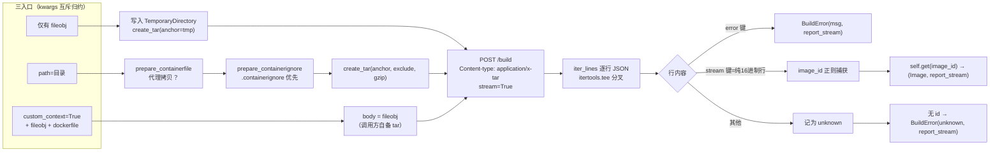

# 09 - 镜像构建上下文管线（三入口归约与 x-tar 打包）

[04 镜像管理](04-images.md) 从调用者视角讲了 `images.build()` 的参数与 BuildError 现象；本文进入 [images_build.py](https://github.com/containers/podman-py/blob/v5.8.0/podman/domain/images_build.py) 与 [tar_utils.py](https://github.com/containers/podman-py/blob/v5.8.0/podman/api/tar_utils.py)，回答"一个本地目录如何变成守护进程可消费的构建请求"。核心结论：**上下文的标准化全部在客户端完成，服务端只接收一个去身份化的 tar 字节流。**

## 9.1 管线全景

## 9.2 三个入口的归约规则

`build(**kwargs)` 按以下优先级判定上下文来源（images_build.py L87-120）：

| 入口条件 | 处理 | 失败 |
|---------|------|------|
| `custom_context=True` | **必须同时给 `fileobj`（tar 二进制流）与 `dockerfile`（包内文件名）**；body 直接用 fileobj，客户端不打包 | 缺任一抛 `PodmanError`（两条不同文案：fileobj 必须是含构建目录 tar 的二进制类文件对象；dockerfile 文件名不可省略，TODO 注释说明未来可能扫描 tar 包） |
| 仅给 `fileobj`（Dockerfile 内容流） | 建 `tempfile.TemporaryDirectory()`，把流复制为临时目录里的 dockerfile，再 `create_tar(anchor=临时目录)` | — |
| 给 `path`（目录） | `prepare_containerfile(path, dockerfile)` 决定是否代理拷贝；`prepare_containerignore(path)` 取排除模式；`create_tar(anchor=path, exclude=..., gzip=...)` | — |

三个入口最终都向 `POST /build` 发送 `Content-type: application/x-tar`、`stream=True`；请求返回后客户端负责 `body.close()` 与临时目录 `cleanup()`（在解析响应之前执行）。

> `path` 与 `fileobj` 都不给时，`_render_params` 直接抛 `TypeError("Either path or fileobj must be provided.")`；同时给 `gzip` 与 `encoding` 抛 `PodmanError("Custom encoding not supported when gzip enabled.")`。

## 9.3 客户端标准化的四个细节

### 9.3.1 ignore：.containerignore 优先于 .dockerignore

`prepare_containerignore(anchor)` 按固定顺序 `(".containerignore", ".dockerignore")` 查找，**取第一个存在的文件**（不是合并）；解析规则仅为：去空行、去 `#` 注释行。模式匹配在 tar 打包阶段用标准库 `fnmatch` 完成——源码注释明示 **FIXME：不支持取反 `!` 与双星 `**` 等高级语法**。两个文件都不存在时返回空列表。

### 9.3.2 Containerfile 代理拷贝

`prepare_containerfile(anchor, dockerfile)`：

- Dockerfile 已在上下文目录内（`Path.samefile` 判定）→ 只返回文件名，tar 原样收录；
- 在目录外 → `shutil.copy2(..., follow_symlinks=False)` 复制进上下文根，命名为随机 `.containerfile.{160 bit 随机十六进制}`，tar 中以该代理名出现（对应 `_render_params` 中 dockerfile 缺省也用同一随机命名规则）。

### 9.3.3 tar 成员过滤与脱敏（create_tar）

打包过滤器 `add_filter` 对每个 TarInfo 做四件事：

1. **只收录普通文件、目录与符号链接**，其他类型（设备、FIFO 等）排除；
2. 命中 exclude 模式排除；
3. mtime 越界（`<0` 或 `>8**11-1`）时取整钳制（规避 CPython issue32713）；
4. **`info.uid = 0`、`uname = gname = "root"`——注释原文 "do not leak client information to service"**，防止客户端用户名/UID 进入镜像构建上下文；Windows 平台额外修正 mode（`& 0o755 | 0o111`）。

此外 exclude 列表会自动追加 tar 文件自身的名字，避免把输出包打进包内；`gzip=True` 时以 `w:gz` 写包。默认输出为 `prefix="podman_context", suffix=".tar"` 的临时文件，函数返回打开的二进制句柄（`"rb"`）。

### 9.3.4 `_render_params`：kwargs 到 query 参数的映射

| 类别 | 映射 |
|------|------|
| 直传 | dockerfile（缺省随机 `.containerfile.<hex>`）、forcerm、httpproxy（来自 `http_proxy`）、networkmode、manifest、nocache、platform、pull、q（quiet）、remote、rm、shmsize、squash、t（tag）、target、secrets、output |
| 默认值 | `layers=True`、`outputformat="application/vnd.oci.image.manifest.v1+json"`（**默认产出 OCI 格式清单**） |
| JSON 序列化 | buildargs、cache_from（cachefrom）、container_limits 展开为 cpuperiod/cpuquota/cpusetcpus/cpushares/memory/memswap、extra_hosts（extrahosts）、labels、secrets |
| 静默丢弃 | 其余所有 kwargs（docstring 标注 ignored 的 isolation/use_config_proxy/encoding 等） |

`manifest=<清单名>` 还可把构建产物直接加入指定 manifest list（不存在则由服务端创建），与 [07 讲的清单 API](07-secrets-manifests-registry.md) 衔接。

## 9.4 响应解析：tee 分叉与 image id 提取

构建响应是逐行 JSON 的 NDJSON 流（每行形如 `{"stream": "Step 1/3 ..."}` 或 `{"error": "..."}`）。处理方式：

1. `report_stream, stream = itertools.tee(response.iter_lines())`——一份留给调用方作为 build_log，另一份用于消费判定；
2. 消费流逐行 `json.loads`：含 `error` 键立即 `raise BuildError(result["error"], report_stream)`；含 `stream` 键时用正则 `(^[0-9a-f]+)\n$` 匹配，命中则捕获 image id；其他行记录为 `unknown`；
3. 流结束后：拿到 id → `(self.get(image_id), report_stream)`；始终没有 id → `BuildError(unknown or "Unknown", report_stream)`。

404 在请求层映射为 `ImageNotFound`（`raise_for_status(not_found=ImageNotFound)`）。

## 9.5 BuildError 诊断三部曲

构建失败时排障路径：

1. **看异常消息**：来自最后一条含 `error` 键的流行（服务端构建错误），或 `unknown`/`"Unknown"`（流里从未出现镜像 id，常见于上下文打包错误）；
2. **消费异常附带的 report_stream**：第二个参数是完整构建日志迭代器（tee 的另一份），逐行打印可定位失败的 Step；
3. **回头查客户端归约**：ignore 误排（注意不支持 `**`/`!`）、目录外 Dockerfile 的代理名、tar 脱敏导致的属主变化、`_render_params` 静默丢弃了你以为传了的参数。

## 9.6 与 docker-py 的行为差异清单

| 点 | podman-py |
|----|-----------|
| ignore 语法 | 仅 fnmatch，无 `!`/`**` |
| 输出清单格式 | 默认 OCI manifest media type |
| tar 属主 | 强制 uid=0/root（跨平台一致） |
| 自定义上下文 | 必须同时声明包内 dockerfile 文件名 |
| 错误携带 | BuildError 始终附 report_stream（可二次消费的迭代器） |
| BuildKit | 不涉及 BuildKit 协议，全部走 libpod `/build` |

## 相关概念

- [04 - 镜像管理与 Rich 进度条构建](04-images.md)：build() 调用签名、pull policy 与 Rich 进度条
- [07 - Secret / Manifest / Registry](07-secrets-manifests-registry.md)：`manifest=` 参数与多架构清单
- [08 - 事件与三套流协议](08-events-and-streams.md)：build 响应属于协议① NDJSON 行流
- [信源登记：vendor 全量源码地图](/references/source-code-map.md)：images_build.py/tar_utils.py 行号索引
