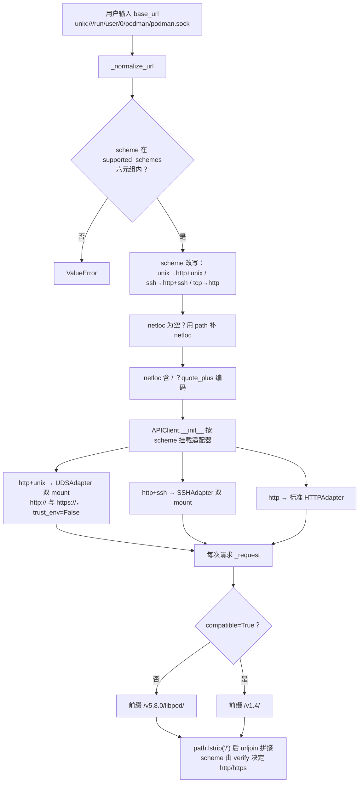

# 10 - 传输与配置深化（URL 一生、UDS 四层栈、双前缀、containers.conf 双格式）

[01 连接配置](01-connection.md) 回答了"怎么连上 Podman"；本文沿 [api/client.py](https://github.com/containers/podman-py/blob/v5.8.0/podman/api/client.py)、[uds.py](https://github.com/containers/podman-py/blob/v5.8.0/podman/api/uds.py)、[config.py](https://github.com/containers/podman-py/blob/v5.8.0/podman/domain/config.py)、[system.py](https://github.com/containers/podman-py/blob/v5.8.0/podman/domain/system.py) 回答"连接字符串进入 SDK 后发生了什么"，并集中记录若干**兼容优先于实现**的折中行为。

## 10.1 URL 的一生：从 base_url 到请求行

四个容易踩中的规范化行为：

1. 你写的 `tcp://host:port` 最终请求 scheme 是 **`http`**；`unix://` 会变成 `http+unix`——日志/抓包里看到的 scheme 与输入不同是预期行为。
2. UDS 路径形如 `http+unix:///run/user/0/podman/podman.sock`：netloc 为空时 path 被整体提升为 netloc，其中的 `/` 再经 `quote_plus` 编码，最终交给 urllib3 的主机位其实是 `%2Frun%2F...` 形态；解码由 `UDSSocket.connect` 里的 `unquote(urlparse(...).netloc)` 还原。
3. UDS 适配器同时 mount 到 `http://` 与 `https://`，并设置 `trust_env=False`——**环境变量里的 HTTP_PROXY 不会介入本地 socket 连接**。
4. `verify` 一词两义：它既作为 `requests` 的 TLS 校验开关透传，又决定拼 URL 时用 `https` 还是 `http`（`_request` 中 `scheme = "https" if kwargs.get("verify") else "http"`）。

## 10.2 UDS 四层连接栈

[uds.py](https://github.com/containers/podman-py/blob/v5.8.0/podman/api/uds.py) 是教科书式的 urllib3 自定义传输实现，自上而下四层：

| 层 | 类 | 职责 |
|----|----|------|
| requests 适配 | `UDSAdapter(HTTPAdapter)` | 接收 `uds=` 与可选 timeout，`init_poolmanager` 时注入 pool kwargs |
| urllib3 池管理 | `UDSPoolManager(PoolManager)` | 自定义 `_PoolKey`（在标准 PoolKey 上扩展 `key_uds` 字段，使不同 socket 路径各占一池）；scheme 表把 **`http` 与 `http+ssh` 都映射到 UDSConnectionPool**（SSH 隧道落地为本地转发 socket 后复用同一套 UDS 栈） |
| urllib3 连接池 | `UDSConnectionPool(HTTPConnectionPool)` | `ConnectionCls = UDSConnection` |
| 连接 | `UDSConnection(HTTPConnection)` → `UDSSocket(socket.socket)` | 连接对象 pop 出 `uds` 参数；socket 以 `AF_UNIX/SOCK_STREAM` 建立，`connect()` 解析 netloc 路径，**任何连接异常被包装为 `APIError("Unable to make connection to UDS ...")`** |

池键规范化函数 `_key_normalizer`（[adapter_utils.py](https://github.com/containers/podman-py/blob/v5.8.0/podman/api/adapter_utils.py)）源码注释明示复制自 `urllib3.poolmanager._default_key_normalizer`：scheme/host 小写化（RFC 3986）、headers 转 frozenset、socket_options 转 tuple、上下文字段统一加 `key_` 前缀。

> 排障含义：报 "Unable to make connection to UDS" 时，路径已经过 unquote 还原——检查该文件路径是否存在、当前用户对 rootless socket（`/run/user/$UID/podman/podman.sock`）是否有权限，而不是怀疑 URL 编码。

## 10.3 TLS 的现状：兼容外壳，当前忽略

- [tlsconfig.py](https://github.com/containers/podman-py/blob/v5.8.0/podman/tlsconfig.py) 的 `TLSConfig` docstring 直白写明 **"Provided for compatibility, currently ignored."**：`__init__(*args, **kwargs)` 空实现，文档列出 client_cert/ca_cert/verify/ssl_version/assert_hostname 等 docker-py 风格参数但不生效；`configure_client` 是 no-op，源码 TODO 注明未来或并入 SSHAdapter。
- 真正影响加密的只有每请求的 `verify`（透传 requests，且参与 scheme 选择）。生产环境对 TCP/TLS 端点的证书需求不能依赖 TLSConfig 对象表达。
- SSH 传输的主机密钥校验、身份文件（`identity`）与隧道轮询机制在 [01 连接配置](01-connection.md) 与 [api-source 信源](/references/api-source.md) S-1~S-8 已完整登记，本文不重复。

## 10.4 libpod / 兼容双前缀

APIClient 构造后持有两个路径前缀：

- `path_prefix = /v{VERSION}/libpod/`（VERSION 由包版本 `5.8.0` 经 `_api_version` 切三段得到）——默认前缀；
- `compatible_prefix = /v{COMPATIBLE_VERSION}/`（COMPATIBLE_VERSION 由 `1.40` 切**两**段得到，即 `/v1.4/`）。

每个 `get/post/put/delete/head` 的 kwargs 都接受 `compatible=True` 切换前缀；`path.lstrip("/")` 后用 `urljoin` 与前缀拼接（注释：前导 `/` 会让 urljoin 行为异常）。域代码里显式走兼容前缀的典型是 `SystemManager.login` → POST `/auth`（`compatible=True`）；镜像 pull 默认带 `compatMode` query 参数则是服务端行为开关，与 URL 前缀是两套机制，不要混淆。

## 10.5 containers.conf 双格式：JSON 优先，TOML 兜底

[config.py](https://github.com/containers/podman-py/blob/v5.8.0/podman/domain/config.py) 同时理解两代 Podman 连接配置：

| 来源 | 文件 | 结构 |
|------|------|------|
| 新格式（JSON） | `$XDG_CONFIG_HOME/containers/podman-connections.json` | `Connection.Default` 指默认连接名，`Connection.Connections` 为连接表 |
| 旧格式（TOML） | `$XDG_CONFIG_HOME/containers/containers.conf` | `engine.active_service` + `engine.service_destinations` 表 |

规则：

1. 默认路径下新 JSON 先读；旧 TOML 存在则 `attrs.update()` 补充；
2. `services` 属性先装旧 TOML 连接、**再装新 JSON 连接，同名连接 JSON 覆盖 TOML**（源码注释明确该优先级）；
3. `active_service` 先找 JSON `Default`，找不到再回退 TOML `active_service`，都没有返 `None`；
4. `ServiceConnection` 内部对键名双写兼容：`uri`/`URI`、`identity`/`Identity`（小写优先），`is_machine` 读 `IsMachine`（缺省 False）——门面的"active_service 且 is_machine 才自动采用"判定就建立在此字段上；
5. 显式传 `path` 时先按 JSON 解析，失败再试 TOML，两者都失败抛 `AttributeError`。TOML 解析器按解释器版本四级回退：3.11+ 标准库 tomllib → tomli → toml → pytomlpp。

（路径中的 `@@is_test@@` 段是测试专用钩子，生产代码不会出现。）

## 10.6 XDG 路径解析与安全回退

[path_utils.py](https://github.com/containers/podman-py/blob/v5.8.0/podman/api/path_utils.py)：

- `get_runtime_dir()`：`XDG_RUNTIME_DIR` → `/run/user/{uid}`（必须通过 `isdir` 验证）→ `/tmp/podmanpy-runtime-dir-fallback-{user}`。
- 回退目录有一套防替换攻击的创建逻辑：用 **`lstat`**（不跟随符号链接，防止攻击者把路径指向别处）检查；不存在则 `mkdir(0o700)`；存在但不是目录则先 unlink 再建；属主不是当前用户或组/其他用户有任何权限位则删除重建。
- `get_xdg_config_home()`：`XDG_CONFIG_HOME` → `~/.config`。

这解释了 [01 连接配置](01-connection.md) 中"本地回退 socket"路径的拼接来源：`Path(get_runtime_dir())/"podman"/"podman.sock"`。

## 10.7 SystemManager 与门面直方法

[system.py](https://github.com/containers/podman-py/blob/v5.8.0/podman/domain/system.py) 五端点：

| 方法 | HTTP | 备注 |
|------|------|------|
| `df()` | GET `/system/df` | 各类资源占用 |
| `info(*_, **__)` | GET `/info` | 参数全部忽略 |
| `login(username, ..., tls_verify=None)` | POST `/auth` | **compatible=True**；body 键含 serveraddress/identitytoken/registrytoken；verify=tls_verify |
| `ping()` | HEAD `/_ping` | 返回 `response.ok` 布尔，**不抛异常**，适合健康探测 |
| `version(api_version=True)` | GET `/version` | `api_version=False` 时删除返回体的 `APIVersion` 键 |

门面对 df/info/login/ping/version/close 六个方法做纯转发，并用 `fn.__doc__ = SystemManager.<m>.__doc__` 复制 docstring；**events 是第七个直方法，但每次调用都 new 一个 EventsManager**（不是 cached_property 单例）。Swarm 系列（`swarm/services/configs/nodes`）在门面层直接抛 NotImplementedError。

## 10.8 请求体/过滤器的编码约定

- `prepare_filters` 接受三种形态：字符串 `"key=value"`、字符串列表、Mapping；统一成 `dict[str, list[str]]` 后 `json.dumps(sort_keys=True)` 作为 query 中的 `filters` 值；空输入返 None。
- `prepare_body` 递归剔除 None 与空容器，**但保留 False 和 0**（布尔开关不能被当空值删掉）；`networks` 键特判保留——`networks={name: {}}` 这种空字典端点配置必须存活。
- `encode_auth_header` 用 **urlsafe** base64 编码 `json.dumps(auth_config)`，服务于 push/manifest push 的 `X-Registry-Auth` 头。
- 时间参数（since/until/events）统一走 `prepare_timestamp`：int 原样，naive datetime 视为 UTC。
- 网络 CIDR 的掩码走 `prepare_cidr`，掩码按 **base64 编码字节**上送（Go 端 JSON 解码约定），不是点分字符串。

## 10.9 APIResponse：代理模式与参数化 404

`APIResponse` 不是 `requests.Response` 的子类，而是**代理（proxy）**：`__getattr__` 把所有未显式定义的属性转发给被包装对象，只重写 `raise_for_status`：

- 尝试从 JSON 错误体取 `cause`/`message`，失败则用纯文本；
- 404 抛哪个异常由参数 `not_found` 决定，**默认 `NotFound`**——镜像相关调用统一传 `not_found=ImageNotFound`（push/pull/build/manifest add 等），因此"404 得到哪个异常"取决于具体调用点而非全局映射。
- 传输层（连接失败等 OSError）在 `_request` 被统一包装为 `APIError`。

## 10.10 可迁移模式

| 模式 | 要点 |
|------|------|
| 传输适配四分层 | 基于 requests/urllib3 扩展新传输（UDS/SSH）时，按 Adapter→PoolManager→Pool→Connection/Socket 四件套实现，并以自定义 PoolKey 字段隔离不同目标 |
| 兼容外壳保留策略 | 无法立即实现的生态 API（TLSConfig）以"接收参数+显式 ignored 注释"保留，避免迁移用户在导入期失败 |
| 双格式配置读取 | 新旧配置并存时固定"新格式覆盖旧格式"的确定优先级，并在键名层做双写兼容 |
| 临时目录最小权限 | /tmp 回退目录必须 lstat 防 symlink + 0700 + 属主校验，三件套不可省 |
| 错误异常参数化 | 同一 HTTP 状态码在不同资源域映射不同异常类，以方法参数注入而非全局分支实现 |

## 相关概念

- [01 - 连接配置（UDS/SSH/TCP）](01-connection.md)：四级连接优先级与 SSH 隧道轮询
- [02 - 资源管理器架构](02-managers.md)：Manager 如何拿到 APIClient（`.api` 窄化）
- [05 - 高级资源、异常体系与工程治理](05-advanced.md)：8 类异常继承全景
- [08 - 事件与三套流协议](08-events-and-streams.md)：UDS 裸连接劫持为何止于 SSH 边界
- [信源登记：vendor 全量源码地图](/references/source-code-map.md)
