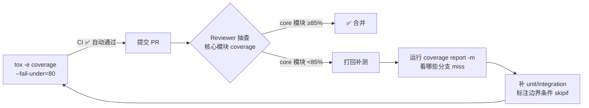

# 03 - 集成测试治理：skipif/pnext/覆盖率双轨/DCO/pylint 不默认

> **场景**：用 podman-py SDK 的项目做 CI。需要同时兼容 Python 3.9~3.13，integration test 要求 `ssh localhost exit` 先 0 秒通，覆盖率 CI 过 80% 但 REVIEW 时要求核心模块 85%。

## E3.1 tox.ini 环境矩阵（对齐 podman-py 上游）

```ini
# tox.ini — 与 podman-py 上游保持 envlist 一致
[tox]
minversion = 4.0
envlist =
    py{39,310,311,312,313}-unit
    py{312,313}-integration
    coverage
    lint
skip_missing_interpreters = true

[testenv]
deps =
    pytest
    requests-mock
    integration: pytest-timeout
setenv =
    CONTAINER_HOST = {env:CONTAINER_HOST:unix:///run/user/{env:UID}/podman/podman.sock}
    PODMAN_VERSION = {env:PODMAN_VERSION:}
    OS_RELEASE = {env:OS_RELEASE:}
    PODMAN_BINARY = {env:PODMAN_BINARY:podman}
commands =
    unit: pytest tests/unit/ {posargs}
    integration: pytest \
        --timeout=120 \
        tests/integration/ {posargs}

# —— 覆盖率：自动化层 80%（R3 陷阱的宽松端）——
[testenv:coverage]
deps =
    pytest-cov
    pytest
setenv = {[testenv]setenv}
commands =
    pytest tests/unit/ tests/integration/ \
        --cov=myapp_podman_wrappers \
        --cov-report=term-missing \
        --cov-report=xml:coverage.xml \
        --fail-under=80

[testenv:lint]
deps =
    ruff>=0.6
    mypy>=1.11
commands =
    ruff check .
    ruff format --check .
    mypy src/
```

## E3.2 Unit test：requests-mock 纯 mock HTTP 结构

```python
# tests/unit/test_images_get_404.py
import pytest
import requests_mock
from podman import PodmanClient
from podman.errors import ImageNotFound, APIError


def test_images_get_404_raises_image_not_found():
    """404 响应 → 精确抛 ImageNotFound (不是裸 APIError)"""
    with requests_mock.Mocker() as m:
        # 符合 api/client.py 的路径风格（libpod 端点）
        m.get(
            "http+unix://localhost/images/nonexist%3Alatest/json",
            status_code=404,
            json={"cause": "image not known", "message": "No such image"},
        )
        client = PodmanClient(base_url="http+unix://localhost")
        with pytest.raises(ImageNotFound) as excinfo:
            client.images.get("nonexist:latest")
        # 断言：是 ImageNotFound (APIError 子类)
        assert isinstance(excinfo.value, APIError)
        assert excinfo.value.status_code == 404


def test_images_list_empty_not_raises():
    """images.list() 404 返回 [] 不抛（images_manager.py L75-76）"""
    with requests_mock.Mocker() as m:
        m.get("http+unix://localhost/images/json", status_code=404)
        client = PodmanClient(base_url="http+unix://localhost")
        assert client.images.list() == []


def test_images_load_both_params_raises_invalid():
    """load() data+file_path 双传 → InvalidArgument/PodmanError (images_manager.py L144-L147)"""
    from podman.errors import PodmanError
    client = PodmanClient(base_url="http+unix://localhost")
    with pytest.raises(PodmanError):
        import io
        client.images.load(data=b"fake", file_path=io.StringIO(""))
```

## E3.3 Integration test：PODMAN_BINARY + SSH 预断言

```python
# tests/integration/base.py
import os
import subprocess
import pytest
from podman import PodmanClient


@pytest.fixture(scope="class")
def real_client():
    """真实 daemon client：class 级 scope，整个测试类共享一个连接"""
    # 前置断言 1：PODMAN_BINARY 存在且 --version 能跑
    binary = os.environ.get("PODMAN_BINARY", "podman")
    r = subprocess.run(
        [binary, "--version"], capture_output=True, text=True, timeout=5
    )
    assert r.returncode == 0, f"{binary} not in PATH or not executable"

    # 前置断言 2（R5 陷阱 SSH hang 防挂）：ssh localhost exit 必须 0 秒通
    # 即使不使用 SSH 适配器，integration test 上游 CI 也要求此前置条件
    r_ssh = subprocess.run(
        ["ssh", "-o", "BatchMode=yes", "-o", "ConnectTimeout=2",
         "localhost", "exit"],
        capture_output=True, timeout=5,
    )
    if r_ssh.returncode != 0:
        pytest.skip(
            f"ssh localhost exit 失败（rc={r_ssh.returncode}），"
            f"跳过 integration tests。原因: {r_ssh.stderr.decode()[:200]}"
        )

    client = PodmanClient()   # 四级优先级自动找 socket
    assert client.ping(), "podman daemon 不可达"
    yield client
    client.close()


@pytest.fixture
def demo_label():
    """所有 integration 资源都标 label，最后统一 prune 防残留"""
    return "testenv=pytest-integration"
```

## E3.4 `@pytest.mark.skipif` 三元组（版本/OS/Rootful vs Rootless）

```python
# tests/integration/test_advanced_matrix.py
import os
import pytest

PODMAN_VERSION = tuple(
    int(x) for x in os.environ.get("PODMAN_VERSION", "0.0.0").split(".") if x.isdigit()
) or (0, 0, 0)
OS_RELEASE = os.environ.get("OS_RELEASE", "")
IS_ROOTFUL = os.geteuid() == 0  # Rootless=geteuid() != 0, Rootful=0


class TestQuadlets:
    """quadlets API 仅 Podman ≥5.8，版本太低直接 skip"""

    @pytest.mark.skipif(
        PODMAN_VERSION < (5, 8),
        reason=f"QuadletsManager 需要 podman >= 5.8 实际 {PODMAN_VERSION}",
    )
    def test_quadlets_install_tuple_memory(self, real_client, demo_label):
        q = ("demo-pytest.container", f"[Container]\nImage=alpine:3\nLabel={demo_label}\n")
        r = real_client.quadlets.install(q, replace=True, reload_systemd=True)
        assert not r["QuadletErrors"]
        assert "demo-pytest.container" in str(r["InstalledQuadlets"])


class TestCgroupv2Fedora42:
    """Cgroup v2 特性仅 Fedora 42+ 上验证"""

    @pytest.mark.skipif(
        "fedora" not in OS_RELEASE.lower(),
        reason=f"非 Fedora 系: {OS_RELEASE}",
    )
    @pytest.mark.skipif(
        lambda: (
            int(OS_RELEASE.split(":")[-1]) < 42
            if OS_RELEASE and ":" in OS_RELEASE else True
        )(),
        reason=f"Fedora 版本需要 ≥42",
    )
    def test_cgroup_v2_cpu_quota(self, real_client, demo_label):
        ct = real_client.containers.create(
            "alpine:3", "sleep 5",
            labels={demo_label.split("=")[0]: demo_label.split("=")[1]},
            cpu_quota=50000,
        )
        # 断言 cgroup 文件写进去了
        ct.remove(v=True)


class TestPrivilegedPorts:
    """Rootless 无法绑定 <1024 端口"""

    @pytest.mark.skipif(
        not IS_ROOTFUL,
        reason=f"Rootless (uid={os.geteuid()}) 不能 bind <1024",
    )
    def test_publish_80_httpd(self, real_client, demo_label):
        ct = real_client.containers.run(
            "httpd:alpine", detach=True,
            ports={"80/tcp": 80},
            labels={demo_label.split("=")[0]: demo_label.split("=")[1]},
        )
        assert not ct.attrs["NetworkSettings"]["Ports"]["80/tcp"][0]["HostPort"] == "0"
        ct.remove(force=True, v=True)
```

## E3.5 `@pytest.mark.pnext` 前瞻用例（默认跳过，`--pnext` 才执行）

```python
# tests/integration/test_manifest_annotations_v5_9.py
import pytest

# 规划 Podman 5.9 才实现的 OCI annotations 扩展
@pytest.mark.pnext
class TestManifestAnnotationsV59:
    def test_manifest_push_annotations_preserved(self, real_client):
        # 5.9 以下跑这个没意义，但为了"功能对齐规划"先写好
        client = real_client
        mid = client.manifests.create("demo-multiarch:next")
        client.manifests.add(mid, "alpine:3", platform="linux/s390x")
        # 断言 annotations...（5.9 实现后补）
        client.manifests.remove(mid)
```

执行方式：
```bash
tox -e py313-integration                              # 默认跳过 pnext
tox -e py313-integration -- --pnext tests/.../test_manifest_annotations_v5_9.py
```

## E3.6 覆盖率双轨：80%(CI) vs 85%(Review) 处理方案



落地脚本：
```bash
# CI 里必跑（宽松门）
tox -e coverage

# 提交 PR 前自测（严格门，开发者本地跑）
pytest \
  --cov=myapp_podman_wrappers.containers \
  --cov=myapp_podman_wrappers.images \
  --cov=myapp_podman_wrappers.errors \
  --cov-fail-under=85 \
  tests/

# 看具体哪一行没覆盖（reviewer 最常问：你这 else 分支怎么没单测）
coverage report -m --include='*/myapp_podman_wrappers/*'
```

## E3.7 pylint：什么时候才调用？（R2 陷阱延伸）

`pre-commit` / `tox -e lint` 里**不含** pylint，只有 `ruff + mypy`。
**pylint 只在两种场景主动调用：**

| 场景 | 触发者 | 命令 | 目标 |
|---|---|---|---|
| 审稿人要求 | Reviewer comment `run pylint please` | `pylint podman/domain/images_manager.py --disable=C0301,R0801` | 指定文件，disable 风格/长行 |
| 大重构前基准 | 开发者自测 | `pylint --disable=C,R --output-format=json podman/ > pylint-before.json` | 只留错误/警告，输出 JSON 方便 diff |

> **R2 陷阱反模式**：把 pylint 加进 pre-commit → 团队 20% 时间在调格式警告 → 生产力崩盘。保持上游风格：**ruff 快速格式 + mypy 静态检查 + pylint 按需深度扫描**。

## E3.8 DCO Signed-off-by + make validate 需 git-validation

```bash
# 每笔提交必须带 DCO Sign-off
git commit -s -m "feat(quadlets): add report() health filter"
# message 末尾自动出现: Signed-off-by: 张三 <zhang.san@company.com>

# make validate 跑 DCO + subject 长度 + 历史提交检查
# 依赖: 系统 PATH 有 git-validation 二进制（⚠️ 不是 pip 包！）
# 安装方式 A：go 编译
go install github.com/vbatts/git-validation@latest
# 安装方式 B：release 下载
#   https://github.com/vbatts/git-validation/releases
export PATH="$HOME/go/bin:$PATH"
make validate
# 常见报错:
#   "git-validation: command not found"  → 按上面安装后重试
#   "missing DCO"                       → 补 git commit --amend -s
#   "subject too long (>90 chars)"      → 改 subject 精简
```

## E3.9 G3 可迁移模式：CI "门外守门"三层静态防线

| 防线 | 工具 | 失败表现 | 修复 |
|---|---|---|---|
| G1-格式 | `ruff format --check` | diff 不通过 | `ruff format .` 后重提 |
| G2-静态 | `ruff check .` + `mypy` | E/F/W 编号错误 | 每条修复或 `# noqa: xxx` 说明 |
| G3-签名 | `make validate` (git-validation) | DCO missing / subject too long | `git commit --amend -s` / 改短 subject |

三道全过 → 才允许进 `tox -e coverage`（耗时，跑真 daemon）。
