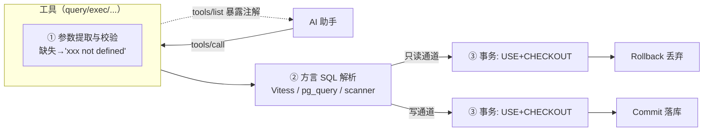

# dolt-mcp SQL 安全机制

> 本文解析 dolt-mcp 的 SQL 安全防线。对应 [F-050、F-062/F-068/F-072/F-073、F-113/F-114](/references/source.md)。

## 核心命题

给 AI 一把 SQL 会出事的根因是**语句类型与意图错配**——AI 想查询却写了 DELETE，或想临时试验却直接改了主分支。dolt-mcp 的四层防护专门压制这类错配。

## 第一层：读写通道分离（工具级）

最朴素也最有效的防线是把能力拆成两个工具（F-113/F-114）：

| | `query` | `exec` |
|---|---|---|
| 定位 | 执行 READ 查询 | 执行 WRITE 查询 |
| 注解 | readOnly=true, destructive=false | readOnly=false, **destructive=true** |
| 事务 | 只 `Rollback` | 成功 `Commit` |
| 返回 | 查询结果（Markdown） | 成功文案 |
| 典型语句 | SELECT / SHOW / EXPLAIN | INSERT / UPDATE / DELETE |

AI 想"看一眼数据"只会被引导去 `query`；任何副作用语句在 `query` 通道会被直接拒绝。错误文案示例：往 query 塞 DELETE → "invalid read query"。

## 第二层：方言 SQL 解析器校验（语句级）

工具在执行前先调用方言 `ValidateReadQuery`/`ValidateWriteQuery`，**真正解析语句**而非字符串匹配（F-062/F-068/F-072/F-073）：

| 方言 | 解析器 | 判定只读的方式 |
|------|--------|----------------|
| Dolt(MySQL) | Vitess `sqlparser` | 语句 AST ∈ SelectStatement/Show/Explain/OtherRead → 只读（F-062） |
| DoltgreSQL | pg_query_go | 首条 Stmt ∈ SelectStmt/VariableShowStmt/ExplainStmt → 只读（F-068） |
| DoltLite | 自研 scanner | 首关键字 ∈ SELECT/WITH/VALUES/EXPLAIN **且** 单语句 **且** 无 dolt_* 变更函数（F-072） |

三个特点值得注意：

1. **真解析而非正则**：MySQL/Postgres 走完整 SQL 解析器，能识别 `WITH ... DELETE` 之类复合形态；
2. **只读/写双向校验**：`ValidateWriteQuery` 反过来拒绝只读语句混入 exec 通道（F-073）；
3. **DoltLite 需自研 scanner**：SQLite 无现成 AST 工具，作者手写状态机扫描多语句与注释（F-072），并额外禁止 dolt_commit/add/reset/merge 等存储过程被当作"读"混过。

`create_table`/`alter_table` 同样有专用校验器（`ValidateCreateTableQuery`/`ValidateAlterTableQuery`），确保执行的是真正的 DDL（F-110/F-111、F-062）。

## 第三层：事务生命周期隔离（会话级）

dolt-mcp 的事务策略刻意区分读写生命周期（F-050）：

```go
// 只读：结束即丢弃，不产生任何持久化
defer tx.Rollback(ctx)

// 写入：无错提交，有错回滚并上报
defer CommitTransactionOrRollbackOnError(ctx, tx, err)
```

- **query 即使成功也回滚**——读通道零副作用，反复试错不污染会话（F-113）；
- **exec 才 COMMIT**——每次写操作是独立事务，成功即落库（F-114）；
- DoltLite 更进一步：每个工具调用使用**独立的 pin 数据库句柄**，分支/事务状态无法在并发 MCP 调用间泄漏（F-092）。

## 第四层：安全注解元数据（客户端级）

四枚 hint 注解（readOnly/destructive/idempotent/openWorld）在 MCP `tools/list` 中暴露给客户端（F-100），让 AI 助手或 UI 在**调用前**就感知工具风险——例如 destructive 工具可触发二次确认，openWorld 工具（clone/fetch/push/pull）可提示涉及网络与远端状态（F-105/F-140~F-143）。

## 纵深防御总览



## 边界与认知

- **dolt-mcp 不替代数据库权限**：它仍是"连库的一个客户端"。真正的写权限由连库账号控制——集成测试甚至建议用独立最小权限用户（F-151）。生产部署把库账号权限收紧、server 放私有网络，仍是底线。
- **exec 的 destructive=true 是语义标记，不是拦截**：它提醒客户端，但语句仍会执行。安全兜底靠①SQL 校验只放行"能解析的语句"②库账号权限。
- **openWorld 工具（远程操作）**面向网络状态，非纯本地可推导，客户端应对其单独授权（F-105/F-140~F-143）。
- 各方言校验器覆盖面不同：DoltLite 自研 scanner 较 MySQL/PG 解析器保守但覆盖核心；版本/解析器差异可能导致个别合法语句被误判——重试或改用 `query`/`exec` 之外专用工具（如建表用 create_table）可规避。

## 相关概念

* [架构分层](/concepts/01-architecture.md)
* [工具全景](/concepts/03-tools-overview.md)
* [方言设计](/concepts/05-dialect-design.md)
* 实操见 [examples/00-query-and-exec](../examples/00-query-and-exec.md)
