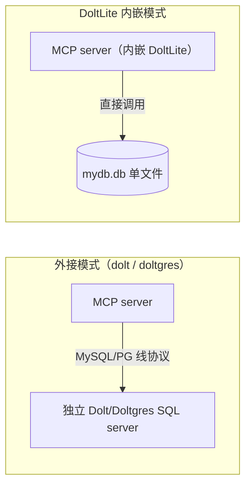

# DoltLite 内嵌模式

> 本文解析 dolt-mcp 的第三种后端：内嵌 DoltLite。对应 [F-090~F-095](/references/source.md)。

## 什么是 DoltLite 模式

[DoltLite](https://github.com/dolthub/doltlite) 是 SQLite 的一个 fork，在单文件里内建 Dolt 的版本控制能力（分支/提交/diff/合并/远程）[F-161]。dolt-mcp 的 DoltLite 模式把整个引擎**编译进 MCP server 二进制**，启动时不连任何外部数据库服务器，直接指向一个本地文件（首次使用自动创建）[F-091]。

> **一句话**：把"两台进程 + 网络配置"的部署压成"一个二进制 + 一个 .db 文件"。



## 构建要求（关键门槛）

DoltLite 支持**不是默认构建的一部分**（F-090）：

- 默认纯 Go 构建（`go build`）不含 DoltLite，`--doltlite` 会报错；
- DoltLite 需要 **cgo** + `-tags "doltlite libsqlite3"` + 链接 **libdoltlite**（含 zlib/pthreads）；
- 因 cgo 无法交叉编译，**必须在目标平台构建**。

获取 libdoltlite 两条路（F-090）：① 从 doltlite release 下载 `doltlite-lib-<platform>-<version>.zip`（内含 doltlite.h + libdoltlite.a），把 doltlite.h 复制为 sqlite3.h；② 本地从源码构建。构建示例：

```bash
CGO_CFLAGS="-I/path/to/doltlite/build" \
CGO_LDFLAGS="/path/to/doltlite/build/libdoltlite.a -lz -lpthread" \
go build -tags "doltlite libsqlite3" -o dolt-mcp-server-doltlite ./mcp/cmd/dolt-mcp-server
```

对多数用户，更简单的路径是直接用预编译产物：release 的 `dolt-mcp-server-doltlite-<platform>` 归档，或 `dolthub/dolt-mcp:<version>-doltlite` Docker 镜像（F-090）。

## 启动与参数

```bash
# 原生
./dolt-mcp-server-doltlite --doltlite --db-file /path/to/mydb.db \
  --commit-name "Your Name" --commit-email you@example.com \
  --http --mcp-port 8080
# 或 --stdio 给 Claude

# Docker（挂载 /data 持久化）
docker run -d --name mcp-doltlite -p 8080:8080 \
  -v dolt_mcp_data:/data -e MCP_MODE=http \
  -e DOLT_DB_FILE=/data/mydb.db \
  -e DOLT_COMMIT_NAME="Your Name" -e DOLT_COMMIT_EMAIL=you@example.com \
  dolthub/dolt-mcp:latest-doltlite
```

无需 `--host/--port/--user/--password/TLS`（F-091、F-027）。DoltLite 专用参数见 [部署与配置](02-deployment-configuration.md)。

## 能力裁剪

单库单文件意味着服务器级/多库工具无意义，DoltLite 自动隐藏 6 个工具（F-069），保留 **39 个**（F-095）：

| 隐藏工具 | 原因 |
|---------|------|
| `list_databases` / `create_database` / `drop_database` | 单文件即单库 |
| `clone_database` | 远程克隆走 `dolt_fetch` 等专用工具 |
| `show_processlist` / `kill_process` | 无服务器进程 |

保留的工具包括全部版本控制、diff/merge、dolt_tests 与远程操作（针对 file:// 与 DoltLite 兼容 HTTP(S) 远程）（F-095）。

## 事务与并发模型

dolt-mcp 对 DoltLite 做了专门的并发安全设计（F-092）：

- **每次工具调用 = 独立 pin 的数据库句柄**（`database.db.Conn`），分支/事务状态无法在并发 MCP 调用间泄漏；
- DoltLite 引擎协调多个并发读者与**一个持久写者**；
- 冲突锁等待由 `--doltlite-busy-timeout` 控制（默认 5s，0 立即失败）（F-032）；
- 打开时校验 `doltlite_engine()` 返回 `"prolly"`（Prolly Tree 存储），版本不兼容的文件直接拒绝（F-053）。

## 行为细节（与源码一致）

| 行为 | 说明 |
|------|------|
| `working_database` | 参数被接受但忽略——永远只有那一个库（F-094） |
| 提交作者 | 未设 `--commit-name/--commit-email` 时提交作者为 `"doltlite"`（F-094） |
| 分支切换 | dirty working set 按分支独立保存；切走再切回恢复该分支未暂存/已暂存状态（F-094） |
| 远程兼容 | 只认 DoltLite 的 file/HTTP(S) 协议——**完整 Dolt 仓库与 DoltLite 文件是不同存储格式**，不能混用（F-093） |
| 远程认证 | `exec` 工具 `SELECT dolt_creds_new();` 生成凭据；引擎默认读 `~/.doltlite/creds`，或 `DOLTLITE_CREDS_DIR`（F-093） |

## 为什么值得关注（本地优先 AI 的价值）

README 明确把 DoltLite 定位为 **local-first AI workflow**（F-161）：在笔记本或容器里跑 AI 数据应用，无需安装/配置/运行 Dolt 服务器，一个文件搞定全版本控制能力。对以下场景尤其契合：

- 原型/个人项目：想给 AI 配"可回滚数据库"但不想运维服务器；
- CI/测试：临时文件即建即弃，隔离成本为零；
- 隐私/离线：数据只在本机文件，不经过网络。

代价是：cgo 构建门槛、无多库、无服务器级工具、远程格式与完整 Dolt 不互通（F-093）。

## 相关概念

* [概述](/concepts/00-overview.md)
* [部署与配置](/concepts/02-deployment-configuration.md)
* [方言设计](/concepts/05-dialect-design.md)
