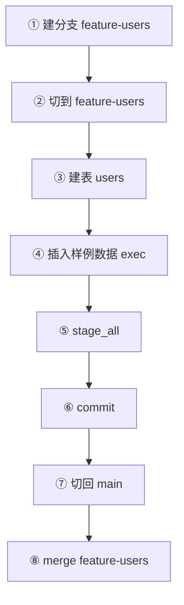

# AI 驱动的分支-提交-合并版本控制工作流

> 本文把 [工具全景](../concepts/03-tools-overview.md) 的分支/暂存/提交/合并工具串成一条 AI 可执行的工作流，每个步骤给出真实 `tools/call` 请求。事实依据 [F-117~F-136](/references/source.md)。

## 工作流场景

数据团队让 AI 在隔离分支上"造一张用户表并填样例数据"，验证通过后合并回 main。全程数据被版本控制保护，误操作可随时回滚。



## 步骤 1：从 main 建功能分支

工具：`create_dolt_branch_from_head`（当前 HEAD 建新分支，F-120）。

```json
{
  "name": "create_dolt_branch_from_head",
  "arguments": {
    "working_database": "test",
    "working_branch": "main",
    "new_branch": "feature-users",
    "force": false
  }
}
```

> 若需从"指定已有分支"复制而非当前 HEAD，用 `create_dolt_branch`（参数 original_branch + new_branch，F-119）。

## 步骤 2：切到功能分支

工具：`select_active_branch` 确认状态（F-118）之后，后续每个带 `working_branch` 的调用都会自动执行 `DOLT_CHECKOUT('feature-users')`（F-052），因此无需单独"切分支"工具——把 `working_branch` 设为目标分支即可。

```json
{
  "name": "select_active_branch",
  "arguments": {
    "working_database": "test",
    "working_branch": "feature-users"
  }
}
```

## 步骤 3：建表（走专用工具而非裸 exec）

工具：`create_table`（先 `ValidateCreateTableQuery` 校验是 CREATE TABLE 才执行，F-110）。

```json
{
  "name": "create_table",
  "arguments": {
    "working_database": "test",
    "working_branch": "feature-users",
    "query": "CREATE TABLE users (id INT PRIMARY KEY, name VARCHAR(255) NOT NULL);"
  }
}
```

成功返回 `successfully created table`。

## 步骤 4：写入样例数据

工具：`exec`（写入通道，destructive=true，成功 COMMIT，F-114）。

```json
{
  "name": "exec",
  "arguments": {
    "working_database": "test",
    "working_branch": "feature-users",
    "query": "INSERT INTO users VALUES (1, 'alice'), (2, 'bob');"
  }
}
```

## 步骤 5：暂存全部变更

工具：`stage_all_tables_for_dolt_commit`（`CALL DOLT_ADD('-A')`，F-124）。也可用 `stage_table_for_dolt_commit` 只暂存单表（F-123）。

```json
{
  "name": "stage_all_tables_for_dolt_commit",
  "arguments": {
    "working_database": "test",
    "working_branch": "feature-users"
  }
}
```

提交前可用 `list_dolt_diff_changes_in_working_set` 查看待提交内容（F-131），或 `list_dolt_commits` 看历史（F-130）。

## 步骤 6：创建提交

工具：`create_dolt_commit`（`CALL DOLT_COMMIT('-m', msg)`，F-127）。

```json
{
  "name": "create_dolt_commit",
  "arguments": {
    "working_database": "test",
    "working_branch": "feature-users",
    "message": "add users table with sample data"
  }
}
```

成功返回 `successfully committed changes`。

> 若暂存错了，用 `unstage_table`（F-125）或 `unstage_all_tables`（F-126）撤销暂存；要整体放弃未提交改动可 `dolt_reset_hard`（destructive，F-129）。

## 步骤 7：切回 main

再次利用 `working_branch` 语义：后续 main 上的调用自动 checkout main。

```json
{
  "name": "list_dolt_branches",
  "arguments": { "working_database": "test" }
}
```

## 步骤 8：合并功能分支

工具：`merge_dolt_branch`（能快进则快进，F-135）。

```json
{
  "name": "merge_dolt_branch",
  "arguments": {
    "working_database": "test",
    "working_branch": "main",
    "branch": "feature-users",
    "message": "merge users table feature"
  }
}
```

需要"强制生成合并提交"（保留分支历史）时改用 `merge_dolt_branch_no_fast_forward`（加 `--no-ff`，F-136）。两者成功都返回 `successfully merged branch`。

合并后可 `get_dolt_merge_status` 检查冲突状态（F-134）。

## 收尾：验证与清理

- 验证：`query` 在 main 查 `SELECT * FROM users;`，应看到两行数据。
- 若分支不再需要，用 `delete_dolt_branch`（destructive，F-121）删除 feature-users。

## 安全提醒

- 所有 `working_branch` 指向的检出在每个调用内自动完成并回滚/提交事务，**AI 的并发会话不会互相污染**（F-092 的 DoltLite pin-handle 是极致体现）。
- `merge`/`delete_dolt_branch`/`dolt_reset_hard` 都是 destructive 工具，调用前 AI 应确认目标分支与影响面。
- 这个工作流在 **DoltLite 单文件模式**下同样成立（39 工具含全套版本控制），适合先本地演练（F-095）。

## 相关概念

* [工具全景](/concepts/03-tools-overview.md)
* [SQL 安全机制](/concepts/04-sql-safety.md)
* [DoltLite 内嵌模式](/concepts/06-doltlite-mode.md)
* 上一个实操见 [examples/00-query-and-exec.md](00-query-and-exec.md)
