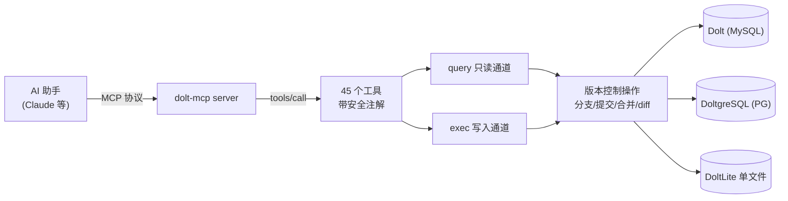

# Dolt MCP Server——把版本化 SQL 数据库交给 AI

> **官方仓库**：[dolthub/dolt-mcp](https://github.com/dolthub/dolt-mcp) [F-001]
> **分析版本**：commit `cde8e48`（v0.3.8 + 5 commits，2026-08-18）
> **服务名/版本**：`dolt-mcp` / 0.3.8 [F-002]
> **工具数量**：45（注册表逐项核验）[F-014]
> **方言后端**：Dolt(MySQL) / DoltgreSQL(PG) / DoltLite(内嵌单文件) [F-043]
> **事实基数**：162 条（F-001~F-162）
> **事实来源**：官方源码逐文件精读，信源距离 ①

Dolt MCP Server 是 DoltHub 官方的 MCP（Model Context Protocol）服务器，让 AI 助手通过 MCP 工具直接操作 Dolt 版本化 SQL 数据库——数据库管理、表操作、行级版本控制（分支/提交/合并/diff）、数据读写与远程仓库同步，一并通过 45 个带安全注解的工具暴露给 AI。

## 核心价值



dolt-mcp 解决的核心命题：**AI 能安全、结构化地操作一个 Git 式版本控制的 SQL 数据库**。它把"裸 SQL 交给 AI"的危险，化解为四层防线——读写通道分离（query/exec）、方言 SQL 解析校验、事务生命周期隔离、安全注解元数据（详见 [SQL 安全机制](concepts/04-sql-safety.md)）。

## 导航

### 核心概念（concepts/，7 篇）

* [Dolt MCP Server 概述](concepts/00-overview.md) — 是什么、解决什么问题、三方言后端、能力版图、适用场景
* [架构分层](concepts/01-architecture.md) — Server→ToolSet→工具→Dialect→db 五层架构与请求生命周期
* [部署与配置](concepts/02-deployment-configuration.md) — stdio/HTTP 模式、CLI 标志、Docker、JWT/HTTPS 完整参考
* [工具全景与安全注解](concepts/03-tools-overview.md) — 45 工具十类分组 + hint 注解四元组 + 源码怪癖
* [SQL 安全机制](concepts/04-sql-safety.md) — 让 AI 拿 SQL 也安全的四层防线
* [方言设计（三引擎适配）](concepts/05-dialect-design.md) — Dialect 接口如何封装 MySQL/Postgres/DoltLite 差异
* [DoltLite 内嵌模式](concepts/06-doltlite-mode.md) — 单文件版本化数据库内嵌进 MCP server

### 实战示例（examples/，2 篇）

* [query 与 exec：读/写双通道调用实操](examples/00-query-and-exec.md) — 标准 tools/call 请求、三方言差异、错误场景
* [AI 驱动的分支-提交-合并工作流](examples/01-branch-commit-merge-workflow.md) — 从建分支到合并回 main 的完整演练

### 信源登记（references/）

* [源码事实登记](references/source.md) — F-001~F-162 编号事实底账

## 学习路径建议

1. **入门**：[概述](concepts/00-overview.md) → [架构分层](concepts/01-architecture.md)
2. **动手**：[部署与配置](concepts/02-deployment-configuration.md) → [examples/00 query 与 exec](examples/00-query-and-exec.md)（推荐 DoltLite 免服务器体验）
3. **进阶**：[工具全景](concepts/03-tools-overview.md) → [SQL 安全机制](concepts/04-sql-safety.md) → [examples/01 版本控制工作流](examples/01-branch-commit-merge-workflow.md)
4. **源码深读**：[方言设计](concepts/05-dialect-design.md) → [DoltLite 内嵌模式](concepts/06-doltlite-mode.md)
5. **溯源**：[references/source.md](references/source.md) 核对全部 F 编号

## 信任与生命周期

| 项目 | 状态 |
|------|------|
| **status** | stable |
| **stale_after** | 2026-12-31（dolt-mcp v0.3.8+，迭代活跃，年末重评） |
| **事实来源** | 官方源码逐文件精读（信源距离 ①），无第三方转述 |
| **generated/verified** | 2026-09-09（process:source-code-to-okf-wiki 生成 / process:seven-concepts-v 核验） |
| **工具计数** | 45（primitive_v1.go 注册表逐项核对） |

## 骨架判定说明

- **一问**（有读者可照做的安装/配置/代码/调用流程？）：是——README 与源码提供完整 CLI/JSON 调用范式
- **二问**（经实测、有版本/输入输出/步骤顺序？）：官方集成测试提供真实工具调用 JSON、seed 数据与断言
- **结论**：设 examples/，内容严格取材集成测试与源码事实

## 边界说明

- 本束为源码教程，正文未实测运行 MCP server 的输出；示例调用形态取自官方集成测试（integration_tests）事实，可复现路径见各 examples 尾注。
- 工具层存在 5 处源码描述怪癖（F-147），正文 [工具全景](concepts/03-tools-overview.md) 已如实标注，不影响行为。

```{toctree}
:hidden:
:maxdepth: 7

concepts/index
examples/index
references/index
log
```
