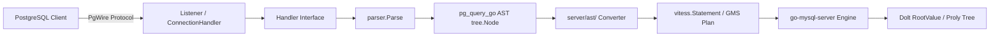

# 三层架构与数据流

DoltgreSQL 采用经典的三层转换架构，将 PostgreSQL 协议请求转换为 go-mysql-server 可执行的查询计划。

## 架构图



## 第一层：协议接入层（server/）

### Listener 连接监听

[listener.go](file:///d:/spaces/SpecWeave/external/dao/action/DoltHub/doltgresql/server/listener.go) 实现 PostgreSQL wire protocol 监听：

```go
// F-011: Listener struct 封装 net.Listener + mysql.ListenerConfig
type Listener struct {
    net.Listener
    mysql.ListenerConfig
    ServerEventListener
}
```

关键特性：
- 支持 TLS 证书注入（`WithCertificate` 选项）
- 支持连接级读/写超时
- 每个连接创建独立的 `ConnectionHandler` goroutine

### Handler 接口

[handler.go](file:///d:/spaces/SpecWeave/external/dao/action/DoltHub/doltgresql/server/handler.go) 定义核心接口（6 个方法）：

```go
// F-012: Handler 接口定义
type Handler interface {
    ComBind(ctx, c, query, parsedQuery, bindVars, formatCodes) (BoundQuery, []FieldDescription, error)
    ComExecuteBound(ctx, conn, query, boundQuery, formatCodes, callback) error
    ComPrepareParsed(ctx, c, query, parsed) (ParsedQuery, []FieldDescription, error)
    ComQuery(ctx, c, query, parsed, callback) error
    ComResetConnection(c) error
    ConnectionClosed(c)
    NewConnection(c)
    NewContext(ctx, c, query) (*sql.Context, error)
}
```

## 第二层：AST 转换层（server/ast/）

### Context 传递

[context.go](file:///d:/spaces/SpecWeave/external/dao/action/DoltHub/doltgresql/server/ast/context.go) 提供转换上下文：

```go
// F-013: AST 转换上下文
type Context struct {
    authContext   *auth.AuthContext
    originalQuery string
}
```

### 转换入口

每个 SQL 语句类型对应一个 `nodeXxx()` 函数：
- `nodeSelect()` → `vitess.SelectStatement`
- `nodeInsert()` → `vitess.Insert`
- `nodeCreateTable()` → `vitess.DDL`
- `nodeExpr()` → `vitess.Expr`（表达式转换，979 行，最复杂）

### 转换链

```
tree.Node (pg_query_go AST)
    ↓ nodeExpr() / nodeSelect() / nodeInsert() 等
vitess.Statement (GMS 可执行计划)
    ↓
go-mysql-server 执行引擎
```

## 第三层：执行引擎层（go-mysql-server）

DoltgreSQL **不重新实现查询执行引擎**，而是复用 Dolt 的 go-mysql-server 引擎。AST 转换器将 PostgreSQL SQL 语义映射到 GMS 语义，执行由 Dolt 引擎完成。

## 服务器启动

[server.go](file:///d:/spaces/SpecWeave/external/dao/action/DoltHub/doltgresql/server/server.go) 提供两种启动模式（[F-009](../source.md#f-009)）：

| 模式 | 函数 | 用途 |
|------|------|------|
| 磁盘模式 | `RunOnDisk()` | 持久化数据存储 |
| 内存模式 | `RunInMemory()` | 测试/临时使用 |

关键常量（[F-008](../source.md#f-008)）：
- `Version = "1.3.0"`
- `DefUserName = "postres"`
- `DefaultDbNameEnvVar = "DOLTGRES_DB"`

启动时自动设置（[F-010](../source.md#f-010)）：
- `ExternalDisableUsers = true`（禁用外部用户管理）
- `UseSearchPath = true`（启用 search_path 语义）

## 核心设计决策

1. **复用而非重写**：执行引擎完全复用 Dolt，仅新增转换层
2. **pg_catalog 虚拟表**：通过 `tables.Handler` 接口实现，不实际存储在 Dolt 表中
3. **contextValues 缓存**：通过 `sql.Context` 传递临时状态，避免重复解析

```{toctree}
:hidden:
```
