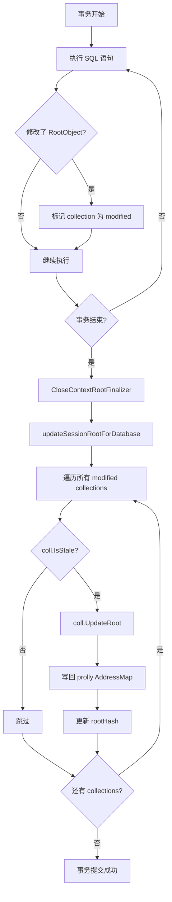

# RootValue 架构与 Root Object Collections

> **一句话概述**
>
> RootValue 是 DoltgreSQL 的核心数据结构，在 Dolt 表数据（table data）之上承载了 10 类 PostgreSQL 根对象集合，实现了 Dolt 与 PostgreSQL 系统目录之间的桥接。

---

## 概述

DoltgreSQL 兼容 PostgreSQL 系统目录（如 `pg_class`、`pg_namespace`）的方式是：将这些系统的元数据存入 `doltdb.RootValue`，而非使用真实的 PostgreSQL catalog 表。

`RootValue` 同时实现了两个接口：

- `doltdb.RootValue`：Dolt 数据库根值接口，承载表数据与外键集合
- `objinterface.RootValue`：DoltgreSQL 自定义接口，承载 PostgreSQL 根对象集合

这使得 RootValue 成为**表数据**与**系统元数据**的统一容器，是整个 DoltgreSQL 运行时的数据中枢。

---

## RootValue 核心设计

### 数据结构

`core/rootvalue.go` 中 RootValue 的核心字段如下：

```go
type RootValue struct {
    vrw         types.ValueReader        // 类型值读取器
    ns          tree.NodeStore           // 节点存储
    st          *schema.Schema           // 当前 schema
    fkc         *fk.Collection           // 外键集合
    hash        string                   // 根值哈希
    colls       map[string]RootObject    // 根对象名称 → 对象映射
    collsLock   sync.RWMutex             // colls 读写锁
}
```

其中 `colls` 是 `map[string]RootObject`，以对象名称为 key，存储所有已加载的 RootObject 实例。

### 核心方法

| 方法 | 作用 |
|---|---|
| `GetTable(name)` | 从当前 schema 获取表 |
| `HasTable(name)` | 检查表是否存在 |
| `PutTable(name, tbl)` | 写入或更新表 |
| `RemoveTables(names)` | 批量删除表（级联删除关联序列、触发器、外键） |
| `RenameTable(oldName, newName)` | 重命名表 |
| `GetForeignKeyCollection()` | 获取外键集合 |
| `IterTables()` | 迭代所有表 |
| `GetAllTableNames()` | 获取全部表名 |
| `HashOf()` | 返回当前根值哈希 |
| `FilterRootObjectNames(prefix)` | 按前缀过滤根对象名称 |
| `PutRootObject(name, ro)` | 添加或替换根对象 |
| `ReadOnlyCollections()` | 返回所有 collections 的只读快照 |

### withStorage 模式

RootValue 使用不可变更新模式，`withStorage` 方法创建新的只读实例：

```go
// 伪代码示意
func (rv *RootValue) withStorage(newVrw types.ValueReader, newNs tree.NodeStore) RootValue {
    return RootValue{
        vrw: newVrw, ns: newNs, st: rv.st,
        fkc: rv.fkc, hash: rv.hash,
        colls: rv.readOnlyCollections(),  // 深拷贝只读快照
    }
}
```

---

## RootObject 接口体系

### RootObject 接口

所有 PostgreSQL 系统对象（序列、类型、函数、触发器、扩展等）统一实现 `RootObject` 接口：

```go
type RootObject interface {
    GetID() id.Id              // 返回内部 ID
    GetRootObjectID() RootObjectID  // 返回所属集合类型
    Serialize() ([]byte, error) // 序列化为字节数组
}
```

### RootObjectID 枚举

`core/rootobject/objinterface/interfaces.go` 定义了 10 种集合类型：

```go
type RootObjectID int

const (
    None          RootObjectID = iota // 无
    Sequences                         // 序列
    Types                             // 类型
    Functions                         // 函数
    Triggers                          // 触发器
    Extensions                        // 扩展
    Conflicts                         // 冲突（复制同步）
    Procedures                        // 过程
    Casts                             // 类型转换
    Operators                         // 运算符
    Aggregates                        // 聚合函数
    Count                             // 总数（用于数组索引）
)
```

### RootObjectDiff 结构

当发生合并冲突时，使用 `RootObjectDiff` 描述变更：

```go
type RootObjectDiff struct {
    Type            string                // 对象类型
    FromHash        string                // 变更前的哈希
    FieldName       string                // 变更字段名
    AncestorValue   []byte                // 祖先值（用于三方合并）
    OurValue        []byte                // 本地修改值
    TheirValue      []byte                // 远端修改值
    OurChange       RootObjectDiffChange  // 本地变更类型
    TheirChange     RootObjectDiffChange  // 远端变更类型
}

// 变更类型
type RootObjectDiffChange int

const (
    Added    RootObjectDiffChange = iota // 新增
    Deleted                              // 删除
    Modified                             // 修改
    NoChange                             // 无变更
)
```

---

## Collection 模式

### Collection 接口

每个 RootObject 类型对应一个 `Collection`，接口定义在 `interfaces.go`：

```go
type Collection interface {
    DeserializeRootObject(bytes []byte) (RootObject, error)
    DiffRootObjects(a, b RootObject) ([]RootObjectDiff, error)
    DropRootObject(id id.Id) error
    GetRootObject(name string) (RootObject, bool, error)
    HasRootObject(id id.Id) (bool, error)
    IterAll() (func(func(RootObject) bool), error)
    IterIDs() (func(func(id.Id) bool), error)
    PutRootObject(ro RootObject) error
    RenameRootObject(oldId, newId id.Id) error
    ResolveName(name string) (RootObject, bool, error)
    UpdateRoot(root RootValue) error
    IsStale() bool          // 检测是否需要重新加载
    LoadCollection(root RootValue) error  // 从 root 加载
}
```

### 基础存储：RootObjectMap

所有 Collection 共享基础存储结构 `RootObjectMap`（`core/rootobject/objinterface/root_object_map.go`）：

```go
type RootObjectMap struct {
    serializer RootObjectSerializer  // 序列化器
    contents   polly.AddressMap      // 底层持久化 map（prolly tree）
    ns         tree.NodeStore        // 节点存储
    rootHash   string                // 用于 stale 检测的哈希
}

func (rom *RootObjectMap) IsStale(root RootValue) bool {
    return rom.rootHash != root.HashOf()
}

func (rom *RootObjectMap) UpdateRoot(root RootValue) error {
    // 通过 serializer 将变更写回 prolly map
    newAddressMap, err := rom.serializer.UpdateRoot(rom, root)
    ...
    rom.contents = newAddressMap
    rom.rootHash = root.HashOf()
    return nil
}
```

### 全局 Collection 注册

`core/rootobject/collection.go` 中定义了全局 collection 数组，索引到 `RootObjectID`：

```go
var globalCollections = [...]Collection{
    nil,                  // None
    sequences.Collection, // Sequences
    types.Collection,     // Types
    functions.Collection, // Functions
    triggers.Collection,  // Triggers
    extensions.Collection,// Extensions
    conflicts.Collection, // Conflicts
    procedures.Collection,// Procedures
    casts.Collection,     // Casts
    operators.Collection, // Operators
    aggregates.Collection,// Aggregates
}
```

### 各 Collection 具体实现

#### 序列集合（sequences）

```go
type Collection struct {
    *objinterface.RootObjectMap
    accessedMap sync.Map  // 会话级访问缓存
}

type Sequence struct {
    ID           id.Id
    DataTypeID   id.TypeId
    Persistence  string
    SequenceState SequenceState
    OwnerTable   sql.TableIdentifier
    OwnerColumn  sql.Column
}

type SequenceState struct {
    Current      *big.Int
    Increment    *big.Int
    Minimum      *big.Int
    Maximum      *big.Int
    Cache        *big.Int
    Cycle        bool
}
```

`Sequence.Next()` 方法负责生成下一个值，支持循环（CYCLE）和溢出检测。

#### 函数集合（functions）

```go
type Collection struct {
    *objinterface.RootObjectMap
    accessCache    sync.Map
    overloadCache  sync.Map
    idCache        sync.Map
}

type Function struct {
    ID             id.Id
    ReturnType     *expression.ReturnedExpression
    AllParams      []*expression.TypedExpr
    Variadic       bool
    Definition     string
    ExtensionName  string
    Schema         string
    Language       string
    IsAgg          bool
    IsWindowFunc   bool
    IsTrigger      bool
    IsProcedure    bool
}
```

#### 触发器集合（triggers）

```go
type Collection struct {
    *objinterface.RootObjectMap
    accessCache sync.Map
    tableCache  sync.Map
    idCache     sync.Map
}

type Trigger struct {
    ID           id.Id
    Function     *expression.TypedExpr
    Timing       TriggerTiming
    Events       TriggerEventType
    ForEachRow   bool
    When         string
    Definition   string
    Extension    string
    Schema       string
    TableName    string
    ReferenceTableName string
    Columns      []string
    TransitionTableName string
    TransitionRowVariablename string
    TransitionTableVariablename string
}
```

触发器枚举：
- `TriggerTiming`: Before / After / InsteadOf
- `TriggerDeferrable`: Deferred / NotDeferred
- `TriggerEventType`: Insert / Update / Delete / Truncate（支持组合）

#### 扩展集合（extensions）

```go
type Collection struct {
    *objinterface.RootObjectMap
    accessCache sync.Map
    idCache     sync.Map
}

type Extension struct {
    ExtName      string
    Namespace    string
    Relocatable  bool
    Version      string
}
```

#### 类型转换集合（casts）

```go
type Collection struct {
    *objinterface.RootObjectMap
}

type Cast struct {
    ID      id.Id
    CastType CastType
    Function *expression.TypedExpr
    BuiltIn  bool
    UseInOut bool
}

type CastType int
const (
    Explicit CastType = iota
    Assignment
    Implicit
)
```

#### 运算符集合（operators）

```go
type Collection struct {
    *objinterface.RootObjectMap
}

type Operator struct {
    ID         id.Id
    Function   *expression.TypedExpr
    ReturnType *expression.ReturnedExpression
    Commutator id.Id
    Negator    id.Id
    Hashes     bool
    Merges     bool
}
```

### 名称解析

`globalCollections` 支持跨所有集合的名称解析：

```go
// 伪代码：在所有 collections 中按顺序查找名称
func ResolveName(name string) (RootObject, bool, error) {
    for _, coll := range globalCollections {
        if coll == nil { continue }
        ro, found, err := coll.ResolveName(name)
        if found || err != nil {
            return ro, found, err
        }
    }
    return nil, false, nil
}
```

### 级联删除

`RemoveTables` 在删除表时会级联删除关联对象：

```go
func (rv *RootValue) RemoveTables(tableNames []string) (*RootValue, error) {
    // 1. 从 schema 删除表
    newSchema, err := rv.st.RemoveTables(tableNames)
    // 2. 删除对应序列（sequences 集合）
    // 3. 删除关联触发器（triggers 集合）
    // 4. 删除关联外键（fkc）
    // 5. 更新根值
    return rv.withStorage(vrw, ns), nil
}
```

---

## ID 系统

DoltgreSQL 使用内部的 `id.Id` 系统替代 PostgreSQL 的 OID，避免 Dolt 字符串索引的局限性。

### Id 类型定义

```go
// core/id/id.go
type Id string

// 大量类型化别名
type AccessMethod  Id
type Cast          Id
type Check         Id
type Collation     Id
type ColumnDefault Id
type Database      Id
type EnumLabel     Id
type Extension     Id
type ForeignKey    Id
type Function      Id
type Sequence      Id
type Type          Id
type Trigger       Id
type View          Id
// ... 更多
```

### 双格式设计

```
┌─────────────────────────────────────────────────────┐
│  紧凑格式（Compact）                            │
│  [section][data...]                                │
│  section 单字节，标识 ID 类型                       │
│  段长 ≤ 255 字节                                   │
├─────────────────────────────────────────────────────┤
│  分隔符格式（Delimiter）                           │
│  [section][data\0data\0data...]                     │
│  首字节被置位（& 0x80），标识使用分隔符格式          │
│  用于超长数据或需要多个字段的场景                    │
└─────────────────────────────────────────────────────┘
```

| 特性 | 紧凑格式 | 分隔符格式 |
|---|---|---|
| 段长限制 | ≤ 255 字节 | 无限制 |
| 首字节标识 | 普通类型 byte | type byte \| 0x80 |
| 分隔符 | 无 | `\x00` |
| 典型用途 | 短名称、单字段 | 多字段、长数据 |

### Section 概念

每个 ID 的第一个字节（section）标识其类型，例如：

```go
const (
    AccessMethodSection byte = iota + 1
    AggregateSection
    CastSection
    ColumnDefaultSection
    DatabaseSection
    EnumLabelSection
    ExtensionSection
    ForeignKeySection
    FunctionSection
    IndexSection
    ProcedureSection
    SchemaSection
    SequenceSection
    TableSection
    TriggerSection
    TypeSection
    ViewSection
    ConflictSection
    // ...
)
```

---

## contextValues 缓存与事务提交

### contextValues 结构

`core/context.go` 中定义了会话级上下文值：

```go
type contextValues struct {
    colls map[string]*databaseCollections
    pgCatalogCache *pgCatalogCache
    runner         *Runner
    dateOutputFormat string
    transactionEndCallbacks []func()
}

type databaseCollections struct {
    colls [objinterface.RootObjectID_Count]objinterface.Collection
}
```

### collectionFromContext：带 stale 检测的缓存

```go
func collectionFromContext(ctx context.Context, root objinterface.RootValue, collType objinterface.RootObjectID) (objinterface.Collection, error) {
    cv := getContextValues(ctx)
    dbName := root.GetDatabaseName().Normalized().String()
    dbColls, ok := cv.colls[dbName]
    if !ok {
        // 首次加载：创建空的 databaseCollections
        dbColls = &databaseCollections{}
        cv.colls[dbName] = dbColls
    }
    coll := dbColls.colls[collType]
    if coll == nil || coll.IsStale(root) {
        // 缓存未命中或 stale：从 root 重新加载
        coll = globalCollections[collType]
        if err := coll.LoadCollection(root); err != nil {
            return nil, err
        }
        dbColls.colls[collType] = coll
    }
    return coll, nil
}
```

### updateSessionRootForDatabase：事务提交

```go
func updateSessionRootForDatabase(ctx context.Context, root objinterface.RootValue) (objinterface.RootValue, error) {
    cv := getContextValues(ctx)
    dbName := root.GetDatabaseName().Normalized().String()
    dbColls, ok := cv.colls[dbName]
    if !ok {
        return root, nil  // 无修改
    }
    for i := objinterface.RootObjectID(1); i < objinterface.RootObjectID_Count; i++ {
        coll := dbColls.colls[i]
        if coll == nil { continue }
        if !coll.IsStale(root) {
            continue  // 未修改，跳过
        }
        if err := coll.UpdateRoot(root); err != nil {
            return nil, err
        }
    }
    return root, nil
}
```

### 事务提交流程



---

## syntheticRoot：空数据库兼容

对于不支持 DoltgreSQL 的数据库（如 `dolt_cluster`），提供 `syntheticRoot` 单例：

```go
var syntheticRoot = NewRootValue(&dummyVrw{}, &dummyNs{}, types.NewMap(nil), emptySchema)

func init() {
    synthColls := make(map[string]RootObject)
    for _, coll := range globalCollections {
        if coll == nil { continue }
        for _, ro := range coll.Readonly() {
            synthColls[ro.GetName()] = ro
        }
    }
    syntheticRoot = &RootValue{
        colls: synthColls,
        // ...
    }
}
```

`syntheticRoot` 返回空的 collections，使不支持 DoltgreSQL 的数据库能正常返回空结果集，而非 panic。

---

## 关键设计决策

### 1. 为什么不直接使用 PostgreSQL OIDs？

PostgreSQL OID 是 4 字节整数，在分布式场景下存在冲突风险。DoltgreSQL 使用 `id.Id`（基于 string 的类型化 ID），通过 section byte 标识类型，支持跨节点唯一性。

### 2. 为什么使用 prolly AddressMap 而非关系表？

Prolly tree（ProLOngLY）是 Dolt 的数据结构，适合键值型存储。RootObject 集合本质上是「ID → 序列化对象」的映射，使用 prolly AddressMap 可获得 O(log n) 查找性能，同时与 Dolt 的快照隔离机制兼容。

### 3. 为什么 collection 需要 stale 检测？

RootValue 是不可变的，每次修改都产生新实例。session context 中缓存的 collection 持有旧 root 的 hash，通过 `IsStale()` 比较 hash 可判断是否需要从新 root 重新加载，避免每次访问都执行全量反序列化。

### 4. 为什么 RemoveTables 需要级联删除？

PostgreSQL 语义要求：DROP TABLE 时自动清理关联的序列（由 SERIAL 列隐式创建）、触发器（表级触发器）和外键引用。DoltgreSQL 在 RootValue 层面实现这一语义，确保删除操作符合 PostgreSQL 行为。

### 5. 为什么有 syntheticRoot？

部分数据库（如集群复制中的集群库）不支持 DoltgreSQL 功能。返回 syntheticRoot（空 collections）可使这些数据库正常返回空结果集，而非因 nil collection 导致 panic，实现优雅降级。

---

## 附录：架构图

```mermaid
graph TB
    subgraph RootValue["RootValue（统一容器）"]
        RV["RootValue\n- vrw: ValueReader\n- ns: NodeStore\n- st: Schema\n- fkc: FK Collection\n- hash: String\n- colls: map[string]RootObject"]
    end

    subgraph Context["contextValues（会话级缓存）"]
        CV["contextValues\n- colls: map[dbName]*databaseCollections\n- pgCatalogCache\n- runner\n- dateOutputFormat\n- transactionEndCallbacks"]
        DB COLL["databaseCollections\n[coll1, coll2, ..., coll10]"]
    end

    subgraph Collections["10 类 RootObject Collections"]
        S["sequences.Collection\nSequence / SequenceState"]
        T["types.Collection\nType 元数据"]
        F["functions.Collection\nFunction / TypedExpr"]
        TR["triggers.Collection\nTrigger / TriggerTiming"]
        E["extensions.Collection\nExtension"]
        C["conflicts.Collection\nConflict RootObject"]
        P["procedures.Collection\nProcedure"]
        CS["casts.Collection\nCast / CastType"]
        O["operators.Collection\nOperator"]
        AG["aggregates.Collection\nAggregate"]
    end

    subgraph Storage["polly.AddressMap（持久化层）"]
        AM["RootObjectMap\n- serializer\n- contents: AddressMap\n- ns: NodeStore\n- rootHash: String（stale 检测）"]
    end

    subgraph IDSystem["id.Id 系统"]
        ID["Id（string 类型别名）\n- 紧凑格式：≤255 字节\n- 分隔符格式：\x00 分隔多段\n- section byte 标识类型"]
    end

    RV -->|包含| Context
    CV -->|缓存| DB COLL
    DB COLL -->|索引| S & T & F & TR & E & C & P & CS & O & AG
    S & T & F & TR & E & C & P & CS & O & AG -->|底层存储| AM
    AM -->|ID 序列化/反序列化| ID
```
