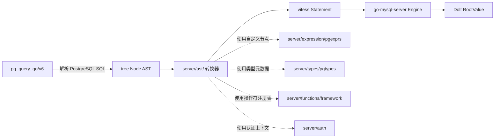

# AST 转换层详解

DoltgreSQL 的 AST 转换层位于 `server/ast/` 子目录，负责将 `pg_query_go` 解析出的 PostgreSQL 语法树（`tree.Node`）转换为 go-mysql-server（GMS）可执行的 Vitess 语句（`vitess.Statement`）。该层是整个 DoltgreSQL 兼容性的核心——所有 PostgreSQL SQL 语义都必须通过这一层映射到 MySQL 风格的执行计划。

## 概述

AST 转换器采用"按节点类型分派"的设计模式：每个 PostgreSQL AST 节点类型对应一个 `nodeXxx()` 函数，通过 `switch node.(type)` 实现路由。转换过程是纯函数式的——输入是 `*Context` + `tree.Node`，输出是 `vitess.Statement` 或错误。

### 核心设计原则

1. **类型安全**：每个 nodeXxx() 函数都有明确的 Go 类型签名，编译期保证一致性
2. **上下文传递**：通过 `*Context` 传递认证信息和原始查询字符串，避免全局状态
3. **错误即拒绝**：不支持的特性直接返回错误，而非静默忽略或降级
4. **注入式表达式**：通过 `vitess.InjectedExpr` 包装自定义 PG 表达式节点，绕过 GMS 默认处理

## 转换入口：Context

`server/ast/context.go` 定义了转换上下文：

```go
// server/ast/context.go:25-36
type Context struct {
    authContext   *auth.AuthContext
    originalQuery string
}

func NewContext(postgresStmt parser.Statement) *Context {
    return &Context{
        authContext:   auth.NewAuthContext(),
        originalQuery: postgresStmt.SQL,
    }
}
```

关键设计：
- `authContext`：认证上下文，用于在执行过程中追踪当前语句的认证类型（SELECT/INSERT/UPDATE/DELETE）
- `originalQuery`：保留原始 SQL 字符串，便于错误信息和日志追溯

每个顶层语句进入时调用 `NewContext()`，之后所有子节点转换共享同一上下文。

## 表达式转换：nodeExpr()

`server/ast/expr.go` 包含约 979 行的 `nodeExpr()` 函数，是最复杂的转换器。它处理所有 PostgreSQL 表达式类型的转换。

### 架构：InjectedExpr 机制

对于大多数自定义 PG 表达式，转换器使用 `vitess.InjectedExpr` 包装：

```go
// server/ast/expr.go:213-216（二进制运算符示例）
return vitess.InjectedExpr{
    Expression: pgexprs.NewBinaryOperator(operator),
    Children:   vitess.Exprs{left, right},
}, nil
```

`InjectedExpr` 是 Vitess 提供的扩展点，允许在 GMS 执行引擎中注入自定义表达式节点（定义在 `server/expression/`）。标准表达式则直接映射到 `vitess.*` 类型。

### 二元运算符映射

| PostgreSQL tree 操作符 | GMS 表达式工厂 | 说明 |
|---|---|---|
| `Bitand` | `Operator_BinaryBitAnd` | 位与 `&` |
| `Bitor` | `Operator_BinaryBitOr` | 位或 `\|` |
| `Bitxor` | `Operator_BinaryBitXor` | 位异或 |
| `Plus` | `Operator_BinaryPlus` | 加法 `+` |
| `Minus` | `Operator_BinaryMinus` | 减法 `-` |
| `Mult` | `Operator_BinaryMultiply` | 乘法 `*` |
| `Div` | `Operator_BinaryDivide` | 除法 `/` |
| `Mod` | `Operator_BinaryMod` | 取模 `%` |
| `Pow` | 不支持，返回错误 | TODO: 替换为 power 函数 |
| `Concat` | `Operator_BinaryConcatenate` | 字符串拼接 `\|\|` |
| `LShift` | `Operator_BinaryShiftLeft` | 左移 `<<` |
| `RShift` | `Operator_BinaryShiftRight` | 右移 `>>` |
| `JSONFetchVal` | `Operator_BinaryJSONExtractJson` | `->` |
| `JSONFetchText` | `Operator_BinaryJSONExtractText` | `->>` |
| `JSONFetchValPath` | `Operator_BinaryJSONExtractPathJson` | `#>` |
| `JSONFetchTextPath` | `Operator_BinaryJSONExtractPathText` | `#>>` |
| `FloorDiv` | 不支持，返回错误 | TODO: 替换为 floor divide 函数 |
| `Schema` 非 pg_catalog | 返回错误 | 当前仅支持内置操作符 |

### 比较运算符映射

```go
// server/ast/expr.go:356-506（节选）
switch node.Operator {
case tree.EQ:
    return vitess.InjectedExpr{Expression: pgexprs.NewBinaryOperator(framework.Operator_BinaryEqual), ...}
case tree.LT:
    return vitess.InjectedExpr{Expression: pgexprs.NewBinaryOperator(framework.Operator_BinaryLessThan), ...}
case tree.GT:
    return vitess.InjectedExpr{Expression: pgexprs.NewBinaryOperator(framework.Operator_BinaryGreaterThan), ...}
case tree.LE:
    return vitess.InjectedExpr{Expression: pgexprs.NewBinaryOperator(framework.Operator_BinaryLessOrEqual), ...}
case tree.GE:
    return vitess.InjectedExpr{Expression: pgexprs.NewBinaryOperator(framework.Operator_BinaryGreaterOrEqual), ...}
case tree.NE:
    return vitess.InjectedExpr{Expression: pgexprs.NewBinaryOperator(framework.Operator_BinaryNotEqual), ...}
case tree.In, tree.NotIn:
    // 分派到 NewInTuple() / NewInSubquery()
case tree.Like:
    operator = vitess.LikeStr
case tree.NotLike:
    operator = vitess.NotLikeStr
case tree.ILike:
    return nil, errors.Errorf("ILIKE is not yet supported")  // F-078
case tree.SimilarTo:
    return nil, errors.Errorf("similar to is not yet supported")  // F-079
case tree.RegMatch:
    operator = vitess.RegexpStr
case tree.IsDistinctFrom:
    return vitess.InjectedExpr{Expression: pgexprs.NewIsDistinctFrom(), ...}
case tree.Contains:
    return vitess.InjectedExpr{Expression: pgexprs.NewBinaryOperator(framework.Operator_BinaryJSONContainsRight), ...}
case tree.Any, tree.Some, tree.All:
    // 分派到 NewAnyExpr / NewSomeExpr / NewAllExpr
}
```

### 字面量映射

| PostgreSQL Datum 类型 | GMS 表达式构造 | 说明 |
|---|---|---|
| `DInt` | `pgexprs.NewRawLiteralInt64(int64(*node))` | 整型 |
| `DFloat` | `pgexprs.NewRawLiteralFloat64(float64(*node))` | 浮点 |
| `DString` | `pgexprs.NewUnknownLiteral(string(*node))` | 字符串（类型标注为 unknown） |
| `DBool` | `pgexprs.NewRawLiteralBool(bool(*node))` | 布尔 |
| `DDate` | `pgexprs.NewRawLiteralDate(t)` | 日期 |
| `DTimestamp` | `pgexprs.NewRawLiteralTimestamp(node.Time)` | 时间戳 |
| `DTime` | `pgexprs.NewRawLiteralTime(timeofday.TimeOfDay(*node))` | 时间 |
| `DInterval` | `pgexprs.NewExplicitCastInjectable(pgtypes.Interval)` + `NewIntervalLiteral` | 间隔（需类型转换包裹） |
| `DJSON` | `pgexprs.NewRawLiteralJSON(node.JSON.String())` | JSON（以字符串格式存储） |
| `DUuid` | `pgexprs.NewRawLiteralUuid(node.UUID)` | UUID |
| `DDecimal` | `pgexprs.NewRawLiteralNumeric(&node.Decimal)` | 高精度小数 |
| `DBitArray` | 先转为字符串，再 `NewUnsafeLiteral` | 位串（内存表示更冗长） |
| `DHalfFloat` | `pgexprs.NewRawLiteralHalfFloat(...)` | 半精度浮点 |
| `DBytea` | `pgexprs.NewRawLiteralBytes(...)` | bytea |
| `DOid` | `pgexprs.NewRawLiteralOid(internalID)` | OID（经 id.Cache 转换） |
| `NullLiteral` | `&vitess.NullVal{}` | NULL |
| `NumVal` | `pgexprs.NewIntegerLiteral` / `pgexprs.NewNumericLiteral` | 动态数字字面量 |
| `StrVal` | `pgexprs.NewUnknownLiteral(node.RawString())` | 带原始字符串值的字面量 |

**关键设计决策**：字符串字面量使用 `NewUnknownLiteral` 而非强类型字面量。原因是 PostgreSQL 对字面量的隐式类型提升规则比强类型系统更宽松，延迟类型解析到执行阶段更准确。

### 特殊表达式处理

#### COALESCE → FuncExpr

```go
// server/ast/expr.go:300-309
case *tree.CoalesceExpr:
    exprs, err := nodeExprsToSelectExprs(ctx, node.Exprs)
    return &vitess.FuncExpr{
        Name:  vitess.NewColIdent("COALESCE"),
        Exprs: exprs,
    }, nil
```

#### CAST → NewExplicitCastInjectable

```go
// server/ast/expr.go:246-297（节选）
case *tree.CastExpr:
    switch node.SyntaxMode {
    case tree.CastExplicit, tree.CastShort:
        // 标准 CAST 语法
    case tree.CastPrepend:
        // 类型前缀语法：'2024-01-01'::date
        strVal, isStrVal := node.Expr.(*tree.StrVal)
        t, isT := node.Type.(*types.T)
        if isStrVal && isT {
            typedExpr, _ := strVal.ResolveAsType(context.TODO(), nil, t)
            expr, _ = nodeExpr(ctx, typedExpr)
        }
    }
    // 优先使用 Doltgres 自定义类型转换
    if !resolvedType.IsEmptyType() {
        cast, _ := pgexprs.NewExplicitCastInjectable(resolvedType)
        return vitess.InjectedExpr{Expression: cast, Children: vitess.Exprs{expr}}, nil
    }
    // 降级到 Vitess ConvertExpr
    return &vitess.ConvertExpr{Name: "CAST", Expr: expr, Type: convertType}, nil
```

#### BETWEEN → RangeCond 转换

```go
// server/ast/expr.go:780-824
case *tree.RangeCond:
    // BETWEEN 转换为 AND 连接的两个比较表达式
    retExpr := &vitess.AndExpr{
        Left:  {GreaterOrEqual: left, from},
        Right: {LessOrEqual: left, to},
    }
    if node.Symmetric {
        // SYMMETRIC 反转 from/to
    }
    if node.Not {
        retExpr = Not(retExpr)
    }
```

#### 数组下标 → Subscript

```go
// server/ast/expr.go:670-690
case *tree.IndirectionExpr:
    // 仅支持单维下标，不支持 slice
    if len(node.Indirection) > 1 {
        return nil, errors.Errorf("multi dimensional array subscripts are not yet supported")
    }
    if node.Indirection[0].Slice {
        return nil, errors.Errorf("slice subscripts are not yet supported")
    }
    return vitess.InjectedExpr{
        Expression: &pgexprs.Subscript{},
        Children:   vitess.Exprs{childExpr, indexExpr},
    }, nil
```

#### 隐藏列 → 零值注入

在 `nodeSelectExpr()` 和 `nodeExpr()` 中，PostgreSQL 的系统隐藏列被映射为零值：

```go
// server/ast/expr.go:897-906
switch colName.Name.String() {
case "cmin", "cmax":
    return vitess.InjectedExpr{Expression: pgexprs.NewUnsafeLiteral(uint32(0), pgtypes.Cid)}, nil
case "ctid":
    return vitess.InjectedExpr{Expression: pgexprs.NewUnsafeLiteral(pgtypes.TidValue{}, pgtypes.Tid)}, nil
case "tableoid":
    return vitess.InjectedExpr{Expression: pgexprs.NewUnsafeLiteral(id.Null, pgtypes.Oid)}, nil
case "xmin", "xmax":
    return vitess.InjectedExpr{Expression: pgexprs.NewUnsafeLiteral(uint32(0), pgtypes.Xid)}, nil
}
```

### 函数表达式：nodeFuncExpr()

`server/ast/func_expr.go` 处理 `tree.FuncExpr`：

```go
// server/ast/func_expr.go:29-80
func nodeFuncExpr(ctx *Context, node *tree.FuncExpr) (vitess.Expr, error) {
    // 过滤不支持的特性
    if node.Filter != nil {
        return nil, errors.Errorf("function filters are not yet supported")
    }
    if node.AggType == tree.OrderedSetAgg {
        return nil, errors.Errorf("WITHIN GROUP is not yet supported")
    }
    // 提取函数名和参数
    // 特殊处理 string_agg → group_concat
}
```

特殊映射：`string_agg` → MySQL 的 `group_concat` 聚合函数。

## SELECT 转换：nodeSelect()

`server/ast/select.go` 包含约 261 行，处理 PostgreSQL SELECT 语句到 GMS `vitess.SelectStatement` 的转换。

### 转换入口

```go
// server/ast/select.go:32-78
func nodeSelect(ctx *Context, node *tree.Select) (vitess.SelectStatement, error) {
    // 默认值填充：nil Select → ValuesClause{}
    if node.Select == nil {
        node.Select = &tree.ValuesClause{Rows: []tree.Exprs{}}
    }
    selectStmt, _ := nodeSelectStatement(ctx, node.Select)
    // 依次处理 ORDER BY / WITH / LIMIT / LOCKING
    orderBy, _ := nodeOrderBy(ctx, node.OrderBy)
    with, _ := nodeWith(ctx, node.With)
    limit, _ := nodeLimit(ctx, node.Limit)
    _, _ = nodeLockingClause(ctx, node.Locking)
    // 注入到目标语句
    switch selectStmt := selectStmt.(type) {
    case *vitess.ParenSelect:
        return selectStmt, nil
    case *vitess.Select:
        selectStmt.OrderBy = orderBy
        selectStmt.With = with
        selectStmt.Limit = limit
        return selectStmt, nil
    case *vitess.SetOp:
        selectStmt.OrderBy = orderBy
        selectStmt.With = with
        selectStmt.Limit = limit
        return selectStmt, nil
    }
}
```

### nodeSelectStatement() 分派

```go
// server/ast/select.go:81-99
func nodeSelectStatement(ctx *Context, node tree.SelectStatement) (vitess.SelectStatement, error) {
    ctx.Auth().PushAuthType(auth.AuthType_SELECT)
    defer ctx.Auth().PopAuthType()
    switch node := node.(type) {
    case *tree.ParenSelect:
        return nodeParenSelect(ctx, node)
    case *tree.SelectClause:
        return nodeSelectClause(ctx, node)
    case *tree.UnionClause:
        return nodeUnionClause(ctx, node)
    case *tree.ValuesClause:
        return nodeValuesClause(ctx, node)
    }
}
```

### SELECT 列表：未限定名称与哨兵值

```go
// server/ast/select.go:212-233
func nodeSelectExprs(ctx *Context, node tree.SelectExprs) (vitess.SelectExprs, error) {
    for i := range node {
        // 未限定字符串字面量使用 ?column? 占位符
        // 用唯一索引哨兵避免 GMS alias scope 冲突
        if _, isStrVal := node[i].Expr.(*tree.StrVal); isStrVal && node[i].As == "" {
            node[i].As = tree.UnrestrictedName(fmt.Sprintf("%s%d", UnknownColSentinelPrefix, i))
        }
        selectExprs[i], err = nodeSelectExpr(ctx, node[i])
    }
}
```

关键设计：多个未命名字符串字面量列之间会产生命名冲突，因此使用索引哨兵（如 `_unknown_col_0`、`_unknown_col_1`）代替直接的 `?column?`，在 handler 层再映射回 `?column?`。

### nodeSelectClause()：隐式 JOIN 重写入

`server/ast/select_clause.go` 实现了重要的隐式 JOIN 检测逻辑：当 FROM 子句包含两个表且 WHERE 条件中包含跨表等值比较时，自动重写为显式 JOIN：

```go
// server/ast/select_clause.go:40-99（节选）
if len(node.From.Tables) == 2 && node.Where != nil {
    // 遍历表名和别名映射
    // 深入 WHERE 表达式，检测跨表 EQ 条件
    if !delveExprs(node.Where.Expr) {
        goto PostJoinRewrite
    }
    // 重写在 WHERE 中的跨表 EQ 到 JOIN 条件
}
```

该机制解决 GMS 处理内连接方式与 Doltgres 表达式不兼容的问题。

### 值子句：nodeValuesClause()

```go
// server/ast/values_clause.go:24-47
func nodeValuesClause(ctx *Context, node *tree.ValuesClause) (*vitess.Select, error) {
    valTuples := make([]vitess.ValTuple, len(node.Rows))
    for i := range node.Rows {
        exprs, _ := nodeExprs(ctx, node.Rows[i])
        valTuples[i] = vitess.ValTuple(exprs)
    }
    return &vitess.Select{
        SelectExprs: vitess.SelectExprs{&vitess.StarExpr{}},
        From: vitess.TableExprs{&vitess.AliasedTableExpr{
            Expr: &vitess.ValuesStatement{Rows: valTuples},
        }},
    }, nil
}
```

VALUES 子句被转换为 `SELECT * FROM (VALUES (...), (...))` 的 Vitess 形式。

## DML 转换

### INSERT：nodeInsert()

`server/ast/insert.go` 处理 INSERT 语句转换：

```go
// server/ast/insert.go:27-143（结构摘要）
func nodeInsert(ctx *Context, node *tree.Insert) (insert *vitess.Insert, err error) {
    ctx.Auth().PushAuthType(auth.AuthType_INSERT)
    defer ctx.Auth().PopAuthType()

    // 1. RETURNING 子句转换
    if returning, ok := node.Returning.(*tree.ReturningExprs); ok {
        returningExprs, _ = nodeSelectExprs(ctx, tree.SelectExprs(*returning))
    }

    // 2. ON CONFLICT 处理
    if node.OnConflict != nil {
        if isIgnore(node.OnConflict) {
            ignore = vitess.IgnoreStr  // DO NOTHING → INSERT IGNORE
        } else if supportedOnConflictClause(node.OnConflict) {
            // DO UPDATE → OnDup
        } else {
            return nil, errors.Errorf("the ON CONFLICT clause provided is not yet supported")
        }
    }

    // 3. 表名解析（禁止别名子查询）
    switch node.Table.(type) {
    case *tree.AliasedTableExpr:
        return nil, errors.Errorf("aliased inserts are not yet supported")  // F-076
    case *tree.TableName:
        tableName, _ = nodeTableName(ctx, node)
    }

    // 4. VALUES → AliasedValues 转换
    if vSelect, ok := rows.(*vitess.Select); ok {
        // VALUES 语句转为 AliasedValues 以适配 GMS
    }

    return &vitess.Insert{
        Action: vitess.InsertStr,
        Ignore: ignore,
        Table:  tableName,
        Returning: returningExprs,
        // ...
    }, nil
}
```

ON CONFLICT 检测逻辑（`isIgnore()`）：
```go
// server/ast/insert.go:147-150
func isIgnore(conflict *tree.OnConflict) bool {
    return conflict.ArbiterPredicate == nil &&
        conflict.Exprs == nil &&
        conflict.Where == nil &&
        conflict.Action == tree.OnConflictActionDoNothing
}
```

### UPDATE：nodeUpdate()

`server/ast/update.go` 处理 UPDATE：

```go
// server/ast/update.go:25-93（结构摘要）
func nodeUpdate(ctx *Context, node *tree.Update) (update *vitess.Update, err error) {
    ctx.Auth().PushAuthType(auth.AuthType_UPDATE)
    defer ctx.Auth().PopAuthType()

    // RETURNING 子句
    if returning, ok := node.Returning.(*tree.ReturningExprs); ok {
        returningExprs, _ = nodeSelectExprs(ctx, tree.SelectExprs(*returning))
    }

    // FROM 子句 → JOIN 重写
    tableExprs := vitess.TableExprs{table}
    if len(node.From) > 0 {
        // 将 FROM 表构建为 JoinTableExpr
        tableExprs = []vitess.TableExpr{
            &vitess.JoinTableExpr{
                Join:     vitess.JoinStr,
                LeftExpr: buildJoinTableExpressionTree(ctx, vitessTableExprs),
                RightExpr: table,
            },
        }
    }

    return &vitess.Update{
        TableExprs: tableExprs,
        Exprs:      exprs,
        Where:      where,
        OrderBy:    orderBy,
        Limit:      limit,
        Returning:  returningExprs,
    }, nil
}
```

### DELETE：nodeDelete()

`server/ast/delete.go` 处理 DELETE：

```go
// server/ast/delete.go:25-68（结构摘要）
func nodeDelete(ctx *Context, node *tree.Delete) (*vitess.Delete, error) {
    ctx.Auth().PushAuthType(auth.AuthType_DELETE)
    defer ctx.Auth().PopAuthType()

    // RETURNING 子句
    if returning, ok := node.Returning.(*tree.ReturningExprs); ok {
        returningExprs, _ = nodeSelectExprs(ctx, tree.SelectExprs(*returning))
    }

    return &vitess.Delete{
        TableExprs: vitess.TableExprs{table},
        With:       with,
        Where:      where,
        OrderBy:    orderBy,
        Limit:      limit,
        Returning:  returningExprs,
    }, nil
}
```

DOLTREESQL 的 DELETE 和 UPDATE 均支持 `RETURNING` 子句，转换为 GMS 的 `Returning` 字段。

## DDL 转换

### CREATE TABLE：nodeCreateTable()

`server/ast/create_table.go` 处理表创建：

```go
// server/ast/create_table.go:27-124（结构摘要）
func nodeCreateTable(ctx *Context, node *tree.CreateTable) (*vitess.DDL, error) {
    // 1. Storage parameters 不支持
    if len(node.StorageParams) > 0 {
        return nil, errors.Errorf("storage parameters are not yet supported")
    }

    // 2. 持久性策略
    switch node.Persistence {
    case tree.PersistencePermanent:
        isTemporary = false
    case tree.PersistenceTemporary:
        isTemporary = true
    case tree.PersistenceUnlogged:
        return nil, errors.Errorf("UNLOGGED is not yet supported")  // F-072
    }

    // 3. USING / TABLESPACE 不支持
    if node.Using != "" {
        return nil, errors.Errorf("USING is not yet supported")
    }
    if node.Tablespace != "" {
        return nil, errors.Errorf("TABLESPACE is not yet supported")  // F-073
    }

    // 4. AS SOURCE → OptSelect
    if node.AsSource != nil {
        selectStmt, _ := nodeSelect(ctx, node.AsSource)
        optSelect = &vitess.OptSelect{Select: selectStmt}
    }

    // 5. INHERITS → OptLike
    if len(node.Inherits) > 0 {
        optLike = &vitess.OptLike{LikeTables: []vitess.TableName{}}
        for _, table := range node.Inherits {
            likeTable, _ := nodeTableName(ctx, &table)
            optLike.LikeTables = append(optLike.LikeTables, likeTable)
        }
    }

    // 6. PARTITION BY → PartitionOpt（仅解析，GMS 不执行分区）
    if node.PartitionBy != nil {
        ddl.TableSpec.PartitionOpt = &vitess.PartitionOption{...}
    }

    return &vitess.DDL{
        Action:    vitess.CreateStr,
        Table:     tableName,
        IfNotExists: node.IfNotExists,
        Temporary: isTemporary,
        OptSelect: optSelect,
        OptLike:   optLike,
    }, nil
}
```

关键转换细节：
- `INHERITS` 通过 `OptLike` 语义映射——Dolt 的 `CREATE TABLE ... LIKE` 继承源表结构
- `PARTITION BY` 仅记录到 `PartitionOpt`，GMS 引擎不实际执行分区逻辑
- `WITH NO DATA` 直接返回错误

## 特殊处理机制

### 不可解析名称（UnresolvedName）→ ColName

`server/ast/unresolved_object_name.go` 中的 `unresolvedNameToColName()` 将 PostgreSQL 的点分列名解析为 Vitess 的 `ColName`：

```go
// server/ast/expr.go:917-944
func unresolvedNameToColName(name *tree.UnresolvedName) (*vitess.ColName, error) {
    var tableName vitess.TableName
    switch name.NumParts {
    case 4:
        tableName = vitess.TableName{
            Name: vitess.NewTableIdent(name.Parts[1]),
            SchemaQualifier: vitess.NewTableIdent(name.Parts[2]),
            DbQualifier: vitess.NewTableIdent(name.Parts[3]),
        }
    case 3:
        tableName = vitess.TableName{
            Name: vitess.NewTableIdent(name.Parts[1]),
            SchemaQualifier: vitess.NewTableIdent(name.Parts[2]),
        }
    case 2:
        tableName = vitess.TableName{Name: vitess.NewTableIdent(name.Parts[1])}
    case 1:
        // 无表名前缀
    }
    return &vitess.ColName{
        Name:      vitess.NewColIdent(name.Parts[0]),
        Qualifier: tableName,
    }, nil
}
```

支持 1-4 段命名（`col`、`table.col`、`schema.table.col`、`db.schema.table.col`）。

### 类型转换：translateConvertType()

```go
// server/ast/expr.go:949-978
func translateConvertType(convertType *vitess.ConvertType) (*vitess.ConvertType, error) {
    switch strings.ToLower(convertType.Type) {
    case "text", "character varying", "varchar":
        return &vitess.ConvertType{Type: expression.ConvertToChar}, nil
    case "integer", "bigint":
        return &vitess.ConvertType{Type: expression.ConvertToSigned}, nil
    case "decimal", "numeric":
        return &vitess.ConvertType{Type: expression.ConvertToFloat}, nil
    case "boolean":
        return &vitess.ConvertType{Type: expression.ConvertToSigned}, nil
    case "timestamp", "timestamp with time zone", "timestamp without time zone":
        return &vitess.ConvertType{Type: expression.ConvertToDatetime}, nil
    }
}
```

PostgreSQL 类型名被映射为 Vitess 的转换类型标识符。

### PostgresExpressionFactory

`server/expression/expr_factory.go` 实现了 GMS 的 `expression.ExpressionFactory` 接口：

```go
// server/expression/expr_factory.go:24-31
type PostgresExpressionFactory struct{}

func (m PostgresExpressionFactory) NewIsNull(e sql.Expression) sql.Expression {
    return NewIsNull(e)
}

func (m PostgresExpressionFactory) NewIsNotNull(e sql.Expression) sql.Expression {
    return NewIsNotNull(e)
}
```

该工厂确保 IS NULL / IS NOT NULL 表达式使用 PostgreSQL 语义的自定义节点。

## 转换流程图

```mermaid
flowchart TD
    A[PostgreSQL SQL 字符串] --> B[pg_query_go 解析器]
    B --> C[tree.Node AST]
    C --> D{顶层节点类型?}

    D -->|tree.Expr| E[nodeExpr\(\)]
    D -->|tree.Select| F[nodeSelect\(\)]
    D -->|tree.Insert| G[nodeInsert\(\)]
    D -->|tree.Update| H[nodeUpdate\(\)]
    D -->|tree.Delete| I[nodeDelete\(\)]
    D -->|tree.CreateTable| J[nodeCreateTable\(\)]

    E --> K{子类型?}
    K -->|BinaryExpr| L[pgexprs.NewBinaryOperator\(\)]
    K -->|ComparisonExpr| M[pgexprs.NewBinaryOperator\(\) / vitess.ComparisonExpr]
    K -->|DInt/DFloat/DBool| N[pgexprs.NewRawLiteral*]
    K -->|CastExpr| O[pgexprs.NewExplicitCastInjectable]
    K -->|FuncExpr| P[nodeFuncExpr\(\)]
    K -->|RangeCond| Q[BETWEEN → AndExpr 展开]
    K -->|IndirectionExpr| R[pgexprs.Subscript]

    F --> S[nodeSelectStatement\(\)]
    S --> T{子类型?}
    T -->|SelectClause| U[nodeSelectClause\(\)]
    T -->|UnionClause| V[nodeUnionClause\(\)]
    T -->|ValuesClause| W[nodeValuesClause\(\)]
    T -->|ParenSelect| X[nodeParenSelect\(\)]

    U --> Y[隐式 JOIN 重写入检测]

    G --> Z[ON CONFLICT 策略判断]
    Z --> AA[DO NOTHING → Insert.Ignore]
    Z --> BB[DO UPDATE → OnDup]

    J --> CC[Persistence 策略]
    CC --> DD[Permanent → 普通表]
    CC --> EE[Temporary → 临时表]
    CC --> FF[Unlogged → 错误]
    CC --> GG[INHERITS → OptLike]
    CC --> HH[USING/TABLESPACE → 错误]

    E --> I1[vitess.Expr]
    F --> I2[vitess.SelectStatement]
    G --> I3[vitess.Insert]
    H --> I4[vitess.Update]
    I --> I5[vitess.Delete]
    J --> I6[vitess.DDL]

    I1 --> Z1[go-mysql-server 执行引擎]
    I2 --> Z1
    I3 --> Z1
    I4 --> Z1
    I5 --> Z1
    I6 --> Z1
    Z1 --> Z2[Dolt RootValue / Proly Tree]
```

## 已知限制

以下限制均来自源码实际检查，按严重级别分类：

### 表达式层限制

| 限制 | 源码位置 | 错误信息 | 级别 |
|------|---------|---------|------|
| ILIKE / NOT ILIKE | expr.go:429 | `ILIKE is not yet supported` | P2 |
| SIMILAR TO | expr.go:433 | `similar to is not yet supported` | P2 |
| ~* / !~*（正则忽略大小写） | expr.go:441 | `~* is not yet supported` | P2 |
| @@（文本搜索） | expr.go:445 | `@@ is not yet supported` | P2 |
| &&（数组重叠） | expr.go:482 | `&& is not yet supported` | P2 |
| POW 运算符 | expr.go:182 | `the power operator is not yet supported` | P2 |
| FloorDiv 运算符 | expr.go:177 | `the floor divide operator is not yet supported` | P2 |
| IS OF | expr.go:710 | `IS OF is not yet supported` | P2 |
| IFERROR | expr.go:637 | `IFERROR is not yet supported` | P2 |
| ANNOTATE_TYPE | expr.go:107 | `ANNOTATE_TYPE is not yet supported` | P2 |
| 多维数组下标 | expr.go:677 | `multi dimensional array subscripts are not yet supported` | P2 |
| 数组 slice 下标 | expr.go:679 | `slice subscripts are not yet supported` | P2 |
| tuple 标签 | expr.go:838 | `tuple labels are not yet supported` | P2 |
| (E).* 通配符 | expr.go:851 | `(E).* is not yet supported` | P2 |
| 非 pg_catalog schema 操作符 | expr.go:149 | `schema %q not allowed in OPERATOR syntax` | P2 |
| table.* 全列选择（特定上下文） | expr.go:92 | `table.* syntax is not yet supported in this context` | P2 |
| 引用超出 schema/db 的对象 | expr.go:107 | `referencing items outside the schema or database is not yet supported` | P2 |
| 引用超出数据库的对象（列名） | expr.go:330 | `referencing items outside the database is not yet supported` | P2 |

### DML 层限制

| 限制 | 源码位置 | 错误信息 | 级别 |
|------|---------|---------|------|
| ON CONFLICT 复杂子句 | insert.go:72 | `the ON CONFLICT clause provided is not yet supported` | P2 |
| 别名子查询插入 | insert.go:78 | `aliased inserts are not yet supported` | P2 |
| 表引用插入 | insert.go:86 | `table refs are not yet supported` | P2 |
| DArray 表达式 | expr.go:508 | `the statement is not yet supported` | P2 |
| DBox2D / DBytes / DCollatedString | expr.go:520-525 | `the statement is not yet supported` | P2 |
| DEnum / DTuple | expr.go:538, 599 | `the statement is not yet supported` | P2 |
| DGeography / DGeometry | expr.go:543-546 | `the statement is not yet supported` | P2 |
| DIPAddr | expr.go:548 | `the statement is not yet supported` | P2 |

### DDL 层限制

| 限制 | 源码位置 | 错误信息 | 级别 |
|------|---------|---------|------|
| UNLOGGED 表 | create_table.go:52 | `UNLOGGED is not yet supported` | P2 |
| USING 子句 | create_table.go:58 | `USING is not yet supported` | P2 |
| TABLESPACE 子句 | create_table.go:61 | `TABLESPACE is not yet supported` | P2 |
| STORAGE PARAMETERS | create_table.go:32 | `storage parameters are not yet supported` | P2 |
| WITH NO DATA | create_table.go:86 | `WITH NO DATA is not yet supported` | P2 |
| PARTITION OF | create_table.go:122 | `PARTITION OF is not yet supported` | P2 |

### 函数层限制

| 限制 | 源码位置 | 错误信息 | 级别 |
|------|---------|---------|------|
| 函数过滤器（FILTER WHERE） | func_expr.go:34 | `function filters are not yet supported` | P2 |
| WITHIN GROUP 聚合 | func_expr.go:37 | `WITHIN GROUP is not yet supported` | P2 |

### COLLATE 处理

```go
// server/ast/expr.go:310-312
case *tree.CollateExpr:
    logrus.Warnf("collate is not yet supported, ignoring")
    return nodeExpr(ctx, node.Expr)
```

COLLATE 表达式不报错，但被**静默忽略**——这是少数不直接返回错误的"软不支持"案例。

## 依赖关系



核心依赖：
- `github.com/dolthub/pg_query_go/v6`：PostgreSQL SQL 解析器，产出 `tree.Node`
- `github.com/dolthub/vitess/go/vt/sqlparser`：Vitess SQL AST，作为转换目标格式
- `github.com/dolthub/go-mysql-server`：GMS 执行引擎
- `github.com/dolthub/doltgresql/server/expression`：自定义 PG 表达式节点库
- `github.com/dolthub/doltgresql/server/types`：PG 类型元数据
- `github.com/dolthub/doltgresql/server/functions/framework`：操作符注册表

```{toctree}
:hidden:
```
