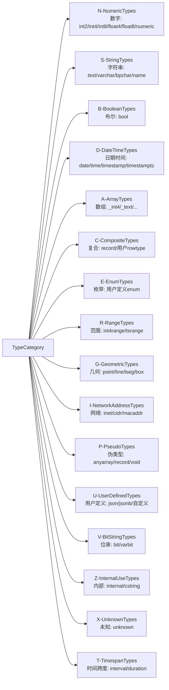
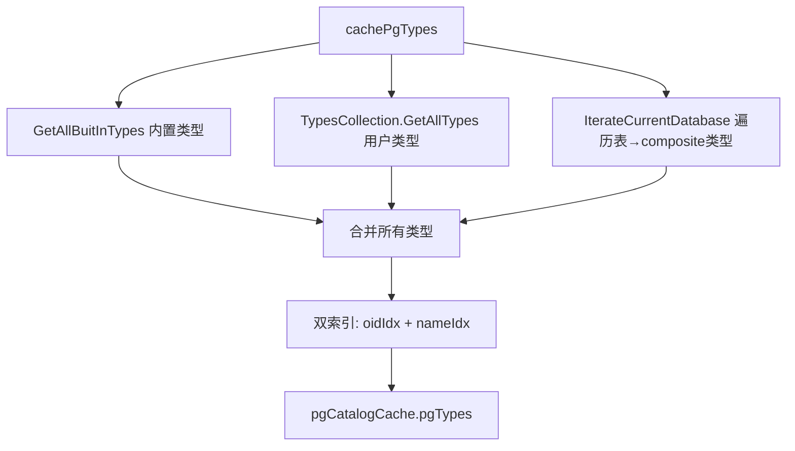
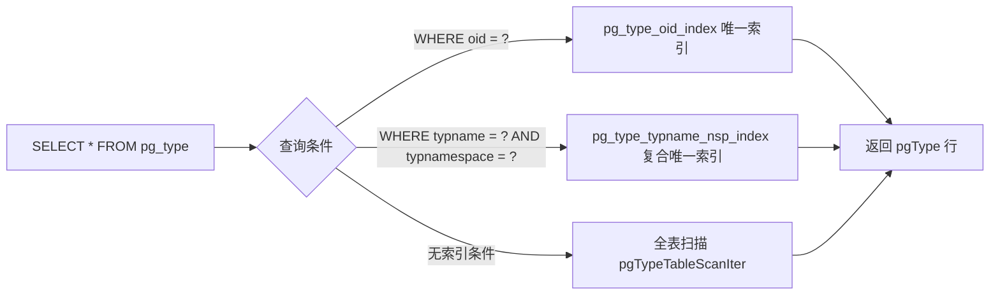

# DoltgresType 类型系统

DoltgreSQL 的类型系统以 PostgreSQL `pg_type` 系统目录为完整映射目标，通过 `DoltgresType` 结构体承载约 100+ 个字段，支持 16 种 TypeCategory 大类和 7 种 TypeType 子类型，并实现了多层序列化/反序列化策略以适配 Dolt 存储引擎。

## DoltgresType 结构体

`DoltgresType` 定义于 [type.go](file:///d:/spaces/SpecWeave/external/dao/action/DoltHub/doltgresql/server/types/type.go)，其字段与 PostgreSQL `pg_type` 系统表几乎一一对应（[F-021](../source.md#f-021)）。结构体实现了六个接口：`sql.ExtendedType`、`sql.NullType`、`sql.StringType`、`sql.NumberType`、`val.TupleTypeHandler`、`typeinfo.ExtendedType`。

### 三层字段分类

**第一层：pg_type 核心字段（对应系统目录）**

| 字段 | 类型 | 说明 |
|------|------|------|
| `ID` | `id.Type` | 全局唯一类型标识符 |
| `TypType` | `TypeType` | 类型子类型（b/c/d/e/p/r/m）[F-022](../source.md#f-022) |
| `TypCategory` | `TypeCategory` | 类型大类（16 种字符编码）[F-023](../source.md#f-023) |
| `TypLength` | `int16` | -1 = 变长；正数 = 固定字节长度 |
| `PassedByVal` | `bool` | 按值传递（小类型优化） |
| `IsPreferred` | `bool` | 是否优先转化目标（如 `bool`、`text`）|
| `IsDefined` | `bool` | 类型是否已完整定义 |
| `Delimiter` | `string` | 数组元素分隔符，默认 `","` |
| `Align` | `TypeAlignment` | 内存对齐方式（c/s/i/d）[F-024](../source.md#f-024) |
| `Storage` | `TypeStorage` | 存储策略（p/e/m/x）[F-025](../source.md#f-025) |
| `InputFunc/OutputFunc/ReceiveFunc/SendFunc` | `uint32` | I/O 函数注册 ID |
| `ModInFunc/ModOutFunc/AnalyzeFunc` | `uint32` | 类型修饰符与分析函数 |
| `Elem` | `*DoltgresType` | 数组元素类型 |
| `Array` | `*DoltgresType` | 对应的数组类型 |
| `BaseTypeType` | `*DoltgresType` | 域类型的基础类型 |
| `NotNull` | `bool` | 域类型是否 NOT NULL |
| `TypMod` | `int32` | 类型修饰符 |
| `NDims` | `int32` | 数组维度数 |
| `TypCollation` | `id.Collation` | 排序规则 |
| `RelID` | `id.Id` | 复合类型关联的表关系 ID |
| `SubscriptFunc` | `uint32` | 下标访问函数 |

**第二层：扩展元数据（非 pg_type 标准字段）**

| 字段 | 类型 | 说明 |
|------|------|------|
| `Checks` | `[]*sql.CheckDefinition` | 域类型检查约束 |
| `attTypMod` | `int32` | 属性级类型修饰符（列定义用） |
| `CompareFunc` | `uint32` | 比较函数 |
| `InternalName` | `string` | 内部别名（如 `int2` → `smallint`）[F-026](../source.md#f-026) |
| `EnumLabels` | `map[string]EnumLabel` | 枚举标签及排序顺序 |
| `CompositeAttrs` | `[]CompositeAttribute` | 复合类型属性列表 |
| `IsSerial` | `bool` | 是否为 serial 系列伪类型 |

**第三层：运行时缓存（不持久化）**

| 字段 | 类型 | 说明 |
|------|------|------|
| `IsUnresolved` | `bool` | 类型是否尚未解析 |
| `UnresolvedTypmods` | `[]any` | 等待解析的类型修饰符 |
| `BaseTypeForInternal` | `id.Type` | INTERNAL 类型的底层类型 |
| `SerializationFunc` | `internalSerializationFunc` | 内部序列化函数 |
| `DeserializationFunc` | `internalDeserializationFunc` | 内部反序列化函数 |
| `castCache` | `map[*typePair]*Cast` | 转换缓存 |
| `mutex` | `sync.Mutex` | 线程安全锁 |
| `outFuncID/outFunc` | `uint32` / `QuickFunction` | 输出函数缓存 |

### internalNullType 单例

所有未初始化的指针字段默认指向 `internalNullType`，避免 nil 解引用（[F-027](../source.md#f-027)）：

```go
// F-027: internalNullType 是全局 null 类型单例
var internalNullType = &DoltgresType{ID: id.NullType, IsUnresolved: false}
```

`Init()` 函数（[init.go](file:///d:/spaces/SpecWeave/external/dao/action/DoltHub/doltgresql/server/types/init.go)）修复循环引用，使 `internalNullType` 的 `Array`、`Elem`、`BaseTypeType` 均自指：

```go
func Init() {
    internalNullType.Array = internalNullType
    internalNullType.Elem = internalNullType
    internalNullType.BaseTypeType = internalNullType
}
```

## 类型分类

### TypeType：7 种子类型

[F-022](../source.md#f-022) 定义了 PostgreSQL 的 7 种类型子类型（`pg_type.typtype`）：

| 常量 | 值 | 含义 | 典型类型 |
|------|-----|------|---------|
| `TypeType_Base` | `"b"` | 基础类型 | `int4`、`text`、`bool` |
| `TypeType_Composite` | `"c"` | 复合类型（表行类型） | 用户创建表的 row type |
| `TypeType_Domain` | `"d"` | 域类型 | `CREATE DOMAIN` 创建的约束类型 |
| `TypeType_Enum` | `"e"` | 枚举类型 | `CREATE TYPE ... AS ENUM` |
| `TypeType_Pseudo` | `"p"` | 伪类型 | `anyarray`、`record`、`void` |
| `TypeType_Range` | `"r"` | 范围类型 | `int4range`、`tsrange` |
| `TypeType_MultiRange` | `"m"` | 多范围类型 | `int4multirange` |

### TypeCategory：16 种大类

[F-023](../source.md#f-023) 定义了 16 种类型大类（`pg_type.typcategory`），用于参数解析、运算符解析等场景：



### 关键判断方法

`DoltgresType` 提供了丰富的类型判断方法（[F-028](../source.md#f-028)）：

```go
// F-028: 类型判断方法
IsArrayType() bool      // 是否为数组类型（TypCategory=ArrayTypes 且 Elem 非 null）
IsArrayCategory() bool   // 是否为数组大类
IsVectorType() bool      // 是否为 legacy vector 类型（int2vector/oidvector）
IsCompositeType() bool   // 是否为复合类型（TypeType=Composite 或 record）
IsRecordType() bool      // 是否为匿名 record 类型
IsPolymorphicType() bool // 是否为多态类型（anyelement/anyarray/anynonarray/anyenum/anyrange）
IsResolvedType() bool    // 是否为已解析类型
```

## 内置类型系统

### 注册表模式

[F-029](../source.md#f-029) 内置类型通过全局 Map 管理，在 `init()` 中填充：

```go
// F-029: 内置类型注册表
var IDToBuiltInDoltgresType map[id.Type]*DoltgresType   // ID → 类型实例
var NameToInternalID = map[string]id.Type{}              // 名称 → ID
var idToInternalSerializationFunc = map[id.Function]internalSerializationFunc{}
var idToInternalDeserializationFunc = map[id.Function]internalDeserializationFunc{}
```

`init()` 函数（[globals.go](file:///d:/spaces/SpecWeave/external/dao/action/DoltHub/doltgresql/server/types/globals.go)）初始化约 80+ 个内置类型映射，并构建序列化/反序列化函数索引。其中许多类型标记为 `Unknown`（暂未实现），如 `box`、`circle`、`inet` 等。

### 具体类型示例

**Bool 类型**（[bool.go](file:///d:/spaces/SpecWeave/external/dao/action/DoltHub/doltgresql/server/types/bool.go)）— 固定 1 字节，按值传递，字符对齐：

```go
// F-030: Bool 类型定义
var Bool = &DoltgresType{
    ID:            toInternal("bool"),
    TypLength:     int16(1),
    PassedByVal:   true,
    TypType:       TypeType_Base,
    TypCategory:   TypeCategory_BooleanTypes,
    IsPreferred:   true,
    Align:         TypeAlignment_Char,
    Storage:       TypeStorage_Plain,
    SerializationFunc:   serializeTypeBool,
    DeserializationFunc: deserializeTypeBool,
}
// 序列化：true→[]byte{1}, false→[]byte{0}
```

**Int32 类型**（[int32.go](file:///d:/spaces/SpecWeave/external/dao/action/DoltHub/doltgresql/server/types/int32.go)）— 4 字节大端序 + 偏移 `2^31`，使负数字节比较正确：

```go
// F-031: Int32 序列化（偏移编码保证字节序比较正确）
func serializeTypeInt32(ctx *sql.Context, t *DoltgresType, val any) ([]byte, error) {
    retVal := make([]byte, 4)
    binary.BigEndian.PutUint32(retVal, uint32(val.(int32))+(1<<31))
    return retVal, nil
}
func deserializeTypeInt32(ctx *sql.Context, t *DoltgresType, data []byte) (any, error) {
    if len(data) == 0 { return nil, nil }
    return int32(binary.BigEndian.Uint32(data) - (1 << 31)), nil
}
```

**VarChar 类型**（[varchar.go](file:///d:/spaces/SpecWeave/external/dao/action/DoltHub/doltgresql/server/types/varchar.go)）— 变长字符串（`TypLength=-1`，`Storage=Extended`），`attTypMod` 编码长度限制（`length + 4`）：

```go
// F-032: VarChar 变长字符串，attTypMod = length + 4
var VarChar = &DoltgresType{
    ID:          toInternal("varchar"),
    TypLength:   int16(-1),
    Storage:     TypeStorage_Extended,
    // attTypMod 编码: length + 4
}
func GetTypModFromCharLength(typName string, l int32) (int32, error) {
    return l + 4, nil  // attTypMod = length + 4
}
func GetCharLengthFromTypmod(typmod int32) int32 {
    return typmod - 4
}
```

**Text 类型**（[text.go](file:///d:/spaces/SpecWeave/external/dao/action/DoltHub/doltgresql/server/types/text.go)）— 无长度限制变长字符串，`IsPreferred=true`。

**Json 类型**（[json.go](file:///d:/spaces/SpecWeave/external/dao/action/DoltHub/doltgresql/server/types/json.go)）— `TypCategory=UserDefinedTypes`，序列化为纯字节，反序列化还原为 `string`。

## 类型工厂模式

### BaseTypeDefinition 工厂

[F-033](../source.md#f-033) `BaseTypeDefinition`（[base.go](file:///d:/spaces/SpecWeave/external/dao/action/DoltHub/doltgresql/server/types/base.go)）封装基础类型创建参数：

```go
// F-033: BaseTypeDefinition 工厂结构
type BaseTypeDefinition struct {
    InputFunc, OutputFunc, ReceiveFunc, SendFunc uint32
    ModInFunc, ModOutFunc, CompareFunc            uint32
    TypLength   int16
    PassedByVal bool
    Align       TypeAlignment
    Storage     TypeStorage
    TypCategory TypeCategory
    IsPreferred bool
    Default     string
    Elem        *DoltgresType
    Delimiter   string
    Collatable  bool
}

func NewBaseTypeDefinition() BaseTypeDefinition {
    return BaseTypeDefinition{
        TypLength:   -1,            // 默认变长
        Align:       TypeAlignment_Int,
        Storage:     TypeStorage_Plain,
        TypCategory: TypeCategory_UserDefinedTypes,
        Delimiter:   ",",
    }
}
```

### 数组类型工厂

`CreateArrayTypeFromBaseType()`（[array.go](file:///d:/spaces/SpecWeave/external/dao/action/DoltHub/doltgresql/server/types/array.go)）创建数组类型并建立双向链接：

```go
// F-034: 数组类型工厂（双向链接）
func CreateArrayTypeFromBaseType(baseType *DoltgresType) *DoltgresType {
    // 数组 ID 遵循 "_" + 元素类型名 约定
    arrayID = id.NewType(baseType.ID.SchemaName(), "_"+baseType.ID.TypeName())
    arrayType := &DoltgresType{
        ID:           arrayID,
        TypCategory:  TypeCategory_ArrayTypes,
        TypLength:    -1,
        PassedByVal:  false,
        Elem:         baseType,       // 指向基础类型
        Storage:      TypeStorage_Extended,
        // ... I/O 函数
    }
    baseType.Array = arrayType    // 反向链接
    return arrayType
}
```

数组序列化格式：`[4字节元素计数][4×(n+1)字节偏移表][元素数据]`，每个元素前有 1 字节 null 标志（[F-035](../source.md#f-035)）。

### 未解析类型工厂

`NewUnresolvedDoltgresType()` 和 `NewUnresolvedArrayDoltgresType()` 用于延迟解析场景（[F-036](../source.md#f-036)）：

```go
// F-036: 未解析类型工厂
func NewUnresolvedDoltgresType(sch, name string) *DoltgresType {
    return &DoltgresType{
        ID:           id.NewType(sch, name),
        Elem:         internalNullType,
        Array:        internalNullType,
        BaseTypeType: internalNullType,
        IsUnresolved: true,
    }
}
func NewUnresolvedArrayDoltgresType(sch, elemName string) *DoltgresType {
    return &DoltgresType{
        ID:           id.NewType(sch, "_"+elemName),
        IsUnresolved: true,
        TypCategory:  TypeCategory_ArrayTypes,
        Elem:         &DoltgresType{ID: id.NewType(sch, elemName), IsUnresolved: true},
    }
}
```

### 其他类型工厂

| 工厂函数 | 文件 | 说明 |
|---------|------|------|
| `NewEnumType()` | [enum.go](file:///d:/spaces/SpecWeave/external/dao/action/DoltHub/doltgresql/server/types/enum.go) | 枚举类型，含 `EnumLabels` 映射和标签校验 |
| `NewDomainType()` | [domain.go](file:///d:/spaces/SpecWeave/external/dao/action/DoltHub/doltgresql/server/types/domain.go) | 域类型，`BaseTypeType` 指向基础类型，约束在 IoInput 阶段检查 |
| `NewCompositeType()` | [composite.go](file:///d:/spaces/SpecWeave/external/dao/action/DoltHub/doltgresql/server/types/composite.go) | 复合类型，关联表 `RelID` 和属性列表 |
| `NewVarCharType()` | [varchar.go](file:///d:/spaces/SpecWeave/external/dao/action/DoltHub/doltgresql/server/types/varchar.go) | 带长度限制的 VarChar |

## 序列化/反序列化

### 三层策略

`SerializeValue()` 和 `DeserializeValue()` 实现了三层回退策略（[F-037](../source.md#f-037)）：

```mermaid
flowchart TD
    A[SerializeValue val] --> B{SerializationFunc != nil?}
    B -->|是| C[调用 SerializationFunc]
    B -->|否| D{codec != nil?}
    D -->|是| E[调用 TypeCodec.Serialize]
    D -->|否| F[调用 CallSend SendFunc]
    C --> G[返回 []byte]
    E --> G
    F --> G

    H[DeserializeValue bytes] --> I{DeserializationFunc != nil?}
    I -->|是| J[调用 DeserializationFunc]
    I -->|否| K{codec != nil?}
    K -->|是| L[调用 TypeCodec.Deserialize]
    K -->|否| M[调用 CallReceive ReceiveFunc]
    J --> N[返回 any]
    L --> N
    M --> N
```

**第一层：`SerializationFunc` / `DeserializationFunc`** — 每个类型文件自定义的最优实现。例如：
- `serializeTypeBool`：1 字节编码
- `serializeTypeInt32`：大端序 + `2^31` 偏移
- `serializeTypeEnum`：字符串 + 标签校验
- `serializeTypeArray`：偏移表格式

**第二层：`TypeCodec`**（[type_codec.go](file:///d:/spaces/SpecWeave/external/dao/action/DoltHub/doltgresql/server/types/type_codec.go)）— 存储编解码器接口，通过 `SendFunc` 名称查找注册的 codec：

```go
// F-038: TypeCodec 存储编解码器
type TypeCodec struct {
    Serialize         func(val any) ([]byte, error)
    Deserialize       func(data []byte) (any, error)
    SerializedCompare func(left, right []byte) (int, error)
    VectorIndexable   bool
}
func (t *DoltgresType) codec() *TypeCodec {
    return LoadTypeCodec(globalFunctionRegistry.GetString(t.SendFunc))
}
```

**第三层：`CallSend` / `CallReceive`** — 通过 `globalFunctionRegistry` 调用注册函数，处理 `ModInFunc`/数组/域/枚举/复合等特殊情况。

### 类型元数据序列化

`Serialize()` 方法（[serialization.go](file:///d:/spaces/SpecWeave/external/dao/action/DoltHub/doltgresql/server/types/serialization.go)）将完整的 `DoltgresType` 序列化为字节流，用于 Dolt 存储中的类型元数据。版本号为 `0`，按顺序写入所有字段（[F-039](../source.md#f-039)）：

```go
// F-039: 类型元数据序列化（Version 0）
func (t *DoltgresType) Serialize() []byte {
    writer := utils.NewWriter(256)
    writer.VariableUint(0) // Version
    writer.Id(t.ID.AsId())
    writer.Int16(t.TypLength)
    writer.Bool(t.PassedByVal)
    writer.String(string(t.TypType))
    writer.String(string(t.TypCategory))
    // ... 逐个写入所有字段
    return writer.Data()
}
```

反序列化时通过 `prefillTypeDuringDeserialization()` 预填充内置类型，再通过 `recursiveDeserializeType()` 递归解析未解析类型（[F-040](../source.md#f-040)）。

## pg_type 虚拟表

### PgTypeHandler 实现

[F-041](../source.md#f-041) `pg_type` 通过 `PgTypeHandler`（[pg_type.go](file:///d:/spaces/SpecWeave/external/dao/action/DoltHub/doltgresql/server/tables/pgcatalog/pg_type.go)）实现 `tables.Handler` 接口，作为虚拟表提供而非实际存储在 Dolt 中。

**31 列 schema**（完整对应 PostgreSQL `pg_type`）：

| 列名 | 类型 | 说明 |
|------|------|------|
| `oid` | `Oid` | 对象 ID |
| `typname` | `Name` | 类型名称 |
| `typnamespace` | `Oid` | 所属 schema OID |
| `typlen` | `Int16` | 固定长度（-1=变长）[F-042](../source.md#f-042) |
| `typbyval` | `Bool` | 是否按值传递 |
| `typtype` | `InternalChar` | 类型子类型（b/c/d/e/p/r/m）[F-022](../source.md#f-022) |
| `typcategory` | `InternalChar` | 类型大类（16 种）[F-023](../source.md#f-023) |
| `typispreferred` | `Bool` | 是否优先类型 |
| `typisdefined` | `Bool` | 是否已定义 |
| `typdelim` | `InternalChar` | 数组分隔符 |
| `typrelid` | `Oid` | 关联的 rel OID（复合类型） |
| `typelem` | `Oid` | 元素类型 OID（数组类型） |
| `typarray` | `Oid` | 数组类型 OID |
| `typinput/typoutput/typreceive/typsend` | `Regproc` | I/O 函数 |
| `typalign/typstorage` | `InternalChar` | 对齐/存储策略 [F-024/F-025](../source.md#f-024) |
| `typnotnull/typtypmod/typndims` | `Bool/Int32/Int32` | 域类型属性 |
| `typcollation` | `Oid` | 排序规则 OID |
| `typdefaultbin/typdefault/typacl` | `Text/Text/TextArray` | 默认值与权限 |

### 缓存与索引

`cachePgTypes()` 从三个来源构建缓存（[F-043](../source.md#f-043)）：



1. **内置类型**：`pgtypes.GetAllBuitInTypes()` 返回 `IDToBuiltInDoltgresType` 中所有已注册类型
2. **用户类型**：从 `TypesCollection` 获取用户自定义类型（排除 `pg_catalog` 和 `information_schema`）
3. **表 composite 类型**：遍历数据库中的表，为每张表生成对应的复合类型和数组类型

查询路由采用双索引设计（[F-044](../source.md#f-044)）：



## 多态类型

[F-045](../source.md#f-045) 多态类型是特殊的伪类型，用于函数重载解析，使单个函数定义能处理多种具体类型：

| 多态类型 | ID | 有效性约束 | 用途 |
|---------|-----|-----------|------|
| `any` | `any` | 始终有效 | 占位符，允许任意类型 |
| `anyelement` | `anyelement` | 始终有效 | 任意元素类型 |
| `anyarray` | `anyarray` | `TypCategory == ArrayTypes` | 任意数组类型 |
| `anynonarray` | `anynonarray` | `TypCategory != ArrayTypes` | 非数组类型 |
| `anyenum` | `anyenum` | `TypCategory == EnumTypes` | 枚举类型 |
| `anyrange` | `anyrange` | `TypCategory == RangeTypes` | 范围类型 |

```go
// F-046: 多态类型有效性检查
func (t *DoltgresType) IsValidForPolymorphicType(target *DoltgresType) bool {
    switch t.ID.TypeName() {
    case "anyarray":
        return target.TypCategory == TypeCategory_ArrayTypes
    case "anynonarray":
        return target.TypCategory != TypeCategory_ArrayTypes
    case "anyenum":
        return target.TypCategory == TypeCategory_EnumTypes
    case "anyrange":
        return target.TypCategory == TypeCategory_RangeTypes
    default:
        return true
    }
}
```

`AnyArray` 伪类型（[any_array.go](file:///d:/spaces/SpecWeave/external/dao/action/DoltHub/doltgresql/server/types/any_array.go)）的序列化暂未实现，返回错误 `"anyarray serialization is not yet implemented"`。

## 关键设计决策

1. **pg_type 完整映射**：`DoltgresType` 字段与 PostgreSQL `pg_type` 系统目录几乎一一映射，确保客户端工具（如 psql、ORM）能正确读取类型元数据

2. **internalNullType 单例模式**：所有 nil 指针字段统一指向 `internalNullType`，避免 nil 解引用崩溃，同时 `Init()` 修复循环引用保证一致性

3. **整数偏移编码**（`int32` 序列化）：`+ 2^31` 偏移使有符号整数转换为无符号大端序后字节比较结果与数值比较一致，直接兼容 Dolt 的 BTree 存储

4. **三层序列化回退**：`SerializationFunc → TypeCodec → SendFunc/ReceiveFunc`，优先使用最高效的自定义实现，退化到通用编解码器，最终退化到 PostgreSQL 协议函数

5. **数组双向链接**：`baseType.Array ↔ arrayType.Elem` 保持双向一致性，`CreateArrayTypeFromBaseType` 在创建时自动建立双向关系

6. **域类型透明性**：域类型的 `DeserializationFunc` 直接委托给 `BaseTypeType.DeserializeValue`，约束检查仅在 `IoInput`（文本输入）阶段执行，存储层不感知域约束

7. **未解析类型延迟解析**：`IsUnresolved=true` 的类型通过 `recursiveDeserializeType` 在需要时从 `TypesCollection` 动态解析，支持跨 session 的类型引用

## 核心方法速查表

| 方法 | 文件 | 说明 |
|------|------|------|
| `SerializeValue(ctx, val)` | type.go:1284 | 值序列化（三层策略） |
| `DeserializeValue(ctx, bytes)` | type.go:1300 | 值反序列化（三层策略） |
| `Serialize()` | serialization.go:183 | 类型元数据序列化 |
| `Compare(ctx, v1, v2)` | type.go:264 | 值比较（含枚举特殊处理） |
| `Convert/ConvertToType` | type.go:505+ | 类型转换 |
| `IsArrayType/IsCompositeType/IsPolymorphicType` | type.go:788+ | 类型判断 |
| `CallSend/CallReceive` | type.go:1321+ | 调用 Send/Receive 函数 |
| `DomainUnderlyingBaseType()` | type.go | 获取域的基础类型 |
| `ToArrayType()` | type.go | 获取数组类型 |
| `Copy()` | type.go:1406 | 深拷贝（不含缓存） |

```{toctree}
:hidden:
```
