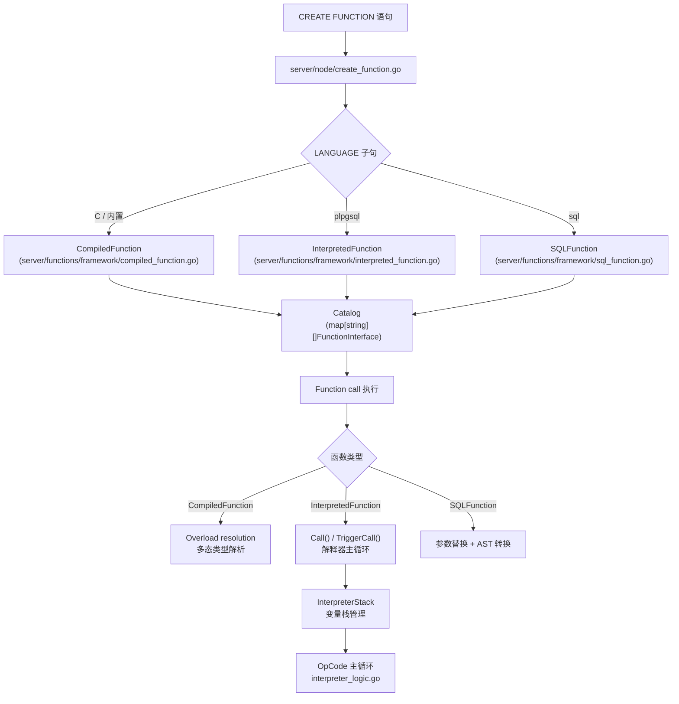

# plpgsql 解释器与函数系统

DoltgreSQL 的函数系统支持三种实现模式：C 语言内置函数（CompiledFunction）、PL/pgSQL 解释函数（InterpretedFunction）和 SQL-language 函数（SQLFunction）。PL/pgSQL 解释器将 PL/pgSQL 源码解析为持久化的 OpCode 序列，由解释器栈驱动执行。

## 三层函数执行模型

DoltgreSQL 函数系统采用三层架构：运行时接口层（FunctionInterface）、编译执行层（CompiledFunction）和解释执行层（InterpretedFunction/SQLFunction）。



### FunctionInterface 接口

所有函数类型的统一接口定义在 [functions.go](file:///d:/spaces/SpecWeave/external/dao/action/DoltHub/doltgresql/server/functions/framework/functions.go)，核心方法如下：

```go
// F-105: FunctionInterface 定义
type FunctionInterface interface {
    GetName() string
    GetOutParameters() sql.Schema
    GetReturn() *pgtypes.DoltgresType
    GetInputParameterTypes() []*pgtypes.DoltgresType
    VariadicIndex() int
    GetExpectedParameterCount() int
    NonDeterministic() bool
    IsCVariadic() bool
    IsStrict() bool
    IsSRF() bool
    InternalID() id.Id
    enforceInterfaceInheritance(error)
}
```

### 三种函数实现类型

| 类型 | 文件 | 用途 |
|------|------|------|
| CompiledFunction | [compiled_function.go](file:///d:/spaces/SpecWeave/external/dao/action/DoltHub/doltgresql/server/functions/framework/compiled_function.go) | C 语言/内置函数，含 overload resolution |
| InterpretedFunction | [interpreted_function.go](file:///d:/spaces/SpecWeave/external/dao/action/DoltHub/doltgresql/server/functions/framework/interpreted_function.go) | PL/pgSQL 函数，由解释器栈执行 |
| SQLFunction | [sql_function.go](file:///d:/spaces/SpecWeave/external/dao/action/DoltHub/doltgresql/server/functions/framework/sql_function.go) | SQL-language 函数，参数 map 替换后执行 |

### Function0–Function7：变长参数函数结构

内置函数通过 `Function0` 到 `Function7` 结构体注册，支持 0–7 个元参数：

```go
// F-106: Function1 结构（其余 Function0/Function2–7 结构类似）
type Function1 struct {
    Name               string
    Return             *pgtypes.DoltgresType
    Parameters         [1]*pgtypes.DoltgresType
    Variadic           bool
    IsNonDeterministic bool
    Strict             bool
    SRF                bool
    Callable           func(ctx *sql.Context, paramsAndReturn [2]*pgtypes.DoltgresType, val1 any) (any, error)
    OutParams          sql.Schema
}
```

## PL/pgSQL 解释器

PL/pgSQL 解释器位于 `server/plpgsql/` 目录，将 PL/pgSQL 源码解析为 OpCode 序列后由解释器主循环驱动执行。

### OpCode 体系

[interpreter_operation.go](file:///d:/spaces/SpecWeave/external/dao/action/DoltHub/doltgresql/server/plpgsql/interpreter_operation.go) 定义了 23 种操作码（OpCode 0–22），**注释明确说明 OpCodes 持久化到磁盘，值必须跨版本稳定**：

```go
// F-107: OpCode 定义（23 种操作码）
type OpCode uint16

const (
    OpCode_Alias         OpCode = 0  // DECLARE 别名
    OpCode_Assign        OpCode = 1  // 变量赋值 :=
    OpCode_Case          OpCode = 2  // CASE 语句
    OpCode_Declare       OpCode = 3  // 变量声明
    OpCode_DeleteInto    OpCode = 4  // DELETE ... INTO（TODO: 未实现）
    OpCode_Exception     OpCode = 5  // EXCEPTION 块（TODO: 未实现）
    OpCode_Execute       OpCode = 6  // EXECUTE 动态 SQL
    OpCode_Get           OpCode = 7  // GET DIAGNOSTICS
    OpCode_Goto          OpCode = 8  // 跳转
    OpCode_If            OpCode = 9  // IF 条件
    OpCode_InsertInto    OpCode = 10 // INSERT ... INTO
    OpCode_Perform       OpCode = 11 // PERFORM 语句
    OpCode_Raise         OpCode = 12 // RAISE 异常
    OpCode_Return        OpCode = 13 // RETURN
    OpCode_ScopeBegin    OpCode = 14 // 作用域开始（DoltgreSQL 特有）
    OpCode_ScopeEnd      OpCode = 15 // 作用域结束（DoltgreSQL 特有）
    OpCode_SelectInto    OpCode = 16 // SELECT ... INTO
    OpCode_UpdateInto    OpCode = 17 // UPDATE ... INTO
    OpCode_ReturnQuery   OpCode = 18 // RETURN QUERY
    OpCode_ForQueryInit  OpCode = 19 // FOR .. IN query LOOP 初始化
    OpCode_ForQueryNext  OpCode = 20 // FOR .. IN query LOOP 迭代
    OpCode_DeclareRecord OpCode = 21 // RECORD 变量声明
    OpCode_ExecuteInto   OpCode = 22 // EXECUTE ... INTO（动态 SQL + 结果绑定）
)
```

### InterpreterOperation 结构

每个 OpCode 操作携带丰富的上下文数据：

```go
// F-108: InterpreterOperation 结构
type InterpreterOperation struct {
    OpCode        OpCode            // 操作码
    PrimaryData   string            // 主数据（查询/表达式等）
    SecondaryData []string          // 辅助数据（绑定/严格性等）
    Target        string            // 目标变量名
    Index         int               // 函数计数器索引
    Options       map[string]string // 额外选项（sets_found / loop_condition）
}
```

两个关键 Options 常量用于区分语义相似的操作：

```go
// F-109: Option 常量
const OptionSetsFound = "sets_found"     // 标记更新 FOUND 变量的操作
const OptionLoopCondition = "loop_condition"  // 标记整数 FOR 循环条件跳转
```

### 解释器主循环

[interpreter_logic.go](file:///d:/spaces/SpecWeave/external/dao/action/DoltHub/doltgresql/server/plpgsql/interpreter_logic.go) 中的 `call()` 函数是解释器主循环，通过 switch-case 对每个 OpCode 执行对应操作：

```go
// F-110: 解释器主循环框架
func call(ctx *sql.Context, iFunc InterpretedFunction, stack InterpreterStack) (any, error) {
    counter := -1
    statements := iFunc.GetStatements()
    for {
        counter++
        if counter >= len(statements) { break }
        operation := statements[counter]
        switch operation.OpCode {
        case OpCode_Alias:    // 创建变量别名
        case OpCode_Assign:   // 变量赋值
        case OpCode_If:       // IF 条件分支
        case OpCode_Case:     // CASE 语句
        case OpCode_Return:   // RETURN
        case OpCode_SelectInto: // SELECT ... INTO
        case OpCode_Execute:  // EXECUTE 动态 SQL
        // ... 其余 23 种 OpCode
        }
    }
}
```

### 执行入口：Call() 与 TriggerCall()

两个公共入口函数：

```go
// F-111: Call() — 普通函数调用
func Call(ctx *sql.Context, iFunc InterpretedFunction, runner sql.StatementRunner,
    paramsAndReturn []*pgtypes.DoltgresType, vals []any) (any, error) {
    stack := NewInterpreterStack(runner)
    // 先添加 OUT 参数变量，再添加 IN 参数变量
    // ...
    return call(ctx, iFunc, stack)
}

// F-112: TriggerCall() — 触发器调用
func TriggerCall(ctx *sql.Context, iFunc InterpretedFunction, runner sql.StatementRunner,
    sch sql.Schema, oldRow sql.Row, newRow sql.Row, trigVars map[string]any) (any, error) {
    stack := NewInterpreterStack(runner)
    // 设置 NEW/OLD 特殊变量及触发器变量
    // ...
    return call(ctx, iFunc, stack)
}
```

触发器调用时，特殊变量以折叠名（`NormalizeIdentifier` 处理后的小写形式）入栈，支持 `NEW.x`、`new.x` 等任意大小写写法。

### 解释器栈

[interpreter_stack.go](file:///d:/spaces/SpecWeave/external/dao/action/DoltHub/doltgresql/server/plpgsql/interpreter_stack.go) 实现基于栈的变量管理，支持作用域嵌套和 cursor 状态：

```go
// F-113: InterpreterStack 核心方法
type InterpreterStack interface {
    NewVariable(name string, typ *pgtypes.DoltgresType)
    NewVariableWithValue(name string, typ *pgtypes.DoltgresType, val any)
    NewVariableAlias(name, source string)
    NewRecord(name string, schema sql.Schema, row sql.Row)
    GetVariable(name string) interpreterVariableReference
    SetVariable(ctx *sql.Context, name string, val any) error
    PushScope()
    PopScope()
    SetFound(ctx *sql.Context, found bool) error
    // ... FOR cursor 相关方法
}
```

关键设计：
- **作用域栈**：`PushScope()/PopScope()` 支持 PL/pgSQL 嵌套块
- **RECORD 类型**：RECORD 变量无静态形状，通过 `NewRecord()` 创建带 schema 的记录变量；访问未赋值的 RECORD 字段会触发 `ErrRecordNotAssigned`
- **变量折叠**：所有标识符通过 `NormalizeIdentifier()` 折叠为小写（引号标识符保留大小写），使 `MyVar` 和 `MYVAR` 引用同一变量

### 表达式求值接口

`InterpretedFunction` 接口提供表达式求值的四个查询方法：

```go
// F-114: InterpretedFunction 接口（plpgsql 包内定义）
type InterpretedFunction interface {
    ApplyBindings(ctx *sql.Context, stack InterpreterStack, stmt string,
        bindings []string, enforceType bool) (newStmt string, varFound bool, err error)
    GetAllNames() []string
    GetOutputParameterNamesAndTypes() ([]string, []*pgtypes.DoltgresType)
    GetInputParameterNamesAndTypes() ([]string, []*pgtypes.DoltgresType)
    GetReturn() *pgtypes.DoltgresType
    GetStatements() []InterpreterOperation
    QueryMultiReturn(ctx *sql.Context, stack InterpreterStack, stmt string,
        bindings []string) (schema sql.Schema, rows []sql.Row, err error)
    QueryRowReturn(ctx *sql.Context, stack InterpreterStack, stmt string,
        targetTypes []*pgtypes.DoltgresType, bindings []string) (row sql.Row, ok bool, err error)
    QuerySingleReturn(ctx *sql.Context, stack InterpreterStack, stmt string,
        targetType *pgtypes.DoltgresType, bindings []string) (val any, err error)
    IsSRF() bool
}
```

### plpgsql 源码解析

PL/pgSQL 源码经解析后生成 OpCode 序列，核心文件：
- `parse.go`：PL/pgSQL 源码 → 中间表示
- `statements.go`：语句级解析
- `reconcile_labels.go`：标签（label）解析与 goto 目标解析

## 内置函数注册表

内置函数注册集中在 `server/functions/` 目录，启动时通过 `init()` 函数批量注册。

### Catalog 三张全局表

[catalog.go](file:///d:/spaces/SpecWeave/external/dao/action/DoltHub/doltgresql/server/functions/framework/catalog.go) 定义三张全局注册表：

```go
// F-115: 三张全局函数目录表
var Catalog         = map[string][]FunctionInterface{}         // 普通函数
var AggregateCatalog = map[string][]AggregateFunctionInterface{} // 聚合函数
var WindowCatalog   = map[string][]WindowFunctionInterface{}   // 窗口函数（仅 OVER 子句使用）
```

注册函数必须发生在 `init()` 阶段，在 `Initialize()` 之后注册会触发 panic：

```go
// F-116: RegisterFunction — init 阶段后注册会 panic
func RegisterFunction(f FunctionInterface) {
    if initializedFunctions {
        panic("attempted to register a function after the init() phase")
    }
    // 按 Function0/1/1N/2/2N/3/4/5/6/7/InterpretedFunction 类型分发
    name := strings.ToLower(f.GetName())
    Catalog[name] = append(Catalog[name], f)
}
```

### 注册入口：init.go

[init.go](file:///d:/spaces/SpecWeave/external/dao/action/DoltHub/doltgresql/server/functions/init.go) 包含约 246 个 `init*()` 函数，按类别组织：

| 类别 | 示例 init 函数 |
|------|--------------|
| 类型函数 | `initTypeFunctions()`（Any/Array/Bit/Bool/Date/Int*/Json*/Text/Timestamp 等） |
| 数学函数 | `initAbs()`、`initAcos()`、`initAcosh()` 等 |
| 字符串函数 | `initAscii()`、`initChr()` 等 |
| JSON 函数 | `initJson()`、`initJsonB()` 等 |
| pg_ 系统函数 | `initPg_*()` 系列 |
| dolt_ 专用函数 | `initDolt_*()` 系列 |
| 聚合/窗口 | `initAggregate*()`、`initWindow*()` |

### 运算符注册

[operators.go](file:///d:/spaces/SpecWeave/external/dao/action/DoltHub/doltgresql/server/functions/framework/operators.go) 定义 31 个运算符常量（`Operator` 类型，`byte` 基础）：

```go
// F-117: 运算符常量（部分示例）
const (
    Operator_BinaryPlus         Operator = iota // +
    Operator_BinaryMinus                        // -
    Operator_BinaryMultiply                     // *
    Operator_BinaryDivide                       // /
    // ... 共 31 个运算符
    Operator_BinaryJSONExtractJson              // ->
    Operator_BinaryJSONExtractText              // ->>
    Operator_BinaryJSONExtractPathJson          // #>
    Operator_BinaryJSONExtractPathText          // #>>
)
```

运算符通过 `unaryFunctions` 和 `binaryFunctions` 两个 map 注册：

```go
var (
    unaryFunctions  = map[unaryFunction]Function1{}
    binaryFunctions = map[binaryFunction]Function2{}
)
```

## 函数持久化

函数通过二进制序列化写入 Dolt 存储，支持版本化格式。

### Function 存储结构

[core/functions/collection.go](file:///d:/spaces/SpecWeave/external/dao/action/DoltHub/doltgresql/core/functions/collection.go) 中的 `Function` 结构：

```go
// F-118: Function 结构（持久化单元）
type Function struct {
    ID                 id.Function
    ReturnType         id.Type
    AllParams          []procedures.Parameter
    Variadic           bool
    IsNonDeterministic bool
    Strict             bool
    Definition         string              // PL/pgSQL 源码文本
    ExtensionName      string              // 扩展函数专用
    ExtensionSymbol    string              // 扩展函数专用
    Operations         []plpgsql.InterpreterOperation // plpgsql 函数的 OpCode 序列
    SQLDefinition      string              // SQL-language 函数定义
    SetOf              bool
}
```

`Collection` 维护三个缓存：`accessCache`（按 ID 访问）、`overloadCache`（按名称查重载）、`idCache`（所有函数 ID 列表）。

### 二进制序列化格式

[core/functions/serialization.go](file:///d:/spaces/SpecWeave/external/dao/action/DoltHub/doltgresql/core/functions/serialization.go) 实现 v4 格式的二进制序列化：

```go
// F-119: 二进制序列化 v4 格式（13 个字段）
writer.VariableUint(4) // Version = 4
writer.Id(function.ID.AsId())          // 函数 ID
writer.Id(function.ReturnType.AsId())  // 返回类型
writer.StringSlice(paramNames)         // 参数名列表
writer.IdTypeSlice(paramTypes)         // 参数类型列表
writer.Bool(function.Variadic)         // 是否 variadic
writer.Bool(function.IsNonDeterministic) // 是否非确定性
writer.Bool(function.Strict)           // 是否 STRICT
writer.String(function.Definition)     // PL/pgSQL 源码定义
writer.VariableUint(uint64(len(function.Operations))) // OpCode 数量
for _, op := range function.Operations {
    writer.Uint16(uint16(op.OpCode))            // 操作码
    writer.String(op.PrimaryData)               // 主数据
    writer.StringSlice(op.SecondaryData)        // 辅助数据
    writer.String(op.Target)                    // 目标变量
    writer.Int32(int32(op.Index))               // 索引
    writer.StringMap(op.Options)                // 选项 map
}
writer.String(function.ExtensionName)     // 扩展名称（v1）
writer.String(function.ExtensionSymbol)   // 扩展符号（v1）
writer.String(function.SQLDefinition)     // SQL 定义（v2）
writer.Bool(function.SetOf)               // 是否 SETOF（v2）
writer.StringSlice(paramDefaults)         // 参数默认值（v3）
writer.VariableUint(uint64(len(paramModes))) // 参数模式（v4）
for _, mode := range paramModes {
    writer.Uint8(uint8(mode))
}
```

### 全局函数注册表

[server/types/function_registry.go](file:///d:/spaces/SpecWeave/external/dao/action/DoltHub/doltgresql/server/types/function_registry.go) 中的 `globalFunctionRegistry` 提供 `id.Function` → `uint32` 的映射（替代 OID 机制）：

```go
// F-120: globalFunctionRegistry 结构
type functionRegistry struct {
    mutex      *sync.Mutex
    counter    uint32                              // 从 1 开始，NullFunction = 0
    mapping    map[id.Function]uint32
    revMapping map[uint32]id.Function
    functions  []QuickFunction
}

var globalFunctionRegistry = functionRegistry{
    mutex:      &sync.Mutex{},
    counter:    1,
    mapping:    map[id.Function]uint32{id.NullFunction: 0},
    revMapping: map[uint32]id.Function{0: id.NullFunction},
    functions:  make([]QuickFunction, 1, 256),
}
```

## CREATE FUNCTION 执行

CREATE FUNCTION 语句在 [server/node/create_function.go](file:///d:/spaces/SpecWeave/external/dao/action/DoltHub/doltgresql/server/node/create_function.go) 中实现。

### RoutineParam 结构

参数描述结构：

```go
// F-121: RoutineParam — CREATE FUNCTION 参数描述
type RoutineParam struct {
    Mode       procedures.ParameterMode // IN / OUT / INOUT / VARIADIC
    Name       string
    Type       *pgtypes.DoltgresType
    HasDefault bool
    Default    sql.Expression
}
```

### CreateFunction 节点

```go
// F-122: CreateFunction 执行节点
type CreateFunction struct {
    FunctionName      string
    SchemaName        string
    Replace           bool
    ReturnType        *pgtypes.DoltgresType
    Parameters        []RoutineParam
    Strict            bool
    Statements        []plpgsql.InterpreterOperation // PL/pgSQL 函数已解析的 OpCode
    ExtensionName     string
    ExtensionSymbol   string
    Definition        string           // PL/pgSQL 源码文本
    SqlDef            string           // SQL-language 函数定义
    SqlDefParsedStmts []vitess.Statement
    SetOf             bool
}
```

执行流程：
1. 解析 PL/pgSQL 源码 → 生成 `[]plpgsql.InterpreterOperation`
2. 构造 `CreateFunction` 节点
3. 将函数注册到 `functions.Collection`，序列化写入 Dolt 存储
4. 同时注册到 `framework.Catalog`（in-memory）供运行时查询

## 多态类型解析

[compiled_function.go](file:///d:/spaces/SpecWeave/external/dao/action/DoltHub/doltgresql/server/functions/framework/compiled_function.go) 中的 overload resolution 处理多态类型（`anyelement`/`anyarray`/`anyenum`/`anyrange`）：

```go
// F-123: 多态类型解析核心逻辑（节选）
c.callResolved = make([]*pgtypes.DoltgresType, len(overload.params.paramTypes)+1)
hasPolymorphicParam := false
for i, param := range overload.params.paramTypes {
    if param.IsPolymorphicType() {
        hasPolymorphicParam = true
        c.callResolved[i] = originalTypes[i]  // 直接使用调用时传入的实际类型
    } else if param.ID == pgtypes.Any.ID {
        c.callResolved[i] = originalTypes[i]
    } else {
        // 普通类型：使用函数签名中的类型（带 AttTypMod）
        c.callResolved[i] = param
    }
}
returnType := fn.GetReturn()
c.callResolved[len(c.callResolved)-1] = returnType
if returnType.IsPolymorphicType() {
    if hasPolymorphicParam {
        // 从参数多态类型推导返回类型
        c.callResolved[len(c.callResolved)-1] =
            c.resolvePolymorphicReturnType(overload.params.paramTypes, originalTypes, returnType)
    } else {
        // 无多态参数但有返回多态类型 → 错误
        c.stashedErr = cerrors.Errorf(
            "A result of type %s requires at least one input of type anyelement, anyarray, ...",
            returnType.String())
    }
}
```

多态规则：
- **anyelement**：从调用参数推导具体类型
- **anyarray**：同上，要求参数为数组类型
- **anyenum**：要求参数为枚举类型
- **anyrange**：要求参数为 range 类型
- 若返回类型为多态但无多态输入参数，报错

## 关键设计决策

1. **OpCode 值永久稳定**：注释明确要求新 OpCode 必须添加到列表末尾，值不可修改——因为序列化和反序列化需要跨版本兼容。

2. **三层函数模型分离关注点**：Built-in（CompiledFunction）走编译路径，PL/pgSQL（InterpretedFunction）走解释路径，SQL-language（SQLFunction）走文本替换路径，三者统一在 `FunctionInterface` 下。

3. **FOUND 变量通过 Options 区分**：静态 SQL 语句和动态 EXECUTE 共享同一个 OpCode（6/Execute），通过 `Options["sets_found"]` 区分是否应更新 FOUND 变量。

4. **变量命名折叠**：所有标识符经过 `NormalizeIdentifier()` 统一折叠，使大小写不敏感匹配，引号标识符保留原始大小写。

5. **无 OID 替代方案**：`globalFunctionRegistry` 用自增 `uint32` 替代 PostgreSQL 的 OID，Counter 从 1 开始，0 保留为 `NullFunction`。

6. **触发器变量以折叠名入栈**：`TriggerCall()` 中 `NEW`/`OLD` 等触发器特殊变量以折叠后的名称（`"new"`/`"old"`）入栈，与 pg_query_go 解析函数体时使用的名称保持一致。

```{toctree}
:hidden:
```
