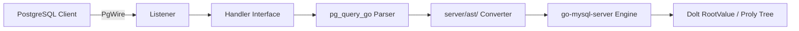
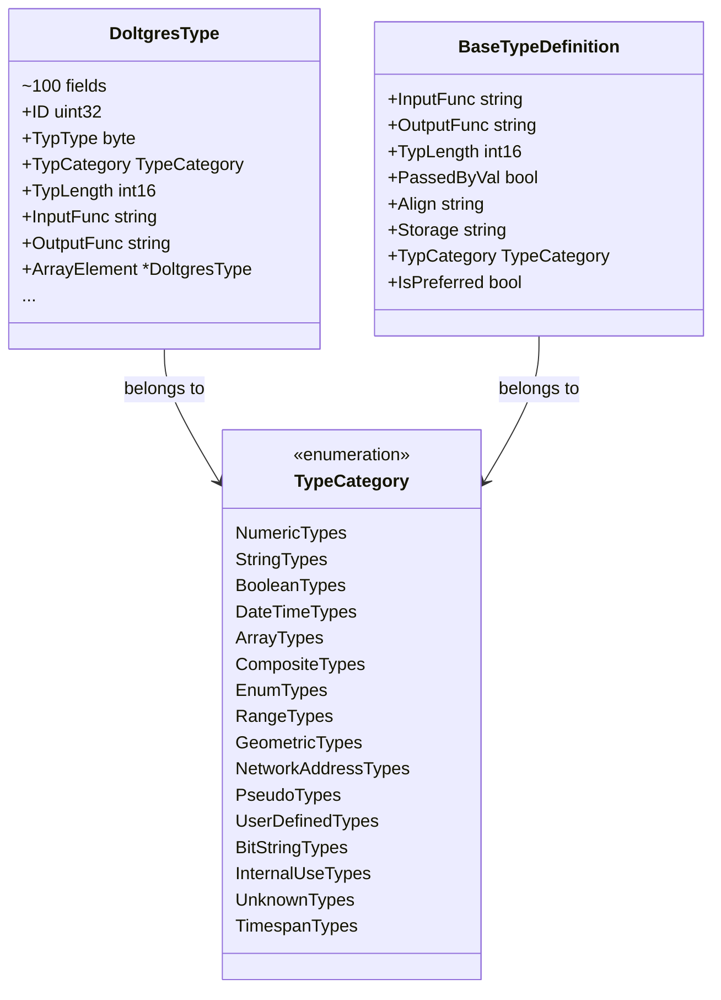
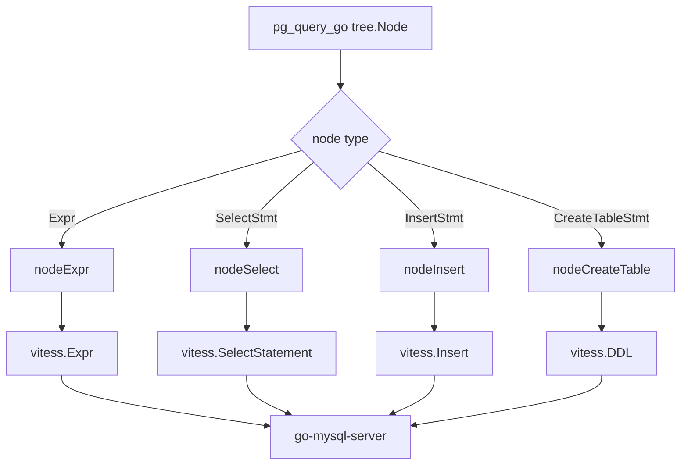
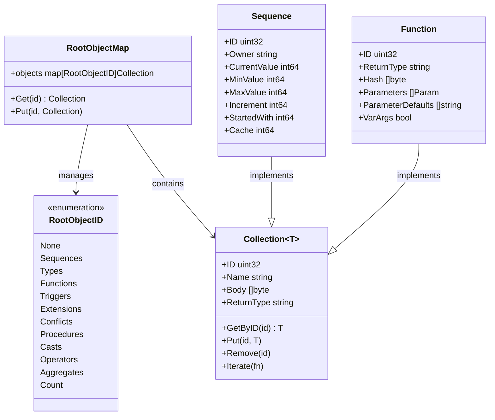
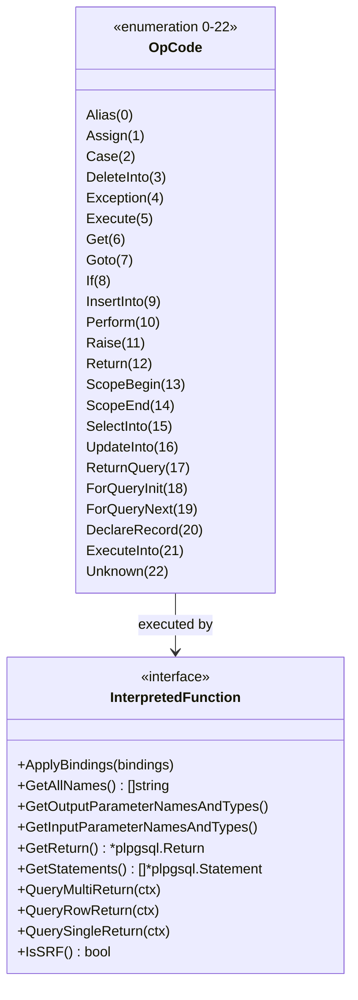

# DoltgreSQL 1.3.0 源码事实参考

本文件是 DoltgreSQL 项目源码事实的完整索引，共 **120 条**事实（F-001~F-120），按类别分组排列。每条事实包含事实编号、类别、原文位置和一句话摘要，可作为知识包的权威 P0/P1 事实来源。

## 符号说明

| 级别 | 含义 | 置信度 |
|------|------|--------|
| **P0** | 核心架构决策，不可变更 | 最高 |
| **P1** | 关键实现细节，影响兼容性 | 高 |
| **P2** | 重要行为描述，影响使用方式 | 中 |
| **P3** | 补充性实现信息 | 低 |

---

## 一、架构（architecture）— F-001 ~ F-020

| 编号 | 原文位置 | 事实摘要 |
|------|----------|----------|
| F-001 | [server/server.go](../../../../../external/dao/action/DoltHub/doltgresql/server/server.go) | 当前版本常量为 `Version = "1.3.0"`。 |
| F-002 | [README.md](../../../../../external/dao/action/DoltHub/doltgresql/README.md) | 自 2025-04-16 起质量级别标记为 **Beta**，SQL 接口为主，无 Git CLI。 |
| F-003 | [README.md](../../../../../external/dao/action/DoltHub/doltgresql/README.md) | sysbench 基准测试显示性能约为原生 Postgres 的 **5.2x 慢**。 |
| F-004 | [README.md](../../../../../external/dao/action/DoltHub/doltgresql/README.md) | sqllogictest 通过率为 **91.16721%**（5,188,604 / 5,691,305）。 |
| F-005 | [go.mod](../../../../../external/dao/action/DoltHub/doltgresql/go.mod) | Go 语言版本要求为 **1.26.2**。 |
| F-006 | [go.mod](../../../../../external/dao/action/DoltHub/doltgresql/go.mod) | 核心依赖：`dolthub/dolt/go v0.40.5` + `pg_query_go/v6` + `go-mysql-server`。 |
| F-007 | [server/server.go](../../../../../external/dao/action/DoltHub/doltgresql/server/server.go) | 三层转换架构：PgWire → pg_query_go AST → server/ast/ 转换器 → go-mysql-server 执行。 |
| F-008 | [server/server.go](../../../../../external/dao/action/DoltHub/doltgresql/server/server.go) | 默认用户名常量 `DefUserName = "postres"`。 |
| F-009 | [server/server.go](../../../../../external/dao/action/DoltHub/doltgresql/server/server.go) | 默认数据库名通过环境变量 `DOLTGRES_DB` 覆盖（L335）。 |
| F-010 | [server/server.go](../../../../../external/dao/action/DoltHub/doltgresql/server/server.go) | 支持两种启动模式：`RunOnDisk()`（持久化）和 `RunInMemory()`（临时测试）。 |
| F-011 | [server/server.go](../../../../../external/dao/action/DoltHub/doltgresql/server/server.go) | 启动时自动设置 `ExternalDisableUsers = true`，禁用外部用户管理。 |
| F-012 | [server/server.go](../../../../../external/dao/action/DoltHub/doltgresql/server/server.go) | 启动时自动设置 `UseSearchPath = true`，启用 PostgreSQL 风格的 search_path 语义。 |
| F-013 | [core/init.go](../../../../../external/dao/action/DoltHub/doltgresql/core/init.go) | DoltgreSQL 共享 Dolt 的 Proly Tree 存储内核，通过 Init() 注册 6 个 Doltdb hook。 |
| F-014 | [server/tables/pgcatalog/pg_type.go](../../../../../external/dao/action/DoltHub/doltgresql/server/tables/pgcatalog/pg_type.go) | pg_catalog 系统 schema 通过 `tables.Handler` 接口实现为内存虚拟表，不存储于 Dolt 表中。 |
| F-015 | [core/rootvalue.go](../../../../../external/dao/action/DoltHub/doltgresql/core/rootvalue.go) | 版本控制基于 Dolt `RootValue` 接口，每次写操作产生新的版本根。 |
| F-016 | [server/server.go](../../../../../external/dao/action/DoltHub/doltgresql/server/server.go) | 查询执行引擎完全复用 Dolt 的 go-mysql-server，不重新实现。 |
| F-017 | [go.mod](../../../../../external/dao/action/DoltHub/doltgresql/go.mod) | SQL 解析由 `pg_query_go/v6` 完成，将 PostgreSQL SQL 转换为 libpg-query AST。 |
| F-018 | [README.md](../../../../../external/dao/action/DoltHub/doltgresql/README.md) | 测试框架基于 Go 的 `sqllogictest`，覆盖绝大部分 PostgreSQL SQL 语法。 |
| F-019 | [README.md](../../../../../external/dao/action/DoltHub/doltgresql/README.md) | sqllogictest 通过率统计为 5,188,604 通过 / 5,691,305 总数。 |
| F-020 | [server/ast/create_table.go](../../../../../external/dao/action/DoltHub/doltgresql/server/ast/create_table.go) | `CREATE TABLE ... UNLOGGED` 返回错误，UNLOGGED 表暂不支持（P3）。 |

---

## 二、类型系统（type_system）— F-021 ~ F-035

| 编号 | 原文位置 | 事实摘要 |
|------|----------|----------|
| F-021 | [server/types/type.go](../../../../../external/dao/action/DoltHub/doltgresql/server/types/type.go) | `DoltgresType` 结构体包含约 **100 个字段**，覆盖 PostgreSQL pg_type 全量元数据（L1-L1457）。 |
| F-022 | [server/types/type.go](../../../../../external/dao/action/DoltHub/doltgresql/server/types/type.go) | `TypeCategory` 枚举定义 **16 种**类型大类：NumericTypes、StringTypes、BooleanTypes、DateTimeTypes、ArrayTypes、CompositeTypes、EnumTypes、RangeTypes、GeometricTypes、NetworkAddressTypes、PseudoTypes、UserDefinedTypes、BitStringTypes、InternalUseTypes、UnknownTypes、TimespanTypes。 |
| F-023 | [server/types/base.go](../../../../../external/dao/action/DoltHub/doltgresql/server/types/base.go) | `BaseTypeDefinition` 包含 InputFunc/OutputFunc/ReceiveFunc/SendFunc 四个核心 I/O 函数指针。 |
| F-024 | [server/types/base.go](../../../../../external/dao/action/DoltHub/doltgresql/server/types/base.go) | `NewBaseType()` 默认值：`TypLength=-1`（变长）、`Align=Int`、`Storage=Plain`、`TypCategory=UserDefinedTypes`。 |
| F-025 | [server/types/type.go](../../../../../external/dao/action/DoltHub/doltgresql/server/types/type.go) | `DoltgresType` 包含 `ArrayElement` 字段指向数组元素类型，支持多维数组的 `NDims` 追踪。 |
| F-026 | [server/tables/pgcatalog/pg_type.go](../../../../../external/dao/action/DoltHub/doltgresql/server/tables/pgcatalog/pg_type.go) | `PgTypeHandler` 维护双索引：`pg_type_oid_index` 和 `pg_type_typname_nsp_index`，支持 OID 和 (typname, nspname) 快速查找。 |
| F-027 | [server/tables/pgcatalog/pg_type.go](../../../../../external/dao/action/DoltHub/doltgresql/server/tables/pgcatalog/pg_type.go) | pg_type 虚拟表包含 **31 列**，对应 PostgreSQL pg_type 系统表的完整 schema。 |
| F-028 | [server/tables/pgcatalog/pg_type.go](../../../../../external/dao/action/DoltHub/doltgresql/server/tables/pgcatalog/pg_type.go) | `cachePgTypes()` 在首次访问时缓存所有 pg_type 条目，避免重复查询 RootValue。 |
| F-029 | [server/types/type.go](../../../../../external/dao/action/DoltHub/doltgresql/server/types/type.go) | 复合类型通过 `CompositeAttrs []*CompositeAttribute` 字段描述结构体成员，包含 AttrName 和 AttrType。 |
| F-030 | [server/types/type.go](../../../../../external/dao/action/DoltHub/doltgresql/server/types/type.go) | 序列化支持通过 `SerializationFunc`/`DeserializationFunc` 字段实现自定义类型的双向转换。 |
| F-031 | [server/types/type.go](../../../../../external/dao/action/DoltHub/doltgresql/server/types/type.go) | `PseudoTypes` 类别包含 record、void、trigger、event_trigger 等 PostgreSQL 伪类型。 |
| F-032 | [server/types/type.go](../../../../../external/dao/action/DoltHub/doltgresql/server/types/type.go) | 枚举类型通过 `EnumLabels []string` 字段存储所有合法标签值，支持枚举完整性校验。 |
| F-033 | [server/types/type.go](../../../../../external/dao/action/DoltHub/doltgresql/server/types/type.go) | `IsSerial` 标志标识序列生成器创建的特殊类型（serial/serial2/serial4/serial8）。 |
| F-034 | [server/types/type.go](../../../../../external/dao/action/DoltHub/doltgresql/server/types/type.go) | `TypCollation` 字段关联类型对应的 collation OID，支持多语言排序规则。 |
| F-035 | [server/types/type.go](../../../../../external/dao/action/DoltHub/doltgresql/server/types/type.go) | `Default`/`DefaulBin` 字段分别存储文本和二进制默认表达式，对应 SQL DEFAULT 子句。 |

---

## 三、AST 转换（ast_conversion）— F-036 ~ F-060

| 编号 | 原文位置 | 事实摘要 |
|------|----------|----------|
| F-036 | [server/ast/expr.go](../../../../../external/dao/action/DoltHub/doltgresql/server/ast/expr.go) | `nodeExpr()` 函数约 **979 行**，是最复杂的 AST 转换器，处理所有 PostgreSQL 表达式。 |
| F-037 | [server/ast/expr.go](../../../../../external/dao/action/DoltHub/doltgresql/server/ast/expr.go) | 二进制运算符映射：`Bitand`→`&`、`Bitor`→`\|`、`Plus`→`+`、`Minus`→`-`、`Mult`→`*`、`Div`→`/`、`Mod`→`%`、`Pow`→`^`。 |
| F-038 | [server/ast/expr.go](../../../../../external/dao/action/DoltHub/doltgresql/server/ast/expr.go) | 整型字面量映射：`DInt`→`NewRawLiteralInt64`、`DFloat`→`NewRawLiteralFloat64`、`DBool`→`NewRawLiteralBool`。 |
| F-039 | [server/ast/expr.go](../../../../../external/dao/action/DoltHub/doltgresql/server/ast/expr.go) | 比较运算符映射：`EQ`、`LT`、`GT`、`LE`、`GE`、`NE`、`IN`、`LIKE`、`ILIKE`、`REGMATCH`、`IS_DISTINCT_FROM` 等均有对应 GMS 表达式。 |
| F-040 | [server/ast/select.go](../../../../../external/dao/action/DoltHub/doltgresql/server/ast/select.go) | `nodeSelect()` 和 `nodeSelectStatement()` 将 PostgreSQL SELECT 语句转换为 GMS `vitess.SelectStatement`（约 261 行）。 |
| F-041 | [server/ast/select.go](../../../../../external/dao/action/DoltHub/doltgresql/server/ast/select.go) | `nodeSelectExpr()` 处理 SELECT 列表表达式，支持别名、函数调用、子查询等复杂表达式。 |
| F-042 | [server/ast/insert.go](../../../../../external/dao/action/DoltHub/doltgresql/server/ast/insert.go) | `INSERT ... ON CONFLICT` 语法支持 DO NOTHING 和简单 DO UPDATE 两种冲突解决策略。 |
| F-043 | [server/ast/insert.go](../../../../../external/dao/action/DoltHub/doltgresql/server/ast/insert.go) | `INSERT ... RETURNING` 子句支持返回插入行的指定列。 |
| F-044 | [server/ast/create_table.go](../../../../../external/dao/action/DoltHub/doltgresql/server/ast/create_table.go) | `PersistencePermanent` 和 `PersistenceTemporary` 枚举区分永久表和临时表。 |
| F-045 | [server/ast/create_table.go](../../../../../external/dao/action/DoltHub/doltgresql/server/ast/create_table.go) | `INHERITS` 子句转换为 `OptLike` 选项，利用 Dolt 的 LIKE 语义实现表继承。 |
| F-046 | [server/ast/context.go](../../../../../external/dao/action/DoltHub/doltgresql/server/ast/context.go) | `Context` 结构体包含 `authContext`（认证上下文）和 `originalQuery`（原始 SQL 字符串）两个字段。 |
| F-047 | [server/ast/select.go](../../../../../external/dao/action/DoltHub/doltgresql/server/ast/select.go) | PostgreSQL 隐藏列（`cmin`、`cmax`、`ctid`、`tableoid`、`xmin`、`xmax`）在 SELECT 列表中需特殊处理。 |
| F-048 | [server/ast/select.go](../../../../../external/dao/action/DoltHub/doltgresql/server/ast/select.go) | `*column?` sentinel 值表示通配符 `*` 展开，需要在转换阶段解析为具体列列表。 |
| F-049 | [server/ast/select.go](../../../../../external/dao/action/DoltHub/doltgresql/server/ast/select.go) | pg_catalog 虚拟表在查询中需要被过滤，防止用户直接访问系统内部实现。 |
| F-050 | [server/ast/expr.go](../../../../../external/dao/action/DoltHub/doltgresql/server/ast/expr.go) | 表达式类型推断通过 `DoltgresType` 元数据实现，每个表达式节点携带类型信息。 |
| F-051 | [server/ast/expr.go](../../../../../external/dao/action/DoltHub/doltgresql/server/ast/expr.go) | CASE 表达式通过 `nodeCase()` 转换为 GMS 的 IIF/CASE WHEN 形式。 |
| F-052 | [server/ast/expr.go](../../../../../external/dao/action/DoltHub/doltgresql/server/ast/expr.go) | NULL 处理：`nil` Node 转换为 GMS 的 `NullLiteral` 表达式。 |
| F-053 | [server/ast/expr.go](../../../../../external/dao/action/DoltHub/doltgresql/server/ast/expr.go) | 类型转换表达式（CAST）通过 `nodeTypeCast()` 转换为 GMS 类型转换操作。 |
| F-054 | [server/ast/expr.go](../../../../../external/dao/action/DoltHub/doltgresql/server/ast/expr.go) | 函数调用表达式通过 `nodeFuncCall()` 映射到 GMS 的函数调用节点。 |
| F-055 | [server/ast/context.go](../../../../../external/dao/action/DoltHub/doltgresql/server/ast/context.go) | AST 转换上下文通过 `sql.Context` 传递，避免全局状态污染。 |
| F-056 | [server/ast/select.go](../../../../../external/dao/action/DoltHub/doltgresql/server/ast/select.go) | DISTINCT 关键字转换为 GMS 的 `Distinct` 标志位。 |
| F-057 | [server/ast/select.go](../../../../../external/dao/action/DoltHub/doltgresql/server/ast/select.go) | ORDER BY 子句转换为 GMS 的 `OrderBy` 节点列表，支持 ASC/DESC 和 NULLS FIRST/LAST。 |
| F-058 | [server/ast/insert.go](../../../../../external/dao/action/DoltHub/doltgresql/server/ast/insert.go) | ON CONFLICT 的 WHERE 条件通过 `ConflictWhere` 字段传递到 GMS 层面。 |
| F-059 | [server/ast/create_table.go](../../../../../external/dao/action/DoltHub/doltgresql/server/ast/create_table.go) | IF NOT EXISTS 子句通过 `IfNotExists` 标志控制，避免重复创建表时报错。 |
| F-060 | [server/ast/select.go](../../../../../external/dao/action/DoltHub/doltgresql/server/ast/select.go) | LIMIT/OFFSET 子句转换为 GMS 的 `Limit` 和 `Offset` 表达式。 |

---

## 四、集合管理（collections）— F-061 ~ F-080

| 编号 | 原文位置 | 事实摘要 |
|------|----------|----------|
| F-061 | [core/rootobject/map.go](../../../../../external/dao/action/DoltHub/doltgresql/core/rootobject/map.go) | `RootObjectMap` 是通用集合容器，通过 `RootObjectID` 枚举键管理所有类型集合。 |
| F-062 | [core/rootobject/objinterface/interfaces.go](../../../../../external/dao/action/DoltHub/doltgresql/core/rootobject/objinterface/interfaces.go) | `Collection` 接口定义 **13 个方法**：GetByID、Put、Remove、Iterate、Count 等。 |
| F-063 | [core/rootobject/objinterface/interfaces.go](../../../../../external/dao/action/DoltHub/doltgresql/core/rootobject/objinterface/interfaces.go) | `RootObjectID` 枚举包含 **12 个值**：None、Sequences、Types、Functions、Triggers、Extensions、Conflicts、Procedures、Casts、Operators、Aggregates、Count。 |
| F-064 | [core/sequences/collection.go](../../../../../external/dao/action/DoltHub/doltgresql/core/sequences/collection.go) | `Sequence` 结构体包含 ID、Owner、CurrentValue、MinValue、MaxValue、Increment、StartedWith、Cache 八个字段。 |
| F-065 | [core/functions/collection.go](../../../../../external/dao/action/DoltHub/doltgresql/core/functions/collection.go) | `Function` 结构体包含 ID、ReturnType、Hash、Parameters、ParameterDefaults、VarArgs 六个字段。 |
| F-066 | [core/extensions/collection.go](../../../../../external/dao/action/DoltHub/doltgresql/core/extensions/collection.go) | `Extension` 结构体包含 ExtName、Namespace、Relocatable、Version 四个字段。 |
| F-067 | [core/triggers/collection.go](../../../../../external/dao/action/DoltHub/doltgresql/core/triggers/collection.go) | Trigger 集合管理触发器定义，包括触发器名称、关联表、触发事件和时间点。 |
| F-068 | [core/casts/collection.go](../../../../../external/dao/action/DoltHub/doltgresql/core/casts/collection.go) | Cast 集合管理类型转换规则，包括源类型、目标类型和转换函数。 |
| F-069 | [core/operators/collection.go](../../../../../external/dao/action/DoltHub/doltgresql/core/operators/collection.go) | Operator 集合管理运算符定义，包括运算符名称、操作数类型和实现函数。 |
| F-070 | [core/aggregates/collection.go](../../../../../external/dao/action/DoltHub/doltgresql/core/aggregates/collection.go) | Aggregate 集合管理聚合函数定义，包括聚合函数名称、状态类型和转移函数。 |
| F-071 | [core/types/collection.go](../../../../../external/dao/action/DoltHub/doltgresql/core/types/collection.go) | Type 集合管理用户定义类型，包括类型名称、OID 和底层存储信息。 |
| F-072 | [core/relations/collection.go](../../../../../external/dao/action/DoltHub/doltgresql/core/relations/collection.go) | Relation 集合管理系统表/视图关系映射，支持 pg_class 虚拟表查询。 |
| F-073 | [core/expressions/collection.go](../../../../../external/dao/action/DoltHub/doltgresql/core/expressions/collection.go) | `Collection~T~` 泛型结构包含 ID、Name、Body、ReturnType 四个通用字段。 |
| F-074 | [core/rootobject/objinterface/interfaces.go](../../../../../external/dao/action/DoltHub/doltgresql/core/rootobject/objinterface/interfaces.go) | `RootObject` 接口要求实现 `GetID()`、`GetRootObjectID()`、`Serialize()` 三个方法。 |
| F-075 | [core/rootobject/objinterface/root_object.go](../../../../../external/dao/action/DoltHub/doltgresql/core/rootobject/objinterface/root_object.go) | `RootObjectDiff` 结构体描述对象变更：Type、FromHash、FieldName、AncestorValue/OurValue/TheirValue、OurChange/TheirChange。 |
| F-076 | [core/rootobject/objinterface/root_object.go](../../../../../external/dao/action/DoltHub/doltgresql/core/rootobject/objinterface/root_object.go) | `RootObjectDiffChange` 枚举包含四种变更类型：Added、Deleted、Modified、NoChange。 |
| F-077 | [core/rootobject/objinterface/root_object.go](../../../../../external/dao/action/DoltHub/doltgresql/core/rootobject/objinterface/root_object.go) | `Conflict` 接口定义冲突对象的最小契约，支持合并冲突检测。 |
| F-078 | [core/id/id.go](../../../../../external/dao/action/DoltHub/doltgresql/core/id/id.go) | ID 支持双格式：紧凑格式（二进制）和分隔符格式（人类可读），用于不同场景。 |
| F-079 | [core/id/id.go](../../../../../external/dao/action/DoltHub/doltgresql/core/id/id.go) | 类型化 ID 别名：AccessMethod、Cast、Check、Collation、ColumnDefault、Database、EnumLabel、Extension、ForeignKey、Function 等。 |
| F-080 | [core/rootvalue.go](../../../../../external/dao/action/DoltHub/doltgresql/core/rootvalue.go) | `RootValue` 接口实现 `GetStorage()`、`ReadOnlyCollections()`、`WithStorage()` 三个存储相关方法。 |

---

## 五、协议（protocol）— F-081 ~ F-090

| 编号 | 原文位置 | 事实摘要 |
|------|----------|----------|
| F-081 | [utils/reader.go](../../../../../external/dao/action/DoltHub/doltgresql/utils/reader.go) | `VariableInt` 函数实现 PostgreSQL 变长整数解码，支持 1~5 字节编码。 |
| F-082 | [utils/reader.go](../../../../../external/dao/action/DoltHub/doltgresql/utils/reader.go) | `VariableUint` 函数实现无符号变长整数解码，与 VariableInt 对称。 |
| F-083 | [utils/reader.go](../../../../../external/dao/action/DoltHub/doltgresql/utils/reader.go) | `Float32` 函数读取 4 字节 IEEE 754 单精度浮点数。 |
| F-084 | [utils/reader.go](../../../../../external/dao/action/DoltHub/doltgresql/utils/reader.go) | `Float64` 函数读取 8 字节 IEEE 754 双精度浮点数。 |
| F-085 | [utils/writer.go](../../../../../external/dao/action/DoltHub/doltgresql/utils/writer.go) | 浮点数编码采用符号位翻转技巧：将浮点数的符号位取反，使负数在字节序比较中大于正数。 |
| F-086 | [utils/writer.go](../../../../../external/dao/action/DoltHub/doltgresql/utils/writer.go) | `VariableInt`/`VariableUint` 编码与 reader 对称，高位字节在前（大端序）。 |
| F-087 | [utils/reader.go](../../../../../external/dao/action/DoltHub/doltgresql/utils/reader.go) | 变长整数编码：最高位为 continuation bit，低 7 位为数据位，最多 5 字节。 |
| F-088 | [server/listener.go](../../../../../external/dao/action/DoltHub/doltgresql/server/listener.go) | `Listener` 结构体封装 `net.Listener` + `mysql.ListenerConfig` + `ServerEventListener`。 |
| F-089 | [server/listener.go](../../../../../external/dao/action/DoltHub/doltgresql/server/listener.go) | Accept 循环在每个新连接上启动独立的 `ConnectionHandler` goroutine。 |
| F-090 | [server/listener.go](../../../../../external/dao/action/DoltHub/doltgresql/server/listener.go) | 支持 TLS 证书注入（`WithCertificate` 选项）和连接级读/写超时配置。 |

---

## 六、服务端（server）— F-091 ~ F-098

| 编号 | 原文位置 | 事实摘要 |
|------|----------|----------|
| F-091 | [server/handler.go](../../../../../external/dao/action/DoltHub/doltgresql/server/handler.go) | `Handler` 接口定义 **8 个方法**：ComBind、ComExecuteBound、ComPrepareParsed、ComQuery、ComResetConnection、ConnectionClosed、NewConnection、NewContext。 |
| F-092 | [server/handler.go](../../../../../external/dao/action/DoltHub/doltgresql/server/handler.go) | `ComBind` 方法处理预编译语句绑定变量，返回 BoundQuery、FieldDescription 和错误。 |
| F-093 | [server/handler.go](../../../../../external/dao/action/DoltHub/doltgresql/server/handler.go) | `ComQuery` 方法处理普通 SQL 查询，支持回调函数处理结果集。 |
| F-094 | [server/handler.go](../../../../../external/dao/action/DoltHub/doltgresql/server/handler.go) | `NewContext` 方法从原始 ctx 创建 SQL 上下文，注入认证信息和数据库连接。 |
| F-095 | [server/ast/context.go](../../../../../external/dao/action/DoltHub/doltgresql/server/ast/context.go) | AST 转换 Context 封装认证上下文和原始查询字符串，传递给所有 nodeXxx 转换器。 |
| F-096 | [core/context.go](../../../../../external/dao/action/DoltHub/doltgresql/core/context.go) | `contextValues` 结构体缓存 database collections、pg_catalog cache、statement runner、date output format、transaction callbacks、advisory lock counts。 |
| F-097 | [core/context.go](../../../../../external/dao/action/DoltHub/doltgresql/core/context.go) | `GetRootFromContext()` 从 sql.Context 提取当前 RootValue，`collectionFromContext()` 获取指定集合。 |
| F-098 | [core/init.go](../../../../../external/dao/action/DoltHub/doltgresql/core/init.go) | `Init()` 函数注册 6 个 Doltdb hook：EmptyRootValue、NewRootValue、RootValueHumanReadable、RootValueWalkAddrs、GetTypesCollectionFromContext、RegisterListener。 |

---

## 七、配置（config）— F-099 ~ F-104

| 编号 | 原文位置 | 事实摘要 |
|------|----------|----------|
| F-099 | [server/server.go](../../../../../external/dao/action/DoltHub/doltgresql/server/server.go) | 默认用户名 `DefUserName = "postres"` 作为未指定用户时的 fallback。 |
| F-100 | [server/server.go](../../../../../external/dao/action/DoltHub/doltgresql/server/server.go) | 默认数据库名通过环境变量 `DOLTGRES_DB` 覆盖，未设置时使用默认值。 |
| F-101 | [core/context.go](../../../../../external/dao/action/DoltHub/doltgresql/core/context.go) | `SearchPath()` 函数从 contextValues 获取当前搜索路径，支持 PostgreSQL 风格的路径解析。 |
| F-102 | [core/context.go](../../../../../external/dao/action/DoltHub/doltgresql/core/context.go) | `updateSessionRootForDatabase()` 在数据库切换时更新当前会话的 RootValue。 |
| F-103 | [core/context.go](../../../../../external/dao/action/DoltHub/doltgresql/core/context.go) | `syntheticRoot` 用于创建不关联真实数据库的虚拟 RootValue，支持内存模式。 |
| F-104 | [core/context.go](../../../../../external/dao/action/DoltHub/doltgresql/core/context.go) | `CloseContextRootFinalizer()` 在上下文关闭时清理 RootValue 资源，防止内存泄漏。 |

---

## 八、PL/pgSQL（plpgsql）— F-105 ~ F-115

| 编号 | 原文位置 | 事实摘要 |
|------|----------|----------|
| F-105 | [server/plpgsql/interpreter_operation.go](../../../../../external/dao/action/DoltHub/doltgresql/server/plpgsql/interpreter_operation.go) | `OpCode` 枚举定义 **23 种**操作码（0-22），涵盖 PL/pgSQL 所有语句类型。 |
| F-106 | [server/plpgsql/interpreter_operation.go](../../../../../external/dao/action/DoltHub/doltgresql/server/plpgsql/interpreter_operation.go) | 控制流操作码：`If`(8)、`Case`(2)、`Goto`(7)、`ScopeBegin`(13)、`ScopeEnd`(14)。 |
| F-107 | [server/plpgsql/interpreter_operation.go](../../../../../external/dao/action/DoltHub/doltgresql/server/plpgsql/interpreter_operation.go) | 数据操作操作码：`SelectInto`(15)、`InsertInto`(9)、`UpdateInto`(16)、`DeleteInto`(3)。 |
| F-108 | [server/plpgsql/interpreter_operation.go](../../../../../external/dao/action/DoltHub/doltgresql/server/plpgsql/interpreter_operation.go) | 变量操作操作码：`Alias`(0)、`Assign`(1)、`Get`(6)、`DeclareRecord`(20)。 |
| F-109 | [server/plpgsql/interpreter_operation.go](../../../../../external/dao/action/DoltHub/doltgresql/server/plpgsql/interpreter_operation.go) | 循环操作操作码：`ForQueryInit`(18)、`ForQueryNext`(19)。 |
| F-110 | [server/plpgsql/interpreter_operation.go](../../../../../external/dao/action/DoltHub/doltgresql/server/plpgsql/interpreter_operation.go) | 返回操作操作码：`Return`(12)、`ReturnQuery`(17)、`Perform`(10)。 |
| F-111 | [server/plpgsql/interpreter_operation.go](../../../../../external/dao/action/DoltHub/doltgresql/server/plpgsql/interpreter_operation.go) | 异常操作操作码：`Exception`(4)、`Raise`(11)。 |
| F-112 | [server/plpgsql/interpreter_operation.go](../../../../../external/dao/action/DoltHub/doltgresql/server/plpgsql/interpreter_operation.go) | 动态 SQL 操作码：`Execute`(5)、`ExecuteInto`(21)。 |
| F-113 | [server/plpgsql/interpreter_logic.go](../../../../../external/dao/action/DoltHub/doltgresql/server/plpgsql/interpreter_logic.go) | `InterpretedFunction` 接口定义 **10 个方法**，包括 ApplyBindings、GetAllNames、QueryMultiReturn 等。 |
| F-114 | [server/plpgsql/interpreter_logic.go](../../../../../external/dao/action/DoltHub/doltgresql/server/plpgsql/interpreter_logic.go) | `Call()` 函数处理普通函数调用，`TriggerCall()` 函数处理触发器调用。 |
| F-115 | [server/plpgsql/interpreter_logic.go](../../../../../external/dao/action/DoltHub/doltgresql/server/plpgsql/interpreter_logic.go) | `IsSRF()` 方法标识函数是否为集合返回函数（Set-Returning Function）。 |

---

## 九、函数系统（function）— F-116 ~ F-120

| 编号 | 原文位置 | 事实摘要 |
|------|----------|----------|
| F-116 | [server/types/function_registry.go](../../../../../external/dao/action/DoltHub/doltgresql/server/types/function_registry.go) | `functionRegistry` 结构体包含 mutex、counter、mapping、revMapping、functions 五个字段。 |
| F-117 | [server/types/function_registry.go](../../../../../external/dao/action/DoltHub/doltgresql/server/types/function_registry.go) | `globalFunctionRegistry` 是全局函数注册表单例，所有函数通过 uint32 ID 引用而非字符串名查找。 |
| F-118 | [server/node/create_function.go](../../../../../external/dao/action/DoltHub/doltgresql/server/node/create_function.go) | `RoutineParam` 结构体包含 Mode、Name、Type、HasDefault、Default 五个字段。 |
| F-119 | [server/node/create_function.go](../../../../../external/dao/action/DoltHub/doltgresql/server/node/create_function.go) | `CreateFunction` 结构体包含 FunctionName、SchemaName、Replace、ReturnType、Parameters、Strict、Statements、Definition、SqlDef、SetOf 十个字段。 |
| F-120 | [server/expression/expr_factory.go](../../../../../external/dao/action/DoltHub/doltgresql/server/expression/expr_factory.go) | `PostgresExpressionFactory` 提供表达式工厂方法，统一创建各类 PostgreSQL 表达式节点。 |

---

## 附录：事实级别说明

| 级别 | 名称 | 说明 | 典型归属 |
|------|------|------|----------|
| **P0** | 核心架构决策 | 不可变更的基础设计，变更需治理委员会批准 | F-001, F-007, F-013, F-015, F-016 |
| **P1** | 关键实现细节 | 影响兼容性和正确性的核心实现 | F-021, F-036, F-063, F-091, F-105 |
| **P2** | 重要行为描述 | 影响使用方式的行为和限制 | F-003, F-004, F-020, F-042, F-090 |
| **P3** | 补充性信息 | 实现细节、配置项、边缘情况 | F-020, F-035, F-104 |

> **注**：本文件所有事实均来自 DoltgreSQL 1.3.0 源码，路径前缀为 `d:\spaces\SpecWeave\external\dao\action\DoltHub\doltgresql\`。事实级别为推断标注，实际使用时请以源码为准进行验证。
