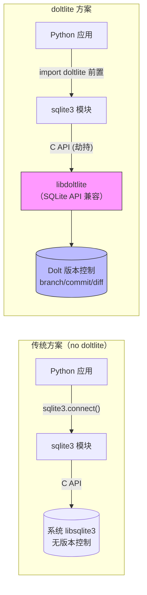

# doltlite-python 概述

> **对应 F 编号**：F-001 ~ F-007

## 产品定位

`doltlite`（PyPI 包名）是 DoltHub 官方推出的 Python loader，口号为 **"Dolt version control through SQLite's drop-in API"**。它的核心设计目标是：**在不修改 sqlite3 模块代码的前提下，通过运行时符号劫持让标准 `sqlite3` 模块自动使用 libdoltlite 的 SQLite API 实现**。

## 解决的核心问题

| 场景 | 传统方案 | doltlite-python 方案 |
|------|---------|---------------------|
| Python 应用需要 SQL 数据库 | 使用系统 SQLite，无版本控制 | `import doltlite` 后 sqlite3 自动获得版本控制 |
| 需要 Git 式历史/分支 | 需改用 Dolt CLI 或独立服务器 | sqlite3 API 完全不变，`dolt_commit` 等函数可直接调用 |
| SQLAlchemy 等 ORM | 无法接入 Dolt 版本控制 | ORM 使用的 sqlite3 已被劫持，自动获得版本控制 |
| 嵌入式部署 | 需打包独立 Dolt 服务器 | 单 wheel 包含 libdoltlite 二进制，`pip install` 即用 |

## 包结构

doltlite-python 是一个极简的 loader 包，核心代码不到 300 行：

| 文件 | 行数 | 职责 |
|------|------|------|
| `src/doltlite/__init__.py` | 23 | 入口：导出 `bootstrap()`、`libdoltlite_path()`，自动调用 `bootstrap()` |
| `src/doltlite/_loader.py` | 206 | 核心 loader：平台策略、符号劫持、re-exec 逻辑 |
| `src/doltlite/_lib/` | 0（`.gitkeep`） | 占位符；实际 libdoltlite.{dylib,so} 由 before-build 脚本编译并打包进 wheel |
| `tests/smoke.py` | 24 | 冒烟测试：验证 `dolt_version()` 和 `dolt_log` 虚拟表 |

## 关键设计约束

doltlite 不是传统 SQLite 扩展（不通过 `sqlite3_create_function()` 注册），而是**直接替换 SQLite C API 符号**——这使得它能接管完整的 SQL 执行路径，包括 `dolt_log`、`dolt_diff_<table>` 等虚拟表。代价是平台兼容性策略复杂（见 [02-platform-strategies](02-platform-strategies.md)）。

## 学习路径

继续阅读本 bundle 其他概念文档以深入：

* [bootstrap() 加载机制](01-bootstrap-mechanism.md) — 幂等性设计、环境标记、调用时序
* [跨平台符号劫持策略](02-platform-strategies.md) — Linux RTLD_GLOBAL vs macOS shim + re-exec
* [wheel tag 与构建系统](03-wheel-and-build.md) — py3-none 策略、cibuildwheel 配置、lockstep 版本管理
