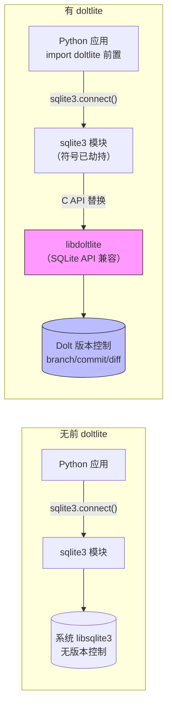

# doltlite-python——SQLite Drop-in API 之上的 Dolt 版本控制

> **官方仓库**：[dolthub/doltlite-python](https://github.com/dolthub/doltlite-python) [F-001]
> **分析版本**：tag `v0.50.7`，commit `ba3b46fa6f58e42aef4b929d97a28248832079cb`
> **服务名/版本**：`doltlite`（Python loader）/ v0.50.7 [F-002]
> **Python 版本**：>=3.9 [F-002]
> **事实基数**：22 条（F-001~F-022）
> **事实来源**：官方源码逐文件精读，信源距离 ①

`doltlite`（PyPI 包名）是 DoltHub 官方推出的 Python loader，口号为 **"Dolt version control through SQLite's drop-in API"**。它通过运行时动态符号劫持（Linux 用 `RTLD_GLOBAL`，macOS 用 `DYLD_INSERT_LIBRARIES` shim），将预编译的 libdoltlite 注入 Python sqlite3 模块的符号解析链——无需修改 sqlite3 代码，标准 `sqlite3` API 和 SQLAlchemy 等 ORM 自动获得 Git 式版本控制能力。

## 核心价值



doltlite-python 解决的核心命题：**让现有 Python SQLite 应用零改动获得 Git 式版本控制**——只需在 `import sqlite3` 之前加一行 `import doltlite`。

## 导航

### 核心概念（concepts/，4 篇）

* [doltlite-python 概述](concepts/00-overview.md) — 产品定位、符号劫持原理、包结构、关键设计约束
* [bootstrap() 加载机制](concepts/01-bootstrap-mechanism.md) — 幂等性设计、环境标记、库路径解析
* [跨平台符号劫持策略](concepts/02-platform-strategies.md) — Linux RTLD_GLOBAL vs macOS shim+re-exec
* [wheel tag 与构建系统](concepts/03-wheel-and-build.md) — py3-none 策略、cibuildwheel 配置、lockstep 版本管理

### 实战示例（examples/，2 篇）

* [基本用法：python 脚本中使用 doltlite](examples/00-basic-usage.md) — 完整可运行代码路径，含分支管理
* [Jupyter/REPL 绕过方案](examples/01-jupyter-workaround.md) — 交互式环境的环境变量设置方案

### 信源登记（references/）

* [源码事实登记](references/source.md) — F-001~F-022 编号事实底账

## 学习路径建议

1. **入门**：[概述](concepts/00-overview.md) → [基本用法示例](examples/00-basic-usage.md)
2. **深入加载机制**：[bootstrap() 加载机制](concepts/01-bootstrap-mechanism.md) → [跨平台策略](concepts/02-platform-strategies.md)
3. **构建与部署**：[wheel tag 与构建系统](concepts/03-wheel-and-build.md) → [Jupyter 绕过](examples/01-jupyter-workaround.md)
4. **源码深读**：[references/source.md](references/source.md) 核对全部 F 编号

## 信任与生命周期

| 项目 | 状态 |
|------|------|
| **status** | stable |
| **stale_after** | 2027-03-31（doltlite-python 迭代节奏较慢，半年重评） |
| **事实来源** | 官方源码逐文件精读（信源距离 ①），无第三方转述 |
| **generated/verified** | 2026-09-10 |

## 骨架判定说明

- **一问**（有读者可照做的安装/配置/代码/调用流程？）：是——`example/main.py` 风格代码和 README 提供完整使用范式
- **二问**（经实测、有版本/输入输出/步骤顺序？）：README 提供使用示例，源码有完整的 bootstrap 逻辑和 smoke 测试
- **结论**：设 examples/，内容严格取材 README 与源码事实

## 边界说明

- 本束聚焦 doltlite-python loader 包，不涉及上游 libdoltlite（Go 语言实现的 Dolt 引擎）的实现细节
- Windows 不支持：cibuildwheel 配置中明确 skip `*-win_*`，且 re-exec + LD_PRELOAD/DYLD_INSERT_LIBRARIES 机制依赖 POSIX 动态链接器语义
- 单进程内嵌模式：libdoltlite 在同一进程中作为共享库加载，不适用于多进程并发写场景（需独立 Dolt 服务器）
- 不支持 Jupyter/IPython 原生支持：需通过环境变量手动绕过，见 [01-jupyter-workaround](examples/01-jupyter-workaround.md)

```{toctree}
:hidden:
:maxdepth: 7

concepts/index
examples/index
references/index
log
```
