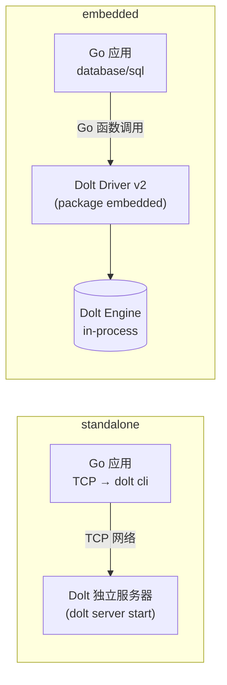

# Dolt Driver v2 概述

> **对应 F 编号**：F-001 ~ F-008

## 产品定位

`github.com/dolthub/driver/v2`（Go package 名为 `embedded`）是 DoltHub 官方实现的 Go `database/sql/driver` 驱动，核心设计目标是：**在调用方进程内直接嵌入完整的 Dolt 引擎，无需启动任何外部数据库服务器进程**。



驱动通过标准 `database/sql` 接口注册为名为 `"dolt"` 的服务，配合 `sql.OpenDB(connector)` 模式使用，与 `go-sql-driver/mysql`、GORM、sqlx 等生态零摩擦兼容。

## 解决的核心问题

| 场景 | 传统方案 | Driver v2 方案 |
|------|---------|---------------|
| Go 应用需要 SQL 数据库 | 运行独立 Dolt 服务器，应用通过 TCP 连接 | 内嵌引擎，零外部进程依赖 |
| 需要 Git 式版本控制 | 需手动调用 dolt CLI | 每次写操作自动产生 commit |
| 需要分支/merge | 需调用 dolt CLI | 通过 `dbname@rootish` 格式或 API 支持 |
| 单机嵌入式场景 | 选 SQLite 等通用方案，无版本控制 | Dolt 提供行级版本历史 + 分支能力 |

## 与独立 Dolt 服务器的对比

| 维度 | 独立服务器（dolt server start） | Driver v2（embedded） |
|------|-------------------------------|----------------------|
| 进程模型 | 独立进程，TCP 监听 | 同进程，函数调用 |
| 部署复杂度 | 需管理服务器进程生命周期 | 零配置，直接 import |
| 并发写入 | 支持多 writer | 单 SqlEngine，串行写 |
| 文件系统路径 | 通过 DSN 指定 repo 目录 | 通过 `file:///path` 指定 repo 目录 |
| 版本控制能力 | 完整（CLI + 服务器） | 完整（底层共用同一引擎） |
| 多语句支持 | 默认开启 | 需显式 `multistatements=true` |

## 架构总览

driver v2 整体遵循 Go 标准库 `database/sql/driver` 的五层接口契约：

```
doltDriver (driver.Driver)
    └── Connector (driver.Connector)      ← 持有共享 SqlEngine
            └── DoltConn (driver.Conn)    ← per-connection 会话
                    ├── doltStmt          ← 单语句 Prepared Statement
                    ├── doltMultiStmt     ← 多语句 Prepared Statement
                    ├── doltRows          ← 结果集游标
                    ├── doltResult        ← DML 影响行数
                    └── doltTx            ← 事务
```

所有层级的查询最终汇聚到 `engine.SqlEngine.QueryWithBindings()`，由 Dolt 内核执行。

## 关键依赖（F-022）

```
github.com/dolthub/dolt/go           v0.40.5-0.20260902090248-362a86528a8a
github.com/go-sql-driver/mysql       v1.9.3
github.com/dolthub/go-mysql-server   v0.20.1
github.com/cenkalti/backoff/v4       v4.x.x
```

## 学习路径

继续阅读本 bundle 其他概念文档以深入：

* [架构分层](01-architecture.md) — 五层接口实现细节
* [DSN 解析与 Config](02-dsn-config.md) — `file://` 前缀与参数体系
* [连接生命周期与 BackOff 重试](03-lifecycle-and-retry.md) — 并发安全机制
* [查询执行与多语句支持](04-query-and-transaction.md) — 查询路径与事务模型
