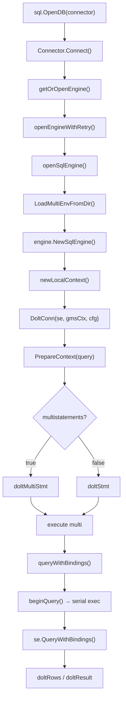

# 架构分层

> **对应 F 编号**：F-009 ~ F-020

## 接口契约

driver v2 实现了 Go `database/sql/driver` 包的全部核心接口，通过接口断言验证：

```go
// driver.go
var _ driver.Driver = (*doltDriver)(nil)
var _ driver.DriverContext = (*doltDriver)(nil)

// connector.go
var _ driver.Connector = (*Connector)(nil)

// conn.go
var _ driver.Conn = (*DoltConn)(nil)
var _ driver.Pinger = (*DoltConn)(nil)
var _ driver.ConnPrepareContext = (*DoltConn)(nil)
var _ driver.ExecerContext = (*DoltConn)(nil)
var _ driver.QueryerContext = (*DoltConn)(nil)
```

## 第一层：doltDriver（driver.Driver）

[d](file:///d:/spaces/SpecWeave/external/dao/action/DoltHub/driver/driver.go#L52-L54) 是最顶层的入口，仅作为注册名载体：

```go
const DoltDriverName = "dolt"

func init() {
    sql.Register(DoltDriverName, &doltDriver{})
}
```

**关键设计**：`Open(dsn)` 被显式禁止，强制走 `OpenConnector` 新 API：

```go
func (d *doltDriver) Open(dsn string) (driver.Conn, error) {
    return nil, errors.New("dolt SQL driver does not support Open()")
}

func (d *doltDriver) OpenConnector(dsn string) (driver.Connector, error) {
    cfg, err := ParseDSN(dsn)
    if err != nil {
        return nil, err
    }
    return NewConnector(cfg)
}
```

## 第二层：Connector（driver.Connector）

[conn](file:///d:/spaces/SpecWeave/external/dao/action/DoltHub/driver/connector.go#L75-L83) 是架构核心，持有共享的 `SqlEngine`：

```go
type Connector struct {
    cfg    Config
    driver *doltDriver

    mu     sync.Mutex
    se     *engine.SqlEngine   // 共享引擎
    openCh chan struct{}       // 等待引擎初始化完成的 channel
    closed bool
}
```

**Lazy Open 模式**：引擎在首次 `Connect()` 时打开，后续所有 `Connect()` 调用共享同一实例。进程级 semaphore `openSem`（[op](file:///d:/spaces/SpecWeave/external/dao/action/DoltHub/driver/driver.go#L64)）保证并发 open 时的串行化。

```
sql.OpenDB(connector)
    └── connector.Connect(ctx)
            └── getOrOpenEngine(ctx)   // 如 se==nil 则 openEngineWithRetry
                    └── openSqlEngine(ctx)  // 获取 openSem，创建 SqlEngine
```

## 第三层：DoltConn（driver.Conn）

[dol](file:///d:/spaces/SpecWeave/external/dao/action/DoltHub/driver/conn.go#L41-L51) 代表一次会话，字段较少但职责集中：

```go
type DoltConn struct {
    se     *engine.SqlEngine
    gmsCtx *gms.Context        // go-mysql-server 上下文
    cfg    *Config

    activeQueryCtx *gms.Context   // 当前活跃查询的 gms.Context（串行执行用）
}
```

**全局 PID 计数器**（[glob](file:///d:/spaces/SpecWeave/external/dao/action/DoltHub/driver/conn.go#L38)）：

```go
var globalQueryPid atomic.Uint64
```

每次 `beginQuery()` 分配一个单调递增 PID，与 GMS 的 SessionManager 行为对齐。

## 第四层：doltStmt / doltMultiStmt（driver.Stmt）

[stat](file:///d:/spaces/SpecWeave/external/dao/action/DoltHub/driver/statement.go) 根据 DSN 中 `multistatements` 参数选择类型：

```go
type doltStmt struct {
    conn  *DoltConn
    query string
}

type doltMultiStmt struct {
    stmts []*doltStmt   // 拆分后的单语句列表
}
```

**namedArgsToBindings()** 将 `driver.NamedValue` 转换为 `sqlparser.Expr`，支持命名参数和位置参数两种风格。

## 第五层：doltRows / doltResult（driver.Rows / driver.Result）

[rows](file:///d:/spaces/SpecWeave/external/dao/action/DoltHub/driver/rows.go) 封装 GMS 的 `RowIter`：

```go
type doltRows struct {
    sch    gms.Schema
    rowIter gms.RowIter
    drained bool
}
```

`Next()` 方法处理多种 Go 类型映射：`types.Value`、`driver.Valuer`、`types.GeometryValue`、`EnumType`、`SetType`。`Close()` 会 drain 剩余行以确保 DML/DDL 结果集完整消费。

[result](file:///d:/spaces/SpecWeave/external/dao/action/DoltHub/driver/result.go) 通过遍历 `RowIter` 累加 `RowsAffected` 和 `InsertID`。

## 层次交互图



## 错误翻译层（F-020）

[d](file:///d:/spaces/SpecWeave/external/dao/action/DoltHub/driver/errors.go) 在每层错误上报前通过 `translateError()` 统一转换为 MySQL 线协议格式：

```go
func translateError(err error) error {
    // sql.CastSQLError(err) → mysql.MySQLError{Number, Message}
}
```
